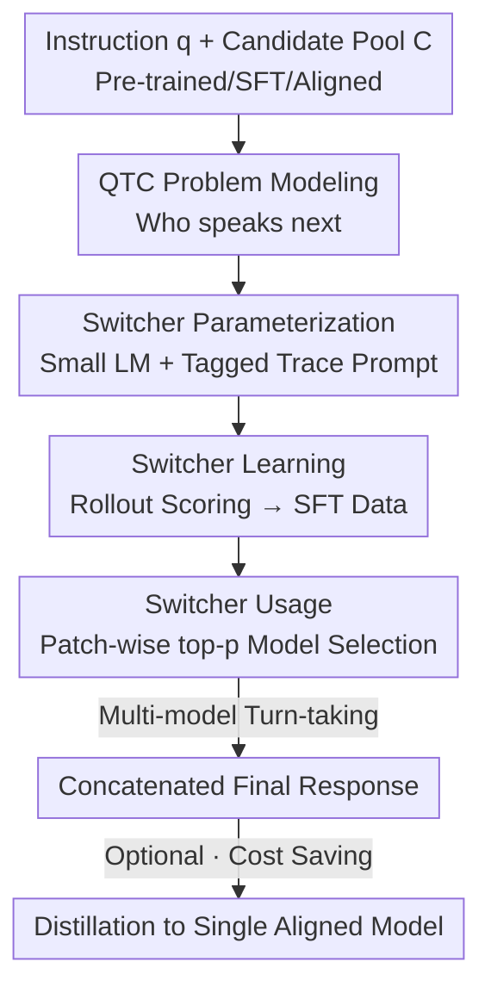

# Don't Throw Away Your Pretrained Model

**Conference**: ICLR2026  
**OpenReview**: [https://openreview.net/forum?id=1TTeOEufHz](https://openreview.net/forum?id=1TTeOEufHz)  
**Code**: https://github.com/BunsenFeng/model_collaboration  
**Area**: LLM Alignment / Model Collaboration / Inference-time Fusion  
**Keywords**: Model Collaboration, Alignment tradeoff, Switch generation, Checkpoint fusion, Inference-time routing

## TL;DR
The paper proposes SWITCH GENERATION: training a small "switcher" LM to dynamically select between pre-trained, fine-tuned, and aligned checkpoints as "speakers" for token fragments during a single response generation. This allows the complementarity of base capabilities lost during alignment (creativity, calibration, diversity) and capabilities gained through alignment (reasoning, instruction following), achieving a 31% average improvement over single models across 18 datasets and a 12.9% further gain over 8 types of collaboration baselines.

## Background & Motivation
**Background**: Alignment (RLHF / RL) has become a standard step in language model training, significantly enhancing reasoning, instruction following, and safety. Consequently, the "final aligned version" is typically the one deployed, while pre-trained and SFT checkpoints earlier in the pipeline are discarded.

**Limitations of Prior Work**: Alignment is not Pareto-optimal. Extensive research indicates that while alignment improves reasoning/instruction following, it sacrifices skills inherent to the base model—such as creativity, confidence calibration, generation diversity, pluralism, and uncertainty expression. In other words, discarded pre-trained/SFT checkpoints may actually perform better on certain skills than the aligned version.

**Key Challenge**: A single checkpoint cannot simultaneously maximize both "alignment-gained abilities" and "alignment-lost abilities." Deploying base models directly is unfeasible as they lack instruction following and safety guardrails. A single response often involves an interplay of multiple skills (recalling knowledge, reasoning, and then refining expression), and these segments favor different checkpoints (the core observation in Figure 1).

**Goal**: Without retraining the large model, the objective is to repurpose discarded "pre-trained → SFT → aligned" checkpoints from the same pipeline, allowing them to collaborate and complement each other within a single generation by contributing to the segments where each excels.

**Key Insight**: Since "responses are not monolithic and different segments favor different models," the granularity of collaboration should not be the entire response (routing) or every individual token (too fragmented, disrupting coherence), but rather "patch-level"—asking at the start of each segment: Who is most suitable to write this next step?

**Core Idea**: A small switcher LM is trained to model "who speaks next" as a learnable decision problem (the QTC problem). During inference, multiple checkpoints take turns writing fragments under the switcher's direction to form a final concatenated response.

## Method

### Overall Architecture
SWITCH GENERATION is an inference-time collaboration algorithm: the candidate pool $C=\{c_1,\dots,c_n\}$ contains multiple checkpoints from the same pipeline (defaulting to the pre-trained, SFT, and aligned versions of Tulu-v3). A small switcher LM $f$ decides which model speaks next at each patch boundary, and the final response is the sequence of combined segments.

The method centers on a core problem termed the QTC (Query-Trace-Candidate) problem:

$$f(q, t, C) \rightarrow [p_1, \cdots, p_n] \in \mathbb{R}^n$$

Where $q$ is the user instruction, $t$ is the generated "trace" (what has been written so far), $C$ is the pool of candidate checkpoints, and $p_i$ is the probability of selecting checkpoint $c_i$ for the next fragment. It differs from existing routing (e.g., RouteLLM) in three ways: the trace $t\neq\emptyset$ (context-aware decision), each selected model writes only one patch rather than the whole response, and $f$ is called repeatedly rather than once—enabling finer-grained, flexible collaboration.

The mechanism follows two stages: **Offline Switcher Learning** (simulating "who performs best at this step" via rollouts to generate SFT data for tuning $f$) and **Online Switcher Usage** (invoking $f$ for each patch and selecting a model via top-p sampling). Finally, the collaborative trajectories can be distilled back into a single aligned model to reduce inference costs.

### Key Designs

**1. QTC Problem: Formalizing "Who speaks next" as contextual patch-level decision making**

This design directly addresses the limitation where single models struggle to balance conflicting skills and whole-response routing is too coarse. The authors abstract collaboration as $f(q,t,C)\to[p_1,\dots,p_n]$. Unlike traditional routing, it considers the trace $t$, allowing the system to determine what skill is needed based on "what has already been written." For example, if the first half just recalled facts, the next part might require reasoning, signaling a switch to the aligned version.

**2. Switcher Parameterization: Using a small LM to read "tagged traces" for decision making**

The switcher $f$ is parameterized as a small LM. On the input side, the authors use special delimiters to annotate the trace: `⟨model i begins⟩…⟨model i ends⟩`, followed by a prompt: "Which model should generate the next segment? Please answer with a number from 0 to n-1. The answer is model ___". The switcher $f$ predicts a model ID at this position, using the logits of tokens 0 to n-1 as $[p_1,\dots,p_n]$. This utilizes the LM’s semantic understanding to interpret the narrative flow from the "signed" history.

**3. Switcher Learning: Automated SFT data generation via rollout simulations**

Training data for the switcher is generated automatically through simulated rollouts. For any instruction $q$: ① A trace $t$ is generated using random switching $f_{random}=\text{Uniform}(n)$ (truncated at 10%-90% length); ② A "branching step" allows each candidate to write one segment: $t_i = t \,\|\, c_i(q,t)$; ③ For each $t_i$, $k$ completions are sampled using random switching to calculate average utility:

$$s_i = \frac{1}{k}\sum_{j=1}^{k}\text{score}(t_i, f_{random}\mid q)$$

Where score is the evaluation metric (Accuracy/F1/Reward). Selecting $g=\arg\max_i s_i$ provides the SFT label for $(q,t)$. This "simulate the future and backfill optimal choice" paradigm ensures the switcher learns to maximize final results rather than short-term gains.

**4. Switcher Usage: Online collaboration via patch-wise top-p sampling**

During inference, models are switched every patch (default 50 tokens) rather than every token to maintain coherence and reduce overhead. Top-p (nucleus) sampling is used to select the model: $\text{top-}p(f(q,t,C))\to c\in C$, balancing exploitation and exploration. The first and last patches are optionally fixed to the aligned model to ensure safety and proper instruction following.

### Key Experimental Results

### Main Results
Using Tulu-v3 (Pre-trained/SFT/Aligned 8B) as candidates and comparing against 11 baselines across 18 datasets.

| Method | TruthfulQA | GSM8k | BBH | PopQA | AGIEval | Rep. |
|------|-----------|-------|-----|-------|---------|--------|
| Aligned Model | 29.01 | 56.80 | 35.20 | 31.20 | 11.85 | Baseline |
| RouteLLM (Routing) | 34.38 | 48.10 | 45.90 | 31.30 | 12.32 | Best Base. |
| Greedy Soup (Weight Merge) | 33.06 | 58.10 | 36.50 | 31.30 | 11.76 | Weight Best |
| **SWITCH-TASK (Ours)** | **39.22** | **59.60** | **58.30** | **37.70** | **25.26** | 13 Best |

- Model collaboration outperforms single models on **16/18** tasks, with an average relative **Gain** of **31.0%**.
- SWITCH GENERATION beats all single models and collaboration baselines on **13/18** tasks, with an average relative **Gain** of **12.9%**.

### Ablation Study

| Config | TruthfulQA | GSM8k | BBH | Description |
|------|-----------|-------|-----|------|
| SWITCH-TASK (Default patch=50) | 39.22 | 59.60 | 58.30 | Full Method |
| patch size = 100 | 30.31 | 44.70 | 40.40 | Coarser collaboration |
| RANDOM SWITCH | 27.07 | 44.70 | 53.10 | Random is significantly worse |
| UNTUNED SWITCH | 31.12 | 47.90 | 41.80 | Direct use of aligned model fails |

### Key Findings
- **Switcher Tuning is Essential**: Learned strategies significantly outperform random or untuned switchers.
- **Weak Models are Helpful**: Analysis shows that while pre-trained models are weaker individually, they almost always contribute positive marginal utility in collaboration.
- **Solving the Unsolvable**: SWITCH GENERATION correctly answered 10.7% of questions where every single model failed, indicating it synthesizes new capabilities.
- **Generalization**: A switcher trained on Tulu generalizes well to the Qwen family and unseen tasks.

## Highlights & Insights
- **Counter-intuitive Proposition**: "Don't throw away your pretrained models"—viewing intermediate checkpoints as reusable assets rather than waste effectively recovers lost alignment properties.
- **Patch-level Routing**: Finding the "sweet spot" between whole-response routing and token-level switching maintains narrative coherence while enabling fine-grained collaboration.
- **Rollout-based SFT**: Automating label generation by simulating future utility bypasses the lack of ground truth for optimal model selection.
- **Distillation to Single Model**: Proving that multi-model system behaviors can be distilled back into a single model provides a path for efficient deployment of agentic systems.

## Limitations & Future Work
- **Inference Cost**: Running $n+1$ models (switch + candidates) increases deployment overhead, though distillation and parallelization offer mitigations.
- **Homologous Dependency**: While it generalizes, performance gains are highest when checkpoints come from the same training pipeline.
- **Score Dependency**: Rollout labeling requires tasks with clear evaluation metrics, making it harder to train switchers for open-ended creative tasks.
- **Patch Granularity**: Optimal patch size varies by task, and a self-adaptive mechanism is currently missing.

## Related Work & Insights
- **Vs Routing (RouteLLM)**: Routing decides once for the whole text; this method is "finer and more dynamic."
- **Vs Weight Merging (DARE-TIES)**: Merging creates a static model; this method allows dynamic turn-taking.
- **Vs Logit Fusion**: Logit fusion often disrupts coherence; patch-level switching preserves the "thought process" of each component model.

## Rating
- Novelty: ⭐⭐⭐⭐⭐ 
- Experimental Thoroughness: ⭐⭐⭐⭐⭐ 
- Writing Quality: ⭐⭐⭐⭐ 
- Value: ⭐⭐⭐⭐ 

<!-- RELATED:START -->

## Related Papers

- [\[NeurIPS 2025\] Ask a Strong LLM Judge when Your Reward Model is Uncertain](../../NeurIPS2025/llm_alignment/ask_a_strong_llm_judge_when_your_reward_model_is_uncertain.md)
- [\[ACL 2025\] Don't Say No: Jailbreaking LLM by Suppressing Refusal](../../ACL2025/llm_alignment/dont_say_no_jailbreaking_llm_by_suppressing_refusal.md)
- [\[ICLR 2026\] Reward Model Routing in Alignment](reward_model_routing_in_alignment.md)
- [\[ICLR 2026\] RewardBench 2: Advancing Reward Model Evaluation](rewardbench_2_advancing_reward_model_evaluation.md)
- [\[ICLR 2026\] Towards Understanding Valuable Preference Data for Large Language Model Alignment](towards_understanding_valuable_preference_data_for_large_language_model_alignmen.md)

<!-- RELATED:END -->
## Related Papers

- [\[NeurIPS 2025\] Ask a Strong LLM Judge when Your Reward Model is Uncertain](../../NeurIPS2025/llm_alignment/ask_a_strong_llm_judge_when_your_reward_model_is_uncertain.md)
- [\[ACL 2025\] Don't Say No: Jailbreaking LLM by Suppressing Refusal](../../ACL2025/llm_alignment/dont_say_no_jailbreaking_llm_by_suppressing_refusal.md)
- [\[ICLR 2026\] Reward Model Routing in Alignment](reward_model_routing_in_alignment.md)
- [\[ICLR 2026\] RewardBench 2: Advancing Reward Model Evaluation](rewardbench_2_advancing_reward_model_evaluation.md)
- [\[ICLR 2026\] Towards Understanding Valuable Preference Data for Large Language Model Alignment](towards_understanding_valuable_preference_data_for_large_language_model_alignmen.md)

<!-- RELATED:END -->
