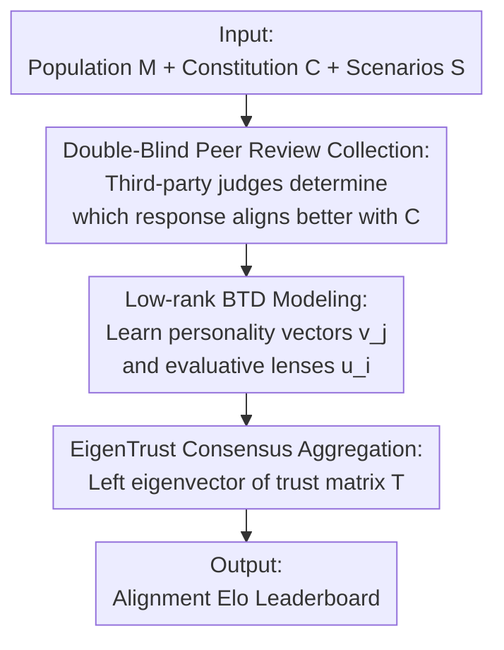

# EigenBench: A Comparative Behavioral Measure of Value Alignment

**Conference**: ICLR 2026  
**OpenReview**: [https://openreview.net/forum?id=fm79KXJIUQ](https://openreview.net/forum?id=fm79KXJIUQ)  
**Code**: https://github.com/jchang153/EigenBench  
**Area**: Alignment RLHF  
**Keywords**: Value Alignment, Evaluation Benchmark, Peer Review, EigenTrust, Bradley-Terry  

## TL;DR
EigenBench proposes a black-box, ground-truth-free value alignment measurement method: a population of language models evaluates each other's responses under a given "constitution" (value criteria). EigenTrust is used to aggregate these pairwise evaluations into a consensus score vector, where "more aligned models receive higher evaluative weight," ultimately outputting an Elo ranking of alignment for each model relative to that value system.

## Background & Motivation
**Background**: Aligning AI with human values is a core challenge. Mainstream alignment evaluations either rely on objective tasks with fixed ground-truth labels (e.g., accuracy, safety red-teaming) or on human preference scoring (e.g., Chatbot Arena using human pairwise comparisons to rank models). These methods excel at measuring "objectively determinable" capabilities.

**Limitations of Prior Work**: The traits humans value most are often precisely the most subjective—whether a model is "kind," "loyal," or "unpretentious," or whether it conforms to Taoist, Utilitarian, or Deep Ecology values, for which no objective ground truth exists. The authors invoke Goodhart’s Law to point out a paradox: once an easily quantifiable trait becomes an optimization target, it ceases to be a good metric; what remains truly important are the hard-to-quantify subjective traits. These subjective traits fall into a dilemma: if "kindness" to one person is "sycophancy" to another, it seems impossible to quantify.

**Key Challenge**: Subjective traits lack "correct labels" yet require comparable and reproducible quantitative rankings. Directly asking a model "how kind are you" is ineffective—paper experiments confirm a massive gap between a model's "self-reported values" and "behaviorally revealed values" (Grok 4 gave itself a perfect score for kindness but ranked sixth).

**Goal**: Construct an alignment measurement method that does not rely on any ground-truth labels, can produce customized leaderboards for any value system, and verify that the resulting rankings are meaningful and trustworthy.

**Key Insight**: The authors were inspired by Scott Aaronson's "Eigenmorality" blog and PageRank/EigenTrust—letting judges evaluate each other and using eigenvectors to extract social consensus. The key assumption is: a model that behaves more in accordance with $C$ is generally better at judging whether others conform to $C$. Thus, good judges should be granted more influence.

**Core Idea**: A population of models serves as both judges and candidates. In each scenario, a third-party model determines which of two responses is better aligned with constitution $C$. All pairwise evaluations are fitted to a latent space preference model to construct a trust matrix, and its left principal eigenvector is taken as the "consensus alignment score"—essentially porting EigenTrust from node reputation ranking to value alignment measurement.

## Method

### Overall Architecture
The input to EigenBench consists of three components: a population of $N \ge 2$ models $M=\{M_1,\dots,M_N\}$ (each model acts as both judge and candidate; a "model" refers to the combination of a language model and its persona prompt), a constitution $C=\{C_1,\dots,C_k\}$ describing the target values (a set of criteria), and a set of scenario prompts $S$. The output is a score vector $t \in \mathbb{R}^N_{\ge 0}$, where $t_j$ summarizes the average situational alignment of model $M_j$ with respect to $C$ (averaged across scenarios, criteria, and models, with the model dimension weighted by $t$ itself).

The pipeline follows four sequential steps: first, repeatedly sample scenarios, let a pair of models respond, and have a third model act as a judge to determine which response aligns better with $C$, yielding a large set of pairwise "trits" (win/loss/tie). Next, fit these comparisons to a low-rank Bradley-Terry-Davidson model to learn each model's "personality vector" and each judge's "evaluative lens." Then, construct a row-stochastic trust matrix $T$ from the learned latent strengths, where $T_{ij}$ represents judge $M_i$'s trust in candidate $M_j$. Finally, use EigenTrust to find the left principal eigenvector $t$ of $T$ (satisfying $t=tT$) and convert it into Elo ratings. The process is "double-blind": candidates do not know which criteria they are being judged by, and judges do not know the identity of the candidates.

### Key Designs

**1. Double-Blind Peer Review Collection: Bypassing the "No Ground Truth" Deadlock via Mutual Evaluation**

Subjective traits lack correct labels. The authors' solution is not to define a "standard answer" but to let each model use its own subjective understanding of the criteria to judge others. Specifically: given constitution $C$, sample a scenario $S_\ell$, a pair of candidates $(j,k)$, and a judge $i$. First, $M_j, M_k$ respond to the scenario to produce $R_j, R_k$. Then, judge $M_i$ writes reflections $\hat R_j, \hat R_k$ for each response against $C$. Finally, $R_j, \hat R_j, R_k, \hat R_k$ are presented to the judge to decide which is better or declare a tie, resulting in a comparison trit $r_{ijk\ell}\in\{0,1,2\}$ (tie/prefer j/prefer k). To save tokens, one comparison produces a trit for each criterion in $C$.

Two key de-biasing designs are used. First, **eliminating position bias**: for each group $i,j,k,\ell$, samples are taken twice in both original and swapped orders ($r_{ijk\ell}$ and $r_{ikj\ell}$); if preferences are opposite (strong inconsistency), both trits are overwritten as ties. Second, **double-blind**: candidates never know what criteria they are evaluated on, and judges never know the identity of the candidates, preventing identity and criteria leakage. The "scaffolding" of having judges write reflections before deciding was found to mitigate several judge biases.

**2. Low-Rank Bradley-Terry-Davidson: Accommodating Subjective Divergence via Vector Embeddings**

Aggregating win/loss/tie comparisons into a ranking naturally suggests the Bradley-Terry-Davidson (BTD) model. However, standard BTD learns a scalar strength for each model, implying all judges agree on "what counts as aligned"—yet this method addresses subjective criteria where interpretations vary wildly. Consequently, the authors upgrade scalar strengths to **vector embeddings**: each candidate has a personality vector $v_j\in\mathbb{R}^d$ (coordinates characterizing $d$ latent facets of the constitution), and each judge has an evaluative lens $u_i\in\mathbb{R}^d$ (characterizing the judge's focus on each facet), plus a tie propensity $\lambda_i$.

The latent strength of $j$ in the eyes of judge $i$ is the inner product $u_i^\top v_j$, such that the comparison trits follow:

$$\Pr(i\text{ thinks }j\succ k)=\tfrac{1}{Z}\exp(u_i^\top v_j),\quad \Pr(i\text{ thinks }j\approx k)=\tfrac{1}{Z}\lambda_i\exp\!\big(\tfrac{1}{2}u_i^\top(v_j+v_k)\big)$$

The parameters $u, v, \lambda$ are fitted via gradient ascent to maximize the log-likelihood of all trits; $d$ is selected by test loss on held-out data (often $d=N$ in practice, though differences between $d=2$ and $d=N$ are minor). This vectorization allows discrepancies—e.g., "Judge A prioritizes humility while Judge B prioritizes warmth"—to be explicitly encoded in $u_i$ rather than forced into an average. Visualizing $u_i$ and $v_j$ reveals insights: for instance, when Claude 3.5 Haiku acts as 20 historical figures, the learned lenses align along a "Secular—Sacred" axis (Feynman/Lenin at one end, Pope Francis at the other), showing systematic differences in interpreting the same constitution.

**3. EigenTrust Consensus Aggregation: Giving More Aligned Models Greater Evaluative Weight**

Given the latent strengths $s_{ij}=\exp(u_i^\top v_j)$, the authors construct a row-stochastic trust matrix:

$$T_{ij}=\frac{s_{ij}+\tfrac{1}{2}\lambda_i\sum_{k\neq j}\sqrt{s_{ij}s_{ik}}}{\sum_l\big(s_{il}+\tfrac{1}{2}\lambda_i\sum_{k\neq l}\sqrt{s_{il}s_{ik}}\big)}$$

Physically, if judge $M_i$ compares all $N$ responses and picks the best (randomizing among ties), $T_{ij}$ is the probability of selecting $M_j$. The final score is defined as $t_j=\sum_i t_i T_{ij}$, where $t$ is the left eigenvector of $T$ with an eigenvalue of 1 (guaranteed to exist and be unique by the Perron-Frobenius theorem, normalized to $\sum_j t_j=1$).

Why not use a simple average $\frac{1}{N}\sum_i T_{ij}$? Because the core premise is that "models whose behavior aligns better with $C$ are better at judging whether others align with $C$." The eigenvector equation weights judge $M_i$'s trust $T_{ij}$ by $t_i$ on the right side—the higher the judge's own score, the more their judgment counts. Alternatively, viewing this as a Markov chain transferring trust among judges, $t$ is the stationary distribution, and $t_j$ is the proportion of time $M_j$ serves as the judge. The authors solve for $t$ using the EigenTrust algorithm and convert it to Elo scores via $Elo_j=1500+400\log_{10}(N t_j)$.

## Key Experimental Results

### Main Results
**Character Training Validation (Table 2, Universal "Loving" Constitution, 6 Open-Source Models)**: Using the character training method of Maiya et al. (2025), EigenBench correctly identifies that models following fine-tuning/pre-prompting are the most "loving," even though their base models score lowest. This validates both the character training effectiveness and EigenBench's ability to measure subjective traits.

| Model | EigenBench Elo |
|------|------|
| Llama 3.1 8b (Base) | 1426 |
| Llama 3.1 8b (Loving, Pre-prompted) | **1579** |
| Llama 3.1 8b (Loving-oct, Fine-tuned) | **1573** |
| Qwen 2.5 7b | 1447 |
| Gemma 3 4b | 1468 |
| Mistral 7b | 1434 |

**GPQA Ground-Truth Recovery (Section 5.3)**: On 448 graduate-level multiple-choice questions, using 15 models of varying performance, the constitution was removed and judges were asked to compare answer options without ground-truth labels. The ranking produced by EigenBench differed from the true ranking by only 12 adjacent swaps (Kendall-τ ≈ 0.77). The probability of a random permutation being this close is approximately 1 in 200,000—demonstrating that EigenBench can recover rankings highly close to objective ground truth without ever seeing labels.

### Ablation Study
Robustness analysis shows EigenBench is relatively stable across three types of perturbations:

| Perturbation Dimension | Key Metric | Description |
|------|---------|------|
| Scenario Distribution (Table 3) | Elo generally consistent | Switching to OASST / AIRiskDilemmas datasets, rankings for 5 models remained largely unchanged, with only Grok 4 scoring significantly higher on OASST. |
| Constitution Phrasing (Section 6.2) | Max SD across constitutions: 16 points | Using 5 differently phrased Conservatism constitutions, rankings remained nearly identical and showed no bias towards the model that wrote the constitution. |
| Model Population (Table 4) | Initial model scores stable | The relative scores of the initial population mostly held when adding or removing models (though Grok 4's score decreased as population size increased). |

### Key Findings
- **All components are necessary, but EigenTrust weighting is the soul**: Utilizing eigenvectors rather than uniform averaging fulfills the premise that "good judges count more," which is the core distinction from traditional Elo systems.
- **Human validation shows LM judging is competent**: Collecting human pairwise comparisons for kindness and fitting a scalar BTD revealed that the average trust vector distance between humans and LMs is comparable to distances between humans—indicating LMs approximate human judgment as closely as humans approximate each other.
- **Self-report ≠ Revealed behavior**: Rankings from direct self-evaluations differed significantly from EigenBench rankings, confirming the necessity of behavioral measures over self-reporting.
- **Character persists across prompts**: In an $N=25$ experiment (5 LMs × 5 Personas), 79% of the score variance was explained by the persona and 21% by the base LM, indicating models possess internal tendencies stable across prompts.

## Highlights & Insights
- **Applying Social Consensus Algorithms to Value Alignment**: Using PageRank/EigenTrust mechanisms for subjective values is clever because it naturally accommodates "reasonable disagreement" and produces comparable rankings without any ground truth.
- **Vectorized BTD Transforms Divergence into an Asset**: Explicitly encoding judge preferences into $u_i$ (evaluative lens) improves fitting and yields interpretable structures like the "Secular—Sacred axis." This "insight as a byproduct" design is noteworthy.
- **The GPQA Experiment is a Stroke of Genius**: Intentionally withholding labels on an objective task proves that "mutual trust" alone can approximate true rankings, opening possibilities for using EigenBench as an unsupervised evaluator for hard-to-assess tasks like long-term planning.
- **Transferability**: This "population peer review + eigenvector aggregation" framework can be generalized to any sorting problem lacking ground truth where subjective consensus is required.

## Limitations & Future Work
- **High Collection Cost**: The authors admit each pairwise comparison requires two responses, two reflections, and one comparison—five model calls in total—making it inefficient. Future work suggests active learning or occasional human judgment to guide sampling.
- **Assumption Dependency on Constitution**: The authors note the premise "aligned models judge alignment better" may not be universal—a kind model likely judges kindness well, but an unpretentious model might not necessarily be better at judging unpretentiousness.
- **Risk of Consensus ≠ Truth**: The method measures group consensus. If the entire model population shares a systematic bias, EigenBench will codify that bias as consensus, which is hard to detect without ground truth.
- **GPQA Boundary Analysis**: The unsupervised ranking recovery is impressive, but conditions and boundaries for its success require further investigation.

## Related Work & Insights
- **vs LMArena (Chatbot Arena)**: Both use pairwise comparisons and Elo, but LMArena asks "which models satisfy human preferences across broad prompts" based on massive human voting. EigenBench asks "which models best align with a specific constitution $C$," replacing humans with model peer review.
- **vs Prompt-to-Leaderboard**: The latter produces prompt-specific human preference rankings; EigenBench measures alignment with a value system without needing ground truth.
- **vs LitmusValues**: LitmusValues uses value dilemmas to measure "which values a single model prioritizes internally"; EigenBench measures "who is most aligned with a given value in a population," focusing on inter-model comparison rather than intra-model introspection.
- **vs Constitutional AI / Character Training**: These are training paradigms for shaping model personality via constitutions (using LM feedback instead of human feedback). However, researchers still "vibe-check" during hyperparameter tuning; EigenBench provides the missing piece as a tester to verify if a model has truly internalized the constitution.

## Rating
- Novelty: ⭐⭐⭐⭐⭐ Systematically applying EigenTrust/Eigenmorality to LM value alignment is highly original; the combination of vectorized BTD and ground-truth-free evaluation is innovative.
- Experimental Thoroughness: ⭐⭐⭐⭐ Includes human validation, GPQA recovery, three-dimensional robustness, and character training validation; however, the scale of models/constitutions remains limited, and subjective conclusions are somewhat qualitative.
- Writing Quality: ⭐⭐⭐⭐⭐ Clear narrative progression from the paradox of motivation to mathematical derivation and interpretable visualizations.
- Value: ⭐⭐⭐⭐⭐ Provides a reproducible, customizable, label-free framework for "hard-to-quantify subjective values," directly useful for alignment evaluation and character training validation.

<!-- RELATED:START -->

## Related Papers

- [\[ICML 2026\] Toward Stable Value Alignment: Introducing Independent Modules for Consistent Value Guidance](../../ICML2026/llm_alignment/toward_stable_value_alignment_introducing_independent_modules_for_consistent_val.md)
- [\[ICLR 2026\] Pretrain Value, Not Reward: Decoupled Value Policy Optimization](pretrain_value_not_reward_decoupled_value_policy_optimization.md)
- [\[ICML 2026\] VALUEFLOW: Toward Pluralistic and Steerable Value-based Alignment in Large Language Models](../../ICML2026/llm_alignment/valueflow_toward_pluralistic_and_steerable_value-based_alignment_in_large_langua.md)
- [\[ICLR 2026\] Reward Models Inherit Value Biases from Pretraining](reward_models_inherit_value_biases_from_pretraining.md)
- [\[ACL 2025\] Internal Value Alignment in Large Language Models through Controlled Value Vector Activation](../../ACL2025/llm_alignment/internal_value_alignment_in_large_language_models_through_controlled_value_vecto.md)

<!-- RELATED:END -->
