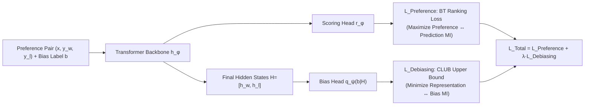

# Eliminating Inductive Bias in Reward Models with Information-Theoretic Guidance

**Conference**: ICLR 2026  
**Code**: [https://github.com/Qwen-Applications/DIR](https://github.com/Qwen-Applications/DIR)  
**Area**: llm_alignment  
**Keywords**: Reward Models, RLHF, Inductive Bias, Reward Hacking, Mutual Information, Information Bottleneck, Debiasing  

## TL;DR
DIR formalizes reward model debiasing as an information-theoretic optimization problem—maximizing the mutual information between "reward prediction ↔ human preference" while minimizing it between "reward latent representation ↔ bias attributes." Using Barber-Agakov (BA) lower bounds and CLUB upper bounds for variational estimation, it unifiedly handles non-linear inductive biases such as length, sycophancy, and formatting.

## Background & Motivation

**Background**: RLHF is the mainstream approach for aligning LLMs, where a Reward Model (RM) is trained on human preference pairs first, then used to drive RL training strategies like PPO/GRPO. The quality of the RM directly determines the stability and performance ceiling of alignment.

**Limitations of Prior Work**: Human preference data is naturally low-quality and filled with **inductive biases**. For instance, annotators often choose "more detailed" answers, leading to longer answers almost always being preferred. Consequently, RMs learn the shortcut "longer is better," which is unrelated to content quality. Similar biases exist for formatting (e.g., Markdown) and sycophancy (pandering to users). Once the RM is misled by these spurious correlations, downstream policies engage in reward hacking, causing actual capabilities to degrade.

**Key Challenge**: Existing debiasing methods lack generality. Pearson correlation-based methods (ALBM, Chen et al.) only capture **linear** correlations and fail to address high-order or non-linear biases. PoE's dual-head architecture is limited to scalar biases and lacks theoretical support. CRM uses MMD to force-align chosen/rejected distributions, but its strong constraints can collapse scores of functionally different responses and distort the reward landscape. InfoRM uses the information bottleneck to compress the entire representation but lacks explicit constraints on bias attributes, failing to guarantee true debiasing.

**Goal**: Propose a theoretically grounded framework that unifiedly handles various complex non-linear biases without distorting the reward landscape.

**Core Idea**: **Replace Pearson coefficients with Mutual Information (MI) to measure bias**, as MI captures arbitrary non-linear correlations. Drawing from the "compression-preservation" trade-off of the information bottleneck, debiasing is formulated as a dual MI objective: preserve preference information while compressing bias information.

## Method

### Overall Architecture
The RM consists of a transformer backbone and a scoring head. Beyond the standard Bradley-Terry (BT) ranking loss, DIR (Debiasing via Information optimization for RMs) adds a lightweight "bias estimation head" $q_\psi(b|H)$ acting on the final hidden states $H=[h_\phi(x,y^w), h_\phi(x,y^l)]$. Training involves alternating updates: first training the bias head to accurately predict bias (ensuring MI estimation accuracy), then using it to calculate the debiasing loss for the RM so that the latent representation "hides" the bias information.

### Key Designs

**1. Dual MI Debiasing Objective: Formalizing debiasing as an Information Bottleneck trade-off**. DIR models the entire RM debiasing as a mutual information optimization problem: $\max_\phi I(\mathbb{1}_{y\succ\bar y}; x,y,\bar y) - \lambda \cdot I(\mathbb{1}_{y\succ\bar y}; b)$. The first term (Preference Term) requires the reward prediction to carry as much content/preference information as possible, while the second term (Debiasing Term) requires it to carry as little information about the bias attribute $b$ as possible, with $\lambda$ balancing the two. Unlike Pearson coefficients which only capture linear relations, MI—defined as $I(x;y)=\mathrm{KL}[p(x,y)\|p(x)p(y)]$—naturally characterizes any non-linear dependence, which is why DIR can unifiedly handle diverse biases.

**2. Two Variational Bounds for Computability**. High-dimensional MI cannot be calculated exactly, so DIR uses variational bounds in opposite directions. The preference term uses the **Barber-Agakov (BA) lower bound**: $I(\mathbb{1}_{y\succ\bar y}; x,y,\bar y) \ge \mathbb{E}[\log q_\phi(\mathbb{1}_{y\succ\bar y}|x,y,\bar y)] + H[p^*]$, where the right-hand side is exactly the standard BT ranking loss. This provides a clean interpretation: **minimizing BT loss is equivalent to maximizing the preference MI**, so DIR doesn't change the conventional RM objective but adds a debiasing term. The debiasing term uses the **CLUB upper bound**: by the Data Processing Inequality, $I(\mathbb{1}_{y\succ\bar y}; b)\le I(H;b)\le I_{\mathrm{CLUB}}(H;b)$ (since $b\to(x,y,\bar y)\to H\to \mathbb{1}_{y\succ\bar y}$ forms a Markov chain). Using the variational network $q_\psi(b|H)$ to estimate this bound within a batch, minimizing it directly reduces the correlation between the bias and the latent representation. The final objective is $\min_\phi L_{\text{Preference}}(\phi) + \lambda \cdot L_{\text{Debiasing}}(\phi,\psi)$, with $r_\phi$ and $q_\psi$ updated iteratively.

**3. Comparative Regularizer: Debiasing without Distorting the Reward Landscape**. Predicting absolute values like "token count" from a compressed representation is difficult, and absolute constraints on individual responses risk destroying the reward landscape (as seen in CRM's MMD). DIR instead focuses on **relative differences between paired responses**: for example, length bias is taken as $b=\mathbb{1}\{\mathrm{length}(y)>\mathrm{length}(\bar y)\}\in\{0,1\}$. Sycophancy and formatting are similarly converted into categorical labels, making $q_\psi(b|H)=\mathrm{Softmax}(\mathrm{MLP}(H))$ a lightweight two-layer classifier. Correspondingly, hidden states are processed as the difference $\Delta h = h_\phi(x,y^w)-h_\phi(x,y^l)$ rather than concatenation, highlighting discriminative features. Thus, DIR constrains that "relative bias should not determine preference," enabling debiasing without collapsing the scores of functionally different responses.

## Key Experimental Results

Using Llama3.1-8B-Instruct as the backbone, the authors compared DIR against BT, Skywork, PoE, ALBM, Length-Penalty, and InfoRM across three types of bias (length, sycophancy, formatting).

### Main Results: Length Debiasing RLHF Performance (Select benchmarks, Avg. Acc.)

| Initial Policy | Base | SK | PoE | LP | ALBM | InfoRM | Ours |
|---|---|---|---|---|---|---|---|
| Llama3.1-8B-Instruct | 62.83 | 63.31 | 63.14 | 61.36 | 63.92 | 62.80 | **66.20** (↑3.37) |
| OpenRLHF-Llama3-8B-SFT | 55.68 | 56.94 | 57.85 | 56.54 | 57.72 | 55.34 | **59.25** (↑3.57) |

- On RM-Bench, DIR achieved the lowest Pearson correlation between length and reward (**0.468** vs. BT 0.533, Skywork 0.498, ALBM 0.560), with scores being the flattest relative to length.
- On ArenaHard, the DIR policy achieved the highest win rate (vs. Llama3.1 baseline **54.3%**, vs. GPT4o-0314 41.9%) with shorter responses (679 tokens vs. ALBM 722, original base 754), reaching a superior "higher win rate + lower verbosity" trade-off.

### Ablation Study: DPO Integration (ArenaHard, OpenRLHF-Llama-3-8B-SFT)

| Method | Win Rate (%) | Avg. Length |
|---|---|---|
| DPO | 38.63 | 436.55 |
| +LC (Length-Controlled) | 40.96 | 407.23 |
| +Ours | **45.27** | **404.61** |

DPO+DIR outperformed specialized Length-Controlled DPO in both win rate and length control, showig an Avg. improvement of ↑6.84 on SFT models.

### Key Findings
- Even if the training set's chosen answers are on average **shorter** (622.86 vs 707.24 tokens), standard BT still learns that "longer is better"—indicating that the BT objective is naturally prone to capturing non-causal simple patterns.
- Removing length bias did not hurt but rather improved the policy's core reasoning and knowledge capabilities, consistently across two base models.
- "Representation difference $\Delta h$" was shown to be superior to concatenation, and $\lambda$ effectively balances preference learning and debiasing.

## Highlights & Insights
- **Theoretical and Practical Alignment**: The BA lower bound seamlessly connects the debiasing framework with the standard BT loss, while the CLUB upper bound provides an optimizable target for debiasing. The derivation from the information bottleneck is self-consistent.
- **Relatively Bias is Key**: Switching absolute attribute prediction to paired relative labels bypasses high-dimensional regression difficulties and prevents reward landscape distortion common in methods like MMD.
- **Strong Generality**: The same framework covers diverse biases (length, sycophancy, formatting) without structural changes and can be applied plug-and-play to both PPO and DPO.

## Limitations & Future Work
- Bias attributes $b$ must be **pre-defined and annotatable** (e.g., length, sycophancy prefixes, formatting tags); there is no automatic mechanism for unknown or hard-to-describe biases.
- Sycophancy experiments rely on synthetic contaminated data with injected prefixes; real-world sycophancy is more subtle, and generalization remains to be verified.
- Multi-bias concurrency was only explored preliminarily; alternating training of the bias head introduces extra system complexity.

## Related Work & Insights
- **vs. InfoRM**: Both use information theory, but InfoRM compresses the entire hidden representation without explicit bias constraints, which cannot guarantee debiasing. DIR uses CLUB to directly minimize the specific MI between representation and bias.
- **vs. Pearson-based Methods**: Upgrades from linear correlation to arbitrary non-linear MI.
- **vs. PoE / CRM**: PoE is heuristic and limited to scalar bias; CRM's MMD tends to over-constrain. DIR's comparative regularizer directly addresses these limitations.
- **Insight**: The MI upper bound (CLUB) can be generalized as an "information leakage penalty" for removing general spurious features (fairness, shortcut learning), and re-interpreting training losses as MI maximization via variational lower bounds is a powerful analytical perspective.

## Rating
- Novelty: ⭐⭐⭐⭐ Unifying BA/CLUB variational bounds for RM debiasing and using relative biases to prevent landscape distortion is a novel combination with clear motivation.
- Experimental Thoroughness: ⭐⭐⭐⭐ Covers three bias types + PPO/DPO + multiple backbones + multiple benchmarks (RM-Bench/ArenaHard). Comparisons are solid.
- Writing Quality: ⭐⭐⭐⭐ Rigorous derivation and clear charts; the BA↔BT connection is particularly well-explained.
- Value: ⭐⭐⭐⭐ Provides a general, theoretically-grounded framework for RLHF debiasing with open-source code.

<!-- RELATED:START -->

## Related Papers

- [\[ICML 2026\] When Distance Distracts: Representation Distance Bias in BT-Loss for Reward Models](../../ICML2026/llm_alignment/when_distance_distracts_representation_distance_bias_in_bt-loss_for_reward_model.md)
- [\[ICLR 2026\] Learning to Summarize User Information for Personalized RLHF (PLUS)](learning_to_summarize_user_information_for_personalized_reinforcement_learning_f.md)
- [\[ACL 2025\] Cheems: A Practical Guidance for Building and Evaluating Chinese Reward Models from Scratch](../../ACL2025/llm_alignment/cheems_chinese_reward_models.md)
- [\[CVPR 2026\] DRM: Diffusion-based Reward Model With Step-wise Guidance](../../CVPR2026/llm_alignment/drm_diffusion-based_reward_model_with_step-wise_guidance.md)
- [\[ICLR 2026\] Evaluating and Improving Cultural Awareness of Reward Models for LLM Alignment](evaluating_and_improving_cultural_awareness_of_reward_models_for_llm_alignment.md)

<!-- RELATED:END -->
