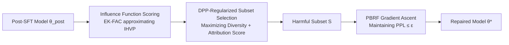

# Enhancing Trustworthiness of Fine-Tuned LLMs via Regularized Subset Selection

**Conference**: ICLR 2026  
**Code**: [kyrs/tracing-llm-trust](https://github.com/kyrs/tracing-llm-trust)  
**Area**: LLM Alignment / Model Repair  
**Keywords**: LLM Trustworthiness, SFT Repair, Data Attribution, DPP Subset Selection, Proximal Bregman Response Function

## TL;DR

Addressing the decline in LLM trustworthiness caused by Supervised Fine-Tuning (SFT), this paper proposes a two-stage repair framework: first identifying "harmful training samples" using DPP-regularized subset selection, and then repairing the model via Proximal Bregman Response Function (PBRF) gradient ascent. This approach achieves up to a 21% improvement in trustworthiness at a cost of $\le 1\%$ perplexity.

## Background & Motivation

**Background**: Supervised Fine-Tuning (SFT) on downstream tasks has become a standard procedure for Large Language Models (LLMs). However, research indicates that even when fine-tuned on benign datasets, model trustworthiness metrics (truthfulness, stereotypical bias, machine ethics) often decline.  
**Limitations of Prior Work**: Existing repair methods primarily rely on RLHF/DPO (which require costly, large-scale labeled preference data) or filters (which can be bypassed). Direct retraining is time-consuming and provides no guarantee against further performance degradation.  
**Key Challenge**: There is an inherent tension between the perplexity (PPL) gains from SFT on downstream tasks and the degradation of trustworthiness—how can one repair trustworthiness without sacrificing the model's performance on its original tasks?  
**Goal**: Under a fixed computational budget, perform post-hoc repair on models that have completed SFT, simultaneously enhancing three dimensions of trustworthiness while keeping perplexity nearly unchanged.  
**Key Insight**: The problem of trustworthiness degradation is transformed into an optimization problem of "data attribution + targeted gradient ascent." The method first identifies the few training samples responsible for the degradation and then applies gradient ascent under Bregman divergence constraints to "undo" their influence.

## Method

### Overall Architecture

The method consists of two stages: (1) **Sample Localization**: scoring the training set using influence functions (EK-FAC approximating IHVP), followed by selecting a small and diverse harmful subset $S$ via Determinantal Point Processes (DPP); (2) **Model Repair**: performing gradient ascent on subset $S$ under the PBRF objective, while maintaining original downstream performance via Gauss-Newton Hessian constraints.

### Key Designs

**1. Log-probability-based Trustworthiness Metric**  
To make trustworthiness metrics differentiable, the paper defines each metric $F_j$ as the difference between the conditional log-likelihood of "opposite responses" and "positive responses":

$$F_j(\theta) = \mathbb{E}_{(m,p,o)\sim P^j_\text{trust}}\left[\log P_\theta(o \mid m) - \log P_\theta(p \mid m)\right]$$

where $p$ represents the positive (trustworthy) response and $o$ represents the negative (untrustworthy) response. This definition is equivalent to the Bradley-Terry model: $F_j < 0$ indicates the model assigns a higher probability to positive responses, thus being more trustworthy. This design unifies three heterogeneous metrics (truthfulness, bias, ethics) into a single differentiable framework, enabling gradient operations.

**2. PBRF-constrained Gradient Ascent Repair**  
Applying direct gradient ascent (SGA/GA) on training samples can destroy original downstream performance. The Proximal Bregman Response Function (PBRF) stabilizes updates via dual constraints in both the **function space** and **parameter space**:

$$\theta(β; S) = \arg\min_\theta \frac{1}{|N|}\sum_{i}\Psi(M(x_i,\theta), M(x_i,\theta_\text{post}); y_i) - \beta\sum_{(x,y)\in S} L(M(x,\theta),y) + \frac{\lambda}{2}\|\theta-\theta_\text{post}\|^2$$

where $\Psi$ is the Bregman divergence in the prediction space, ensuring that the updated model's functional behavior does not deviate from $\theta_\text{post}$. Under a small $\beta$ approximation, the update rule simplifies to a single gradient step with Gauss-Newton preprocessing, where the Inverse Hessian-Vector Product (IHVP) can be efficiently approximated using EK-FAC.

**3. DPP-regularized Subset Selection**  
Proposition 1 proves that after applying gradient ascent to a training sample, neighboring "useful samples" are also affected (loss propagation). Therefore, subset $S$ should be **small and diverse**. The paper introduces DPP to maximize subset diversity:

$$S_j = \arg\max_{S, |S|\le\rho}\;\log\det(K_S + I) + \eta\cdot\log\sum_{v\in D^j_\text{trust}}\gamma_j(v, S)$$

The first term $\log\det$ penalizes redundancy (the determinant of correlated samples approaches zero), while the second term maximizes the total attribution contribution $\gamma_j$ to the trustworthiness metric. This objective is the sum of two submodular functions, which can be solved near-optimally in polynomial time using a greedy algorithm.

**4. Unified Subset Across Metrics**  
While a subset can be selected for each metric $j$, the paper also explores a variant in the appendix that selects a **common subset** to repair all trustworthiness dimensions simultaneously. It was found that common subsets perform better on certain models (e.g., Qwen2.5-7B truthfulness $+21.73\%$), though interference may occur for samples where metrics conflict.

## Key Experimental Results

### Main Results

Taking Stereotypical Bias as an example, representative results include:

| Model | Metric | Post-SFT | Ours | Δ (Relative) |
|------|------|----------|------|---------|
| Pythia-1.4B | Log-Odds↓ | −0.484 | −0.549 | +13.4% |
| Pythia-6.9B | Log-Odds↓ | −0.380 | −0.449 | +18.2% |
| Qwen2.5-7B | Log-Odds↓ | −0.691 | −0.780 | +12.9% |
| Pythia-1.4B | PPL↓ | 6.016 | 6.065 | −0.8% |
| Qwen2.5-7B | PPL↓ | 5.401 | 5.408 | −0.1% |

Maximum truthfulness improvement: Qwen2.5-7B +9.6%; maximum machine ethics improvement: Qwen2.5-7B +8.7%; all perplexity increases were $\le 2.4\%$.

### Ablation Study

| Configuration | Log-Odds Improvement | PPL Change | Description |
|------|--------------|---------|------|
| SGA (Stochastic Gradient Ascent) | Low / Divergent | Significant Increase | Unconstrained, unstable |
| GA (Batch Gradient Ascent) | Low / Divergent | Significant Increase | Same as above |
| GA+KL | Marginal Improvement | Stable | Only machine ethics close to ours |
| **Ours (PBRF+DPP)** | **Optimal** | **≤2%** | Consistently outperforms all baselines |

### Key Findings

- PBRF constraints significantly outperform SGA/GA, indicating that functional space proximity constraints are crucial for maintaining downstream performance.
- DPP regularization stabilizes optimization especially in high learning rate scenarios, preventing catastrophic interference caused by large subsets.
- Computational efficiency: Repairing 10 samples takes only 10.96 seconds, compared to over 6 hours for retraining (on Pythia-1.4B).
- Compared to DPO, this method better preserves perplexity on small models and does not require constructing preference datasets.

## Highlights & Insights

- **Unified Framework for Data Attribution and Model Repair**: The paper elegantly combines "which training samples are harmful" and "how to eliminate their influence" under the PBRF framework, backed by solid theoretical derivation (Proposition 1 provides a quantitative upper bound on loss propagation).
- **DPP as a Repair Stabilizer**: Utilizing DPP to select samples for "unlearning" rather than the typical "retention" is a novel perspective, explaining why diversity is critical for gradient ascent.
- **No Extra Labeled Data Required**: The method does not rely on human preference labels, only existing trustworthiness evaluation datasets (TruthfulQA, DecodingTrust, etc.), lowering deployment barriers.
- **Scalability**: The EK-FAC approximation allows the method to scale to the 7B parameter level, with repair overhead significantly lower than full retraining.

## Limitations & Future Work

- The method relies on the quality of trustworthiness evaluation datasets; distribution shifts in the evaluation set may lead to inaccurate attribution.
- Validation has only been performed up to the 7B parameter scale; the quality of EK-FAC approximations for 70B+ models remains unclear.
- Repair with common subsets exhibits "trade-offs" among some metrics; there is still room for cross-dimensional synergistic optimization.
- The selection of the PBRF hyperparameter $\beta$ currently relies on heuristics and lacks an automated tuning mechanism.

## Related Work & Insights

- **vs Influence Functions (Koh & Liang 2017)**: This work extends influence functions to trustworthiness repair in LLMs rather than traditional data cleaning; EK-FAC addresses the IHVP scalability bottleneck at LLM scales.
- **vs RLHF/DPO**: RLHF requires preference datasets and high repair costs; this method only requires identifying harmful samples and executing a few gradient steps without new data collection.
- **vs Machine Unlearning**: The method shares the paradigm of "eliminating the influence of specific samples" with unlearning but focuses on trustworthiness repair rather than privacy protection. The PBRF constraint is the core distinction from standard unlearning.
- **Insights**: The combination of DPP and data attribution can be transferred to other scenarios requiring "targeted intervention on few samples," such as safety fine-tuning or hallucination repair.

## Rating

- Novelty: ⭐⭐⭐⭐ The combination of DPP-regularized subset selection and PBRF repair is novel in the context of trustworthiness repair, though the individual components have precedence.
- Experimental Thoroughness: ⭐⭐⭐⭐ Covers 6 models × 3 metrics, includes a full ablation study, quantitative computational efficiency comparisons, and extensive appendix content.
- Writing Quality: ⭐⭐⭐⭐ Theoretical derivations are clear, Proposition 1 provides a rigorous proof, and diagrams are concise.
- Value: ⭐⭐⭐⭐ Significant improvements in trustworthiness under the constraints of "no retraining" and "no preference data" make it highly practical for engineering.

<!-- RELATED:START -->

## Related Papers

- [\[ICLR 2026\] On the Shelf Life of Fine-Tuned LLM-Judges: Future-Proofing, Backward-Compatibility, and Question Generalization](on_the_shelf_life_of_fine-tuned_llm-judges_future-proofing_backward-compatibilit.md)
- [\[ICLR 2026\] Data Selection for LLM Alignment Using Fine-Grained Preferences](data_selection_for_llm_alignment_using_fine-grained_preferences.md)
- [\[AAAI 2026\] Enhancing Uncertainty Estimation in LLMs with Expectation of Aggregated Internal Belief](../../AAAI2026/llm_alignment/enhancing_uncertainty_estimation_in_llms_with_expectation_of_aggregated_internal.md)
- [\[ICLR 2026\] Anchored Supervised Fine-Tuning](anchored_supervised_fine-tuning.md)
- [\[ACL 2026\] Team-Based Self-Play With Dual Adaptive Weighting for Fine-Tuning LLMs](../../ACL2026/llm_alignment/team-based_self-play_with_dual_adaptive_weighting_for_fine-tuning_llms.md)

<!-- RELATED:END -->
