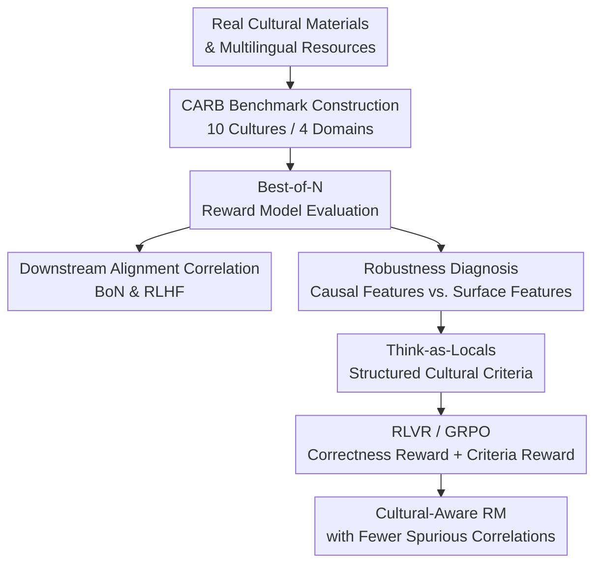

# Evaluating and Improving Cultural Awareness of Reward Models for LLM Alignment

**Conference**: ICLR 2026  
**OpenReview**: [https://openreview.net/forum?id=WhSzqsMhfZ](https://openreview.net/forum?id=WhSzqsMhfZ)  
**Code**: TBD  
**Area**: LLM Alignment / Reward Models / Cultural Awareness  
**Keywords**: Reward Model, Cultural Awareness, Multilingual Alignment, RLHF, Verifiable Reward  

## TL;DR
This paper introduces the CARB (Cultural Awareness Reward Model) benchmark to systematically evaluate the preference judgment capabilities of reward models across 10 cultures and 4 cultural domains. Furthermore, it proposes "Think-as-Locals," which mandates generative reward models to first produce local cultural evaluation criteria before making a judgment. Optimized via RLVR/GRPO, this approach reduces spurious correlations caused by surface linguistic cues.

## Background & Motivation
**Background**: LLM alignment typically depends on Reward Models (RM) to convert human preferences into training or selection signals: they are used for RLHF during training and for Best-of-N sampling during inference to select superior responses. As LLMs are deployed in multilingual and multi-regional scenarios, reward models must move beyond judging "helpfulness, harmlessness, and fluency" to understanding what constitutes an appropriate response within specific cultural contexts.

**Limitations of Prior Work**: Mainstream reward model benchmarks mostly evaluate general capabilities, such as general preference, instruction following, factuality, or safety. Even multilingual reward model evaluations like M-RewardBench largely translate general tasks into multilingual environments, failing to verify whether models truly comprehend cultural nuances. A reward model might perform excellently in English safety Q&A but fail on questions like "whether a specific festival belongs to a certain culture," "whether a proverb is appropriate in a local context," or "whether a value judgment aligns with local public opinion."

**Key Challenge**: Reward models act as proxies in global alignment, but existing evaluations do not check whether these proxies understand local cultural preferences. If an RM only captures surface patterns such as language, explicit country labels, or response length, it may push the policy model toward directions that appear localized but possess shallow cultural understanding during RLHF, potentially inducing reward hacking.

**Goal**: The authors decompose the problem into three steps: first, constructing CARB, a benchmark capable of evaluating cultural-aware RMs; second, verifying whether CARB scores truly predict downstream multilingual cultural alignment performance; and finally, diagnosing whether RM scores derive from genuine cultural concepts, followed by proposing a new training method to enhance the cultural reasoning capabilities of generative RMs.

**Key Insight**: Instead of directly training a chat model for end-users, this paper focuses on the reward model within the RLHF chain. This perspective is critical: identifying which RM is better at judging cultural preferences beforehand reduces the need for expensive full-scale downstream alignment experiments. Furthermore, making the RM's judgment process explicitly generate cultural evaluation criteria makes it easier to constrain it from taking shortcuts like "assigning higher scores upon seeing Chinese or a specific country name."

**Core Idea**: The authors transform "cultural-aware reward modeling" into a measurable problem using CARB, and then employ "Think-as-Locals" to require generative RMs to propose cultural evaluation standards like a local, reinforcing this structured reasoning with verifiable rewards.

## Method

### Overall Architecture
The proposed method consists of three phases: "Benchmark Construction + Diagnostic Analysis + Targeted Improvement." Phase one constructs CARB: prompts are compiled from real cultural materials and multilingual safety/linguistic resources to generate chosen/rejected responses, organized as a Best-of-N preference selection task. Phase two uses CARB to inspect whether different RMs can distinguish culturally appropriate responses and validates the correlation between CARB scores and downstream BoN and RLHF performance. Phase three proposes Think-as-Locals, employing RLVR to train generative RMs to output structured cultural evaluation criteria before providing a preference judgment.

A basic sample in CARB consists of a prompt, a culturally correct chosen answer, and multiple rejected answers. During evaluation, the RM must select the unique chosen response from 4 candidates, making the random baseline 25%. The final metric is the weighted average accuracy across cultures and domains, requiring models to work stably across different languages, writing systems, and cultural themes rather than inflating scores through a single language or safety task.

### Key Designs
**1. CARB: Framing Cultural-Aware Reward Modeling as Best-of-N Preference Selection**

CARB covers 10 cultures—Arabic, Chinese, English, German, Japanese, Korean, Russian, Spanish, Thai, and Vietnamese—organized into four domains: cultural commonsense knowledge, values, safety, and linguistics. This design goes beyond simple translation of English preference questions; it draws real cultural material from sources like the Cultural Atlas, MANGO, the World Values Survey, multilingual toxicity datasets, and idioms/language learning materials. Consequently, the generated questions inherently possess cultural context (e.g., festivals, values, taboos, idiomatic meanings) rather than being translated versions of general Q&A.

During data construction, strong models and corresponding cultural references generate chosen completions, while 24 open- and closed-source LLMs of varying capabilities generate rejected completions under intentionally mismatched cultural references. To ensure quality, the paper utilizes embedding similarity filtering and regeneration mechanisms, resulting in 8,576 high-quality prompts/BoN sets. For RMs, this setup is more rigorous than pairwise comparison: the model must score the chosen response higher than multiple rejected responses to be recognized as identifying culturally appropriate answers.

**2. CARB Validity Verification: Predicting Downstream Alignment**

A reward model benchmark is only useful if its performance predicts real-world utility. This paper examines whether CARB scores correlate with downstream multilingual cultural alignment in two scenarios: using the RM for Best-of-N selection among 16 candidates during inference, and using different RMs to optimize the same policy model via GRPO/RLHF during training. Downstream evaluation uses cultural tasks such as include-44-base, BLEnD, and OMGEval.

This design targets the actual utility of an RM: it is not the final product but a signal for selecting or training a policy model. The strong linear correlation between CARB rankings and downstream policy performance ($r^2$ of 0.649 on BLEnD and 0.680 on OMGEval with $p < 0.001$) demonstrates that it measures capabilities required for cultural alignment rewards. In contrast, M-RewardBench shows $r^2 < 0.1$, which is statistically insignificant.

**3. Spurious Correlation Diagnosis: Genuine Understanding vs. Surface Cues**

The authors investigate whether high RM scores result from recognizing cultural concepts or merely shortcuts like language, country names, or explicit labels. Four types of perturbations were constructed: CC (changing core cultural concepts while keeping explicit labels), RC (removing explicit labels), CL (changing the response language), and RP (paraphrasing). An ideal RM should be sensitive to CC (since cultural facts changed) but relatively insensitive to RC, CL, and RP (surface changes).

The results show that top-performing CARB models align more closely with human judgment: they react strongly to causal cultural feature changes and minimally to surface perturbations. Weak models show the opposite, being significantly influenced by the deletion of labels or language changes. Cross-lingual consistency is also evaluated using $e^{-k|\Delta|}$ to map score differences of synonymous responses across languages.

**4. Think-as-Locals: Generative RM Training with Structured Criteria and Verifiable Rewards**

To address spurious correlations, Think-as-Locals requires the generative RM to output a reasoning sequence $z$ containing cultural evaluation criteria before the final judgment $\hat{j}$. Given a prompt $q$, two responses $y_1, y_2$, and the ground truth preference $j$, the model generates $r_\theta(z|q, y_1, y_2)$.

The reward consists of two parts. The correctness reward $R_{corr.}$ is $+1$ for $\hat{j}=j$ and $-1$ otherwise. The criteria appropriateness reward $R_{appr.}$ measures the "net probability gain" that the generated criteria $z$ provides for the correct judgment $j$. If reading the criteria makes it easier for the model to generate the correct judgment, the criteria are helpful. This is approximated by subtracting the log probability of the correct judgment without reasoning from the log probability with reasoning.

### Loss & Training
Training utilizes GRPO with the generative RM acting as the policy. For each query, a set of outputs $G=\{z^{(i)}, \hat{j}^{(i)}\}_{i=1}^{|G|}$ is sampled, and group-normalized advantages $A_i = (R(z^{(i)}, j) - \mu_G) / (\sigma_G + \eta)$ are calculated. The objective includes a clipped policy ratio and a KL penalty to prevent the model from deviating too far from the reference model:

$$
J_{GRPO}(\theta)=\mathbb{E}\left[\frac{1}{|G|}\sum_i \left(\min(r_i A_i, \mathrm{clip}(r_i,1-\epsilon,1+\epsilon)A_i)-\beta D_{KL}(r_\theta\|r_{ref})\right)\right]
$$

where $r_i$ is the probability ratio between the new and old policies. Data includes HelpSteer3, CARE, and custom data; evaluation focuses on M-RewardBench and CARB for Arabic, Chinese, and Japanese sub-sets.

## Key Experimental Results

### Main Results
Generative RMs significantly outperform classifier-based RMs in cultural-aware reward modeling. Qwen3-235B-A22B-Instruct-2507 achieved the highest average score, followed by GPT-4.1 and DeepSeek-R1. The strongest classifier-based RM, Skywork-Reward-Gemma-2-27B, placed fifth. The authors attribute this to the superior world knowledge and reasoning capabilities of generative models.

| Model | Type | CARB Avg Score | Representative Observation |
|------|------|-------------|------------|
| Qwen3-235B-A22B-Instruct-2507 | Generative RM | 76.5 | Overall #1; most stable cross-cultural performance |
| gpt-4.1-2025-04-14 | Generative RM | 75.9 | #2 on average; strong in high-resource cultures like German |
| DeepSeek-R1-0528 | Generative RM | 74.7 | Reasoning capabilities lead to better cultural judgment |
| DeepSeek-V3-0324 | Generative RM | 74.5 | Consistently leads most classifier RMs |
| Skywork-Reward-Gemma-2-27B | Classifier RM | 73.0 | Strongest classifier RM, but lacks cross-cultural robustness |

The correlation between CARB and downstream performance is a primary finding.

| Benchmark | Downstream Task | Correlation Results | Conclusion |
|------|----------|------------|------|
| CARB | BLEnD | $r^2=0.649$, $p=9.43\times10^{-5}$ | Strongly correlated with downstream cultural scores |
| CARB | OMGEval | $r^2=0.680$, $p=4.60\times10^{-5}$ | Predicts performance differences after optimization |
| M-RewardBench | BLEnD | $r^2=0.039$, $p=0.445$ | Weak and statistically insignificant correlation |

### Ablation Study
Think-as-Locals significantly improved the cultural reward capabilities of base models (e.g., the Qwen2.5 series).

| Configuration | M-RB | CARB | Avg | Note |
|------|------|------|------|------|
| Qwen2.5-32B-Inst | 86.0 | 71.4 | 78.7 | 32B Generative Base |
| Ours (Qwen2.5-32B-Inst) | 89.5 | 84.3 | 86.9 | Highest overall average score |

Ablation of the reward function shows both components are necessary. Removing the correctness reward causes the largest drop in accuracy. Regarding perturbations, the base model's relative change due to language (CL) was 39.1%, while Think-as-Locals with criteria reduced this to 10.9%. Sensitivity to causal features (CC) increased from 12.7% to 30.8%, indicating the model focuses more on genuine cultural concepts.

### Key Findings
- CARB specifically evaluates cultural awareness rather than general multilingual rewards; its high correlation with downstream tasks validates its purpose.
- Generative RMs generally outperform classifier-based RMs, particularly in commonsense knowledge and linguistics.
- Safety is the easiest domain for all RMs, while Values is the most difficult due to subjectivity.
- Think-as-Locals gains efficiency from the "reasoning before judgment" structure; criteria rewards ensure that reasoning contributes specifically to correct judgments.

## Highlights & Insights
- The evaluation target is precise: rather than asking if an LLM understands culture, it asks if the Reward Model can judge cultural appropriateness, which is more relevant to the RLHF pipeline.
- Best-of-N is more discriminative than pairwise comparison for identifying models that rely on surface cues like language or explicit labels.
- Spurious correlation analysis provides diagnostic value, showing that alignment failures often result from the RM using the wrong features as shortcuts.
- The criteria reward can be generalized to other domains (e.g., medical or legal) where models should generate specific standards before judging.

## Limitations & Future Work
- CARB covers 10 cultures, but this is a fraction of global diversity; low-resource or mixed-cultural identities are missing.
- Data construction still relies on strong LLMs (GPT-4o), which might contain inherent biases.
- Think-as-Locals targets generative RMs; adapting these structured criteria to scalar (classifier-based) RMs remains a challenge.
- Criteria rewards are based on the model's own probability gains, which could still be influenced by pre-existing model priors.

## Related Work & Insights
- **vs. RewardBench**: While RewardBench evaluates general preference, CARB focuses on multi-cultural judgments and downstream correlation.
- **vs. M-RewardBench**: M-RewardBench is largely a translation of general tasks, whereas CARB prompts and completions are built natively around cultural content.
- **Insight**: Benchmarks in alignment should demonstrate a predictive relationship with downstream optimization effects to truly serve the alignment community.

## Rating
- Novelty: ⭐⭐⭐⭐ Targeted cultural RM benchmarking and "Think-as-Locals" are highly specific and effective.
- Experimental Thoroughness: ⭐⭐⭐⭐⭐ Comprehensive chain covering leaderboard, correlation, robustness, and RLVR improvement.
- Writing Quality: ⭐⭐⭐⭐ Clear progression of research questions.
- Value: ⭐⭐⭐⭐⭐ Highly practical for global LLM alignment, specifically in selecting and training RMs for diverse cultural contexts.

## Related Papers

- [\[ICML 2026\] Steerable Cultural Preference Optimization of Reward Models](../../ICML2026/llm_alignment/steerable_cultural_preference_optimization_of_reward_models.md)
- [\[ICML 2026\] Korean Culture into LLM Alignment: Toward Cultural Coherence](../../ICML2026/llm_alignment/korean_culture_into_llm_alignment_toward_cultural_coherence.md)
- [\[ICLR 2026\] Eliminating Inductive Bias in Reward Models with Information-Theoretic Guidance](eliminating_inductive_bias_in_reward_models_with_information-theoretic_guidance.md)
- [\[ICLR 2026\] Omni-Reward: Towards Generalist Omni-Modal Reward Modeling with Free-Form Preferences](omni-reward_towards_generalist_omni-modal_reward_modeling_with_free-form_prefere.md)
- [\[ACL 2025\] Cheems: A Practical Guidance for Building and Evaluating Chinese Reward Models from Scratch](../../ACL2025/llm_alignment/cheems_chinese_reward_models.md)

<!-- RELATED:END -->

<!-- RELATED:START -->

## Related Papers

- [\[ICLR 2026\] Reward Model Routing in Alignment](reward_model_routing_in_alignment.md)
- [\[ICLR 2026\] Eliminating Inductive Bias in Reward Models with Information-Theoretic Guidance](eliminating_inductive_bias_in_reward_models_with_information-theoretic_guidance.md)
- [\[ICLR 2026\] Robust Reward Modeling via Causal Rubrics](robust_reward_modeling_via_causal_rubrics.md)
- [\[ICLR 2026\] StoryAlign: Evaluating and Training Reward Models for Story Generation](storyalign_evaluating_and_training_reward_models_for_story_generation.md)
- [\[ICLR 2026\] Beyond Binary Preferences: A Principled Framework for Reward Modeling with Ordinal Feedback](beyond_binary_preferences_a_principled_framework_for_reward_modeling_with_ordina.md)

<!-- RELATED:END -->
