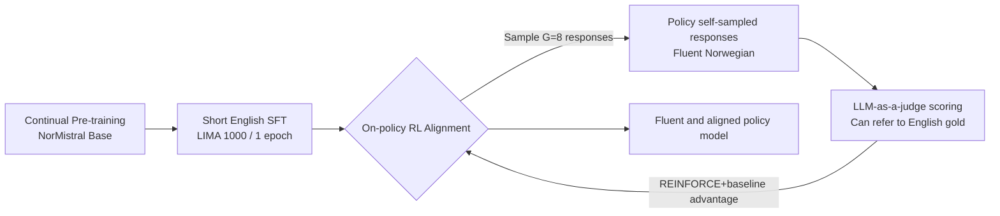

# Fluent Alignment with Disfluent Judges: Post-training for Lower-Resource Languages

**Conference**: ICLR 2026  
**OpenReview**: [https://openreview.net/forum?id=htOZXpUPFZ](https://openreview.net/forum?id=htOZXpUPFZ)  
**Code / Data**: [normistral-fluency-annotation Dataset](https://hf.co/datasets/ltg/normistral-fluency-annotation)  
**Area**: LLM Alignment / Post-training for Low-resource Languages  
**Keywords**: Preference Alignment, On-policy RL, RLAIF, Low-resource Languages, Fluency, LLM-as-a-judge, Norwegian  

## TL;DR
This paper proposes a post-training methodology for low-resource languages: it avoids target-language instruction data entirely, relying solely on on-policy reinforcement learning to learn from the model's own sampled responses. This enables the training of a linguistically authentic aligned model even with a "disfluent" judge—the core principle being "never exposing the model to translationese during training."

## Background & Motivation
**Background**: Preference optimization (RLHF / DPO, etc.) is standard for modern LLMs, but most research focuses on high-resource languages like English and Chinese, which possess massive native instruction datasets and strong instruction models capable of generating fluent synthetic data.

**Limitations of Prior Work**: Low-resource languages (such as Norwegian Bokmål with ~5 million speakers) lack both native instruction datasets and instruction models for fluent synthetic data generation. The mainstream approach is to **machine translate** English instructions into the target language for SFT. This introduces "translationese": text that is grammatically correct but unnatural. Models are heavily affected by this, and concurrent work proves that **even brief exposure to translated data causes a rapid collapse in model fluency**.

**Key Challenge**: To make a model speak naturally in the target language, it must not be trained on translated data; however, for low-resource languages, only translated data is available. A fundamental conflict exists between fluency and data availability.

**Goal**: Train a model that is both fluent and aligned (helpful, honest, safe) in the target language **without any target-language instruction data**.

**Core Idea (Key Insight)**: **In on-policy reinforcement learning, the model learns only from its own sampled responses, thereby completely bypassing translated text**. Pre-training ensures the model can generate fluently in the target language; as long as the alignment phase does not push it out of the "fluency subspace," fluency is preserved. Furthermore, **the judge (reward source) does not need to be fluent**—it only needs to "understand" the target language well enough to evaluate output quality. A disfluent judge can still guide the development of a fluent policy.

## Method

### Overall Architecture
The method is a three-stage pipeline governed by the principle: "**never train the model on unnatural text**." ① Continual pre-training in the target language (reusing existing Norwegian base models); ② Short SFT on a small, high-quality **English** dataset (1000 LIMA dialogues, 1 epoch) to teach the dialogue format without causing catastrophic forgetting of the target language; ③ **On-policy reinforcement learning** in the target language, with rewards from an LLM-as-a-judge (no separate reward model required), where the judge can access English gold responses from the No Robots dataset as a reference. Throughout alignment, the model only sees its own sampled Norwegian responses and is never exposed to translated responses.

### Key Designs

**1. Three-stage post-training: Replacing "Translated SFT" with "Short English SFT + On-policy RL."** Conventional approaches translated English instructions and performed SFT, forcing the model to minimize negative log-likelihood on translationese, thus internalizing it. This paper places the only supervised learning on **English** for a very short duration (1000 LIMA samples, 1 epoch). This teaches dialogue formatting while preserving target-language proficiency. Real alignment is deferred to on-policy RL. Since updates only occur on self-sampled responses, the model is never pushed away from the fluent subspace learned during pre-training.

**2. Simplified REINFORCE objective: Direct d-RLAIF without reward model training.** The goal is to maximize the expected reward $J(\theta)=\mathbb{E}_{x\sim D,\,y\sim\pi_\theta(\cdot|x)}\,r(x,y)$ using policy gradients. To stabilize convergence without a critic, $G=8$ responses are sampled per prompt, and the advantage is estimated using the group mean and standard deviation: $\hat{A}(x,y)=\frac{r(x,y)-\mathrm{mean}\{r(x,y^{(i)})\}}{\mathrm{std}\{r(x,y^{(i)})\}}$. Rewards come directly from the LLM-as-a-judge (d-RLAIF) using a "constitutional" prompt. The loss is normalized by sequence length to eliminate length bias, and **PPO clipping/importance sampling is omitted** as synchronous parallelization keeps samples nearly entirely on-policy.

**3. Rao-Blackwellized KL Regularization: Using the full vocabulary distribution.** Standard KL estimates use only the sampled token probability $\pi_\theta(y_i|\cdot)$, which is noisy. This work uses the distribution over the entire vocabulary $V$: $L_{KL}(\theta)=\mathbb{E}\big[\sum_i \sum_{w\in V}\pi_\theta(y_i{=}w|\cdot)\log\frac{\pi_\theta(y_i{=}w|\cdot)}{\pi_{\theta_{ref}}(y_i{=}w|\cdot)}\big]$. This is unbiased with lower variance, incurs negligible overhead, and removes the need for an explicit entropy regularization term.

**4. Synchronous distributed parallelization.** To handle the policy, reference policy, sampling policy, and judge models efficiently, the authors unroll the RL loop and lag sampling policy weights by 3 steps. Every worker waits for the longest response (fully synchronous), ensuring unbiased samples (unlike asynchronous schemes that oversample short responses).

## Key Experimental Results

### Main Results: Native Speaker Human Fluency Evaluation
Three models based on Mistral Nemo 12B were compared. Five native speakers evaluated 300 pairs of responses in a blind A/B test. Win rates (Row vs Column, 1/0.5/0 aggregation):

| Model | vs On-policy RL | vs Translated SFT | vs Mistral Nemo | Average |
|------|------|------|------|------|
| **On-policy RL (Ours)** | — | **67.5** | 91.8 | **79.7** |
| Translated SFT | 32.5 | — | 87.5 | 60.0 |
| Mistral Nemo (The Judge) | 8.2 | 12.5 | — | 10.3 |

On-policy RL wins against Translated SFT in 67.5% of cases and is **significantly more fluent than its own judge (Mistral Nemo)**, proving the policy can exceed the judge's fluency.

### Ablation Study

**Judge fluency is uncorrelated with policy fluency** (Automatic fluency scores normalized to 0-100%):

| Judge | Judge NLU | Judge NLG | Judge Fluency | Policy Fluency |
|------|------|------|------|------|
| Mistral Nemo 12B | 87.5 | 29.7 | 67.0 | 92.2 |
| Mistral Large 123B | 90.0 | 70.4 | 83.4 | 94.2 |
| Qwen 2.5 14B | 89.6 | 43.5 | **39.0** | 93.1 |
| Qwen 2.5 72B | 92.0 | 75.2 | 50.7 | 92.9 |
| Llama 3.3 70B | 90.7 | 57.7 | 84.2 | 93.5 |

The Pearson correlation between judge fluency and policy fluency is only **0.067**.

**Impact of initial SFT stage / translation data exposure**:

| SFT Setting | Fluency after RL |
|------|------|
| English data (1 epoch) | **94.2** |
| English data (4 epochs) | 92.8 |
| Translated data (1 epoch) | 91.0 |

### Key Findings
- **On-policy is critical**: Learning from self-sampled responses is the root cause of fluency preservation.
- **Minimal translation data is harmful**: Exposure to translated data for just 1 epoch drops fluency significantly compared to English SFT.
- **Judges need not be fluent, only competent**: Disfluent judges can train fluent policies, allowing languages without strong instruction models to bootstrap alignment.
- Automatic fluency scorers align with humans at 85.5%.

## Highlights & Insights
- **Redefining the Judge's Role**: While conventional wisdom suggests "the teacher must be better than the student," this work proves that in an on-policy setting, the judge only needs "discriminative" power, not "generative" power.
- **Clean Mechanistic Explanation**: Fluency is preserved via the structural constraint of "training distribution = model's own distribution."
- **Rigorous Human Evaluation**: Employment of native speakers for extensive blind evaluations provides high-confidence evidence for low-resource language metrics.
- **Engineering Simplification**: The use of Rao-Blackwellized KL and the omission of PPO clipping results in a more streamlined RLHF process.

## Limitations & Future Work
- **Reliance on a strong pre-trained base**: The method assumes a base model already possesses target-language fluency.
- **Single language case study**: Only validated on Norwegian Bokmål; results for more morphologically complex or extremely low-resource languages remain to be seen.
- **Judge comprehension requirements**: If the judge's NLU for the target language is too poor, reward signals will bridge into noise.
- The evaluation focuses on fluency; systematic assessment of helpfulness or factuality remains limited.

## Related Work & Insights
- **RLAIF / d-RLAIF**: This work is a targeted successful application of d-RLAIF for low-resource languages.
- **REINFORCE with group-relative advantage**: Advancements in advantage estimation are utilized while avoiding PPO complexities.
- **Translationese Research**: Provides theoretical grounding for avoiding translated datasets.
- **Insight**: For any scenario where "high-quality target domain data is scarce" (not just language, but specialized domains or stylized generation), "on-policy + weak judge" may be a universal path to bypass data bottlenecks.

## Rating
- **Novelty**: ⭐⭐⭐⭐ The counter-intuitive finding that disfluent judges can train fluent policies is clear and rigorously validated.
- **Experimental Thoroughness**: ⭐⭐⭐⭐ Native human evaluations combined with ablation across 8 judges and multiple SFT settings provide a complete chain of evidence.
- **Writing Quality**: ⭐⭐⭐⭐ Logic is smooth, formulas and charts are clear, and the core claim is well-supported.
- **Value**: ⭐⭐⭐⭐ Provides an actionable, low-cost paradigm for "zero-instruction-data alignment" for thousands of low-resource languages.

<!-- RELATED:START -->

## Related Papers

- [\[ICLR 2026\] Spectrum Tuning: Post-Training for Distributional Coverage and In-Context Steerability](spectrum_tuning_post-training_for_distributional_coverage_and_in-context_steerab.md)
- [\[ICLR 2026\] Chasing the Tail: Effective Rubric-based Reward Modeling for Large Language Model Post-Training](chasing_the_tail_effective_rubric-based_reward_modeling_for_large_language_model.md)
- [\[ICLR 2026\] Quagmires in SFT-RL Post-Training: When High SFT Scores Mislead and What to Use Instead](quagmires_in_sft-rl_post-training_when_high_sft_scores_mislead_and_what_to_use_i.md)
- [\[ICLR 2026\] On the Shelf Life of Fine-Tuned LLM-Judges: Future-Proofing, Backward-Compatibility, and Question Generalization](on_the_shelf_life_of_fine-tuned_llm-judges_future-proofing_backward-compatibilit.md)
- [\[NeurIPS 2025\] GVPO: Group Variance Policy Optimization for Large Language Model Post-Training](../../NeurIPS2025/llm_alignment/gvpo_group_variance_policy_optimization_for_large_language_model_post-training.md)

<!-- RELATED:END -->
