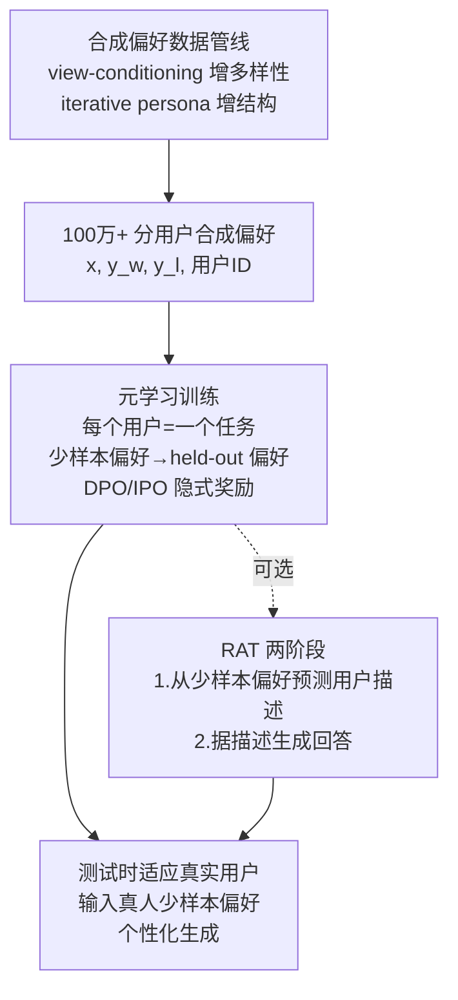

# FSPO: Few-Shot Optimization of Synthetic Preferences Effectively Personalizes to Real Users

**Conference**: ICLR 2026  
**OpenReview**: [https://openreview.net/forum?id=SzEc5fSBXv](https://openreview.net/forum?id=SzEc5fSBXv)  
**Code**: To be confirmed (Anonymous repository provided, based on the official DPO codebase)  
**Area**: LLM Alignment / Personalized Preference Optimization  
**Keywords**: Personalized Alignment, Meta-Learning, Few-Shot Preference Optimization, Synthetic Preference Data, Sim2Real, Reward Modeling  

## TL;DR
Reward modeling is reformulated as a "user-as-task" black-box meta-learning problem. LLMs use few-shot in-context preferences to rapidly infer personalized reward functions. Combined with a million-scale synthetic preference dataset (emphasizing diversity and structure), the approach enables Sim2Real transfer to real users, achieving a 70% win rate against humans in open-ended QA.

## Background & Motivation
**Background**: Current mainstream RLHF/DPO methods aggregate population preferences into a single reward function, training a "one-model-fits-all" policy. While effective for general alignment, this naturally smooths over individual differences—different users possess distinct or even contradictory preferences based on cultural backgrounds, personal experiences, and values.

**Limitations of Prior Work**: ① Aggregated RLHF marginalizes minority viewpoints and solidifies systemic biases; ② Existing personalization attempts either only perform distribution alignment (matching statistical attributes rather than individual preferences) or explicitly model reward distributions but suffer from low sample efficiency and evaluations covering only a few manual personas (e.g., "helpfulness" vs. "honest"); ③ Preference data is difficult to collect at scale, as human annotation is expensive, unreliable, and limited in coverage.

**Key Challenge**: Personalization requires a reward function for every user, but the cost of human annotation makes collecting sufficient stratified preference data for a large user base almost impossible. Furthermore, purely synthetic data faces a Sim2Real gap—can reward models learned from virtual users transfer to real humans?

**Goal**: Achieve personalization for real users in open-ended QA (rather than previous multiple-choice or survey settings) without requiring retraining for each user.

**Core Idea**: **Reformulate personalization as black-box meta-learning**—treating each user as a "task" where the model rapidly infers a reward function from a few annotated preferences (few-shot). To bypass the human data bottleneck, **domain randomization concepts from robotics are adapted to synthesize million-scale preference data**. Additionally, **Rationalization (RAT)** is proposed to use inference-time compute to explicitly summarize few-shot preferences into natural language user personas, enhancing reward modeling.

## Method

### Overall Architecture
FSPO consists of three components: (1) A training objective that packages preference optimization as "meta-learning on users," where the model takes $N$ few-shot preferences + a held-out preference to learn inference via implicit reward objectives like DPO/IPO; (2) RAT, which transforms "direct prediction" into a two-stage process: predicting a user description followed by answer generation; (3) A synthetic preference pipeline emphasizing "diversity + structure" to bridge the Sim2Real gap via domain randomization.

### Key Designs

**1. Personalization as Meta-learning: User-as-Task Preference Optimization**—FSPO requires only a weak label on standard preference data: a user ID $S^{(i)}$ for each preference, defining the dataset as $D_{\text{pref}}=\{(x^{(i)},y_w^{(i)},y_l^{(i)},S^{(i)})\}$. Since a user's reward function is characterized by their preference set, personalization becomes a meta-learning objective over the user distribution $\mathcal{S}=P(S^{(i)})$: $\min_\theta \mathbb{E}_{S^{(i)}\sim\mathcal{S}}\big[\mathbb{E}_{(x,y_1,y_2,c)\sim D_i,\,\{\cdot\}_1^N\sim D_i}[\mathcal{L}^\theta_{\text{pref}}(x,y_1,y_2,c\mid\{(x,y_1,y_2,c)\}_1^N)]\big]$. The model processes a sequence of few-shot preferences $D_i^{\text{fewshot}}$ for user $S^{(i)}$ and predicts a held-out preference via a few-shot prompt. This leverages the LLM's in-context learning while using the IPO objective $\mathcal{L}^\theta_{\text{pref}}=\|h_{\pi_\theta}^{y_w,y_l}-(2\beta)^{-1}\|_2^2$ (where $h_{\pi_\theta}^{y_w,y_l}=\log\frac{\pi_\theta(y_w|x)}{\pi_{\text{ref}}(y_w|x)}-\log\frac{\pi_\theta(y_l|x)}{\pi_{\text{ref}}(y_l|x)}$) to implicitly parameterize rewards as $\beta\log\pi_\theta/\pi_{\text{ref}}$. This avoids the sample inefficiency of explicit distribution modeling and the instability of on-policy sampling. From an information theory perspective, $N$ binary preferences act as an N-bit representation distinguishing up to $2^N$ personas, which aids generalization from synthetic to real users.

**2. Rationalization (RAT): Investing Inference Compute in Personas**—When generating answers directly from few-shot preferences, user features remain latent, making them difficult to utilize fully. RAT splits prediction into two steps: first generating a natural language user description (e.g., "this user values family") from few-shot data, then generating the answer conditioned on the query, few-shot preferences, and the description. This description acts as an interpretable summary and a superior conditioning signal. RAT is fine-tuned using expert-steered pairs: among on-policy sampled descriptions, the one semantically closer to the true user description is the positive example $y^+_{S^{(i)}}$. Unlike using rule-based rewards in math/code reasoning, RAT uses "closeness to gold description" as a soft reward. RAT increases Roleplay win rates from 82.6% to 90.3%, nearly matching the Oracle (90.9%).

**3. Diversity Enhancement: View-Conditioning + Model Ensembles**—For meta-learning to generalize, synthetic preferences must cover a wide range of viewpoints. Standard high-temperature sampling yields highly similar responses (Llama 3.2 3B at temp=1.0 has a mean similarity of 0.94). FSPO uses two tactics: persona steering for ELIX/Reviews, and **view-conditioning** for Roleplay. The model first lists multiple potential "views" for a question (e.g., "YouTube videos" vs. "cookbooks"), then generates answers conditioned on each view. Combined with an ensemble of larger models (Llama 3.3 70B, Gemma 2 27B), this reduces mean similarity to 0.71 (ALOE/BGE-M3 metric), providing broader response support for reward annotation.

**4. Structural Enhancement: Consistency Scoring + Iterative Persona Refinement**—Diversity alone is insufficient; meta-learning requires "shared latent structures" to avoid shortcuts. FSPO controls structure at the scoring end using AI Feedback for relative pairwise scoring conditioned on user descriptions and score-perceiving guidelines. It filters position bias by swapping pair orders and explicitly instructs models to ignore length bias. To handle "persona under-determination" (e.g., preferring vegetarian cake in one instance but a steakhouse in another), **Iterative Persona Refinement** is used. Starting from seed personas, if current descriptions fail to determine a preference for a Q&A pair, a preference is chosen randomly and appended to the persona description to ensure future consistency. This reduced the binary Shannon entropy of preference labels from 0.64 nats to 0.13 nats.

## Key Experimental Results

### Main Results

Roleplay (1500 users) Synthetic Win Rate:

| Method | Winrate (%) |
|------|-------------|
| Llama 3.2 3B Instruct | 50.0 |
| IPO | 72.4 |
| Few-shot Prompting | 63.2 |
| Few-shot Pref-FT (GPO) | 62.8 |
| RIC | 53.3 |
| VPL | 67.3 |
| FSPO (DPO) | 81.3 |
| FSPO (IPO) | 82.6 |
| **FSPO + RAT (IPO)** | **90.3** |
| Oracle (True Persona Prompt, Upper Bound) | 90.9 |

ELIX (550 users) Win Rate:

| Method | ELIX-easy | ELIX-hard |
|------|-----------|-----------|
| Llama 3.2 3B Instruct | 50.0 | 50.0 |
| Few-shot Prompted | 92.4 | 81.4 |
| Few-shot Pref-FT | 91.2 | 82.9 |
| **FSPO (Ours)** | **97.8** | **91.8** |

Human Evaluation (Roleplay, 50 users / 11 questions):

| Comparison | Winrate (%) |
|----------|-------------|
| FSPO vs Base | 68.2 ± 1.93 |
| FSPO vs SFT | 72.3 ± 1.34 |

One-sided binomial test p-value = 5.65e-09, significantly outperforming baselines. These results support the reported 87% average win rate on synthetic users and 70% on real humans.

### Ablation Study

Reviews Task (Trained vs. Interpolated users), progressive addition of shots/FT/RAT:

| Method | Trained | Interpolated |
|------|---------|-------------|
| Llama 3.2 3B Instruct | 50.0 | 50.0 |
| 4-shot Prompted | 66.6 | 61.9 |
| 4-shot Pref-FT | 66.5 | 66.1 |
| 4-shot FSPO | 78.4 | 71.3 |
| 8-shot Prompted | 69.1 | 59.1 |
| 8-shot Pref-FT | 65.6 | 70.7 |
| 8-shot FSPO | 80.4 | 73.6 |
| **8-shot FSPO + RAT** | **92.3** | **84.6** |

Data Diversity Ablation (ALOE / BGE-M3 similarity, lower is better):

| Strategy | Mean Sim (↓) | Median Sim (↓) |
|------|-------------|----------------|
| Llama 3.2 3B Instruct, temp=0.3 | 0.96 | 0.97 |
| Same as above, temp=1.0 | 0.94 | 0.95 |
| + persona steering | 0.81 | 0.82 |
| + view steering | 0.78 | 0.78 |
| **Ensemble + view steering** | **0.71** | **0.73** |

### Key Findings
- **RAT is the key to performance jumps**: It pushed the Roleplay win rate from 82.6% to 90.3%, nearly matching Oracle performance by effectively recovering unseen user traits.
- **Quantifiable verification of structural validity**: Iterative refinement reduced preference label entropy from 0.64 to 0.13 nats; diversity strategies reduced similarity from 0.94 to 0.71. Together, these enable Sim2Real transfer.
- **Meta-learning significantly outperforms simple prompting/SFT**: With the same few-shot context, FSPO (implicit reward meta-learning) beats few-shot prompting and Pref-FT by over 10 percentage points.
- **Genuine transfer to real users**: Achieved ~70% win rate across 50 diverse real users, validated further by the external PRISM dataset.
- **Scalability with shots**: Performance improves monotonically with more shots (4 to 8) and increased preference data volume.

## Highlights & Insights
- **Elegant Perspective Shift**: Reframing personalization from "modeling an aggregated reward" to "modeling a distribution of rewards" via black-box meta-learning allows LLMs to reuse their in-context learning capabilities without retraining per user.
- **Sim2Real via Robotics Principles**: Treating each user as a simulated "environment" and using "diversity + structure" from domain randomization provides a clear engineering recipe for transferable synthetic data.
- **Efficient Inference Compute**: RAT allocates compute to producing interpretable, supervisable user personas rather than just chain-of-thought tokens, resulting in both performance gains and readable intermediate outputs.
- **First Systematic Human Validation in Open-QA**: While most personalization work stops at multiple-choice/surveys, this work provides a statistically significant human study in open-ended generation.

## Limitations & Future Work
- **Dependency on Synthetic Signals**: Relies heavily on LLM-generated preferences and AI Feedback, risking the amplification of the scorer's biases. The human study scale (50 users) is also relatively small.
- **Constrained User Representation**: N-bit binary preferences are used specifically to facilitate transfer; richer representations (chat history, long-term interaction) remain future work.
- **Echo Chamber Risk**: Personalization may reinforce user biases. While the paper avoids value-laden topics (focusing on recommendations), explicit de-biasing mechanisms were not implemented.
- **Base Model Size**: Experiments focused on Llama 3.2 3B; scalability to larger models requires further validation.
- **Cold-Start Cost**: Requires users to provide initial labels as few-shot context during inference.

## Related Work & Insights
- **Personalized Alignment Spectrum**: Compared to distribution alignment or slow explicit modeling (VPL, RIC, GPO), FSPO prioritizes open-ended generation and human verification.
- **Preference Learning Algorithms**: Built on DPO/IPO/KTO implicit reward parameterization wrapped in a meta-learning outer loop.
- **Black-Box Meta-Learning**: Extends the paradigm of using universal sequence operators (attention/recursion) to handle task context, here instantiating "tasks" as "users."
- **Insights**: ① The "individual-as-meta-task" idea is generalizable to education, healthcare, and recommendation systems; ② "Diversity + structure" is a key criterion for Sim2Real synthetic data; ③ Using supervisable natural language personas is a viable path for "inference-compute-for-quality" in tasks lacking easy verifiers.

## Rating
- **Novelty**: ⭐⭐⭐⭐ — The "personalization as user meta-learning" reframing combined with RAT and Sim2Real synthetic recipes is highly novel.
- **Experimental Thoroughness**: ⭐⭐⭐⭐ — Comprehensive across three domains, 1500 synthetic users, human studies, and quantitative ablations, though base model and human sample sizes are small.
- **Writing Quality**: ⭐⭐⭐⭐ — Clear motivation, intuitive figures, and well-explained data pipelines.
- **Value**: ⭐⭐⭐⭐ — Provides a complete scheme for scalable, transferable LLM personalization with direct utility for virtual assistants and content recommendation.

<!-- RELATED:START -->

## Related Papers

- [\[NeurIPS 2025\] PolyJuice Makes It Real: Black-Box, Universal Red Teaming for Synthetic Image Detectors](../../NeurIPS2025/llm_alignment/polyjuice_makes_it_real_black-box_universal_red_teaming_for_synthetic_image_dete.md)
- [\[ICLR 2026\] Learning from Noisy Preferences: A Semi-Supervised Learning Approach to Direct Preference Optimization](learning_from_noisy_preferences_a_semi-supervised_learning_approach_to_direct_pr.md)
- [\[ICLR 2026\] Learning Ordinal Probabilistic Reward from Preferences (OPRM)](learning_ordinal_probabilistic_reward_from_preferences.md)
- [\[ICLR 2026\] Aligning Deep Implicit Preferences by Learning to Reason Defensively](aligning_deep_implicit_preferences_by_learning_to_reason_defensively.md)
- [\[ICLR 2026\] Omni-Reward: Towards Generalist Omni-Modal Reward Modeling with Free-Form Preferences](omni-reward_towards_generalist_omni-modal_reward_modeling_with_free-form_prefere.md)

<!-- RELATED:END -->
