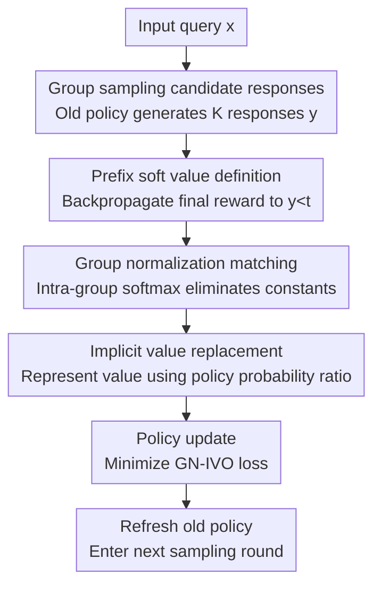

# Group-Normalized Implicit Value Optimization for Language Models

**Conference**: ICLR 2026  
**OpenReview**: [https://openreview.net/forum?id=eFXmrCun0c](https://openreview.net/forum?id=eFXmrCun0c)  
**Code**: TBD  
**Area**: LLM Alignment / Post-training Optimization  
**Keywords**: Reinforcement learning post-training, Implicit value function, Group normalization, Sequence-level credit assignment, Critic-free optimization

## TL;DR
GN-IVO treats LLM generation as a step-by-step decision process. It constructs a normalized reward distribution from a group of candidate responses under the same prompt and then matches this distribution using the prefix probability ratio of the current policy relative to the old policy. This provides fine-grained value signals for tokens or reasoning steps without training an explicit critic or value network.

## Background & Motivation

**Background**: In LLM post-training, reinforcement learning (RL) has become a common means to enhance alignment, summarization, open-ended generation, and mathematical reasoning capabilities. Methods such as PPO, DPO, Online DPO, GRPO, and RLOO attempt to transform "final answer quality" into model parameter updates. Many of these methods avoid training a separate critic to save memory and engineering costs.

**Limitations of Prior Work**: Many mainstream methods still treat the entire answer as a single action, obtaining a scalar reward only after the sequence ends. This bandit perspective works for short answers or preference alignment but is coarse for long-chain reasoning: if the final answer is wrong, it is unclear whether it was a step 2 algebraic error or a final formatting error; if correct, it is unclear which intermediate steps actually contributed to the success.

**Key Challenge**: Sequence-level RL methods can use Bellman consistency or soft Q-learning to learn step-level values, but they typically require additional value networks, partition function estimation, or value heads. For LLM post-training, these additional components introduce memory overhead, training instability, and hyperparameter tuning burdens. Conversely, purely group-based methods like GRPO/RLOO are critic-free but mainly perform advantage estimation at the full-sequence level without truly modeling the value of prefixes.

**Goal**: The authors aim to simultaneously satisfy two conditions: first, language generation should perform credit assignment by token or reasoning step rather than assigning a single label to the entire answer; second, the training process should not depend on an explicit critic or introduce new networks to estimate intractable partition functions.

**Key Insight**: Starting from the closed-form optimal policy of KL-regularized RL, the paper finds that reward reweighting over the full sequence can be generalized to any prefix. That is, the "quality" of a prefix $y_{<t}$ can be expressed as a soft value $V(x,y_{<t})$, which is directly related to the probability ratio of the optimal policy relative to the old policy.

**Core Idea**: Form a small group of $K$ candidate responses for the same input. Normalize all shared constants within the group, letting the policy's own prefix probability ratio serve as an implicit value. This allows learning step-level credit assignment through distribution matching.

## Method

### Overall Architecture

The workflow of GN-IVO can be understood as "first sampling a set of candidates using the old policy, then forming an intra-group target distribution using the final rewards, and finally letting the relative probability ratio of the current policy at a certain prefix step fit this distribution." It does not train a separate value head for each token but hides the value within the policy ratio $\pi_\theta(y_{<t}|x) / \pi_{\theta_{old}}(y_{<t}|x)$.

In mathematical reasoning tasks, $y_t$ is treated as a complete reasoning step; in general text generation, $y_t$ can be a single token. During training, $K$ full responses are sampled for each query, scalar rewards are evaluated for each, a time step $t$ is randomly sampled, and the prefixes of these responses before $t$ are used to construct the intra-group matching target.

The true contribution nodes are the last four steps: prefix soft value definition, group normalization matching, implicit value replacement, and policy update. Sampling and reward evaluation serve as the training scaffold, determining the relative feedback received by the group-normalized objective.

### Key Designs

**1. Prefix Soft Value Definition: Transforming terminal rewards into signals distributable to intermediate steps**

The paper starts from the standard KL-regularized objective: given query $x$, the optimal policy satisfies $\pi^*(y|x) \propto \pi_{old}(y|x) e^{R(x,y)/\alpha}$. Conventional understanding suggests this only implies probability reweighting for the full completion; GN-IVO's first step is to prove the same structure applies to any prefix $y_{<t}$.

The authors define soft value: when $t=T$, $V(x,y_{<t})=R(x,y)/\alpha$; when $t<T$, $V(x,y_{<t})=\log \mathbb{E}_{\pi_{old}(y|y_{<t},x)}[e^{R(x,y)/\alpha}]$. The intuition is clear: the value of a prefix is determined not by how much it looks like a correct answer currently, but by how high the expected exponentiated future reward is when continuing from this prefix. Thus, the optimal prefix distribution can be written as $\pi^*(y_{<t}|x)=\pi_{old}(y_{<t}|x)e^{V(x,y_{<t})}/Z(x)$, providing a clear goal for step-level credit assignment.

**2. Group-Normalized Matching: Using candidate groups of the same query to eliminate the intractable partition function**

Directly fitting $V(x,y_{<t})$ encounters the partition function $Z(x)$, which requires summing over all possible sequences. GN-IVO's key treatment is sampling $K$ responses for the same query and comparing the relative values of these prefixes within the same group. Since $Z(x)$ is shared across candidates, group normalization automatically cancels this constant.

Specifically, the target distribution comes from the exponentiated rewards of each full response, using $\mathrm{softmax}(R(x,y^{(i)})/\alpha)$ as the intra-group weights in practice; the model distribution comes from the exponentiated value of each prefix. The training goal is to match these two intra-group distributions. It learns "which prefix is more likely to lead to high-reward results" rather than the absolute value. The paper further proves that with infinite capacity and data, this objective recovers the true soft value up up to an additive constant independent of $y_{<t}$, which does not change the induced optimal policy.

**3. Implicit Value Substitution: Replacing the critic by letting the policy probability ratio assume the role of value**

The group-normalized objective can initially be written as a training loss for an explicit value estimator $V_\psi$, but the paper eventually avoids training this network. According to the prefix distribution relation, $e^{V(x,y_{<t})}$ is proportional to $\pi^*(y_{<t}|x)/\pi_{old}(y_{<t}|x)$; by substituting the trainable policy $\pi_\theta$, the intra-group distribution on the model side can be written directly in the normalized form of the policy probability ratio.

The practical benefit is significant: critics, value heads, and partition estimators are unnecessary. For each candidate prefix, calculating the log probability difference between the current policy and the old policy yields the implicit value score. Because the softmax is performed within the group, common factors like $C_t(x)$ and $Z(x)$ vanish from the numerator and denominator, leaving only the relative preferences between different candidate prefixes.

**4. Online Iterative Training: Sampling with the old policy and matching intra-group reward distributions with the current policy**

The actual algorithm of GN-IVO is online. In each round, the policy from the previous round is frozen as $\pi_{old}$, which is used to sample $K$ responses per query. The task reward function evaluates the full responses. Finally, the GN-IVO loss in Eq. 9 updates the current policy $\pi_\theta$. After the update, $\pi_{old}$ is refreshed to the current policy for the next round.

This design uses group samples like GRPO/RLOO but differently. While GRPO/RLOO use group rewards mainly as a baseline or advantage for the entire answer, GN-IVO uses the group to construct a "prefix value distribution." Thus, when outputs are long and errors are concentrated in intermediate steps, GN-IVO provides a more granular direction to the policy rather than averaging the blame across all tokens in the sequence.

### A Complete Example

Imagine a math query where the old policy samples 4 step-by-step solutions. The 1st answer is correct and formatted properly (highest reward); the 2nd is largely correct but misses the $\boxed{}$ at the end; the 3rd has an algebraic error halfway; the 4th chooses the wrong formula from the start. Traditional outcome-only updates only know the total scores of the four answers, making it hard to pinpoint where things diverged.

GN-IVO randomly samples a time step $t$, e.g., the 3rd reasoning step. It compares the first three steps of the 4 answers: if the 1st and 2nd lead to high rewards, their prefixes get higher weights in the target distribution; if the 3rd diverged at step 2, its weight for the step 3 prefix will be low; the 4th even lower. The update doesn't just copy the 1st answer but increases the probability ratios of prefixes that are more likely to lead to high rewards.

If an earlier $t$ is sampled, the model learns the value of the initial solution path; if a later $t$ is sampled, it learns the value of late-stage decisions like formatting or final answer presentation. Over multiple rounds, the sparse final reward is repeatedly projected onto different prefix positions, forming a training signal finer than whole-answer advantages.

### Loss & Training

The final GN-IVO loss can be summarized as: using group-normalized reward weights on the target side and group-normalized policy ratios on the model side. Eq. 9 in the paper is:

$$
L_{\mathrm{GN\text{-}IVO}}(\theta)=\mathbb{E}\left[-\sum_{i=0}^{K-1} e^{R(x,y^{(i)})/\alpha}\left(\log \frac{\pi_\theta(y^{(i)}_{<t}|x)}{\pi_{old}(y^{(i)}_{<t}|x)}-\log\sum_{j=0}^{K-1}\frac{\pi_\theta(y^{(j)}_{<t}|x)}{\pi_{old}(y^{(j)}_{<t}|x)}\right)\right].
$$

In implementation, the authors stabilize training by replacing $e^{R/\alpha}$ with group-normalized weights $e^{R/\alpha}/\sum_j e^{R_j/\alpha}$. All methods are implemented based on `trl`; GN-IVO uses a base trainer with default group size $K=4$, temperature $\alpha=0.2$, and retains a KL penalty $\beta$ relative to the initial model. Math experiments fine-tune Qwen2.5-Math-7B and Llama-3.1-8B-Instruct with LoRA, while text generation experiments run for 500 iterations.

## Key Experimental Results

### Main Results

The paper validates GN-IVO on mathematical reasoning and three text generation tasks. Math reasoning uses MATH for training, testing on AMC 2023, Minerva Math, Olympiad-Bench, and AIME 2024/2025. Text generation covers Helpful assistant, TL;DR summarization, and text-to-image prompt generation.

| Task / Backbone | Metric | GN-IVO | Strongest/Second Best Baseline | Gain & Observations |
|--------|------|------|----------|------|
| AMC2023 / Llama-3.1-8B-Instruct | Pass@1 | 42.5 | RLOO/GRPO 35.0 | Significant improvement; group signals plus prefix modeling aid early reasoning decisions |
| AIME2024 / Qwen2.5-Math-7B | Pass@3 | 40.0 | RLOO 36.6 / GRPO 33.3 | Maintains advantage on hard math; superior to pure group advantage methods |
| Helpful assistant / Qwen2.5-1.5B-Instruct | Avg@1 | 1.650 | GRPO 1.594 | Outperforms strong RL baselines in open generation |
| TL;DR / Llama-3.2-3B-Instruct | Avg@1 | 3.347 | Ours one-step 3.398 / RLOO 3.181 | Sequential version close to one-step on short summaries; task length affects gains |
| Prompt generation / Llama-3.2-3B-Instruct | Avg@1 | 0.384 | Ours one-step 0.371 / Online DPO 0.372 | Slight but stable lead in stylistic prompt generation |

| Backbone | Task Set | GN-IVO GM | Strongest Baseline GM | Description |
|--------|------|------|------|------|
| Qwen2.5-1.5B-Instruct | Three text tasks | 1.152 | Ours one-step 1.056 / RLOO 1.004 | Sequential is best overall; prefix value helps beyond math |
| Llama-3.2-3B-Instruct | Three text tasks | 1.630 | Ours one-step 1.478 / RLOO 1.193 | Improvement more pronounced with stronger text backbone |

### Ablation Study

Analyses focus on group size, temperature, reward normalization, and the number of sampled time steps. Trends are clear despite numerical variations.

| Configuration | Key Metric / Trend | Description |
|------|---------|------|
| $K=2,4,8,16$ | Reward increases with $K$ | More candidates make empirical distribution closer to true relative value; GN-IVO outperforms GRPO more clearly in small groups |
| $\alpha=0.1,0.2$ | Higher final reward | Smaller temperature makes $\mathrm{softmax}(R/\alpha)$ sharper, stressing high-quality responses |
| $\alpha=0.5,1.0$ | Lower final reward | Over-smoothed distribution reduces distinction, weakening training signals |
| Reward w/ normalization | More stable training | Normalizing exponential rewards makes update scales controllable |
| Sampled $t=1,20,T$ | Multi-step sampling > single | Projecting sparse rewards to different prefixes is a core gain of GN-IVO |

### Key Findings

- GN-IVO advantages primarily appear in tasks with long outputs, intermediate reasoning, or multi-stage generation, consistent with its step-level value modeling goal.
- Pure critic-based methods (PPO, DRO, OREO) did not stably dominate; the authors suggest value networks struggle to estimate accurately in long-range reasoning, where critic errors drag down the policy.
- Critic-free methods using group samples (GRPO/RLOO) generally outperform single or dual-sample methods, but GN-IVO leads further, suggesting that *how* groups are used is more critical than *whether* they are used.
- In short-output tasks like TL;DR, the gap between sequential GN-IVO and the one-step version narrows, indicating that gains depend on the necessity of fine-grained credit assignment.
- Temperature $\alpha$ cannot be too large; a distribution softened to near-uniformity loses discriminative power in group matching targets.

## Highlights & Insights

- The cleverest part is transforming value learning into intra-group distribution matching. It bypasses the absolute value magnitude and focuses on the relative value of different prefixes for the same query, avoiding the partition function.
- GN-IVO is a smooth extension of the DPO logic: if DPO implies "LMs are secretly a reward model," GN-IVO suggests "LMs are secretly a step-level value model." Both use policy ratios to replace extra predictors.
- This paper merges group sampling from GRPO/RLOO with sequential credit assignment from OREO/DQO, but the key is that group normalization allows "critic-free" and "prefix value" to coexist.
- For tasks requiring process supervision but lacking step-level labels, this framework is highly transferable. As long as a full output can be rewarded, signals can be projected onto intermediate states via random prefix sampling.
- Theoretical guarantees regarding recovery of true values up to an additive constant are sufficient for softmax policies, as they only care about relative prefix preferences.

## Limitations & Future Work

- The method relies on sampling $K$ responses per query and evaluating rewards. Training overhead shifts from the critic to sampling and reward evaluation; throughput remains an issue for expensive reward models or long outputs.
- It assumes intra-group candidates provide sufficient relative variance. In tasks with extremely sparse rewards where all $K=4$ responses are wrong with identical scores, the target distribution remains uninformative.
- Theoretical analysis assumes infinite capacity, sufficient data, and full support coverage by the old policy; in practice, LoRA capacity, sampling drift, and KL penalties affect these guarantees.
- Experiments primarily prove reward gains; quantification of training costs, VRAM savings, wall-clock time, and scaling to larger models is still limited. The true engineering cost-benefit ratio relative to GRPO needs larger-scale validation.
- Future work could migrate group-normalized implicit value ideas to diffusion, agent planning, or tool-use tasks, where "prefix states" might be more complex than tokens or reasoning steps.

## Related Work & Insights

- **vs PPO**: PPO estimates advantage with a critic for clipped policy updates; GN-IVO learns relative prefix values via group-normalized policy ratios, avoiding value network memory and stability issues.
- **vs DPO / Online DPO**: DPO converts preference pairs into policy loss at the full-answer level; GN-IVO handles scalar rewards and online sampling, assigning signals to prefixes.
- **vs GRPO / RLOO**: Both use group reward statistics as baselines/advantages and are critic-free; GN-IVO also lacks a critic but transforms the group's role from a baseline to a distribution matching target, making it better suited for long-chain reasoning.
- **vs DRO**: DRO uses soft Bellman ideas for score feedback but is more bandit-oriented and requires value/partition estimations; GN-IVO avoids these via group normalization.
- **vs OREO / DQO**: Both emphasize sequential decision-making but rely on step-level value networks or Q-functions; GN-IVO demonstrates that sequential modeling does not necessitate an explicit critic, as policy ratios carry sufficient value information.

## Rating

- Novelty: ⭐⭐⭐⭐⭐ Naturally combines group normalization, implicit value, and sequential credit assignment with a solid theoretical motivation.
- Experimental Thoroughness: ⭐⭐⭐⭐ Covers math reasoning and three text tasks against strong baselines (PPO/DPO/GRPO/RLOO/OREO); however, training cost and larger scale analyses could be deeper.
- Writing Quality: ⭐⭐⭐⭐ Clear derivation; core theorems directly support algorithm design. Tables are dense, and some appendix trends lack exact numerical values.
- Value: ⭐⭐⭐⭐⭐ Highly practical for LLM post-training, especially for scenarios requiring process-level credit assignment without the overhead of a critic.

<!-- RELATED:START -->

## Related Papers

- [\[ICLR 2026\] Pretrain Value, Not Reward: Decoupled Value Policy Optimization](pretrain_value_not_reward_decoupled_value_policy_optimization.md)
- [\[ICLR 2026\] Cognitive models can reveal interpretable value trade-offs in language models](cognitive_models_can_reveal_interpretable_value_trade-offs_in_language_models.md)
- [\[ICLR 2026\] Reward Models Inherit Value Biases from Pretraining](reward_models_inherit_value_biases_from_pretraining.md)
- [\[ICML 2026\] VALUEFLOW: Toward Pluralistic and Steerable Value-based Alignment in Large Language Models](../../ICML2026/llm_alignment/valueflow_toward_pluralistic_and_steerable_value-based_alignment_in_large_langua.md)
- [\[ACL 2025\] Internal Value Alignment in Large Language Models through Controlled Value Vector Activation](../../ACL2025/llm_alignment/internal_value_alignment_in_large_language_models_through_controlled_value_vecto.md)

<!-- RELATED:END -->
