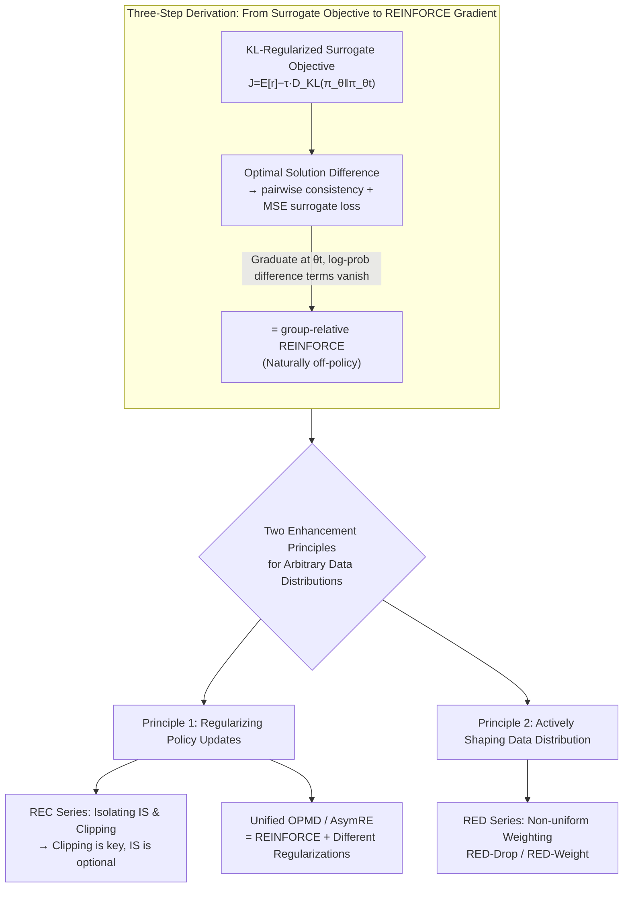

# Group-Relative REINFORCE Is Secretly an Off-Policy Algorithm: Demystifying Some Myths About GRPO and Its Friends

**Conference**: ICLR 2026  
**arXiv**: [2509.24203](https://arxiv.org/abs/2509.24203)  
**Code**: [Trinity-RFT](https://github.com/agentscope-ai/Trinity-RFT/tree/main/examples/rec_gsm8k)  
**Area**: LLM Alignment / RL  
**Keywords**: GRPO, off-policy RL, importance sampling, clipping, REINFORCE, Policy Optimization

## TL;DR

By constructing a KL-regularized surrogate objective and deriving the pairwise consistency condition, this work proves from first principles that group-relative REINFORCE (GRPO) is naturally an off-policy algorithm. Furthermore, through component isolation experiments, it finds that clipping is the key to training stability while importance sampling can be entirely removed. Under this unified framework, it re-interprets several seemingly independent algorithms such as Kimi OPMD and Meta AsymRE.

## Background & Motivation

**Background**: GRPO and its variants (DAPO, GiGPO) have become mainstream algorithms for LLM RL training. DeepSeek-R1 achieved breakthrough results using GRPO for reasoning models, the Kimi team proposed OPMD, and Meta introduced AsymRE—these methods each provide different theoretical justifications, but their intrinsic connections remain unclear.

**Limitations of Prior Work**: The success of GRPO has been attributed to multiple factors—variance reduction via group-relative advantage, distribution shift correction via importance sampling (IS), and training stabilization via clipping—but the true contribution of each component has never been systematically isolated and verified. Crucially, GRPO is theoretically treated as an on-policy algorithm (requiring sampling from the current policy for unbiased gradient estimation), but in engineering practice, it almost always runs on off-policy data (mismatch between rollout generation and model training speeds, data from older policies, delayed reward feedback). this disconnect between theory and practice lacks rigorous explanation.

**Key Challenge**: Classical policy gradient theory requires training data to come from the current policy $\pi_\theta$, and off-policy correction relies on importance sampling weights $\pi_\theta(y|x)/\pi_b(y|x)$, which can explode exponentially with sequence length in the LLM context. Existing practices use token-wise ratios instead of response-wise ratios, introducing bias without strict theoretical guarantees.

**Goal**: (1) Provide a theoretical derivation for GRPO that does not rely on sampling distribution assumptions; (2) systematically isolate the roles of components like IS and clipping; (3) explain the intrinsic links between GRPO, OPMD, and AsymRE within a unified framework.

**Key Insight**: The authors observe that starting from a KL-regularized surrogate objective, one can derive a pairwise consistency condition satisfied by its optimal solution. By constructing a mean squared surrogate loss that enforces this condition and taking a single gradient step at the current parameters, one yields exactly the GRPO update formula. The entire derivation does not require specifying which policy the data originated from.

**Core Idea**: GRPO is an off-policy algorithm; clipping is the sole critical component for stability while IS is nearly useless; a set of two enhancement principles (regularizing policy updates + actively shaping data distribution) can unify and improve a series of RL algorithms.

## Method

### Overall Architecture

This paper aims to answer a long-standing ambiguity: while GRPO is theoretically treated as on-policy, it almost always runs on off-policy data in engineering. The authors reconcile this not by patching the sampling distribution assumptions, but by proving that the GRPO update formula can be derived from a KL-regularized surrogate objective without assuming the data source. Since the derivation never assumes "data comes from the current policy," it is naturally off-policy.

The theory unfolds in three steps. First, define a KL-regularized surrogate objective anchored at the previous policy $\pi_{\theta_t}$: $J(\theta; \pi_{\theta_t}) = \mathbb{E}[r(x,y)] - \tau \cdot D_{\text{KL}}(\pi_\theta \| \pi_{\theta_t})$, and find the pairwise consistency condition satisfied by its optimal policy. Second, construct a mean squared surrogate loss using finite samples to enforce this condition. Third, take a single gradient step at the current parameters $\theta_t$; the result is equivalent to the group-relative REINFORCE update. Building on this off-policy interpretation, the authors extract two enhancement principles for arbitrary data distributions: **regularizing policy update steps** (clipping, KL penalties, etc.) to prevent collapsing the policy on sub-optimal data, and **actively shaping training data distributions** (sample weighting, dropping low-reward samples, etc.) to guide update directions.

### Key Designs

**1. Three-Step Derivation: From Surrogate Objective to REINFORCE**

The foundation of the theory. The optimal solution to the KL-regularized surrogate objective has a closed form $\pi^*(y|x) \propto \pi_{\theta_t}(y|x) \exp(r(x,y)/\tau)$. Taking the logarithm and differencing between any two responses $y_1, y_2$ yields the pairwise consistency condition: $r_1 - \tau(\log\pi(y_1|x) - \log\pi_{\theta_t}(y_1|x)) = r_2 - \tau(\log\pi(y_2|x) - \log\pi_{\theta_t}(y_2|x))$. This implies that the "reward minus KL shift" should be equal for every response. The authors formulate this as a mean squared loss over all sample pairs:

$$\hat{L} = \frac{1}{K^2}\sum_{i<j}(a_i - a_j)^2$$

A critical step occurs during differentiation: when taking the gradient at $\theta = \theta_t$, all log-probability difference terms vanish because $\pi_\theta = \pi_{\theta_t}$, and the remaining part simplifies to $\frac{1}{K}\sum_i (r_i - \bar{r}) \nabla_\theta \log\pi_\theta(y_i|x)$—which is exactly the GRPO update. This process bypasses classical on-policy sampling requirements entirely.

**2. REC Series: Isolating IS and Clipping**

To identify which components actually drive performance, the authors design variants of REINFORCE-with-Clipping (REC). REC-OneSide-IS keeps IS weights and one-sided clipping but removes advantage normalization. REC-OneSide-NoIS further removes IS weights, keeping only a clipping mask:

$$M_i^t = \mathbb{1}(A_i > 0,\ \rho_i^t \leq 1+\epsilon_{\text{high}}) + \mathbb{1}(A_i < 0,\ \rho_i^t \geq 1-\epsilon_{\text{low}})$$

The community often assumes IS is the core mechanism for off-policy correction. However, experiments show that removing IS results in overlapping reward curves and nearly identical performance, while removing clipping causes immediate training collapse. Clipping acts as an implicit trust-region constraint, preventing the policy from drifting into sub-optimal regions when sample coverage is limited.

**3. Unified Explanation of OPMD and AsymRE: REINFORCE with Regularization**

Kimi's OPMD loss can be decomposed into a REINFORCE loss plus a mean squared regularization $\frac{\beta}{2K}\sum_i(\log\pi_\theta(y_i|x) - \log\pi_{\text{old}}(y_i|x))^2$ (where $\beta = \tau$). Meta's AsymRE baseline shift $\bar{r} - \beta$ is equivalent to REINFORCE loss plus a KL regularization $\frac{\beta}{K}\sum_i \log\frac{\pi_{\text{old}}(y_i|x)}{\pi_\theta(y_i|x)}$, which converges to $\beta \cdot D_{\text{KL}}(\pi_{\text{old}} \| \pi_\theta)$ in the large-sample limit. Though derived differently, these are all instances of the "Regularizing Policy Updates" principle, using clipping (GRPO), mean squared (OPMD), or KL (AsymRE) penalties.

**4. RED Series: Shaping Data Distribution**

The authors generalize the pairwise surrogate loss to include weights $\sum_{i<j} w_{i,j}(a_i - a_j)^2$, leading to weighted REINFORCE. **RED-Drop** discards low-reward negative samples, training only on a subset $\mathcal{S} \subseteq [K]$. This mitigates the risk of entropy collapse from negative gradients. **RED-Weight** uses reward-dependent weights $w_i$, which can be decomposed into weighted REINFORCE plus a regularization term that mimics high-reward responses, echoing conclusions from offline RL that regularizing toward high-reward trajectories is more effective than conservative imitation.

### Loss & Training

The core loss remains the standard REINFORCE loss $-\frac{1}{K}\sum_i(r_i - \bar{r})\log\pi_\theta(y_i|x)$, superimposed with optional regularization—clipping masks, KL penalties, or mean squared regularization. Training uses the Trinity-RFT framework, with `sync_interval` and `sync_offset` parameters precisely controlling the degree of off-policy behavior to support on-policy, mixed, and offline experimental settings.

## Key Experimental Results

### Main Results: IS vs. Clipping Ablation (GSM8k, Qwen2.5-1.5B-Instruct)

| Algorithm | Clipping Range | IS | On-Policy Reward | Mixed Reward | Offline Reward |
| :--- | :--- | :--- | :--- | :--- | :--- |
| GRPO | (0.2, 0.2) | ✓ | Normal | Normal | Normal |
| REC-OneSide-IS | (0.2, 0.2) | ✓ | ≈ GRPO | ≈ GRPO | ≈ GRPO |
| REC-OneSide-NoIS | (0.2, 0.2) | ✗ | ≈ GRPO | ≈ GRPO | ≈ GRPO |
| REC-OneSide-NoIS | (0.6, 2.0) | ✗ | **Faster Conv.** | **Faster Conv.** | Speed ↑ / Unstable |
| REINFORCE (No Clipping) | — | ✗ | **Collapse** | **Collapse** | **Collapse** |

Core Conclusion: Removing IS results in nearly perfectly overlapping reward curves, proving IS is non-essential. Removing clipping leads to immediate collapse, proving it is the sole critical component.

### Ablation Study

| Setup | Task/Model | Key Finding |
| :--- | :--- | :--- |
| REC Series | ToolACE / Llama-3.2-3B | IS non-essential; clipping remains critical across models/tasks. |
| RED-Drop | GSM8k / Qwen2.5-1.5B | Dropping low-reward samples works in both on/off-policy settings. |
| RED-Weight | Guru-Math / Qwen2.5-7B | Weighting outperforms GRPO with similar KL shift; positive scaling. |
| RED-Weight | MATH / Llama-3.1-8B | Validated effectiveness on harder math tasks across models. |
| OPMD Repro | GSM8k / Qwen2.5-1.5B | MSE and clipping are complementary, though clipping alone is sufficient. |
| AsymRE Repro | GSM8k / Qwen2.5-1.5B | Baseline shift (KL regular.) is effective but less robust than clipping. |

### Key Findings

- **IS is entirely removable**: Across all tested models, tasks, and off-policy levels, removing IS showed no significant performance change. This simplifies engineering by removing the need to store old policy probabilities.
- **Clipping is the only indispensable component**: It acts as an implicit trust region. Without it, the direction of policy updates becomes uncontrollable with finite samples.
- **Wider asymmetric clipping ranges accelerate training**: Allowing a larger increase for positive advantages ($\epsilon_{\text{high}} = 2.0$) while moderately loosening the lower bound ($\epsilon_{\text{low}} = 0.6$) encourages learning from successes while allowing some forgetting of failures.
- **3-arm bandit counter-example**: Vanilla REINFORCE fails on off-policy data without regularization/shaping, as seen in a synthetic example where it converges to a sub-optimal action because sampling density outweighs reward magnitude.

## Highlights & Insights

- **Theoretical Elegance**: The three-step derivation (Surrogate → Consistency → MSE Loss → Gradient = REINFORCE) is structurally clear. The log-prob difference vanishing trick at $\theta_t$ reveals a deep structural link.
- **Counter-intuitive IS Finding**: While IS is considered foundational for off-policy RL, in LLM fine-tuning (where shifts are often small and token-wise IS is biased), its effect is negligible. Clipping provides the real stability.
- **Unified Framework**: It bridges GRPO, OPMD, and AsymRE into a single story of REINFORCE + specific regularizations.

## Limitations & Future Work

- **Lack of Convergence Proof**: The off-policy interpretation provides justification but lacks formal policy improvement or convergence guarantees.
- **Offline Stability Trade-off**: Expanding clipping ranges in purely offline settings can lead to instability, requiring potential adaptive clipping strategies.
- **Single vs. Multi-turn RL**: Analysis is based on one-step RL (prompt-response). While an extension to multi-step is provided in the appendix, it lacks experimental validation.
- **Task Scope**: Primarily validated on reasoning/tool-use tasks with clear reward signals; fuzzy rewards (creativity) remain untested.

## Related Work & Insights

- **vs. PPO**: Like PPO, clipping is shown here to be crucial even in off-policy contexts, but GRPO does not require a value function.
- **vs. DPO**: While DPO is purely offline, off-policy REINFORCE maintains online learning capability while tolerating stale data.
- **vs. DAPO**: DAPO's success can be viewed through the lens of regularizing updates and shaping distributions.
- **vs. REBEL/CoPG**: These share the KL objective and consistency condition but prioritize multi-step optimization, whereas this work identifies that the single-step gradient recovers REINFORCE.

## Rating

- Novelty: ⭐⭐⭐⭐⭐ Deriving an off-policy explanation for GRPO and debunking the necessity of IS.
- Experimental Thoroughness: ⭐⭐⭐⭐ Broad coverage across models and tasks; needs more agentic/dialogue validation.
- Writing Quality: ⭐⭐⭐⭐⭐ Extremely clear theoretical progression and pedagogical framework.
- Value: ⭐⭐⭐⭐⭐ Highly actionable for engineering—removing IS and tuning clipping are immediate optimizations.

<!-- RELATED:START -->

## Related Papers

- [\[ACL 2026\] MDP-GRPO: Stabilized Group Relative Policy Optimization for Multi-Constraint Instruction Following](../../ACL2026/llm_alignment/mdp-grpo_stabilized_group_relative_policy_optimization_for_multi-constraint_inst.md)
- [\[ICLR 2026\] Mitigating the Safety Alignment Tax with Null-Space Constrained Policy Optimization](mitigating_the_safety_alignment_tax_with_null-space_constrained_policy_optimizat.md)
- [\[ICML 2026\] UDM-GRPO: 统一离散扩散模型的稳定高效 GRPO](../../ICML2026/llm_alignment/udm-grpo_stable_and_efficient_group_relative_policy_optimization_for_uniform_dis.md)
- [\[ICLR 2026\] When Data Is the Algorithm: A Systematic Study and Curation of Preference Optimization Datasets](when_data_is_the_algorithm_a_systematic_study_and_curation_of_preference_optimiz.md)
- [\[ICLR 2026\] Learning More with Less: A Dynamic Dual-Level Down-Sampling Framework for Efficient Policy Optimization](learning_more_with_less_a_dynamic_dual-level_down-sampling_framework_for_efficie.md)

<!-- RELATED:END -->
