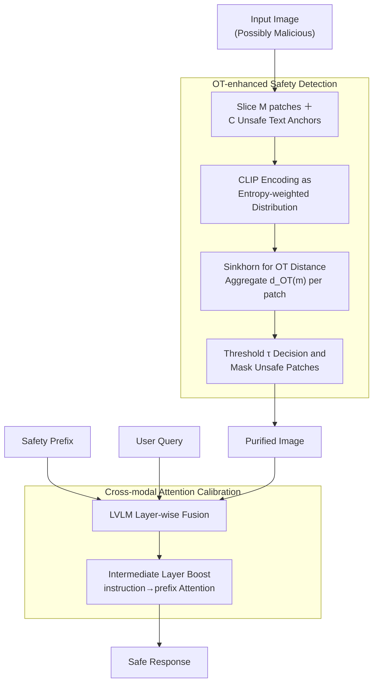

# GuardAlign: Test-time Safety Alignment in Multimodal Large Language Models

**Conference**: ICLR 2026  
**arXiv**: [2602.24027](https://arxiv.org/abs/2602.24027)  
**Code**: None  
**Area**: LLM Alignment  
**Keywords**: LVLM Safety, Optimal Transport (OT), Attention Calibration, Test-time Defense, Visual Safety Detection

## TL;DR
This paper proposes GuardAlign, a training-free inference-time safety defense framework for Large Vision-Language Models (LVLMs). It utilizes Optimal Transport (OT) to precisely detect and mask unsafe regions in images and applies cross-modal attention calibration to prevent the influence of safety prefixes from decaying. GuardAlign reduces the unsafe response rate by up to 39% across six LVLMs while maintaining or even enhancing general capabilities.

## Background & Motivation

**Background**: LVLMs (e.g., LLaVA, InternVL) have made significant strides in vision-language reasoning but remain vulnerable to generating harmful responses when input images carry malicious semantics. Existing defenses include fine-tuning methods (which are costly) and inference-time methods (such as contrastive decoding, which incur high overhead). Recently, lightweight input-side defense paradigms have emerged.

**Limitations of Prior Work**:
   - The first step of input-side defense typically uses CLIP to detect unsafe images. However, in complex scenarios, similarity scores of safe and unsafe samples overlap significantly, leading to inaccurate detection.
   - The second step involves adding a safety prefix to activate internal defense mechanisms. Yet, as the number of layers increases, the attention weight of the prefix continuously decays, diluting the safety signal.
   - Even after an initial refusal, models often begin generating unsafe content after transition words such as "However."

**Key Challenge**: Global CLIP similarity fails to capture local malicious semantics + safety prefix signals decay in deep layers.

**Goal**: Achieve more accurate unsafe content detection and more persistent safety signal maintenance.

**Key Insight**: Model the fine-grained distribution distance between image patches and unsafe semantics using Optimal Transport (OT); prevent the decay of safety prefix signals using an attention calibration mechanism.

**Core Idea**: Malicious patch detection via OT + safety prefix maintenance via attention calibration = training-free LVLM safety defense.

## Method

### Overall Architecture
GuardAlign transforms potentially malicious images into "safe and usable" inputs without modifying model weights. It follows a two-step process: first, **OT-enhanced safety detection** identifies and masks local regions with unsafe semantics patch-by-patch to produce a purified image; second, the purified image, a safety prefix, and the user query are fed into the LVLM. During generation, **cross-modal attention calibration** is performed at intermediate layers to continuously boost the attention of the safety prefix, ensuring its influence does not decay with depth. Both steps are completed at test-time without requiring training or fine-tuning.

### Key Designs

**1. OT-enhanced Safety Detection: Precise Localizing of Malicious Regions via OT**

Prior paradigms used global CLIP similarity to determine if an image was unsafe, but similarity scores of safe and unsafe samples often overlap in complex scenes. GuardAlign instead models fine-grained alignment at the patch level. The image is sliced into $M$ patches, and a set of text anchors is prepared for each of $C$ unsafe categories. CLIP is used to encode image patches $\{\mathbf{x}^m\}$ and text variants $\{\mathbf{z}_i^n\}$, which are represented as two discrete distributions:

$$\mathbb{P}(\mathbf{x})=\sum_m a^m \delta(\mathbf{x}^m), \qquad \mathbb{Q}_i(\mathbf{z})=\sum_n b_i^n \delta(\mathbf{z}_i^n)$$

The patch weights $a^m$ are determined by entropy weighting—higher confidence (low entropy) patches receive greater weight. After solving for the OT distance between distributions using the Sinkhorn algorithm, the transmission contributions for each patch across all categories are aggregated:

$$d_{\text{OT}}(m)=\sum_i\sum_n \mathbf{T}_i(m,n)\,\mathbf{C}_i(m,n)$$

Patches below a certain threshold are judged unsafe and masked. The advantage of this approach is that the transport plan naturally identifies the "most suspicious patches" without requiring additional localization. The paper also provides theoretical guarantees that the OT method's classification error does not exceed that of cosine similarity methods because the entropy-weighted transport plan prioritizes the alignment of discriminative features.

**2. Cross-modal Attention Calibration: Ensuring Safety Signals Penetrate Deep Layers**

Detection alone is insufficient. Even with a safety prefix to activate internal defenses, the authors observed that the attention weight of the prefix in models like LLaVA decreases monotonically with layer depth, becoming nearly "forgotten" in deep layers. This causes the model to pivot back to unsafe content after a "However" transition. The proposed calibration boosts the attention of instruction tokens toward prefix tokens in intermediate layers. For the $h$-th head of the $l$-th layer:

$$\hat{\mathbf{Z}}_{l,h} = \mathbf{Z}_{l,h} + \gamma\,\mathbf{M}^{\text{pref}}_{l,h} \circ \mathbf{Z}_{l,h}$$

Here, $\gamma > 0$ controls the amplification strength. The mask $\mathbf{M}^{\text{pref}}$ specifically selects instruction token $\to$ prefix token query-key pairs and amplifies only the positively correlated attention. This ensures the safety signal remains activated at every layer.

### Loss & Training
- Training-free, pure test-time method.
- OT solved using the Sinkhorn algorithm (efficient iteration).
- Safety detection threshold $\tau=0.42$; attention amplification coefficient $\gamma > 0$ serves as a hyperparameter.

## Key Experimental Results

### Main Results: Unsafe Response Rate (USR) Comparison

| Model | Method | SPA-VL ↓ | MM-SafetyBench SD+TYPO ↓ | FigStep ↓ | Suffix ↓ | Unconstrained ↓ |
|------|------|---------|------------------------|-----------|----------|----------------|
| LLaVA-1.5-7B | Vanilla | 46.04 | 40.46 | 58.60 | 62.00 | 97.50 |
| | + ECSO | 23.40 | 15.89 | 37.40 | 59.00 | 95.00 |
| | + ETA | 16.98 | 15.83 | 7.80 | 22.60 | 22.50 |
| | + **Ours** | **10.31** | **9.65** | **3.40** | **15.30** | **15.00** |
| LLaMA3.2-11B | Vanilla | 7.17 | 19.17 | 41.60 | 44.00 | 15.00 |
| | + **Ours** | **1.25** | **2.28** | **3.50** | **3.00** | **3.50** |

### Ablation Study: Component Contributions

| Configuration | SPA-VL USR ↓ | VQAv2 ↑ | Description |
|------|-------------|---------|------|
| ETA baseline | 16.98 | 78.51 | CLIP Detection + Safety Prefix |
| + OT Detection | 12.45 | 78.85 | OT improves detection accuracy |
| + Attn Calibration | 10.31 | 79.21 | Full GuardAlign |
| Only OT Detection | ~14 | ~79 | OT provides the largest contribution |
| Only Attn Calib. | ~13 | ~79 | Calibration provides independent contribution |

### Key Findings
- **OT Detection vs. CLIP**: OT achieves clear separation between safe and unsafe samples on SPA-VL, whereas CLIP similarity scores show heavy overlap.
- **Calibration vs. "However" Attacks**: Following calibration, prefix attention remains stable across layers, preventing the model from switching to unsafe content after an initial refusal.
- **Performance Gain**: GuardAlign improves performance on VQAv2 from 78.51% to 79.21% and shows gains in benchmarks like MME. This is because masking irrelevant patches and calibrating attention reduces semantic noise during multimodal fusion.
- **Efficiency**: Inference overhead is minimal as the Sinkhorn algorithm converges quickly.

## Highlights & Insights
- **New Perspective on OT for Safety**: Reformulating image safety detection as a distribution distance problem is more robust than patch-wise cosine similarity. The transport plan naturally identifies suspicious patches.
- **Discovery of Prefix Attention Decay**: This observation explains why simply adding a safety prefix is insufficient—the model "forgets" the instruction in deep layers. Attention calibration is a lightweight and effective fix.
- **Safety as a Positive-Sum Game**: While safety defenses often sacrifice utility, GuardAlign's patch masking and attention calibration simultaneously reduce multimodal fusion noise and achieve a win-win for both safety and capability.

## Limitations & Future Work
- **Dependency on Predefined Categories**: Requires a predefined list of unsafe semantic categories, which may not cover emerging attack vectors.
- **Manual Threshold $\tau$**: The threshold $\tau=0.42$ is the result of experimental tuning; different models or scenarios may require adjustment.
- **Vision-centric Defense**: Defense against text-only jailbreak attacks relies on the safety prefix without specialized text-side detection.
- **Future Directions**: LLMs could be used to automatically generate unsafe category lists for adaptivity; focus could also be placed on dynamically adjusting calibration strength during each generation step.

## Related Work & Insights
- **vs. ECSO**: ECSO uses CLIP detection and safety prefixes. GuardAlign improves both stages (OT replaces CLIP, and attention calibration strengthens the prefix).
- **vs. ETA**: ETA is the direct predecessor of GuardAlign; GuardAlign addresses ETA's two core flaws.
- **vs. VLGuard (Posthoc-LoRA)**: VLGuard requires fine-tuning, whereas GuardAlign is training-free and exhibits superior general capabilities.

## Rating
- Novelty: ⭐⭐⭐⭐ Combining OT for safety detection and attention calibration is novel, though individual components are established.
- Experimental Thoroughness: ⭐⭐⭐⭐⭐ Comprehensive evaluation across 6 models and 5 safety benchmarks plus general benchmarks.
- Writing Quality: ⭐⭐⭐⭐ Clear structure with valuable theoretical analysis.
- Value: ⭐⭐⭐⭐ A highly practical inference-time defense solution that is easy to deploy.

<!-- RELATED:START -->

## Related Papers

- [\[ICLR 2026\] Test-Time Alignment for Large Language Models via Textual Model Predictive Control](test-time_alignment_for_large_language_models_via_textual_model_predictive_contr.md)
- [\[ICLR 2026\] Semantic-aware Wasserstein Policy Regularization for Large Language Model Alignment](semantic-aware_wasserstein_policy_regularization_for_large_language_model_alignm.md)
- [\[ICLR 2026\] A2D: Any-Order, Any-Step Safety Alignment for Diffusion Language Models](a2d_any-order_any-step_safety_alignment_for_diffusion_language_models.md)
- [\[ACL 2026\] On the Rejection Criterion for Proxy-Based Test-Time Alignment](../../ACL2026/llm_alignment/on_the_rejection_criterion_for_proxy-based_test-time_alignment.md)
- [\[ICML 2026\] Towards Context-Invariant Safety Alignment for Large Language Models](../../ICML2026/llm_alignment/towards_context-invariant_safety_alignment_for_large_language_models.md)

<!-- RELATED:END -->
