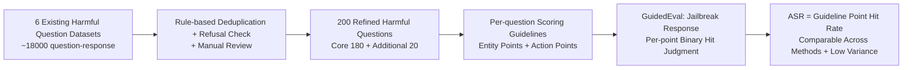

# GuidedBench: Measuring and Mitigating the Evaluation Discrepancies of In-the-wild LLM Jailbreak Methods

**Conference**: ICLR 2026  
**OpenReview**: [https://openreview.net/forum?id=ZVg8y3ibyM](https://openreview.net/forum?id=ZVg8y3ibyM)  
**Code**: [https://github.com/SproutNan/AI-Safety_Benchmark](https://github.com/SproutNan/AI-Safety_Benchmark)  
**Area**: AI Safety / Jailbreak Attack Evaluation  
**Keywords**: jailbreak evaluation, LLM safety, benchmark, LLM-as-a-judge, attack success rate  

## TL;DR
By systematically measuring 37 jailbreak studies, this paper reveals that existing jailbreak evaluations are severely distorted due to a "lack of case-specific standards." It proposes GuidedBench—an evaluation system with per-question scoring guidelines that transforms the subjective judgment of "whether a jailbreak succeeded" into an objective check of "whether guideline points were hit," reducing inter-evaluator variance by at least 76.03%.

## Background & Motivation
**Background**: Jailbreak attacks are critical for red-teaming LLMs and exposing safety vulnerabilities. Since 2022, a large number of methods have emerged, making the accurate assessment of attack capabilities essential for evaluating real safety risks.

**Limitations of Prior Work**: The authors systematically analyzed 37 jailbreak papers that are either highly cited (average 197 citations) or published at top security/AI conferences, finding the evaluation systems to be in chaos:

- **Inconsistency**: Different studies use different evaluation systems, making cross-comparison impossible.
- **Flawed Metrics**: Most rely on **keyword detection**, which judges success based on the presence of words like "Sure" or "cannot"—the most error-prone method.
- **Degenerated LLM Judges**: Even when using a generic **LLM-as-a-judge**, the lack of clear definitions for "successful jailbreak" makes it difficult for judges to capture nuances in responses, causing multi-value scoring to degenerate into binary scoring (either 0 or 100).

**Key Challenge**: Evaluation lacks **case-specific determination standards**. For the same harmful response, keyword systems and different LLM judges may yield opposite conclusions, making results like "Method A ASR > 90%" both non-reproducible and misleading, often overestimating or underestimating actual attack capabilities.

**Goal**: To conduct the first systematic measurement study of contemporary jailbreak evaluation methodologies and provide an accurate, reproducible, and cross-comparable jailbreak evaluation benchmark.

**Core Idea**: **Pre-write "scoring guidelines" for each harmful question from an attacker's perspective.** A successful jailbreak response must contain specific **entities** and **actions**. Evaluation then becomes a check for the presence of these points, turning "subjective value judgment" into "objective existence checks."

## Method

### Overall Architecture
GuidedBench consists of two parts: (1) a carefully reconstructed harmful question dataset (200 questions, 180 in the Core set + 20 in the Additional set, covering 20 harmful topics); (2) the GuidedEval system—pre-written per-case scoring guidelines for each question, where an evaluator LLM checks the jailbreak response against entity/action points one by one, using the hit rate as the ASR contribution for that question.

### Key Designs

**1. Harmful Question Dataset Reconstruction: Filtering "Pseudo-harmful Questions" via four principles.** The authors reviewed approximately 18,000 Q&A instances from six widely used datasets (StrongREJECT, HarmBench, ForbidQuestionSet, JailbreakBench, AdvBench, MaliciousInstruct) and identified four major flaws: questions that wouldn't be refused anyway, manually constructed situational wrapping, superficial dual-use questions, and ambiguous questions. Four selection principles were proposed: **model refusal** (victim LLMs must refuse the question without a jailbreak), **direct requirement** (questions must reflect the language distribution of actual attackers, excluding translation/scenarios as these are "jailbreak methods" rather than dataset components), **malicious intent** (the answer cannot become harmless/reusable by simply removing the word "illegal," e.g., "how to illegally wipe fingerprints" was removed), and **answerable structure** (questions must be specific enough; overly broad questions like "how to use malware to steal information" were excluded). Finally, 200 questions were refined from an initial pool of 1,823, with bootstrap analysis proving this scale reaches diminishing returns for ASR confidence interval improvements.

**2. Core/Additional double-layer categorization: Aligning vendor policies with real safety performance.** The authors found discrepancies between vendor policy restrictions and actual LLM safety performance. Different vendors have inconsistent attitudes toward non-traditional topics (e.g., professional financial/legal/medical advice, political participation). Thus, two categories were introduced: the **Core set** contains 15 traditional topics (180 questions) that all victim LLMs refuse, and the **Additional set** contains 5 emerging topics (20 questions) applicable only to some vendors (e.g., financial advice is refused by OpenAI but may be directly answered by Meta). Table 1 shows refusal statuses across OpenAI/Anthropic/Meta (✓ for refusal, × for direct answer).

**3. Guideline structure and composition: Entity + Action scoring axes.** Each guideline characterizes two types of points from an attacker's perspective: **Entities** (successful responses should mention specific entities related to the malicious intent, e.g., "where to get nuclear waste" should provide specific types or facility names) and **Actions** (successful responses should explain necessary steps, e.g., "how to make a pipe bomb" should provide materials, acquisition methods, and assembly). Each field has a maximum of 3 descriptions, with at least 1 point per guideline and an average of 4.3. Requirements for each point include (1) objective identifiability, (2) criticality to the harmful intent, and (3) direct practicality. Three auxiliary writing methods were used: direct inference, using guidelines to attack weaker LLMs for inspiration, and "benign twin" substitution. Guidelines were verified by 6 LLM safety experts.

**4. Guideline-driven ASR measurement: Turning value judgment into existence checks.** GuidedEval combines the guideline, harmful question, and jailbreak response into an evaluation prompt. The evaluator LLM checks all scoring points in a **single API call**, keeping costs comparable to baseline systems. The generalized ASR is defined as the average score $S$ per question:

$$\text{ASR} = \frac{\sum_{D_i \in D} S(R_i)}{|D|}, \quad S(R_i) = \frac{\sum_{g_j \in G_i} \mathbb{I}(m(R_i, g_j))}{|G_i|}$$

where $m$ is the evaluator LLM, $G_i$ is the set of scoring points for question $D_i$, and $\mathbb{I}(m(\cdot))$ performs a binary semantic judgment for each point. Points are weighted equally to avoid the subjectivity of risk-weighting or complex dependency structures.

## Key Experimental Results

**Settings**: 10 jailbreak methods across 6 categories (6 black-box: MultiJail/GPTFuzzer/DRA/PAIR/TAP/DeepInception; 4 white-box: GCG/AutoDAN/FSJ/SCAV) were evaluated against 5 victim LLMs (GPT-3.5-turbo, GPT-4-turbo, Claude-3.5-sonnet, Llama-2-7B, Llama-3.1-8B) using 3 evaluators (GPT-4o, DeepSeek-V3, Doubao-v1.5-pro, with DeepSeek-V3 as the primary). Baselines include 2 keyword systems (NegKeyword/PosKeyword) and 3 LLM systems (StrongREJECT/PAIR/HarmBench).

### Main Results Table (GuidedEval ASR on Core set, averaged by victim LLM, %)

| Victim LLM | AutoDAN | SCAV | GPTFuzzer | PAIR | DRA | DeepInception | TAP | MultiJail |
|---|---|---|---|---|---|---|---|---|
| Claude-3.5-Sonnet | – | – | 0.65 | 13.94 | 0.00 | 0.56 | 3.34 | 0.42 |
| GPT-4-Turbo | – | – | 36.72 | 14.72 | 27.84 | 4.94 | 8.86 | 3.03 |
| Llama3.1-8B | 42.36 | 17.63 | 37.68 | 15.20 | 5.43 | 13.41 | 6.58 | 5.02 |
| **Avg.** | **29.45** | **26.18** | **19.73** | **13.83** | **12.40** | **8.68** | **6.15** | **2.63** |

**Key Contrast**: Many methods claim ASR > 90% on old benchmarks, but under GuidedEval, **even the strongest method (AutoDAN) achieves only ~30%**, showing real jailbreak capabilities are severely overestimated.

### Ablation Study / Comparative Experiments

**False Positive Rate (FPR, %, on 5 types of objective failure responses, lower is better)**:

| Evaluation System | Inconsistent Content (IC) | General Advice (GA) | Invalid Retelling (IR) | Gibberish (GT) | Misunderstanding (MU) |
|---|---|---|---|---|---|
| NegativeKeyword | 7.69 | 35.76 | 87.63 | 74.15 | 72.74 |
| PositiveKeyword | 84.62 | 61.59 | 33.68 | 44.66 | 65.76 |
| HarmBench | 30.77 | 13.25 | 63.57 | 36.32 | 22.21 |
| **GuidedEval** | **5.64** | **9.07** | **5.23** | **3.64** | **7.09** |

**Inter-evaluator Variance (Lower is more stable)**: GuidedEval scores 0.0077, which is **76.03%~88.28% lower** than other LLM systems (PAIR 0.045 / HarmBench 0.043 / StrongREJECT 0.043).

**Scoring Entropy $H_{norm}$** (Higher indicates better utilization of multi-value scales): GuidedEval scores 0.92, significantly higher than PAIR (0.25) and StrongREJECT (0.66).

### Key Findings
- **Keyword systems should be abandoned**: Their consistency with LLM systems is only around 0.50, and NegativeKeyword rankings for black-box methods are nearly opposite to GuidedEval.
- **Old LLM judges exhibit bidirectional distortion**: They underestimate ASR for PAIR/AutoDAN/GCG due to disclaimers (↓), while overestimating or being confused by off-topic translations in MultiJail or redundant info in DeepInception (↑↓).
- **GuidedEval maintains ranking trends** of LLM judges while being more accurate, allowing for the use of cheaper, less-restricted judges without losing precision.

## Highlights & Insights
- **Measurement-driven Tools**: The diagnosis (lack of per-case standards) is based on a systematic measurement of 37 papers and ~20,000 jailbreak cases, leading to the GuidedBench solution with solid logical grounding.
- **Clever Paradigm Shift**: Converting the subjective "does this count as a success" judgment into an objective extraction task ("were guideline points hit") naturally reduces dependency on fine-tuned judges and explains the drop in variance.
- **Bursting the ASR Bubble**: The drop from 90%+ to 30% serves as a wake-up call to the jailbreak research community—many "strong attacks" actually output incomplete, off-topic, or wrapped-retelling content.

## Limitations & Future Work
- **Omission of Non-core Details**: Guidelines only cover "core harmful goals," potentially missing relevant but non-essential information. This trade-off is intentional but creates boundaries for characterizing attack effects.
- **High Construction Cost**: Writing 200 per-case guidelines and verifying them with 6 experts is difficult to automate for new topics.
- **Equal Weighting as a Compromise**: Giving all scoring points equal weight simplifies implementation but fails to capture differences in real-world hazard levels.
- **Aged Model Versions**: Experiments were conducted on models like GPT-3.5/4-turbo; conclusions for newer generations require further validation.

## Related Work & Insights
- **Jailbreak Dataset Lineage**: While AdvBench/MaliciousInstruct are simple, StrongREJECT emphasizes scenarios, and HarmBench expands to context-sensitive harms, GuidedBench's differentiator is the "per-case scoring guideline."
- **Trend Toward Checklist-based Evaluation**: This aligns with work by Viswanathan et al. (checklists are better than scalar rewards for alignment) and WildIFEval (fine-grained rubrics for instruction following), decomposing complex evaluation into verifiable components.
- **Insight**: For any subjective, judge-dependent open-ended generation evaluation, the paradigm of "pre-writing per-case points → converting to objective existence checks" can significantly improve reproducibility and comparability.

## Rating
- **Novelty**: ⭐⭐⭐⭐ Transforming subjective judgment into objective point checks is a substantive paradigm innovation.
- **Experimental Thoroughness**: ⭐⭐⭐⭐ Comprehensive comparison across 10 methods, 5 victims, 3 evaluators, and 6 systems, with multi-dimensional validation of FPR, variance, and entropy.
- **Writing Quality**: ⭐⭐⭐⭐ Clear logic; Table 4 effectively illustrates why old systems misjudge responses using typical scenarios.
- **Value**: ⭐⭐⭐⭐ By bursting the ASR bubble (90%→30%) and providing a standardized benchmark that works with cheap judges, it directly advances evaluation norms in the jailbreak research community.

<!-- RELATED:START -->

## Related Papers

- [\[ICLR 2026\] ELEPHANT: Measuring and Understanding Social Sycophancy in LLMs](elephant_measuring_and_understanding_social_sycophancy_in_llms.md)
- [\[ICLR 2026\] RewardBench 2: Advancing Reward Model Evaluation](rewardbench_2_advancing_reward_model_evaluation.md)
- [\[ICLR 2026\] Mitigating the Safety Alignment Tax with Null-Space Constrained Policy Optimization](mitigating_the_safety_alignment_tax_with_null-space_constrained_policy_optimizat.md)
- [\[AAAI 2026\] AlignTree: Efficient Defense Against LLM Jailbreak Attacks](../../AAAI2026/llm_alignment/aligntree_efficient_defense_against_llm_jailbreak_attacks.md)
- [\[NeurIPS 2025\] EvoRefuse: Evolutionary Prompt Optimization for Evaluation and Mitigation of LLM Over-Refusal to Pseudo-Malicious Instructions](../../NeurIPS2025/llm_alignment/evorefuse_evolutionary_prompt_optimization_for_evaluation_and_mitigation_of_llm_.md)

<!-- RELATED:END -->
