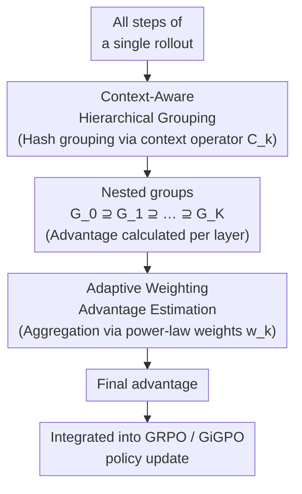

# Hierarchy-of-Groups Policy Optimization for Long-Horizon Agentic Tasks

**Conference**: ICLR 2026  
**arXiv**: [2602.22817](https://arxiv.org/abs/2602.22817)  
**Code**: TBD  
**Area**: LLM Alignment  
**Keywords**: group-relative RL, advantage estimation, long-horizon agent, bias-variance tradeoff, context consistency  

## TL;DR
This paper reveals the "historical context inconsistency" problem in stepwise group-based RL (such as GRPO/GiGPO), where steps within the same group may have different historical contexts, leading to biased advantage estimation. HGPO is proposed to achieve low-bias, balanced-variance advantage estimation through hierarchical grouping and adaptive weighting, achieving significant improvements on ALFWorld and WebShop with minimal extra overhead (<0.001%).

## Background & Motivation
**Background**: RL-based LLM Agent training (e.g., GRPO, GiGPO) shows prominent performance in long-horizon tasks. The core idea is to group multiple steps from the same rollout into a single group and estimate the advantage using relative signals within the group.

**Limitations of Prior Work**: In long-horizon tasks, although different steps of the same rollout originate from the same episode, their historical contexts may be entirely different (e.g., step 3 and step 10 face different combinations of environment states). Mixing steps with inconsistent contexts to calculate the advantage introduces systematic bias.

**Key Challenge**: Step-level advantage estimation is unbiased but high-variance; group-level estimation is low-variance but biased. How can the optimal balance be found between the two?

**Goal**: Design a hierarchical advantage estimation method that constructs nested group structures based on historical context consistency to achieve controllable bias-variance trade-offs.

**Key Insight**: Define a k-step context operator $\mathcal{C}_k$ and construct nested groups $G_0^H \supseteq G_1^H \supseteq \cdots \supseteq G_K^H$ based on shared history from 0 to K steps.

**Core Idea**: Groups with more consistent contexts provide more accurate advantage estimations (lower bias) and should be assigned higher weights.

## Method

### Overall Architecture
HGPO aims to address an ignored source of bias in group-based RL: different steps of the same rollout are forced into one group to calculate relative advantage, even though their historical contexts may differ significantly, introducing bias into the mean baseline. The approach inserts a hierarchical advantage estimation module into the standard GRPO/GiGPO pipeline. After obtaining all steps of a rollout, it first segments them into multi-layer nested groups from coarse to fine based on historical context consistency. An advantage is calculated for each layer, and these estimates are aggregated into a final value using adaptive weights that increase with the hierarchy level. Finally, this advantage is fed back into the original policy update. The entire pipeline does not introduce any additional models, extra rollouts, or forward passes. Grouping and searching are completed via an offline hashmap, resulting in only about 0.5 seconds of extra time per iteration (less than 0.001% of total training time). Furthermore, it only modifies "how the advantage is calculated" without changing rollouts or models, making it plug-and-play for any group-based method such as GRPO, GiGPO, or DAPO.

### Key Designs

**1. Context-Aware Hierarchical Grouping: Partitioning steps into nested multi-layer groups based on historical context consistency**

The pain point is straightforward: treating all steps of an entire rollout as one group treats steps with completely different historical contexts as comparable objects. HGPO's countermeasure is to define a k-step context operator $\mathcal{C}_k$ and construct a sequence of nested groups $G_0^H \supseteq G_1^H \supseteq \cdots \supseteq G_K^H$, where $G_k^H$ only includes steps that share the same first $k$ steps of history. When $k=0$, all steps "share an empty history," so $G_0^H$ is the entire rollout (degenerating to GiGPO); when $k=K$, it is the most constrained and finest-grained group. As $k$ increases, the historical contexts of steps within the group become more consistent, reducing the bias of using the group mean as a baseline. Implementation-wise, the state sequence of each step is hashed and stored in a hashmap. Grouping and lookup are $O(1)$ and require no forward passes, which is why the mechanism incurs nearly zero overhead.

**2. Adaptive Weighting Advantage Estimation: Aggregating advantages from each layer with weights that increase with hierarchy level to explicitly control bias-variance**

Multiple layers of groups are not enough; one must decide which layers to trust more. HGPO calculates an advantage for each layer $G_k^H$ and aggregates them using power-law weights:

$$w_k = \frac{(k+1)^\alpha}{\sum_k (k+1)^\alpha}$$

Higher levels (larger $k$, more consistent context, lower bias) receive greater weights. The exponent $\alpha$ serves as the control knob: as $\alpha \to 0$, weights tend toward uniformity, averaging the estimates of all layers; as $\alpha \to \infty$, the weight is concentrated on the finest-grained layer. This captures the initial contradiction into a single adjustable parameter—step-level estimation is unbiased but high-variance, while coarse-grained group estimation is low-variance but biased. The paper provides theoretical guarantees that the aggregated advantage interpolated this way falls precisely between the step-level (unbiased, high-variance) and Oracle estimations, turning the trade-off between bias and variance into a continuously adjustable spectrum.

## Key Experimental Results

### Main Results

| Method | ALFWorld In-Succ | ALFWorld Out-Succ | WebShop Score | WebShop Succ |
|------|-----------------|------------------|--------------|-------------|
| GiGPO (1.5B) | 93.29% | 91.53% | 86.80% | 73.24% |
| **HGPO (1.5B, K=4)** | **94.85%** | **92.12%** | **90.64%** | **78.12%** |
| GiGPO (7B) | 95.43% | 92.79% | 88.44% | 72.50% |
| **HGPO (7B, K=4)** | **95.96%** | **93.75%** | **90.49%** | **79.29%** |
| GPT-4o | — | 48.0% | — | — |
| Gemini-2.5-Pro | — | 60.3% | — | — |

### Ablation Study

| Configuration | WebShop Score |
|------|-------------|
| HGPO K=0 (=GiGPO) | 86.80% |
| HGPO K=1 | 87.32% |
| HGPO K=2 | 88.92% |
| HGPO K=4 | **90.64%** |

### Key Findings
- Smaller models (1.5B) benefit more: average Gain of 3.41% (K=2), while larger models (7B) see a 0.74% Gain.
- Larger K values yield better results, but with diminishing returns.
- HGPO outperforms closed-source models like GPT-4o and Gemini-2.5-Pro (on ALFWorld).
- Computational overhead is negligible (increment of <0.001% time).

## Highlights & Insights
- **Valuable Problem Discovery**: "Historical context inconsistency" is a real and overlooked issue in group-based RL.
- **Zero-Cost Improvement**: Improved performance is achieved solely through hashmap and weighting, without requiring extra models, extra rollouts, or extra GPUs.
- **Plug-and-Play**: Compatible with any group-based method such as GRPO, GiGPO, and DAPO.
- Theoretical analysis proves HGPO is strictly superior to pure step-level and pure group-level estimation on the bias-variance spectrum.

## Limitations & Future Work
- Evaluation is limited to two benchmarks, ALFWorld and WebShop; coverage could be broader.
- Gains for larger models (7B) are limited; at K=4, the improvement is only 0.13%—larger models' advantage estimations may already be relatively accurate.
- Relies on hashable environment state comparisons; applicability to continuous state spaces has not been discussed.
- Has not been deeply compared with value-based advantage estimation methods (e.g., GAE).

## Related Work & Insights
- **vs GRPO**: GRPO performs grouping at the outcome-level, ignoring context differences at the step-level.
- **vs GiGPO**: GiGPO extends to the step-level but still uses the full rollout as a group, suffering from context inconsistency.
- **vs DAPO**: DAPO focuses on exploration and clipping; it is orthogonal to HGPO and can be used in combination.
- Provides general insights for all group-based RLHF/Agent training methods.

## Supplementary Technical Details

### Example of Context Inconsistency Impact
In ALFWorld, a task to "find an apple and put it in the fridge" may involve multiple steps. Step 3 (open drawer) and step 8 (open fridge) might be in the same rollout group, but they face completely different environment states. Using the group mean as a baseline directly introduces bias.

### Conceptual Comparison with GAE
GAE (Generalized Advantage Estimation) interpolates between TD(0) and MC via the $\lambda$ parameter to control the bias-variance trade-off. HGPO's philosophy is similar but operates at the group level rather than the time-step level, and it does not require an additional value function approximation.

## Rating
- Novelty: ⭐⭐⭐⭐ The problem discovery is valuable, and the solution is elegant and zero-cost.
- Experimental Thoroughness: ⭐⭐⭐ Two benchmarks are sufficient to demonstrate effect but could be broader.
- Writing Quality: ⭐⭐⭐⭐ Clear motivation chain and rigorous theoretical analysis.
- Value: ⭐⭐⭐⭐ A plug-and-play improvement with practical significance for the group-based RL community.

<!-- RELATED:START -->

## Related Papers

- [\[ICML 2026\] Long Live The Balance: Information Bottleneck Driven Tree-based Policy Optimization](../../ICML2026/llm_alignment/long_live_the_balance_information_bottleneck_driven_tree-based_policy_optimizati.md)
- [\[ICLR 2026\] Pretrain Value, Not Reward: Decoupled Value Policy Optimization](pretrain_value_not_reward_decoupled_value_policy_optimization.md)
- [\[ICLR 2026\] Mitigating the Safety Alignment Tax with Null-Space Constrained Policy Optimization](mitigating_the_safety_alignment_tax_with_null-space_constrained_policy_optimizat.md)
- [\[ICLR 2026\] RE-PO: Robust Enhanced Policy Optimization as a General Framework for LLM Alignment](re-po_robust_enhanced_policy_optimization_as_a_general_framework_for_llm_alignme.md)
- [\[ICLR 2026\] Is On-Policy Data always the Best Choice for Direct Preference Optimization-based LM Alignment?](is_on-policy_data_always_the_best_choice_for_direct_preference_optimization-base.md)

<!-- RELATED:END -->
