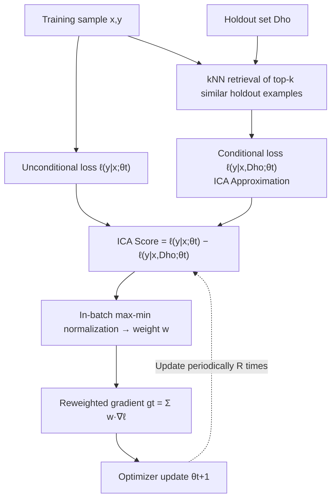

# Holdout-Loss-Based Data Selection for LLM Finetuning via In-Context Learning

**Conference**: ICLR 2026  
**OpenReview**: [https://openreview.net/forum?id=Cw9Bxpda2h](https://openreview.net/forum?id=Cw9Bxpda2h)  
**Code**: [https://github.com/microsoft/HeurAgenix/tree/dpo](https://github.com/microsoft/HeurAgenix/tree/dpo)  
**Area**: LLM Alignment / Data Selection / Fine-tuning  
**Keywords**: data selection, holdout loss, in-context learning, gradient reweighting, SFT, DPO, SimPO  

## TL;DR
By using In-Context Learning (treating the holdout set as in-context examples) to approximate "the holdout loss brought by training on a specific sample," the proposed method scores and dynamically reweights each fine-tuning sample without needing a reference model or retraining. This consistently improves alignment for SFT/DPO/SimPO with an additional overhead of only approximately 1.5%.

## Background & Motivation
**Background**: Fine-tuning (SFT + preference alignment such as RLHF/DPO/SimPO) is the standard practice for aligning pre-trained LLMs with human intent. The quality of the data directly determines the clarity of the alignment signal. Research has repeatedly shown that "small but high-quality" datasets can often rival large, heterogeneous ones, making the systematic selection of high-value training samples a critical problem.

**Limitations of Prior Work**: Approximately 20–40% of preference data contains noisy labels, and alignment performance is highly sensitive to such noise. However, existing data selection methods have significant drawbacks: influence-function-based methods (LESS, GREATS) rely on first-order Taylor expansions, where assumptions are often violated during batch selection and require extra computation to control error; proxy model, bi-level optimization, or meta-learning approaches are either computationally expensive or lack theoretical support; and heuristic quality scoring lacks a rigorous connection to downstream performance.

**Key Challenge**: Theoretically, the most appropriate metric is "how much the loss of the model on the holdout set decreases after training on a specific sample" (i.e., holdout loss), as this directly corresponds to the final objective of fine-tuning. However, **naively calculating this requires retraining and evaluating for every candidate subset, which is computationally infeasible**. RHO-Loss simplifies this via Bayesian formulas but still requires training a separate reference model, which introduces bias into the "sample contribution estimation."

**Goal**: To design a principled, resource-efficient, and dynamically updated data selection/reweighting framework that evolves with the model, retaining the theoretical anchor of holdout loss while completely eliminating the need for reference models and retraining costs.

**Core Idea (In-Context Approximation, ICA)**: Leveraging the observation that "in-context learning can induce model behavior similar to gradient updates" (Dai et al. 2023), **ours directly places the holdout set into the context as demonstrations to approximate the conditional loss "after training on the holdout set,"** thereby replacing expensive retraining with a single extra forward pass.

## Method

### Overall Architecture
The method reformulates data selection as a "per-sample scoring" problem: when greedily adding samples, the most valuable sample is the one that reduces the holdout loss the most. Using the Bayesian simplification from RHO-Loss, this "holdout loss score" can be written as the "loss of the current model on the sample" minus the "loss of the model trained on (current data ∪ holdout) on that same sample." The former is readily computable; the difficulty lies in the latter. Ours uses ICA to approximate it as the "conditional loss when the holdout set is used as in-context demonstrations," making the entire score calculation possible without reference models or retraining. After scoring, max-min normalization is used to convert scores into $[0,1]$ weights to reweight the gradients of the entire batch.

### Key Designs

**1. Bayesian Simplification: Turning "remastered holdout loss" into per-sample computable scores.** Directly solving $\bar{D}^\star = \arg\min_{\bar D\subset D} L(D_{ho};\theta^\star(\bar D))$ requires iterating through all subsets for retraining, which is impossible. Ours follows the Bayesian framework of RHO-Loss: using negative log-likelihood as the loss and assuming conditional independence, Bayes' rule expands the "holdout loss after adding sample $(x,y)$" into $\ell(y|x;\theta^\star(D_t\cup D_{ho})) - \ell(y|x;\theta_t) - L(D_{ho};\theta_t)$. Dropping constant terms unrelated to $(x,y)$ and reversing the sign yields the per-sample holdout-loss score $s_{ho}(x,y;\theta_t)=\ell(y|x;\theta_t)-\ell(y|x;\theta^\star(D_t\cup D_{ho}))$. This step reduces the "global retraining" problem to the "difference between two losses per sample," but the $\theta^\star(D_t\cup D_{ho})$ term still implies retraining at each step—the bottleneck ICA aims to solve.

**2. In-Context Approximation: Replacing retraining with context examples.** The core innovation is approximating $\ell(y|x;\theta^\star(D_t\cup D_{ho}))\approx \ell(y|x,D_{ho};\theta_t)$. That is, the "loss after training on the holdout" is approximated by the "conditional loss when treating the holdout set as in-context demonstrations." The intuition is that ICL simulates gradient updates: instead of actually updating parameters with the holdout set, it is fed as a demonstration so the model "acts as if it has learned it." This results in the ICA score $s_{ICA}(x,y;\theta_t):=\ell(y|x;\theta_t)-\ell(y|x,D_{ho};\theta_t)$. This score avoids reference models and additional fine-tuning, and **because it depends on the current $\theta_t$, it can dynamically re-evaluate the value of each sample as the model evolves**—something RHO-Loss with a fixed reference model cannot do. This framework applies to preference pairs (DPO/SimPO) as well, where $y$ is the preference pair $(y_w,y_l)$ and the loss is the corresponding Bradley-Terry form.

**3. In-batch max-min normalization reweighting, not hard filtering.** Actual training proceeds by batches rather than individual samples. Ours does not use hard filtering (which loses batch diversity and ignores sample interactions). Instead, ICA scores within a batch are converted to $[0,1]$ weights via max-min normalization $w(x_i,y_i;\theta_t)=\frac{s_i-\min_j s_j}{\max_j s_j-\min_j s_j}$, scaling each sample's contribution to the batch gradient: $g_t=\sum_i w(x_i,y_i)\nabla_\theta\ell(x_i,y_i)$. **Choosing max-min over softmax is intentional**: softmax's exponential amplification distorts the relative differences between high and low scores, while max-min preserves linear relative gaps, leading to more stable training. Ablations show reweighting is superior to percentile filtering.

**4. Engineering Accelerations: kNN Truncation + Periodic Updates.** Placing the entire holdout set into the context is often infeasible due to length limits. Ours uses kNN in an embedding space (default: `all-mpnet-base-v2`) to select the top-$k$ most similar holdout examples for each candidate (default $k=3$). Furthermore, scores are not recalculated at every step but are updated periodically $R$ times during training (default $R=1$, calculated once at initialization). Even with these approximations, the method consistently improves alignment while keeping overhead at ~1.5%.

## Key Experimental Results

### Main Results
Covering SFT, DPO, and SimPO with backbones including LLaMA-3-3B/8B-Instruct and Qwen-3-4B/8B, using GPT-4o judged win rates (>50% indicates ours is better).

**SFT (Table 1, win rate %):**

| Model | Alpaca vs w/o | vs RHO-Loss | vs One-Shot | Yahoo vs w/o | vs RHO-Loss | vs One-Shot |
|------|------|------|------|------|------|------|
| LLaMA 3B | 77.81 | 48.96 | 57.03 | 78.90 | 46.73 | 62.33 |
| LLaMA 8B | 80.55 | 49.92 | 62.11 | 85.10 | 54.03 | 66.93 |
| Qwen 4B | 71.21 | 50.56 | 56.82 | 80.30 | 49.93 | 58.73 |
| Qwen 8B | 82.92 | 51.21 | 58.33 | 82.93 | 54.43 | 63.13 |

**DPO (Table 2, win rate %):**

| Model | UltraFeedback vs w/o | vs RHO-Loss | vs One-Shot | SHP-2 vs w/o | vs RHO-Loss | vs One-Shot |
|------|------|------|------|------|------|------|
| LLaMA 3B | 61.05 | 46.85 | 57.60 | 79.90 | 56.70 | 60.20 |
| LLaMA 8B | 64.00 | 48.25 | 58.40 | 77.20 | 48.70 | 55.10 |
| Qwen 4B | 64.30 | 51.90 | 54.60 | 79.20 | 49.90 | 57.00 |
| Qwen 8B | 64.85 | 49.90 | 60.45 | 70.40 | 47.60 | 54.40 |

SimPO (Table 3) trends are consistent, generally 62–94% against w/o and mostly above 50% against One-Shot. **Key Conclusion**: Comprehensive and significant lead over standard training (w/o); consistently >50% and often >60% over One-Shot; comparable or slightly better than RHO-Loss without requiring a reference model. Compared to influence function methods LESS / GREATS (on Yahoo with 8B model), win rates are slightly above 50%, showing comparable performance with less computation.

### Ablation Study

| Dimension | Settings & Results | Conclusion |
|------|------|------|
| Holdout examples $k$ | $k=1$: 43.5%, $k=5$: 48.0%, $k=10$: 46.0% (vs default $k=3$) | A small number of examples is sufficient; too large $k$ introduces irrelevant samples. |
| Score update frequency $R$ | $R=3$: 50.73%, $R=5$: 52.77%, $R=9$: 51.6% (vs default $R=1$) | Multiple updates provide slight gains, but high frequency ($R=9$) is unnecessary. |
| Reweighting vs Filtering | 75th percentile: 48.67%, 50th: 40.80%, 90th: 40.07% | Hard filtering is generally <50%; adaptive reweighting is superior and avoids threshold tuning. |
| Embedding Model | bge-m3: 52% vs default all-mpnet-base-v2 | Stronger embeddings can further improve results. |

### Key Findings
- **Extremely Low Overhead**: Ours adds only ~1.5% overhead, compared to RHO-Loss (~10%) and One-Shot (~4%) (tested on LLaMA-3B with 4×A6000).
- **Robustness to Noise**: In experiments contaminating GSM8K CoT labels, reweighting the contaminated set with ours approached the performance of training on the original high-quality set, proving it can identify valuable samples from noisy data.
- **Weight Stability**: ICA weights mostly change early in training and stabilize later (correlation between first update and subsequent ones: 0.89/0.75/0.69/0.71), justifying infrequent score recalculation.
- **Rational Score Distribution**: When the holdout set is from the Sports domain, samples in the Sports domain receive higher scores, verifying that the scoring aligns with the target distribution.

## Highlights & Insights
- **Using ICL as "Virtual Training"**: The most ingenious part is approximating "post-fine-tuning loss on holdout" with "conditional loss with holdout as context," replacing retraining with a forward pass. The theoretical anchor is the same as RHO-Loss, but the reference model—the largest cost—is eliminated.
- **Dynamism**: Since the score changes with the current model $\theta_t$, the method naturally supports "re-evaluating sample value as the model evolves," which fits training dynamics better and reduces bias compared to RHO-Loss's fixed reference model.
- **Unified SFT and Preference Alignment**: The same Bayesian + ICA framework seamlessly migrates to DPO/SimPO by replacing $y$ with preference pairs and using the BT loss form.
- **High ROI Engineering**: Approximations like kNN top-3 truncation and single-initialization scoring result in almost no performance drop while keeping overhead at 1.5%.

## Limitations & Future Work
- **Dependency on High-Quality Holdout Set**: The effectiveness relies on having a clean, representative holdout set. If the holdout set is noisy or unrepresentative, generalizability to unseen data may suffer despite good alignment metrics.
- **Inapplicability to On-policy Settings**: Experiments were all off-policy. Applying this to on-policy methods (like PPO) would create a computational bottleneck because newly generated data would require frequent score recalculations.
- **GPT-4o Evaluation Bias**: While PPL and BERTScore are used as absolute metrics, the main results rely heavily on model-based evaluation, and each configuration was trained/evaluated only once due to cost.
- **Theoretical Bounds for ICA**: Approximating post-training loss with ICL conditional loss relies primarily on empirical observations from Dai et al.; the approximation error boundaries across different tasks/models have not been strictly characterized.

## Related Work & Insights
- **RHO-Loss (Mindermann et al. 2022)**: The most direct foundation and baseline; provided the Bayesian simplification for holdout loss. Ours improves it by using ICA to remove the reference model and support dynamic scoring.
- **Influence Functions (LESS, GREATS, TracIn)**: Approximates performance changes via first-order Taylor expansions; suffers from assumption violations in batch selection. Ours avoids this overhead by starting from a Bayesian perspective.
- **One-Shot Learning (Li et al. 2023b)**: Also uses ICL for scoring (one-shot loss minus zero-shot loss), but the mechanism differs; ours consistently outperforms it.
- **ICL Simulating Gradients (Dai et al. 2023)**: Provided the key intuition that "context examples ≈ gradient updates," which serves as the theoretical basis for ICA.
- **Inspiration**: The idea of approximating "expensive training operations" with "single forward pass + prompt engineering" could be transferred to curriculum learning, active learning, data cleaning, or any scenario requiring "counterfactual training evaluation."

## Rating
- **Novelty**: ⭐⭐⭐⭐ — Using ICL as a lightweight surrogate for holdout-loss retraining is a clever and insightful improvement over RHO-Loss. Removing the reference model and adding dynamic scoring are both elegant.
- **Experimental Thoroughness**: ⭐⭐⭐⭐ — Covers SFT/DPO/SimPO across LLaMA/Qwen families with solid ablations ($k$, $R$, filtering, embedding, overhead, noise); however, main metrics are weighted towards GPT evaluation with single runs.
- **Writing Quality**: ⭐⭐⭐⭐ — The derivation chain from holdout loss to Bayesian simplification to ICA is clear, with well-documented algorithms and implementation tricks.
- **Value**: ⭐⭐⭐⭐ — Consistent improvement in alignment at only 1.5% overhead without needing a reference model is highly practical for resource-constrained data selection; on-policy inapplicability is the main limitation.

<!-- RELATED:START -->

## Related Papers

- [\[ICLR 2026\] Data Selection for LLM Alignment Using Fine-Grained Preferences](data_selection_for_llm_alignment_using_fine-grained_preferences.md)
- [\[ACL 2026\] What Makes Good Instruction-Tuning Data? An In-Context Learning Perspective](../../ACL2026/llm_alignment/what_makes_good_instruction-tuning_data_an_in-context_learning_perspective.md)
- [\[AAAI 2026\] Importance-Aware Data Selection for Efficient LLM Instruction Tuning](../../AAAI2026/llm_alignment/importance-aware_data_selection_for_efficient_llm_instruction_tuning.md)
- [\[ACL 2026\] Alignment Data Map for Efficient Preference Data Selection and Diagnosis](../../ACL2026/llm_alignment/alignment_data_map_for_efficient_preference_data_selection_and_diagnosis.md)
- [\[ICLR 2026\] Humanline: Online Alignment as Perceptual Loss](humanline_online_alignment_as_perceptual_loss.md)

<!-- RELATED:END -->
