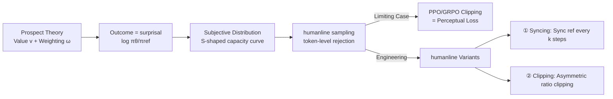

# Humanline: Online Alignment as Perceptual Loss

**Conference**: ICLR 2026  
**OpenReview**: [https://openreview.net/forum?id=FONB5dIxSB](https://openreview.net/forum?id=FONB5dIxSB)  
**Code**: To be confirmed  
**Area**: LLM Alignment / Preference Optimization  
**Keywords**: Online Alignment, Offline Alignment, Prospect Theory, Perceptual Loss, GRPO, DPO, KTO, Rejection Sampling, Clipping  

## TL;DR
This paper explains "why online alignment is superior to offline alignment" using **Prospect Theory** from behavioral economics—online on-policy sampling is closer to the subjective human perception distribution of model outputs. Furthermore, the clipping mechanism in PPO/GRPO implicitly recovers this perceptual bias, making them essentially "perceptual losses." Based on this, a design paradigm (humanline variants) is proposed to explicitly inject perceptual distortion into DPO/KTO/GRPO, matching online performance with offline data while training up to 6× faster.

## Background & Motivation
- **Background**: Post-training alignment is categorized into offline off-policy (DPO, KTO: closed-form loss, static data, cheap and stable) and online on-policy (PPO, GRPO: simultaneous sampling and scoring). Recent consensus suggests online methods have a higher performance ceiling at the cost of more compute, longer training time, and higher instability.
- **Limitations of Prior Work**: While the industry acknowledges that "online is better," explanations vary—hypotheses include better data coverage, emphasis on generation over discrimination, or simpler policy search spaces. These explanations are rooted in RL theory but fail to answer a fundamental question: if the goal is to **maximize model utility for humans**, does the online/offline dichotomy actually matter?
- **Key Challenge**: Online sampling reflects what the policy "literally produces," not what "humans perceive it produces." Humans systematically overestimate extreme outcomes and underestimate typical outcomes (Prospect Theory)—thus, even on-policy data itself is not optimal.
- **Goal**: Provide a unified human-centric explanation and break the requirement for "online data," allowing data from any source (online/offline/on-policy/off-policy) as long as it mimics human perception, making post-training faster, cheaper, and more flexible.
- **Core Idea**: **[Perceptual Loss Perspective]** View alignment as optimization on the "human subjective perception distribution"; **[Clipping = Perceptual Bias]** Prove that PPO/GRPO clipping is a special case of the Prospect Theory weighting function; **[humanline Design Paradigm]** Use a two-step approach of "reference model synchronization + asymmetric clipping" to explicitly inject perceptual distortion into any reference-model-based alignment objective.

## Method

### Overall Architecture
The paper theoretically reformulates alignment as "Prospect Theory utility maximization": the "outcome" of output $y$ is defined as surprisal $z_{x,y}=\log[\pi_\theta(y|x)/\pi_{\text{ref}}(y|x)]$ (in nats), and subjective human perception of these outcomes is characterized by a value function $v$ and a weighting function $\omega$. The paper proves that the most direct way to approximate human subjective utility is to sample according to the subjective distribution—and online on-policy sampling happens to be closer to this distribution than offline off-policy sampling. This "sampling according to subjective distribution" is implemented as token-level rejection sampling (humanline sampling), with PPO/GRPO clipping proven to be its limiting case. Finally, this theory is distilled into an engineering design paradigm: humanline syncing + humanline clipping.

### Key Designs

**1. Prospect Theory explains online > offline: The perceptual distribution is an S-shaped curve.** Prospect Theory states that human perception of probability is distorted by a capacity function $\Omega^+(a;\gamma)=a^\gamma/(a^\gamma+(1-a)^\gamma)^{1/\gamma}$ (S-shaped when $\gamma\in(0,1)$, overestimating extremes and underestimating typical values). Applying this to generative models, the authors argue that the implicit capacity curve of online on-policy sampling (dashed line) loosely fits the human perception curve (solid line), whereas offline off-policy significantly deviates: sampling with a model **worse** than the current policy yields low surprisal and early saturation; using a **better** model leads to slow saturation. Proposition 3.4 provides a bound—if the KL divergence between candidate distribution $Q$ and perceptual weight $\omega$ is small enough ($\sqrt{\text{KL}(\omega\|Q)}\le\delta/(\sqrt2\|v\|_\infty)$), subjective utility is approximated. This translates "why online is better" into one sentence: it is closer to the human perceptual distribution.

**2. humanline sampling: Simulating human perception via rejection sampling.** Since real human perception distributions are inaccessible, standard rejection sampling is modified to simulate the Prospect Theory distribution. Proposition 4.1 defines a one-sided criterion: reject a token if $\pi_\theta(y_t)/\pi_{\text{ref}}(y_t)<M'_\theta B$ (where $B\sim\text{Beta}(\gamma,1)$). To address engineering issues like sequence coherence and saturation dynamics in KTO, a two-sided definition is provided (Eq. 5): when $\frac{\pi_\theta(y_t)}{\pi_{\text{ref}}(y_t)}<M_P B_P$ or $\frac{\pi_{\text{ref}}(y_t)}{\pi_\theta(y_t)}<M_R B_R$, **the token is detached from the computation graph** (stopping gradients) rather than deleted. This preserves sequence integrity while preventing rejected tokens from affecting $\theta$ updates. $\gamma_P, \gamma_R$ implicitly control exploration-exploitation ($\gamma_P<\gamma_R$ favors exploitation).

**3. Clipping recovers perceptual bias: PPO/GRPO as perceptual loss.** Theorem 4.3 proves that the PPO/GRPO clipping term is a special case of humanline sampling under limiting conditions—where sampling from a Beta distribution degrades into taking its mean deterministically. The two one-sided criteria merge into an interval corresponding to the $[1-\epsilon, 1+\epsilon]$ range, with zero gradients outside (via derivative zeroing in clipping vs. explicit detaching in humanline). This provides a theoretical explanation for why clipping, intended for training stability, unexpectedly recovers human perceptual bias. To inject this bias more thoroughly, ratios must be clipped **upstream** of the loss.

**4. humanline design paradigm: syncing + clipping.** This transforms the theory into a two-step modification for any reference-model objectives (DPO/KTO/GRPO). **① humanline syncing**: Synchronize $\pi_{\text{ref}}$ to $\pi_\theta$ every $k$ steps before loss calculation and optimizer updates (Fig. 3); the "ruler" (reference model) for surprisal must update as the policy drifts. **② humanline clipping**: Clip the token-level ratio $\pi_\theta(y_t)/\pi_{\text{ref}}(y_t)$ into an asymmetric $[\epsilon_P, \epsilon_R]$ **before** feeding it into the loss (clipped in log-space for precision). This variant can be paired with online data (online+humanline) or offline data (offline+humanline).

## Key Experimental Results

### Main Results: Instruction Following (Unverifiable Reward)
Llama3-8B-Instruct aligned on UltraFeedback ArmoRM, AlpacaEval2 length-controlled win rate (GPT-4.1 as judge):

| Objective | Gain: offline → online | offline+humanline |
|-----------|-----------------------|-------------------|
| DPO       | +1.4×                 | Parity with online |
| KTO       | +1.3×                 | Parity with online |
| GRPO      | +1.6×                 | Parity with online |

- offline+humanline significantly outperforms offline ($p<0.05$) and matches online; humanline GRPO is 1.6× better than offline GRPO.
- online+humanline is only slightly better than online (consistent with theory: online data is already close to the perceptual distribution).
- offline+humanline GRPO is **>6× faster** in wall-clock time than online GRPO while matching performance. Gains hold across 27B scales and different model families.

### Mathematics Reasoning (Verifiable Reward)
Qwen2.5-1.5B-Instruct aligned on MATH500:

| Setting | Performance |
|---------|-------------|
| online GRPO (sampled every step) | Pass@1 = 0.593 ± 0.019 |
| 64× sparser sampling + standard GRPO | Significantly worse ($p<0.05$) |
| 64× sparser sampling + humanline GRPO | Matches online within 1000 steps |

- humanline GRPO allows for **64×** lower sampling frequency without loss in performance; clipping ranges $\log\epsilon_P=-1.5, \log\epsilon_R=1.5$ serve as strong cross-task defaults.
- Excessive syncing ($k=1$) leads to reward collapse; $k\in[12,24]$ matches online performance and avoids collapse.

### Ablation Study

| Removed Item | Effect |
|--------------|--------|
| Remove humanline syncing | Performance degrades to near offline levels (most critical) |
| Remove humanline clipping| Still fails to match online (syncing alone insufficient) |
| humanline sampling vs clipping | Comparable performance, but clipping is more stable and simpler |

### Key Findings
- **Syncing contributes the majority of gains**, but clipping is necessary to close the final gap. $k=4$ shows no performance loss.
- **Data quality still matters**: Average token log-prob under $\pi_{\text{ref}}$ (pre-training) is a good proxy for whether offline data is "good enough"; data in the bottom quartile ($[-1.03, -0.36]$) shows significantly worse training effects.
- humanline variants do not require changing method-specific hyperparameters, though learning rate/max grad norm may need adjustments (0.1×–4×).

## Highlights & Insights
- **Interdisciplinary Explanatory Power**: Uses Prospect Theory to provide a human-centric explanation for "online vs. offline," a purely empirical engineering phenomenon, complementing rather than conflicting with RL theory.
- **"Clipping as Perceptual Loss" as an Epiphany**: PPO/GRPO clipping, originally for stability, is proven to recover Prospect Theory's probability distortion, elevating an engineering trick to a theoretical necessity.
- **Decoupling Data Source and Performance**: The core argument that the online/offline dichotomy is incidental—and that the key is whether data reflects the human perceptual distribution—is methodologically significant. It liberates alignment from the compute constraints of mandatory online sampling.
- **Lightweight Engineering**: Syncing and clipping involve only a few lines of code, are plug-and-play for DPO/KTO/GRPO, and provide 6× acceleration without performance loss.

## Limitations & Future Work
- The ability of offline+humanline to match online remains an **empirical observation rather than a formal guarantee**; finding metrics beyond average token log-prob to quantify "good data" remains open.
- Prospect Theory originated in monetary contexts; the authors **assume** its shape translates to the large output space of generative models, which lacks theoretical proof and is difficult to verify via human testing on large vocabularies.
- System-level gains from fully overlapping asynchronous training/inference/labeling are not yet quantified; reducing syncing costs (e.g., partial weight sync) and personalizing $\gamma$ are open questions.

## Related Work & Insights
- **Prospect Theory → Alignment**: Extends the introduction of Prospect Theory to alignment by Ethayarajh et al. (2024, KTO), but fills the gap of the weighting function which KTO ignored (by assuming objective probability perception).
- **Online/Offline Alignment**: Relates to hybrid works like online DPO or offline PPO, but differs by arguing that the dichotomy itself is non-essential.
- **Clipping Techniques**: Multiple clipping (Team et al., 2025) and asymmetric clipping (Yu et al., 2025) have been explored, but the specific form of humanline clipping (upstream clipping + perceptual theory explanation) is novel.
- **Insight**: The path of explicitly encoding psychological/behavioral economic priors into loss functions is valuable for other preference modeling and reward shaping tasks—modeling "how humans perceive" may be more aligned with true utility than modeling the "objective distribution."

## Rating
- **Novelty**: ⭐⭐⭐⭐⭐ Provides a completely new explanation for online superiority via Prospect Theory and proves clipping = perceptual bias.
- **Experimental Thoroughness**: ⭐⭐⭐⭐ Covers verifiable/unverifiable tasks, three objectives, and multiple model scales; math reasoning only tested on 1.5B models.
- **Writing Quality**: ⭐⭐⭐⭐⭐ Clear theoretical progression and illustrations; makes abstract Prospect Theory intuitive.
- **Value**: ⭐⭐⭐⭐⭐ Directly practical for reducing post-training costs by matching online performance with offline data 6× faster.

<!-- RELATED:START -->

## Related Papers

- [\[ICLR 2026\] Enforcing Axioms for AI Alignment under Loss-Based Rules](enforcing_axioms_for_ai_alignment_under_loss-based_rules.md)
- [\[ICLR 2026\] Holdout-Loss-Based Data Selection for LLM Finetuning via In-Context Learning](holdout-loss-based_data_selection_for_llm_finetuning_via_in-context_learning.md)
- [\[ACL 2026\] Topology-Enhanced Alignment for Large Language Models: Trajectory Topology Loss and Topological Preference Optimization](../../ACL2026/llm_alignment/topology-enhanced_alignment_for_large_language_models_trajectory_topology_loss_a.md)
- [\[AAAI 2026\] When Human Preferences Flip: An Instance-Dependent Robust Loss for RLHF](../../AAAI2026/llm_alignment/when_human_preferences_flip_an_instance-dependent_robust_loss_for_rlhf.md)
- [\[NeurIPS 2025\] Provably Efficient Online RLHF with One-Pass Reward Modeling](../../NeurIPS2025/llm_alignment/provably_efficient_online_rlhf_with_one-pass_reward_modeling.md)

<!-- RELATED:END -->
