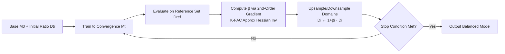

# IDEAL: Data Equilibrium Adaptation for Multi-Capability Language Model Alignment

**Conference**: ICLR 2026  
**OpenReview**: [https://openreview.net/forum?id=n9wS0Hdvri](https://openreview.net/forum?id=n9wS0Hdvri)  
**Code**: [https://github.com/ming-bot/IDEAL](https://github.com/ming-bot/IDEAL)  
**Area**: LLM Alignment / SFT Data Proportioning  
**Keywords**: Data Mixing, Supervised Fine-Tuning, Multi-Capability Alignment, Influence Function, Bilevel Optimization, K-FAC  

## TL;DR
IDEAL models the problem of "how much data to allocate for each SFT domain" as a bilevel optimization problem. It utilizes second-order (Hessian) gradient information to determine whether each domain's data should be upsampled or downsampled. Iterating for two rounds results in a balanced overall improvement of approximately 7% across four capabilities: Math, Code, Reasoning, and Instruction Following.

## Background & Motivation
**Background**: LLMs acquire general capabilities through SFT on multi-domain instruction data. When mixing heterogeneous tasks such as math, code, reasoning, and instruction following, the "mixing ratio" of each domain directly determines the performance upper bound of the final model.

**Limitations of Prior Work**: Naively concatenating multi-domain data for training often performs worse than task-specific fine-tuning due to a "bottleneck effect," where the overall performance is constrained by the weakest capability. Existing automated proportioning methods (DoReMi, DOGE, Data Mixing Law) mostly originate from pre-training scenarios and rely on training small proxy models combined with global weight searches. These methods ignore the unique dynamics of the SFT stage, where "data-task alignment directly causes cross-domain interference," and they require expensive hyperparameter scanning.

**Key Challenge**: Another approach involves using influence functions for data selection; however, these focus on individual samples and instance-level scoring, making them **incapable of handling domain-level proportioning problems** such as "adjusting the entire dataset distribution." Consequently, how to principledly resolve data conflicts in multi-capability SFT remains an open problem.

**Goal**: Given existing high-quality multi-domain data, find an optimal domain ratio. Note that "equilibrium" here does not mean equal amounts of data for each domain, but rather an optimal distribution that allows all capabilities to develop normally.

**Core Idea**: **[Model-Aware Gradient-Guided Adaptation]** This method introduces a domain-level hyperparameter $\beta\in\mathbb{R}^n$ to control the repetition/reduction ratio of each domain relative to its original volume. Finding the optimal ratio is formulated as a bilevel optimization with a reference set loss as the outer objective. Second-order information is then used to calculate the optimal descent direction for $\beta$, approaching equilibrium via iterative up/down-sampling.

## Method

### Overall Architecture
Given a base model $M_0$ and a training set $\{D_1,\dots,D_n\}$ partitioned by domain, IDEAL uses an external reference set $D_\text{ref}$ as a unified metric for multi-task performance. In each round, the model is trained to convergence under the current ratio. Then, second-order gradients are used to calculate the adjustment coefficient $\beta$ for each domain. Based on this, data in each domain is upsampled ($\beta_i>0$, repeated) or downsampled ($\beta_i<0$, reduced). The training set is reconstructed for the next round, typically reaching equilibrium within 2 rounds.

### Key Designs

**1. Formulating Proportioning as Bilevel Optimization and Solving Outer Gradients via Chain Rule**: Inspired by the discovery by Muennighoff et al. that "repeating existing data up to 4 times ≈ introducing the same amount of new data," IDEAL uses $\beta_i$ to control the proportion of repeated data in domain $i$. The optimal parameters are redefined as $\theta^*=\frac{1}{N+\sum_i\beta_i|D_i|}\arg\min_\theta\big(L(D_\text{tr},\theta)+\sum_i\beta_i L(D_i,\theta)\big)$. The outer objective is to minimize the reference set loss $Q(\beta):=L(D_\text{ref},\theta^*)$. Differentiating with respect to $\beta_j$ using the chain rule yields $\frac{\partial Q}{\partial\beta_j}=\frac{\partial L(D_\text{ref},\theta^*)}{\partial\theta^*}^\top\frac{\partial\theta^*}{\partial\beta_j}$. At the initial state $\beta=(0,\dots,0)$, the implicit function theorem gives $\frac{\partial\theta^*}{\partial\beta_j}=-\big[\nabla^2 L(D_\text{tr},\theta^*)\big]^{-1}\nabla L(D_j,\theta^*)$. Thus, the adaptation direction is determined by the second-order term: "Reference Gradient × Inverse Hessian × Domain Gradient."

**2. Making Inverse Hessian Computation Feasible with K-FAC**: Directly inverting the Gauss-Newton Hessian for an 8B model is infeasible. IDEAL leverages K-FAC theory to approximate the Hessian as block-diagonal according to MLP layers. Each layer is decomposed via Kronecker product $H_l=\mathbb{E}(x_l x_l^\top)\otimes\mathbb{E}(delta_l\delta_l^\top)=X_l\otimes\Delta_l$ (where $x_l$ is the layer input and $\delta_l$ is the backpropagated error). Eigendecomposition is performed on $X_l$ and $\Delta_l$ as $X_l=Q_{X_l}\Lambda_{X_l}Q_{X_l}^\top$ to save VRAM. Consequently, the iHVP (inverse Hessian-vector product) calculation is reduced from global matrix inversion to layer-wise operations on small matrices, enabling second-order methods to be applied to LLM SFT for the first time.

**3. Selecting "Important Layers" via Eigenvalue Variance and Compensating Magnitude with $\gamma$ Scaling**: The eigenvalues $\Lambda$ after decomposition measure the variance of pseudo-gradients along K-FAC eigenvectors. MLP layers with lower variance are more stable. IDEAL only retains these "important layers" for computation to further save VRAM. However, calculating only a subset of layers results in smaller $\beta$ magnitudes. A dynamic scaling vector $\gamma$ is introduced to linearly amplify the absolute maximum of $\beta$ to a preset value $m$: $\alpha=\frac{\partial Q(\beta)}{\partial\beta}\big|_{\beta=0}$, $\beta=-\gamma\odot\alpha$, $\gamma=\frac{m}{\max|\alpha|}$. This preserves the relative adjustment directions across domains while keeping the overall step size controllable (experimentally set to $m=0.15$).

**4. Implementing Proportioning via Upsampling/Downsampling and Decoupling via Random Sampling**: Once $\beta$ is obtained, IDEAL performs upsampling (repetition) or downsampling (deletion) for each domain according to $D_{i,t+1}\leftarrow(1+\beta_i)D_{i,t}$. **Random sampling** is used instead of any selection algorithm for data modification. This deliberate choice saves compute, speeds up processing, and maximizes the decoupling of IDEAL's gains from "sample selection quality"—ensuring the improvement stems from the proportioning itself rather than data selection. This maintains algorithm convergence through localized search near the initial distribution, offering better stability than the large fluctuations seen in DoReMi/DOGE.

## Key Experimental Results

Settings: LLaMA3.1-8B full-parameter fine-tuning across four domains (Math, Code, Reasoning, Instruction Following). Evaluation via GSM8K / HumanEval / BBH / IFEval on the OpenCompass platform. Average of 5 runs per experiment, $m=0.15$, sampling factor $\sigma=0.5$.

### Main Results (Average Overall Score)

| Method | Epoch=1 Overall | Epoch=3 Overall |
|------|:---:|:---:|
| Base Model | 39.55 | — |
| Best Specific SFT | 47.17 | 49.86 |
| Joint SFT (D0) | 54.79 | 55.35 |
| Random (Best) | 55.64 | 55.97 |
| DoReMi (Best) | 55.17 | 56.25 |
| DOGE (Best) | 54.71 | 56.87 |
| **IDEAL (D2)** | **57.87** | **59.23** |

At Epoch=1, IDEAL boosts HumanEval (Code) from 41.26 in Joint SFT to **50.61 (+9.35)** without sacrificing performance on other tasks.

### Extension Results (5 Domains + 8 Benchmarks, Epoch=3)
Added MATH / ARC-C / MBPP / TruthfulQA and a TrustAI domain, with D0(FULL) (~66k total data) as a control. This validated that IDEAL consistently improves even under the more difficult setting of balancing a full initial distribution.

### Key Findings
- **Initial distributions are naturally suboptimal**: While Joint SFT outperforms most Specific SFT, it suffers from a bottleneck effect. Random sampling can yield various results but lacks stability.
- **Equilibrium reached in 2 rounds**: In the second round, IDEAL significantly increases code data volume and slightly reduces math/instruction data, demonstrating a targeted enhancement of weak areas. The change in data volume is smoother than in DoReMi/DOGE.
- **HumanEval degrades with training duration**: While 3 epochs are better for most domains, HumanEval performs worse than at Epoch=1. Data conflicts introduced by suboptimal ratios are amplified by longer training.
- **Optimization priorities differ across epochs**: At Epoch=3, all domains tend toward "adding data" (more gradient updates to combat memorization). At Epoch=1, the focus is on local fine-tuning of domain data volumes.

## Highlights & Insights
- **Transforms "data proportioning" from engineering heuristics into a theoretically grounded optimization problem**: Uses bilevel optimization and the implicit function theorem to resolve the optimal direction for domain ratios, rather than relying on manual reweighting or rule-based curriculum learning.
- **Makes second-order methods "computationally feasible" for large models**: A suite of techniques including K-FAC block diagonalization, eigendecomposition, important layer filtering, and $\gamma$ scaling makes iHVP practical.
- **Deliberately uses random sampling instead of data selection**: This cleanly decouples "proportioning gain" from "selection gain" at the methodological level, making the conclusions more credible.
- **"Equilibrium $\neq$ Equality"**: A key insight is that the optimal distribution often involves minor asymmetric adjustments around the initial distribution.

## Limitations & Future Work
- Only validated on LLaMA3.1-8B full-parameter fine-tuning. Whether the optimality of ratios transfers across model scales/architectures requires further validation (though some supplements exist in the appendix).
- The model must be trained to convergence in each round to calculate $\beta$. 2 iterations mean 2~3 full SFT runs, which is computationally expensive. The optimality of $\beta$ also depends on the representativeness of the reference set $D_\text{ref}$.
- Domains are manually pre-partitioned (math/code/etc.); applicability to cases with blurred domain boundaries or long-tail domains is not discussed.
- Training hyperparameters (lr, batch size, epoch) are fixed throughout; joint optimization of proportions and hyperparameters is a natural next step.

## Related Work & Insights
- **Data Mixing**: DoReMi (Group DRO for proxy models), DOGE (weight determination by minimizing backpropagated gradient differences), Data Mixing Law (fitting ratio-validation loss relationships)—these mostly originate from pre-training, require global weight searches, and ignore distribution continuity. IDEAL’s "gradient-guided iterative refinement" is a targeted improvement over these.
- **Data Selection**: LESS (first-order gradient alignment with target distribution), SelectIT (using internal LLM uncertainty for selection), etc., focus on the instance level. These are orthogonal to and can complement IDEAL's domain-level proportioning.
- **Influence Functions**: The classic framework by Koh & Liang and proxy model scoring methods (like MATES) inspired IDEAL to use second-order information to measure the "domain data → reference set performance" influence. IDEAL raises the granularity from single samples to domain distributions.

## Rating
- **Novelty**: ⭐⭐⭐⭐ Formulates SFT data proportioning as bilevel optimization, shifting from instance-level to domain-level via a second-order/influence function perspective, and successfully implements second-order computation on an 8B model. Solid reasoning that fills a gap in SFT proportioning.
- **Experimental Thoroughness**: ⭐⭐⭐⭐ Main experiments on four domains + extension on eight benchmarks/five domains + multiple baselines (Specific/Joint/Random/DoReMi/DOGE) + 5-run averages. Detailed analysis, though slightly lacking intensive cross-base/cross-scale comparisons.
- **Writing Quality**: ⭐⭐⭐⭐ Clear problem definition, complete derivations, and insightful analysis. The K-FAC section has a high barrier for some readers, but readability remains high overall.
- **Value**: ⭐⭐⭐⭐ Provides a practical and theoretically supported tool for "how to mix multi-capability SFT data." Direct practical significance for training general-purpose models with an overall +7% gain and open-source code.

<!-- RELATED:START -->

## Related Papers

- [\[ICLR 2026\] Towards Understanding Valuable Preference Data for Large Language Model Alignment](towards_understanding_valuable_preference_data_for_large_language_model_alignmen.md)
- [\[ICLR 2026\] Multi-objective Large Language Model Alignment with Hierarchical Experts](multi-objective_large_language_model_alignment_with_hierarchical_experts.md)
- [\[ICLR 2026\] Capability-Based Scaling Trends for LLM-Based Red-Teaming](capability-based_scaling_trends_for_llm-based_red-teaming.md)
- [\[ICLR 2026\] Semantic-aware Wasserstein Policy Regularization for Large Language Model Alignment](semantic-aware_wasserstein_policy_regularization_for_large_language_model_alignm.md)
- [\[ICLR 2026\] Test-Time Alignment for Large Language Models via Textual Model Predictive Control](test-time_alignment_for_large_language_models_via_textual_model_predictive_contr.md)

<!-- RELATED:END -->
