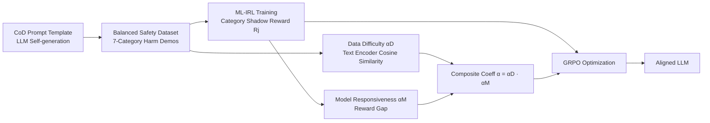

# Inverse Reinforcement Learning with Dynamic Reward Scaling for LLM Alignment

**Conference**: ICLR 2026  
**OpenReview**: [https://openreview.net/forum?id=K0Zh6mzTzc](https://openreview.net/forum?id=K0Zh6mzTzc)  
**Code**: To be confirmed  
**Area**: LLM Alignment / Safety Alignment  
**Keywords**: Inverse Reinforcement Learning, Dynamic Reward Scaling, GRPO, Safety Alignment, Shadow Reward Model, Long-tail Threats  

## TL;DR
DR-IRL utilizes Inverse Reinforcement Learning (IRL) to train category-specific shadow reward models from "balanced safety demonstration data." It then scales the advantage function in GRPO with a dynamic coefficient determined by both "data difficulty" and "model responsiveness." This concentrates optimization efforts on long-tail, high-difficulty harmful samples, significantly enhancing safety alignment without sacrificing (and even improving) general capabilities.

## Background & Motivation
**Background**: LLM alignment primarily follows two paths: reward-based (training a reward model on preference pairs followed by RL optimization like PPO/GRPO) and reward-free (direct fine-tuning on ranked outputs, like DPO). Recent research indicates that well-tuned reward-based pipelines are more robust across diverse benchmarks, and rewards trained from single demonstration data (input paired with one exemplary response) can even outperform those from expensive paired preference data.

**Limitations of Prior Work**: The authors identify two overlooked critical flaws. First, **safety training sets are severely imbalanced**—common harms (e.g., insults) are heavily oversampled, while long-tail threats (e.g., privacy, ethics) remain scarce, leading to weak protection in rare high-risk scenarios. Second, **reward models are static**—fixed rewards treat all samples equally, completely ignoring task difficulty. This forces simple and difficult samples to bear the same update pressure, limiting optimization efficiency and the achievable performance ceiling.

**Key Challenge**: Rare but high-impact long-tail threats are precisely what should be prioritized for optimization, yet the combination of imbalanced data and static rewards leads to their "under-training." Meanwhile, blindly increasing weights triggers training instability on high-uncertainty samples.

**Goal**: Construct balanced safety data and enable rewards to scale adaptively with task difficulty, enhancing safety while minimizing the alignment tax (damage to general capabilities).

**Core Idea (DR-IRL = Dynamically adjust Reward via IRL)**: Use IRL to convert demonstration data into category-specific reward models, and dynamically scale the advantage function during GRPO optimization using a coefficient derived from the product of "data-level difficulty (cosine similarity via text encoders)" and "model-level responsiveness (reward gap)."

## Method

### Overall Architecture
DR-IRL consists of three steps: first, utilizing the CoD (Chain-of-Draft) prompt template to let the LLM generate a **balanced safety demonstration dataset** covering 7 categories of harms; second, using ML-IRL to train a specialized "shadow reward model" for each category on this dataset; finally, during GRPO alignment, calculating a composite difficulty coefficient $\alpha$ for each prompt and multiplying it into the advantage function to adaptively focus optimization on long-tail difficult samples.

### Key Designs

**1. Training Category-specific Shadow Reward Models with ML-IRL: Converting demonstration data into RLHF-style contrastive signals.** DR-IRL does not rely on expensive paired preference annotations. Instead, it formulates the joint learning of reward and policy as a maximum likelihood IRL bi-level optimization: $\max_\theta \mathbb{E}_{(x,y)\sim D}[\log \pi_\theta(y|x)]$, where the lower-level constraint optimizes $\pi_\theta$ under reward $r(x,y;\theta)$ minus KL regularization. Following Li et al. (2024), this problem is equivalent to a minimax form: $\max_\theta \min_\pi \mathbb{E}_{(x,y)\sim D,\tilde y\sim\pi}\big[\tfrac{r(x,y;\theta)-r(x,\tilde y;\theta)}{\beta}+D_{KL}(\pi\|\pi_{ref})\big]$. This implies that even with single demonstrations, the formula contrasts "demonstrated response $y$" and "policy-sampled response $\tilde y$," making it inherently isomorphic to RLHF. The key difference is that the authors **train an independent shadow reward model for each of the 7 harm categories** and use IRL solely for reward pre-training (unlike Li et al., who perform reward learning and policy alignment simultaneously), ensuring precise, tailored reward signals for each type of harmful prompt.

**2. Dual-view Difficulty Metric: Data-level Semantic Separability × Model-level Reward Gap.** Difficulty is jointly characterized by two weakly correlated signals. **Data difficulty** measures the semantic discrepancy between the demonstrated response and the policy-generated response: first, decomposing paired responses into sets of self-contained sub-sentences; then using a text encoder $\Phi$ to calculate the inter-sentence cosine similarity $s_{k,l}=\cos(\Phi(S^k),\Phi(\tilde S^\ell))$; taking the maximum similarity $s_k^{max}$ of each sub-sentence to the other set and averaging them to get the overall similarity $W_{ji}$; and finally normalizing the difference $\delta_{ji}=1-W_{ji}$ into $\alpha^D_{ji}=\sigma(\delta_{ji})/\sigma(\bar\delta_j)$. **Model responsiveness** is measured by the reward gap of the shadow reward model $R_{ji}=R_j(q,o)-R_j(q,\tilde o)$, averaged as $\bar R_{P_j}$ after excluding outliers with a mask $M$, and normalized as $\alpha^M_j=\sigma(\bar R_{P_j})/\sigma(\bar R_j)$. Intuitively, a large $\alpha^D$ represents samples that are easily separable and high-confidence, while a large $\alpha^M$ indicates that the model can currently distinguish them clearly.

**3. Multiplicative Gating for Composite Coefficients: Prioritizing optimization only for "content-difficult and model-uncertain" samples.** The two signals are multiplied to obtain the composite difficulty $\alpha_{ji}=\alpha^D_{ji}\cdot\alpha^M_j$. The authors emphasize that the multiplicative form is intentional—it acts as a gating mechanism: a sample is amplified only when it is **simultaneously** semantically discriminative and remains uncertain for the model. This prevents trivial or overconfident samples from dominating updates, providing stricter constraints and more stable training than additive schemes. Since the two signals originate from the same dataset but represent different perspectives with weak correlation, their product forms a conservative joint criterion to balance safety and utility.

**4. Dynamically Scaling the GRPO Advantage Function: Directing optimization effort toward long-tail difficult samples.** Standard GRPO replaces the critic with relative scores within a group, but static rewards cause all samples to receive equal update pressure, leaving rare high-risk threats under-trained. DR-IRL multiplies the composite coefficient into the advantage function: $A_i^j=\alpha_j(q)\cdot\frac{R_{j,i}-\text{mean}(\{R_{j,\cdot}\})}{\text{std}(\{R_{j,\cdot}\})}$. The policy is then iteratively updated using the clipped GRPO objective $J^j_{\text{DR-IRL}}(\theta)$ (including PPO-style clipping and KL regularization $\beta D_{KL}(\pi_\theta\|\pi_{ref})$). Each category is aligned separately using its respective shadow reward model, allowing optimization to adaptively concentrate on the most challenging long-tail samples while avoiding over-optimization on trivial ones.

## Key Experimental Results

### Main Results Table
Comparison across 4 harmlessness and 4 helpfulness benchmarks (StrongReject reports goodness scores; XsTest/WildChat/Stereotype report refusal rates) on Llama-3.1-8B-Instruct and Qwen-2-7B-Instruct:

| Method (Llama-3.1-8B) | StrongReject | XsTest | WildChat | Stereotype | AdvGLUE | GSM8k | HHH |
|---|---|---|---|---|---|---|---|
| Base | 0.4054 | 88.00% | 47.94% | 87.37% | 58.33% | 85.60% | 82.50% |
| DPO | 0.5054 | 86.00% | 54.79% | 97.89% | 66.27% | 84.15% | 83.84% |
| SACPO | 0.7264 | 88.50% | 58.45% | 96.84% | 65.60% | 86.50% | 85.21% |
| GRPO | 0.8105 | 91.50% | 55.61% | 96.91% | 66.93% | 82.37% | 84.50% |
| STAIR | 0.8798 | 99.00% | 69.86% | 96.84% | 69.20% | 87.64% | 85.66% |
| **DR-IRL (Ours)** | **0.9361** | **99.00%** | **74.21%** | **98.87%** | **70.71%** | **88.10%** | **86.16%** |

DR-IRL achieves the highest StrongReject scores on both models (Llama 0.9361 / Qwen 0.8798), leads in almost all harmlessness benchmarks, and simultaneously refreshes SOTA on AdvGLUE, GSM8k, and HHH, effectively reducing the alignment tax.

### Ablation Study Table
The authors perform step-by-step ablation from GRPO to DR-IRL (Llama-3.1-8B):

| Variant | StrongReject | WildChat | AdvGLUE | GSM8k | HHH |
|---|---|---|---|---|---|
| GRPO (Static Reward) | 0.8105 | 55.61% | 66.93% | 82.37% | 84.50% |
| + IRL (Shadow Reward, still static scaling) | 0.8917 | 67.54% | 68.27% | 87.13% | 85.13% |
| + Dynamic Scaling (**DR-IRL**) | **0.9361** | **74.21%** | **70.71%** | **88.10%** | **86.16%** |

Both components contribute significantly: switching to IRL shadow rewards raises StrongReject from 0.8105 to 0.8917, and adding dynamic difficulty scaling further elevates it to 0.9361, while helpfulness metrics increase concurrently rather than being compromised.

### Key Findings
- CoD demonstrations combined with category-specific IRL rewards are inherently stronger than static GRPO, indicating that "balanced demonstration data + tailored rewards" is the primary source of safety gains.
- Dynamic scaling yields the largest gains on the most difficult high-toxicity prompts in WildChat (+6.67 points), validating its design intent to "direct optimization toward long-tail difficult samples."
- DR-IRL leads across all 7 harm categories in category-wise refusal rates compared to Base/SFT/GRPO/STAIR, with long-tail categories showing particularly significant improvements.

## Highlights & Insights
- **The philosophy of multiplicative gating is sound**: By multiplying two weakly correlated perspectives—"content difficulty" and "model uncertainty"—the method naturally filters out "trivial samples" and "already confident samples." This avoids the pitfall of misidentifying simple samples as difficult ones for over-training, which is more effective than additive fusion.
- **Difficulty signals require no extra annotation**: Data difficulty comes from the cosine similarity of existing text encoders, and model responsiveness comes from pre-trained shadow reward models. Adaptive weighting is achieved at nearly zero additional cost.
- **Safety and utility rise together instead of being traded off**: While most safety alignment methods compromise GSM8k or general capabilities, DR-IRL improves them simultaneously. This suggests that focusing optimization on long-tail difficult samples avoids "over-fitting to refusal."

## Limitations & Future Work
- Shadow reward models are trained individually by category (7 in this paper); training and maintenance costs, as well as cross-category generalization, may be limited as the number of categories expands or category boundaries blur.
- Harm category classification and CoD demonstration data are both self-generated by the LLM. The reward quality ceiling is constrained by the generator model's own safety cognition, potentially amplifying inherent biases.
- The difficulty coefficient depends on the semantic similarity of text encoders and the normalization of reward gaps; sensitivity to hyper-parameters like encoder choice, mask threshold $\tau$, and $T$ is not fully explored.
- The method is only validated on 7-8B scales across two open-source models; scalability to larger models or multi-modal/multi-lingual scenarios remains to be tested.

## Related Work & Insights
- **IRL for alignment**: This work extends IRL concepts from Ng et al. (2000) and the joint reward-policy learning from demonstration data by Li et al. (2024), but specializes IRL as a "category-specific reward pre-training" module.
- **GRPO / RLHF**: The core modification to the GRPO framework by Shao et al. (2024) is the dynamic scaling of the advantage function, sharing conceptual roots with curriculum learning and hard sample mining.
- **Dynamic Reward Adjustment**: Inspired by the model-free dynamic adjustment in multi-modal DPO (Lu et al., 2025), this work migrates the dual-signal approach of "data difficulty + model responsiveness" to RL optimization for safety alignment.
- **Insight**: The "reward scaling coefficient" can be viewed as a lightweight, plug-and-play sample weight controller. In principle, it can be grafted onto any GRPO/PPO safety or reasoning alignment pipeline as a reusable general component.

## Rating
- **Novelty**: ⭐⭐⭐⭐ — The combination of IRL shadow rewards and dual-view multiplicative dynamic scaling is relatively novel in safety alignment, though individual components are transitions of existing ideas.
- **Experimental Thoroughness**: ⭐⭐⭐⭐ — Comprehensive coverage across two models, 8 benchmarks, step-by-step ablation, and 7-category analysis, though coverage of model scale and hyper-parameter sensitivity is limited.
- **Writing Quality**: ⭐⭐⭐⭐ — Clear progression from motivation to method and derivation; the design rationale for multiplicative gating is well-explained.
- **Value**: ⭐⭐⭐⭐ — Enhances long-tail safety without sacrificing general capabilities; the plug-and-play difficulty scaling has practical engineering value for safety alignment.

<!-- RELATED:START -->

## Related Papers

- [\[ICLR 2026\] No Prompt Left Behind: Exploiting Zero-Variance Prompts in LLM Reinforcement Learning via Entropy-Guided Advantage Shaping](no_prompt_left_behind_exploiting_zero-variance_prompts_in_llm_reinforcement_lear.md)
- [\[ICLR 2026\] Capability-Based Scaling Trends for LLM-Based Red-Teaming](capability-based_scaling_trends_for_llm-based_red-teaming.md)
- [\[ICLR 2026\] AlphaAlign: Incentivizing Safety Alignment with Extremely Simplified Reinforcement Learning](alphaalign_incentivizing_safety_alignment_with_extremely_simplified_reinforcemen.md)
- [\[ACL 2025\] Dynamic Scaling of Unit Tests for Code Reward Modeling](../../ACL2025/llm_alignment/dynamic_scaling_of_unit_tests_for_code_reward_modeling.md)
- [\[ICLR 2026\] Learning More with Less: A Dynamic Dual-Level Down-Sampling Framework for Efficient Policy Optimization](learning_more_with_less_a_dynamic_dual-level_down-sampling_framework_for_efficie.md)

<!-- RELATED:END -->
