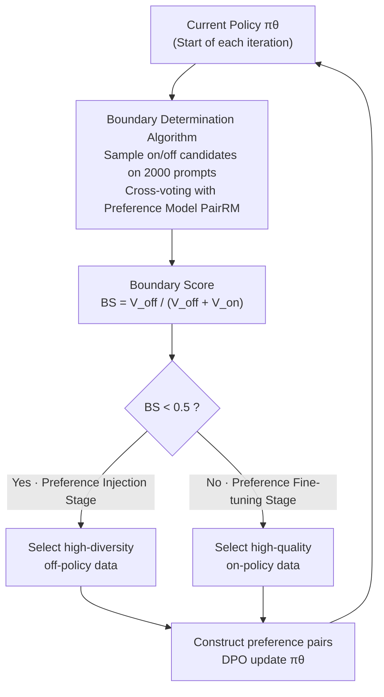

# Is On-Policy Data always the Best Choice for Direct Preference Optimization-based LM Alignment?

**Conference**: ICLR 2026  
**arXiv**: [2508.10530](https://arxiv.org/abs/2508.10530)  
**Code**: None (see reproducibility statement)  
**Area**: Alignment RLHF / DPO  
**Keywords**: on-policy vs off-policy, alignment stages, preference injection, preference fine-tuning, data selection

## TL;DR
This paper challenges the consensus that "on-policy data is always better." It discovers that the alignment process is divided into two stages: preference injection (requiring high-diversity off-policy data) and preference fine-tuning (requiring high-quality on-policy data). The optimal data type varies by model and stage. A boundary determination algorithm with only 3.2% computational overhead is proposed and validated across 5 models and 55 configurations.

## Background & Motivation

**Background**: DPO and its variants are mainstream methods for LLM preference alignment. Recent research trends suggest that on-policy data (preference candidates generated by the current policy during training) is superior to off-policy data (predefined datasets).

**Limitations of Prior Work**:
   - Actual performance contradicts the "on-policy is always better" consensus: on Llama-3, on-policy is indeed 3x better, but on Zephyr, it is 0.4x worse, and on Phi-2, off-policy is consistently superior.
   - There is a lack of systematic understanding regarding when to use on-policy vs. off-policy data.
   - Collecting on-policy data is computationally expensive; resources are wasted if it is unnecessary.

**Key Challenge**: The performance gap between on-policy and off-policy data is model-dependent, yet explanation and prediction mechanisms are missing.

**Core Idea**: Alignment comprises Preference Injection (Exploration, requiring diversity) → Preference Fine-tuning (Exploitation, requiring quality), with a boundary that can be quantified.

## Method

### Overall Architecture
This paper addresses a question often taken for granted: Is on-policy data always better than off-policy data for DPO alignment? The authors' answer is "it depends on the stage." They propose the "Alignment Stage Hypothesis," which decomposes preference alignment into a preference injection stage and a preference fine-tuning stage. The optimal data choice for these two stages is opposite. In practice, at the start of each iteration, a lightweight boundary determination algorithm (Algorithm 1) calculates a scalar boundary score to identify the current stage. Based on this, high-diversity off-policy data is selected during the injection stage, and high-quality on-policy data is selected during the fine-tuning stage to construct preference pairs for DPO updates. This transforms the decision of when to invest in expensive on-policy sampling into a nearly free judgment.

### Key Designs

**1. Alignment Stage Hypothesis: Attributing data choice to the model's current state**

The contradiction in community conclusions regarding on/off-policy data arises from ignoring the model's state. The authors hypothesize that alignment naturally consists of two phases: a preference injection stage, where the model has not yet identified the high-reward regions and requires high-diversity off-policy data for broad exploration; and a preference fine-tuning stage, where the model has mastered the preference direction and requires high-quality on-policy data for refinement. Fundamentally, this is an exploration-exploitation trade-off—exploration requires breadth (diversity), while exploitation requires precision (quality). Thus, the value of the same on-policy dataset can be inverted across different models/stages (e.g., strong on Llama-3, weak on Zephyr).

**2. Boundary Determination Algorithm: A scalar score to identify stages**

To make the hypothesis actionable, the authors propose a low-cost boundary detection method. Using 2000 prompts from UltraFeedback, the current policy generates on-policy candidates, while corresponding off-policy candidates are taken from a static dataset. A preference model $\mathbb{P}$ (implemented as PairRM) performs pairwise comparisons between these candidates. By accumulating votes for on-policy ($V_{\text{on}}$) and off-policy ($V_{\text{off}}$), the boundary score is defined as:

$$BS = \frac{V_{\text{off}}}{V_{\text{off}} + V_{\text{on}}}$$

The decision uses 0.5 as the threshold: $BS < 0.5$ indicates the preference injection stage (where diversity gains $\Delta > 1$), and $BS \ge 0.5$ indicates the preference fine-tuning stage. This rule aligns with empirical results: the strong Llama-3 base consistently shows $BS > 0.5$, while the weaker Phi-2 stays at $BS < 0.5$. The total overhead is approximately 3.2% of a full DPO epoch, making it nearly negligible.

**3. Theoretical Support: Deriving data influence from the DPO objective**

To justify this classification, the authors provide several theorems. Theorem 5.1 proves that the DPO optimization objective is theoretically equivalent to the true alignment goal. Theorem 5.2 indicates that optimal alignment is only reached with infinite preference data; with finite data, the quality depends on "preference consistency" between $\mathbb{P}_\theta$ and $\mathbb{P}^*$. Consequently, data coverage (diversity) and reliability (quality) become bottlenecks, corresponding to the lack of diversity in injection and lack of quality in fine-tuning.

## Key Experimental Results

### Main Results: Two-iteration Combinations (AlpacaEval 2.0 LC Win Rate)

| Model | Stage | Optimal Data Choice | LC Win Rate | Note |
|------|------|-------------|-----------|------|
| Llama-3 | SFT→Iter1 | off→**on** | **40.57** | on-policy is 3x better in fine-tuning |
| Zephyr | SFT→Iter1 | **off**→on | **20.77→33.28** | off-policy is 2.27x better in injection |
| Phi-2 | SFT→Iter1 | **off** | **5.97** | on-policy reduced score (-1.60) |

### Diversity vs Quality Experiment

| Stage | Data Source | Key Feature | Effect |
|------|--------|---------|------|
| Injection (Zephyr) | off-policy | High Diversity | **+12.65** |
| Injection (Zephyr) | on-policy | Low Diversity | +5.58 |
| Fine-tuning (Zephyr) | on-policy | High Quality | **+12.51** |
| Fine-tuning (Zephyr) | off-policy | High Diversity | +3.00 |

### Boundary Determination Results

| Model | Boundary Score Trajectory | Stage Decision |
|------|-------------------|---------|
| Llama-3 | >0.5 (Always) | Full Fine-tuning Stage |
| Phi-2 | <0.5 (Always) | Full Injection Stage |
| Zephyr | 0.40→0.66→0.69 | Injection → Fine-tuning Switch |

### Key Findings
- **On-policy is not always optimal**: This challenges the prevailing assumption in the community.
- **Stage transition is critical**: Zephyr demonstrates a clear transition from injection to fine-tuning.
- **Diversity vs. Quality Trade-off**: Diversity is paramount during the injection stage (favoring off-policy), while quality is paramount during the fine-tuning stage (favoring on-policy).
- **Strong models skip to fine-tuning**: Llama-3, due to its strong base capabilities, enters the fine-tuning stage directly.

## Highlights & Insights
- **Data Selection > Algorithmic Innovation**: Choosing the correct data type may be more critical than improving the loss function in preference alignment.
- **Concise Hypothesis**: Reducing a complex problem to a two-stage decision via a scalar score simplifies engineering practice.
- **Challenge to Consensus**: Providing empirical evidence that "on-policy is always better" is inaccurate.
- **Low Overhead**: A 3.2% computational cost for accurate data selection guidance offers extremely high ROI.

## Limitations & Future Work
- **Rigid Switching**: The paper proposes a hard switch; a smooth mixture of data types might be more effective.
- **Preference Model Dependency**: The boundary determination depends on the quality of $\mathbb{P}$ (PairRM).
- **Annotation Bias**: Using PairRM for labeling may deviate from true human preferences.
- **Future Directions**:
    - Combining with Uni-DPO for quality weighting on off-policy data in the injection stage.
    - Designing a proportional mixture strategy based on continuous $BS$ values.

## Related Work & Insights
- **vs. Online DPO**: Online DPO assumes on-policy is always better; this work proves that is not true during the injection stage.
- **vs. Iterative DPO**: While iterative DPO uses on-policy throughout, this paper suggests off-policy may be better in early iterations.
- **vs. DAR**: DAR focuses on RL stability, whereas this work focuses on data selection; the two are orthogonal.

## Rating
- Novelty: ⭐⭐⭐⭐⭐ 
- Experimental Thoroughness: ⭐⭐⭐⭐⭐ 
- Writing Quality: ⭐⭐⭐⭐ 
- Value: ⭐⭐⭐⭐⭐

<!-- RELATED:START -->

## Related Papers

- [\[ICLR 2026\] Keep the Best, Forget the Rest: Reliable Alignment with Order-Aware Preference Optimization](keep_the_best_forget_the_rest_reliable_alignment_with_order-aware_preference_opt.md)
- [\[ICLR 2026\] When Data Is the Algorithm: A Systematic Study and Curation of Preference Optimization Datasets](when_data_is_the_algorithm_a_systematic_study_and_curation_of_preference_optimiz.md)
- [\[ICLR 2026\] ActiveDPO: Active Direct Preference Optimization for Sample-Efficient Alignment](activedpo_active_direct_preference_optimization_for_sample-efficient_alignment.md)
- [\[ICLR 2026\] Beyond Pairwise: Empowering LLM Alignment With Ranked Choice Modeling](beyond_pairwise_empowering_llm_alignment_with_ranked_choice_modeling.md)
- [\[ICLR 2026\] Learning from Noisy Preferences: A Semi-Supervised Learning Approach to Direct Preference Optimization](learning_from_noisy_preferences_a_semi-supervised_learning_approach_to_direct_pr.md)

<!-- RELATED:END -->
