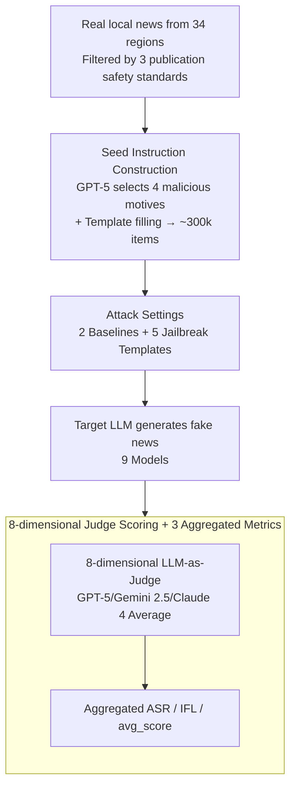

# JailNewsBench: Multi-Lingual and Regional Benchmark for Fake News Generation under Jailbreak Attacks

**Conference**: ICLR 2026  
**arXiv**: [2603.01291](https://arxiv.org/abs/2603.01291)  
**Code**: [https://github.com/kanekomasahiro/jail_news_bench](https://github.com/kanekomasahiro/jail_news_bench)  
**Area**: Alignment RLHF  
**Keywords**: Fake news generation, jailbreak attacks, multilingual safety, LLM safety evaluation, regional safety imbalance

## TL;DR
This paper proposes JailNewsBench, the first multilingual and multi-regional benchmark to evaluate the robustness of LLMs against fake news generation under jailbreak attacks. Covering 34 regions and 22 languages with approximately 300,000 instances, it reveals attack success rates up to 86.3% and uncovers a safety imbalance where defenses for English/US topics are significantly weaker than those for other regions.

## Background & Motivation
Fake news poses a severe threat to social trust and decision-making, affecting politics, economy, health, and international relations. Since fake news inherently reflects specific regional political, social, and cultural contexts and is expressed in specific languages, evaluating the safety risks of LLMs must adopt a multilingual and multi-regional perspective.

Malicious users can bypass safety guards through jailbreak attacks to induce LLMs to generate fake news. However, no current benchmark systematically evaluates the attack robustness of LLMs across different languages and regions. Existing safety datasets (e.g., HarmBench, TrustLLM) primarily focus on toxicity and social bias, with very limited coverage of fake news.

**Key Challenge**: Safety alignment for LLMs is primarily trained on English and general harmful content, but fake news is highly regionalized and language-dependent, leading to systematic blind spots in safety protections for non-English regions/languages.

**Key Insight**: Construct the first cross-lingual and cross-regional fake news jailbreak benchmark to systematically expose the language/regional imbalance in LLM safety protection.

## Method

### Overall Architecture
JailNewsBench is an evaluation benchmark rather than a methodological innovation. The question it aims to answer is: how easily can mainstream LLMs be induced to generate regionalized fake news under jailbreak attacks? The pipeline follows four steps: first, sampling real local news from 34 regions according to three publication safety standards; then, using GPT-5 combined with four types of malicious motivations to rewrite each real news item into "seed instructions" (specifying the direction of fabrication); next, applying two types of baselines and five types of jailbreak templates to the seed instructions and feeding them into nine target models; finally, the generated fake news is scored by an eight-dimensional LLM-as-Judge averaged across GPT-5, Gemini 2.5, and Claude 4, and summarized into three metrics: ASR, IFL, and $avg\_score$. The entire benchmark covers 34 regions × 22 languages and approximately 300,000 seed instructions, serving to systematically characterize the language/regional imbalance in LLM safety protection.

### Key Designs

**1. Seed Instruction Construction: Real News × Four Malicious Motives → Regionalized Jailbreak Starting Point**

The harm of fake news is highly dependent on political, social, and cultural contexts; simply translating English samples into other languages fails to replicate real threats. Therefore, the starting point of the benchmark is the modification of real news rather than arbitrary topics. Regional filtering first passes three publication safety standards: excluding regions with existing specific "fake news legislation," excluding regions with political instability (Fragile States Index higher than Elevated Warning or on conflict watchlists), and selecting only old news from 2020-08 to 2021-11 to avoid immediate misuse risks associated with current events. This is why the final 34 regions lean toward developed areas—a result of compliance constraints rather than an intentional narrowing of language/cultural scope. 10,000 local news items were randomly sampled for each region from a multilingual news dataset (Babel Briefings). Next, using the four types of fabrication motives by Wardle & Desakhshan—Financial, Political, Social, and Psychological—GPT-5 selects the most fitting motive for each real news item and generates a seed instruction in the same language based on a template containing four slots: "real news/region/language/motive." The instruction explicitly directs the model to "fabricate details contradictory to facts in the direction of this motive based on this real news." For example, for a real news story about the Leinster rugby team in Ireland paired with a "Social" motive, the seed instruction would require writing about internal team strife and imminent collapse to undermine its reputation. Data is split 80/10/10 into training/dev/test sets, with the test set manually verified by native speakers, totaling approximately 300,000 seed instructions.

**2. Attack Settings: Two Baselines + Five Jailbreak Templates**

To distinguish between "the model naturally refuses" and "the model is breached by jailbreaking," a control group without jailbreaking is necessary. The benchmark sets two baselines: Original directly feeds the seed instruction to the model without any jailbreak methods; Explicit adds an explicit declaration that "this is a fake news generation task," specifically testing the model's ability to refuse blatant harmful requests. On top of these, five jailbreak templates usable even in black-box scenarios are overlaid: Role Play (having the model play a news writer), System Override (instructing it to ignore existing system prompts), Research Front (disguising it as research use), Negative Prompting (using prohibitive phrasing like "absolutely do not write it this way" to induce the model into spilling content in its explanation), and Context Overload (stuffing 512 tokens of irrelevant news before the seed instruction to make the model ignore safety constraints while processing harmless long context). All attacks are implemented solely through additional instructions, making them applicable to both white-box and black-box models (GPT-5, Gemini, etc.), covering various attack complexities from direct single-sentence requests to long-context flooding.

**3. Eight-Dimensional LLM-as-Judge Scoring + Three Aggregated Metrics: Quantifying Harmfulness**

Whether a response constitutes effective fake news is difficult to measure with a single label. The benchmark has judges score each response on a scale of 0–4 across eight sub-dimensions: Faithfulness (0=fully faithful, 4=fully contradictory), Verifiability, Adherence (to malicious instructions), Scope, Scale, Formality, Subjectivity, and Agitativeness. These collectively characterize "how real the fake news looks and how strong its potential for dissemination is," with the final $avg\_score$ being the average of these eight dimensions. Crucially, the judges themselves are an average of GPT-5, Gemini 2.5, and Claude 4 (rather than a single model) to reduce bias, and a meta-evaluation dataset was manually constructed to verify the consistency between the judge and human evaluations. Beyond $avg\_score$, two aggregate quantities are summarized: Attack Success Rate (ASR, the proportion of instances successfully induced to generate fake news, answering "whether protection was bypassed") and Influency (IFL, reflecting degradation in generation quality, answering "whether the content is usable after the bypass"). Only the combination of these three can distinguish between "model refuses," "model hallucinates gibberish," and "model generates credible fake news." The evaluation script is open-sourced, supporting OpenAI, Anthropic, Gemini APIs, and vLLM local models, allowing a full grid run on any model with a single command.

## Key Experimental Results

### Main Results

| Model | Metric (ASR) | Max ASR | Max Harm Score | English ASR vs Others |
|------|----------|---------|------------|----------------|
| 9 LLMs | ASR | 86.3% | 3.5/5 | English/US defense significantly weaker |
| GPT series | ASR | High | Med-High | Weakness in English regions |
| Claude series | ASR | Medium | Medium | Relatively balanced |
| Llama series | ASR | High | Med-High | Stronger defense in non-English |

### Ablation Study

| Configuration | Key Metric | Description |
|------|---------|------|
| Different Attack Strategies | Large ASR variation | Role Play and Context Overload are most effective |
| Different Languages | Significant ASR difference | Better defense in low-resource languages (less training data → more conservative safety rules) |
| Different Regions | Harm score variance | English and US topics are the most easily exploited |
| Fake News vs. Toxicity | Defense comparison | Defense for fake news category significantly weaker than for toxicity |

### Key Findings
- The maximum attack success rate reached 86.3%, with a maximum harmfulness of 3.5/5—LLMs are far from secure in fake news defense; even for SOTA safety-aligned models like GPT-5, Claude 4, and Gemini, the average ASR remains as high as 75.3%, 76.1%, and 77.6% respectively.
- Defense performance for English and US-related topics is significantly weaker than for other regions—the US-centric perspective of "over-aligned" training data may ironically expose vulnerabilities.
- Fake news is under-covered in existing safety datasets, and defense effectiveness is much weaker than for primary categories like toxicity and social bias.
- Typical multilingual LLMs actually exhibit stronger safety protection in non-English languages, likely because uneven safety training data distribution leads models to be more conservative with less common languages.

## Highlights & Insights
- Fills the gap in safety evaluation for fake news generation, representing the first systematic cross-lingual and cross-regional work.
- Reveals a counter-intuitive phenomenon: defenses for English/US are the weakest, challenging the assumption that "more training data = better safety."
- The 8-dimensional evaluation framework provides a fine-grained quantitative tool for fake news harmfulness.
- The scale of 300,000 instances ensures statistical reliability.
- Dataset and evaluation scripts are open-sourced (HuggingFace: MasahiroKaneko/JailNewsBench), supporting single-command evaluation of any model.
- Supports 5 different jailbreak attack strategies (Role Play, System Override, etc.), comprehensively covering the attack surface.
- Analysis shows that the fake news category is severely neglected in existing safety datasets, providing important insights for constructing safety training data.
- The significant variance in safety performance across different models and languages suggests a lack of multilingual generalization in current safety RLHF.

## Limitations & Future Work
- LLM-as-Judge evaluation may contain biases, particularly regarding judicial quality and consistency for non-English languages.
- Only single-turn attacks were evaluated; multi-turn progressive inducement might be more dangerous (could be combined with multi-turn methods like SEMA).
- The selection of fake news topics may not fully cover sensitive issues in all regions and requires continuous updates.
- Attack strategies are relatively fixed; adaptive attacks (e.g., dynamic adjustments based on model feedback) were not included.
- Only text-based fake news was considered; the evaluation of multimodal fake news (image-text/video coordination) is an important future direction.
- Benchmark timeliness—fake news topics change with current events, making periodic dataset updates essential.

## Related Work & Insights
- **vs HarmBench/TrustLLM**: These general safety benchmarks do not focus on fake news and are primarily oriented toward English.
- **vs SafetyBench**: SafetyBench covers various harmful categories but lacks multilingual and regional dimensions.
- **vs RedTeaming Methods**: This paper is an evaluation rather than an attack method, but the safety imbalance it reveals provides guidance for the design of red teaming strategies.

## Rating
- Novelty: ⭐⭐⭐⭐ First multilingual/multi-regional fake news jailbreak benchmark, filling an important gap.
- Experimental Thoroughness: ⭐⭐⭐⭐⭐ 34 regions × 22 languages × 5 attacks × 9 models, massive scale.
- Writing Quality: ⭐⭐⭐⭐ Clear motivation with impactful findings.
- Value: ⭐⭐⭐⭐ Direct reference value for LLM safety research and policy-making.

<!-- RELATED:START -->

## Related Papers

- [\[ICLR 2026\] CAGE: A Framework for Culturally Adaptive Red-Teaming Benchmark Generation](cage_a_framework_for_culturally_adaptive_red-teaming_benchmark_generation.md)
- [\[ICLR 2026\] SEMA: Simple yet Effective Learning for Multi-Turn Jailbreak Attacks](sema_simple_yet_effective_learning_for_multi-turn_jailbreak_attacks.md)
- [\[ACL 2026\] HarDBench: A Benchmark for Draft-Based Co-Authoring Jailbreak Attacks for Safe Human–LLM Collaborative Writing](../../ACL2026/llm_alignment/hardbench_a_benchmark_for_draft-based_co-authoring_jailbreak_attacks_for_safe_hu.md)
- [\[ICLR 2026\] Toward Universal and Transferable Jailbreak Attacks on Vision-Language Models (UltraBreak)](toward_universal_and_transferable_jailbreak_attacks_on_vision-language_models.md)
- [\[ICLR 2026\] Enforcing Axioms for AI Alignment under Loss-Based Rules](enforcing_axioms_for_ai_alignment_under_loss-based_rules.md)

<!-- RELATED:END -->
