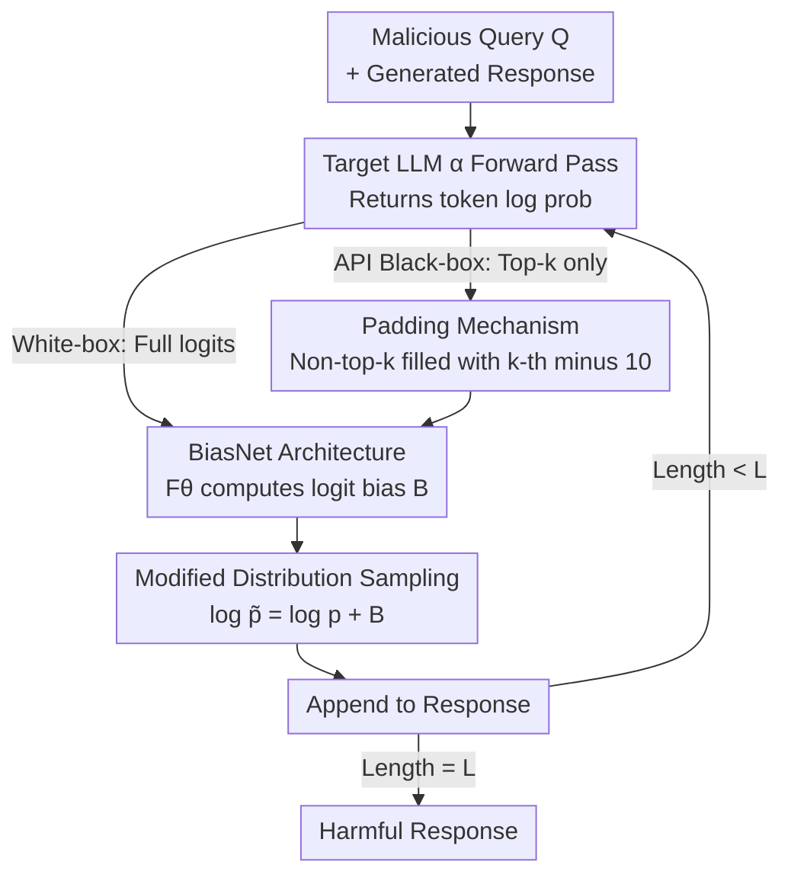

# JULI: Jailbreak Large Language Models by Self-Introspection

**Conference**: ICLR 2026  
**arXiv**: [2505.11790](https://arxiv.org/abs/2505.11790)  
**Code**: [JessonWong/JULI](https://github.com/JessonWong/JULI)  
**Area**: LLM Alignment  
**Keywords**: jailbreak, logit bias, API attack, token log probability, BiasNet

## TL;DR
This paper reveals the knowledge leakage issue where top-k token log probabilities of aligned LLMs still contain harmful information. It proposes JULI—a BiasNet plugin with less than 1% of the target model's parameters that manipulates logit bias. In API scenarios with access to only top-5 token probabilities, it successfully jailbreaks Gemini-2.5-Pro (Harmful Info Score 4.19/5), achieving a 140x speedup over LINT while doubling the harmfulness.

## Background & Motivation
**Background**: LLM jailbreak attacks are categorized into white-box attacks, which require model weights, and black-box attacks, which occur via APIs. API-based attacks are highly challenging because they lack access to gradients, full logits, or the generation process.

**Limitations of Prior Work**: (a) White-box methods like GCG require full gradient access and are inapplicable to commercial APIs; (b) LINT (the current state-of-the-art API attack) requires top-500 token access (most APIs only provide top-5/20), takes 99.7 seconds for inference, and achieves a harmfulness of only 2.25/5; (c) Weak-to-Strong and Emulated Disalignment require weights for both aligned and unaligned versions of the model.

**Key Challenge**: Alignment training is intended to eliminate the expression of harmful knowledge, but do the top-k token probabilities returned by LLM APIs still leak harmful information?

**Goal**: Can mainstream commercial LLMs be efficiently jailbroken using only the limited token probabilities (e.g., top-5) returned by an API?

**Key Insight**: Statistical analysis reveals that >85% of harmful response tokens appear within the top-5 probabilities. This suggests alignment merely suppresses the sampling probability of these tokens rather than erasing the underlying knowledge.

**Core Idea**: Use a lightweight BiasNet (<1% of target model parameters) to learn logit bias to elevate the sampling probability of harmful tokens, requiring only 100 harmful data samples for training.

## Method

### Overall Architecture
JULI does not modify the target model itself; instead, it attaches a lightweight BiasNet $F_\theta$ plugin at the output stage, transforming the jailbreak into a token-by-token "resampling" loop. Given a malicious query $Q$, for each token generated: the target LLM $\alpha$ first returns the token log probabilities $\log p_\alpha(x_n)$ at the current position. BiasNet reads these to compute a set of logit biases $B = F_\theta(\log p_\alpha(x_n))$, which are added back to the original probabilities to obtain a modified distribution $\log \tilde p_\alpha(x_n) = \log p_\alpha(x_n) + B$. A token is then sampled from this distribution and appended to the response. This cycle continues until a complete answer is generated, effectively elevating harmful tokens—originally suppressed by alignment—to high-probability positions.

This loop applies to two scenarios. In **white-box** settings where weights are accessible, BiasNet's two projection layers reuse the target's LM head to align naturally with vocabulary semantics. In **API black-box** settings where weights are hidden and only top-k (e.g., top-5) probabilities are available, BiasNet's projection layers use temporary random orthogonal matrices to construct a semantic space, and a padding mechanism handles the incomplete probability vectors. The following diagram illustrates this token-wise attack loop:

### Key Designs

**1. Token Leakage Discovery: Finding the Unplugged Vulnerability**

The effectiveness of the attack relies on a consistently observed statistical phenomenon: across multiple aligned LLMs, over 85% of harmful response tokens appear within the model's own top-5 predicted probabilities (and over 95% within the top-10). In other words, alignment training like RLHF/DPO does not erase harmful knowledge from the model; it merely suppresses the sampling probability of the corresponding tokens. These tokens are ranked lower but are still "present." This insight allows the attack to bypass the need for gradients or weights, as long as top-k probabilities can be retrieved and the suppressed tokens can be elevated.

**2. BiasNet Architecture: Learning Logit Bias with <1% Parameters**

BiasNet is the core module that determines which tokens to prioritize. It is a three-layer structure with approximately $10^7$ parameters (less than 1% of the target model). It functions by mapping between the token space and a low-dimensional hidden space: the first projection layer maps the token space to the hidden space, a learnable transformation layer identifies key tokens for elevation, and the second projection layer maps the result back to the token space to output logit bias $B = F_\theta(\log p_\alpha(x_n))$. The distribution is then corrected via $\log \tilde p = \log p + B$. In white-box settings, the target's LM head is reused for projection; in black-box settings, a randomly initialized and orthogonalized matrix is used. Because only the intermediate layer requires training, the plugin remains extremely small.

**3. Padding Mechanism: Enabling the Plugin on Incomplete Probability Vectors**

Commercial APIs typically return only top-k (e.g., top-5) token probabilities, leaving the rest of the vocabulary data missing. JULI handles this by filling all non-top-k tokens with a padding value—specifically, the probability of the $k$-th token minus a fixed offset of 10. This signals to the network that these tokens are significantly less probable than those in the top-k list. This allows BiasNet to function normally within the token-wise loop even in extremely restricted API scenarios.

**4. Training: Low-Cost Learning with 100 Samples**

Since only the intermediate transformation layer is trained, the cost is negligible. BiasNet is trained using 100 harmful Q&A pairs from LLM-LAT over 15 epochs with a batch size of 1 and the AdamW optimizer. The objective is to make the modified distribution favor the ground-truth harmful tokens at each position: $\min_\theta \mathbb{E}_{(x,y)}[\mathrm{CE}(F_\theta(F_\alpha(x)) + F_\alpha(x),\, y)]$. The fact that such a small dataset and minimal compute can produce a functional plugin reinforces the premise that harmful knowledge is already latent in the model and only requires a "push."

## Key Experimental Results

### Open-source Model Attack (White-box, AdvBench)

| Target Model | JULI Harmful Score | Best Baseline | Baseline Method | JULI Inference Time |
|----------|-------------------|---------|---------|-------------|
| Llama3-8B-Instruct | **3.44** | 3.02 | ED | 0.71s |
| Llama2-7B-Chat | **3.38** | 2.89 | ED | 0.71s |
| Llama3-3B-Instruct | **3.52** | 3.15 | ED | 0.65s |
| Qwen2-1.5B-Instruct | **3.61** | 3.28 | ED | 0.58s |
| Llama3-8B-CB (Circuit Breaker Defense) | **2.95** | 1.85 | GCG | 0.71s |
| Llama2-7B-DeepAlign (DeepAlign Defense) | **3.21** | 2.45 | GCG | 0.71s |

### API Attack (Black-box, top-5 API)

| Target Model | JULI Harmful Info Score | FLIP | Naive | Base |
|----------|----------------------|------|-------|------|
| Gemini-2.5-Pro | **4.19** | 2.09 | 1.21 | 0.06 |
| Gemini-2.5-Flash | **1.74** | 1.33 | 1.29 | 0.02 |

### Key Findings
- Top-5 token probabilities of aligned LLMs are sufficient to recover harmful outputs—alignment is probability suppression, not knowledge erasure.
- A plugin with <1% parameters trained on only 100 samples can bypass SOTA defenses like Circuit Breaker and DeepAlign.
- JULI is 140x faster than LINT (0.71s vs 99.7s) and improves harmfulness by approximately 2x (3.44 vs 2.25).
- The proposed Harmful Info Score correlates more strongly with human judgment than traditional BERT Score or Harmful Score.

## Highlights & Insights
- **"Knowledge Leakage" vs. "Knowledge Erasure"**: Consistent with "shallow alignment" findings, harmful knowledge remains intact within the model post-alignment but is probabilistically inhibited. JULI proves this inhibition is easily reversible. This implies that current RLHF/DPO-based safety training may be superficial.
- **Red Flags for API Security**: Commercial LLM APIs returning top-k probabilities create an attack surface. API providers must re-evaluate the security risks of returning log probabilities.
- **Methodological Contribution of Harmful Info Score**: This new metric focuses on the information density and quality of the response rather than just a binary "harmful" label, aligning better with human evaluation.

## Ablation Study

| Analysis Dimension | Finding |
|----------|------|
| Top-k Hit Rate | >85% of harmful tokens are in top-5; >95% are in top-10 |
| Training Data Volume | Saturates at 100 samples; marginal gains from more data |
| Projection Layer Choice | Reusing LLM head is superior for white-box, but random orthogonal matrices suffice for black-box |
| Defense Robustness | Successfully breaks both Circuit Breaker and DeepAlign SOTA defenses |
| Hard Subset | Remains effective on the 5% hard subset of AdvBench where baselines fail |
| Harmful Info Score | Higher correlation with human judgment than BERT Score/Harmful Score |

## Limitations & Future Work
- BiasNet requires a small amount of harmful data for training (100 samples), which limits its use as a purely zero-knowledge attack.
- Defense strategies are not discussed in depth—limiting top-k tokens or adding noise to probabilities are obvious mitigation steps.
- API providers can defend by not returning log probabilities, though this sacrifices legitimate utility.
- Currently validated on Gemini API; OpenAI API requires further testing.
- The padding mechanism in BiasNet might introduce bias under certain token distributions.

## Related Work & Insights
- **vs. GCG (Zou et al.)**: GCG requires full gradient access (white-box); JULI only needs top-5 probabilities, representing a significant jump in practicality.
- **vs. Weak-to-Strong (Zhao et al.)**: WTS requires pre-trained base model weights; JULI works entirely through APIs.
- **vs. LINT (Zhang et al.)**: LINT requires top-500 tokens and 99.7s inference; JULI needs only top-5 and 0.71s, a 140x speedup.
- **vs. Emulated Disalignment**: ED requires weights for both aligned and unaligned versions; JULI is fully black-box.
- **Insight—Alignment as "Probability Suppression"**: The most profound contribution is demonstrating that harmful knowledge remains intact; the top-5 probabilities contain sufficient information to reconstruct full harmful outputs.

## Rating
- Novelty: ⭐⭐⭐⭐ First practical jailbreak using only top-5 API probabilities; BiasNet is a novel concept.
- Experimental Thoroughness: ⭐⭐⭐⭐ Tested across multiple models (including closed-source), scenarios, metrics, and SOTA defenses.
- Writing Quality: ⭐⭐⭐⭐ Clear; Harmful Info Score provides a methodological contribution.
- Value: ⭐⭐⭐⭐ Immediate warning for API security design—the practice of returning log probabilities requires re-evaluation.

<!-- RELATED:START -->

## Related Papers

- [\[ICLR 2026\] Toward Universal and Transferable Jailbreak Attacks on Vision-Language Models (UltraBreak)](toward_universal_and_transferable_jailbreak_attacks_on_vision-language_models.md)
- [\[AAAI 2026\] BiasJailbreak: Analyzing Ethical Biases and Jailbreak Vulnerabilities in Large Language Models](../../AAAI2026/llm_alignment/biasjailbreakanalyzing_ethical_biases_and_jailbreak_vulnerabilities_in_large_lan.md)
- [\[ICLR 2026\] GuardAlign: Test-time Safety Alignment in Multimodal Large Language Models](guardalign_test-time_safety_alignment_in_multimodal_large_language_models.md)
- [\[ICLR 2026\] Sysformer: Safeguarding Frozen Large Language Models with Adaptive System Prompts](sysformer_safeguarding_frozen_large_language_models_with_adaptive_system_prompts.md)
- [\[ICLR 2026\] Test-Time Alignment for Large Language Models via Textual Model Predictive Control](test-time_alignment_for_large_language_models_via_textual_model_predictive_contr.md)

<!-- RELATED:END -->
