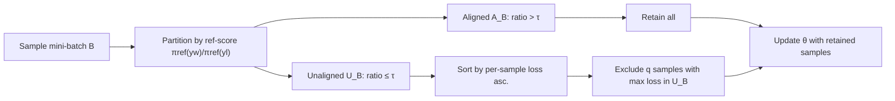

# Keep the Best, Forget the Rest: Reliable Alignment with Order-Aware Preference Optimization

**Conference**: ICLR 2026  
**OpenReview**: [https://openreview.net/forum?id=LrHExpandingFTtg](https://openreview.net/forum?id=LrHPYPFTtg)  
**Code**: [https://github.com/pxyWaterMoon/rappo](https://github.com/pxyWaterMoon/rappo)  
**Area**: LLM Alignment / Preference Optimization  
**Keywords**: DPO, Preference Optimization, Reference Policy, Sample Selection, Generalization Bound, RLHF  

## TL;DR
RAPPO uses the reference policy to assign "credibility" scores to samples within each batch, temporarily excluding high-loss preference pairs where the reference model itself is misaligned and the samples are the hardest to learn. By modifying DPO with just a few lines of code, it consistently outperforms baselines like SimPO/DPO in sentiment, detoxification, summarization, and safety alignment, while providing a tighter generalization bound.

## Background & Motivation
**Background**: DPO simplifies the two-step RLHF process ("train reward model then perform RL") into a single step, learning a policy directly from paired preference data. It has become a mainstream framework for aligning LLMs. Its implicit reward is $r_\theta(x,y)=\beta\log\frac{\pi_\theta(y|x)}{\pi_{\text{ref}}(y|x)}$, where the entire objective is anchored to a fixed reference policy $\pi_{\text{ref}}$ (typically the SFT model).

**Limitations of Prior Work**: The effectiveness of DPO highly depends on the quality of the reference policy. Figure 1 in the paper shows that across GPT2-Small/Medium/Large, a significant proportion of preferences given by the reference model are "misaligned" (i.e., $\pi_{\text{ref}}$ assigns lower probabilities to the human-preferred response), a problem that worsens with smaller models. Theoretical work has proven that even with slight alignment errors in the reference model, DPO and its variants can rarely recover correct preferences because these "reference-misaligned" samples dominate the gradient signal and pull the model in the wrong direction.

**Key Challenge**: Neither of the existing paths is ideal. First, **Data Filtering** (RSO, Selective DPO, etc.) removes ambiguous samples before training, but they focus only on the data itself rather than the root cause of "reference model error." Second, **Reference-free approaches** (SimPO, ORPO) discard the reference policy entirely, which avoids propagating bad signals but loses useful guidance provided by the reference and risks catastrophic forgetting. Thus, the problem becomes: **Can a simple, sample-aware modification retain the benefits of the reference policy while shielding the model from its misleading parts?**

**Goal**: Systematically understand the role of the reference policy in DPO and provide a lightweight, plug-and-play correction with generalization guarantees.

**Core Idea (Order-aware selective updates)**: Inspired by the concept of selective updates in Ordered-SGD, RAPPO does not perform static data deletion. Instead, during **each update step**, it uses the reference policy to partition the batch into "aligned" and "unaligned" groups, temporarily removing the hardest high-loss samples within the unaligned group. This approach preserves information without discarding it entirely while dynamically blocking "reference-misaligned + currently unlearnable" toxic gradients.

## Method

### Overall Architecture
RAPPO (Reliable Alignment for Preference Policy Optimization) is an order-aware variant of DPO. Its core modification lies in the "keep/discard" logic before gradient calculation, enabling it to be embedded into any DPO-like algorithm with a few lines of code. Each training step involves four actions: sampling a mini-batch $\rightarrow$ partitioning samples into an aligned subset $A_B$ and an unaligned subset $U_B$ using reference scores $\rightarrow$ sorting samples in $U_B$ by per-sample loss $\rightarrow$ excluding the top-$q$ samples with the largest losses in $U_B$ and computing the gradient update with the remaining samples.

### Key Designs

**1. Reference Alignment Gating: Partitioning samples into credible and non-credible sets.** RAPPO calculates a reference alignment score $\frac{\pi_{\text{ref}}(y_i^w|x_i)}{\pi_{\text{ref}}(y_i^l|x_i)}$ for each sample $z_i=(x_i,y_i^w,y_i^l)$ in the batch and splits them using a threshold $\tau$. Samples with a ratio greater than $\tau$ enter the aligned set $A_B$ (where the reference model supports human preference, making the signal credible), while others enter the unaligned set $U_B$ (where the reference model gives low probability to human-preferred responses, making them potentially toxic). The key here is precisely locating risks at the reference policy level—only samples where the reference "misrepresents" preferences are candidates for exclusion, while all samples in the aligned set are kept regardless of difficulty to avoid losing valuable hard samples.

**2. Loss-based Sorting and Exclusion within the Unaligned Subset: Dropping the "reference-wrong + currently hardest" batch.** Within $U_B$, RAPPO sorts the DPO loss $\ell_i(\theta)=-\log\sigma\big(\beta(\Delta_\theta(z_i)-\Delta_{\text{ref}}(z_i))\big)$ for each sample in ascending order, excludes the $q$ samples with the largest losses, and updates with the remainder. Intuitively, given the reference is already "misaligned," a larger loss indicates the model currently cannot learn it correctly, and the gradient is more likely to lead the model astray. Crucially, this exclusion is **temporary**: the selection is based on $\ell_i(\theta)$, which changes dynamically. A previously "unreliable and hard" sample may become "unreliable but learned" as the model strengthens, naturally returning to the retention set—forming a **model-adaptive curriculum** using reference scores as a coarse filter and instantaneous loss as a fine filter.

**3. Unbiased Objective and Closed-form Expected Loss.** While the step-wise exclusion is stochastic, RAPPO is not deleting data arbitrarily but optimizing a well-defined objective function. The paper provides a closed-form expression (Proposition 4.8):

$$\hat{L}_{\text{RAPPO}}=\sum_{b=0}^{\min(q,\hat\mu N)}P(|U_B|=b)\frac{m_g+m_b}{s}+\sum_{b=q+1}^{\min(s,\hat\mu N)}P(|U_B|=b)\frac{m_g+\sum_j \alpha_j\ell_{(j)}}{s-q}$$

where $m_g, m_b$ are the sums of losses for aligned/unaligned samples respectively, and $P(|U_B|=b)$ is the probability from a hypergeometric distribution that the batch contains exactly $b$ unaligned samples. The first term represents retaining everything when unaligned samples do not exceed $q$, and the second term represents retaining the aligned set while dropping the top-$q$ losses when they do. The paper proves that the gradient $\tilde g_t$ from retained samples is an unbiased estimator of $\partial\hat{L}_{\text{RAPPO}}$, ensuring stochastic updates align with minimizing this objective.

**4. Tighter Generalization Bound (Theoretical Guarantee).** The paper situates RAPPO within a generalized optimization framework for "excluding top-score terms." The main theorem (Theorem 4.7) proves under smoothness and Lipschitz assumptions (without requiring convexity) that: (i) among all rules "retaining $K_t$ unaligned samples," excluding those with the largest score $z$ (loss) yields the **largest expected first-order decrease** in total risk $R(\theta)$; (ii) it **minimizes the conditional variance** of the update direction, making each step more stable; (iii) a stability bound $\Delta_T\le\frac{2C}{s-q}\exp(\cdot)\sum\eta_u\,\mathbb{E}[\max_{i\in\text{Kept}}w(z_{t,i})]$ is derived via uniform stability. Since the weight function $w(z)=\sigma(-z)$ is monotonically non-increasing, excluding large-loss samples minimizes the $\max$ term, thereby tightening the stability recursion and the generalization gap $\mathbb{E}[R(\theta_T)-R_n(\theta_T)]\le G\Delta_T$. These points combined formally demonstrate that discarding high-loss, reference-misaligned samples allows for more reliable progress toward human alignment.

## Key Experimental Results

### Main Results

IMDb Sentiment Steering (GPT2-Large, higher reward is better) and Real-Toxicity-Prompts Detoxification (GPT-Neo-2.7B, lower toxicity is better):

| Method | Reward Score ↑ | Toxicity (%) ↓ |
|------|---------------|----------------|
| DPO | 1.5513 | 6.30 |
| DPO-Offset | 1.5526 | 8.11 |
| IPO | 1.5446 | 6.49 |
| SimPO (β=2.5,γ=0.5) | 1.5537 | 7.49 |
| RAPPO-1 | 1.6625 | 2.64 |
| RAPPO-2 | 1.6790 | 2.60 |
| **RAPPO-4** | **1.6811** | **2.28** |

On IMDb, all RAPPO variants achieved reward $\ge 1.66$, with the best (1.6811) exceeding the strongest baseline SimPO (1.5611) by 7.7%. In detoxification, toxicity was reduced from the baseline best of 6.30% to 2.28%.

PKU-SafeRLHF Large-scale Safety Alignment (Mistral-7B reference policy, vs DPO/CPO/KTO/SimPO): RAPPO achieved the best in all metrics—Safety Rate 0.573 (+0.014 vs second-best DPO), Helpfulness 0.693 (+34.8% vs DPO), Harmlessness 0.357 (−21.0% vs DPO), and a maximum win rate of 65%.

Summarization tasks (GPT-J-6B and Llama-3.1-8B, GPT-4 as judge): RAPPO consistently outperformed SimPO and DPO on both base models, maintaining rankings on larger models, indicating that gains generalize to newer, larger pre-training scales.

### Ablation Study

Sensitivity analysis for two hyperparameters—exclusion count $q$ and reference alignment threshold $\tau$—on IMDb (GPT2-Large):

| Ablation Dimension | Setting | Observation |
|----------|------|------|
| Exclusion count $q$ | $q\in\{1,2,4,8\}$, batch 16/32 | Increasing $q$ moderately generally improves performance, but too large an exclusion discards useful signals. |
| Threshold $\tau$ | Controls partition granularity | Affects the scope of "which samples are deemed untrustworthy." |
| Reference Scale | GPT2-Small/Medium/Large | The weaker the reference, the larger the relative gain of RAPPO over DPO (+3.5%/+1.1%/+7.1%). |

### Key Findings
- RAPPO's improvement over DPO is more pronounced when the reference policy is weaker and misaligned samples are more frequent, confirming that "shielding against reference misleading" is the primary driver of gains.
- Even conservative RAPPO-1 (excluding 1 per batch) achieved a 6.5% improvement on IMDb, showing that a few high-loss misaligned samples are enough to degrade DPO.
- Toxicity was nearly halved (6.30%→2.28%), indicating that the excluded samples are precisely those inducing harmful generation.

## Highlights & Insights
- **Modeling "reference misalignment" as an identifiable, gateable risk**: Unlike static data pruning or abandoning references, RAPPO uses reference scores to locate risk and instantaneous loss to filter it, balancing "retaining reference guidance" with "shielding toxic signals."
- **Temporary exclusion rather than permanent deletion**: In conjunction with losses that evolve during training, this naturally creates a model-adaptive curriculum, preventing the permanent loss of potentially valuable hard samples through static filtering.
- **Clean alignment between theory and algorithm**: The heuristic of excluding maximum loss directly corresponds to the "maximum expected first-order decrease + minimum variance + tightest stability bound," provided with an unbiased estimator and a closed-form objective rather than being an afterthought.
- **Extremely low engineering cost**: Just a few lines of code can be integrated into any DPO-class method, making it highly practical for deployment.

## Limitations & Future Work
- The exclusion count $q$ and threshold $\tau$ require tuning, and their optimal values are coupled with reference quality and batch size, lacking an automatic selection mechanism.
- Experimental scales were mostly small to medium (GPT2/GPT-Neo/GPT-J/Mistral-7B/Llama-3.1-8B); performance on larger models or in online/iterative preference optimization scenarios remains to be verified.
- The method assumes a reliable "aligned/unaligned" classifier (approximated here by the reference score); if the reference score itself is highly unreliable, the gating effectiveness may decrease.
- While excluded samples can be recovered later, discarding them at each step implies lower data utilization, which requires a trade-off in data-scarce scenarios.

## Related Work & Insights
- **DPO and its variants**: IPO (KL regularization), DPO-Offset (learnable margin for mislabeled references), KTO (prospect theory asymmetric weighting), and token-level DPO (fine-grained credit assignment). RAPPO is orthogonal to these and can be used in combination.
- **Data filtering route**: RSO, Selective DPO, and margin-based sampling filter data before training. RAPPO differs by pushing filtering into every update step and explicitly targeting reference misalignment.
- **Reference-free route**: SimPO and ORPO abandon the reference entirely. RAPPO chooses to retain the reference but gate its "bad signals," which proved more stable in experiments.
- **Optimization insights**: The selective update idea from Ordered-SGD is the algorithmic ancestor of RAPPO. This paper migrates "loss-sorted sampling" from an acceleration perspective to an alignment perspective of "shielding misaligned signals."

## Rating
- **Novelty**: ⭐⭐⭐⭐ —— The combination of "reference score gating + sorting-based exclusion within the unaligned subset" is a novel entry point, explicitly modeling reference misalignment with supporting generalization theory.
- **Experimental Thoroughness**: ⭐⭐⭐⭐ —— Covers sentiment, detoxification, summarization, and safety alignment across multiple base models, including sensitivity ablations for $q$, $\tau$, and reference scale; however, model sizes are mostly small to medium.
- **Writing Quality**: ⭐⭐⭐⭐ —— Logic is clear across motivation, algorithm, theory, and experiments. Figures 1/2 provide intuitive evidence; minor formatting/spelling issues in some formulas.
- **Value**: ⭐⭐⭐⭐ —— Plug-and-play with few lines of code, theoretical backing, and stable gains make it highly valuable for DPO-based alignment pipelines.

<!-- RELATED:START -->

## Related Papers

- [\[ICLR 2026\] Is On-Policy Data always the Best Choice for Direct Preference Optimization-based LM Alignment?](is_on-policy_data_always_the_best_choice_for_direct_preference_optimization-base.md)
- [\[ICML 2026\] Alignment-Aware Decoding](../../ICML2026/llm_alignment/alignment-aware_decoding.md)
- [\[ICLR 2026\] A2D: Any-Order, Any-Step Safety Alignment for Diffusion Language Models](a2d_any-order_any-step_safety_alignment_for_diffusion_language_models.md)
- [\[ICLR 2026\] Multiplayer Nash Preference Optimization](multiplayer_nash_preference_optimization.md)
- [\[ICLR 2026\] Semi-Supervised Preference Optimization with Limited Feedback](semi-supervised_preference_optimization_with_limited_feedback.md)

<!-- RELATED:END -->
