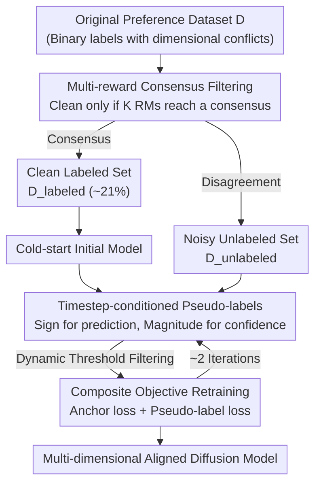

# Learning from Noisy Preferences: A Semi-Supervised Learning Approach to Direct Preference Optimization

**Conference**: ICLR 2026  
**OpenReview**: [https://openreview.net/forum?id=rRc04jyoAk](https://openreview.net/forum?id=rRc04jyoAk)  
**Code**: https://github.com/L-CodingSpace/semi-dpo  
**Area**: Alignment RLHF / Diffusion Models  
**Keywords**: Diffusion DPO, Preference Alignment, Label Noise, Semi-Supervised Learning, Pseudo-labeling

## TL;DR
Addressing the gradient conflict problem in Diffusion-DPO caused by multi-dimensional human visual preferences being compressed into a binary label, this paper proposes Semi-DPO. By treating samples agreed upon by multiple reward models as clean labels and dimensionally conflicting samples as noisy unlabeled data, the method uses the diffusion model itself as an implicit classifier to generate pseudo-labels across different timesteps for iterative self-training. It achieves SOTA alignment performance without introducing additional human annotations or explicit reward models.

## Background & Motivation

**Background**: To align text-to-image diffusion models with human preferences, the mainstream approaches either train an explicit reward model followed by RLHF (which is expensive and requires large-scale annotation) or optimize directly on preference pairs $(x_0^w, x_0^l, c)$ using Diffusion-DPO. The latter treats the denoising process as an MDP and implicitly expresses rewards through the log-likelihood ratio between the policy and a reference model, thereby bypassing the reward model.

**Limitations of Prior Work**: Diffusion-DPO ignores a fundamental fact—human visual preferences are naturally **multi-dimensional** (aesthetics, detail fidelity, semantic alignment, etc.), yet labeling datasets provide only a single holistic binary label. One image might have excellent composition but mediocre texture, while another has stunning texture but poor semantic alignment. When forced to choose, annotators often decide based on a single dimension, which is then recorded as "overall superior." Consequently, the model is erroneously taught that "everything about the winner is good, and everything about the loser is bad," including the winner's flaws and the loser's strengths.

**Key Challenge**: Compressing multi-dimensional preferences into a single binary label creates **dimensional conflicts** at the dataset level. The authors theoretically prove (see Key Designs) that if a conflicting subset exists, the per-sample gradient of DPO inevitably contains updates both "towards the oracle direction" and "away from the oracle direction." The variance of the inner product has a positive lower bound, causing parameter oscillation and convergence to sub-optimal solutions.

**Goal**: To decouple the gradient conflicts caused by label noise and obtain more consistent and effective training signals without increasing manual annotation or training explicit reward models.

**Key Insight**: The alignment task is reformulated as **Learning from Noisy Labels (LNL)** and further transformed into **Semi-Supervised Learning (SSL)**—consistent preference pairs serve as the clean labeled set, while conflicting pairs serve as an unlabeled set requiring re-labeling. The key question then becomes: "who serves as the classifier to generate pseudo-labels?" The authors' answer is: **the diffusion model itself**. Since the DPO loss is equivalent to binary cross-entropy, the training process implicitly trains a classifier at each timestep to distinguish between "preferred/non-preferred." The per-timestep margin $z_\theta^{(t)}$ is exactly the logit of this classifier. Combined with the hierarchical nature of the diffusion process (early timesteps handle global composition, later ones handle local details), a conflicting holistic label can be rewritten as a series of "timestep-conditioned, non-conflicting" preference signals.

**Core Idea**: Use "multi-reward consensus filtering + diffusion model self-confidence pseudo-labeling across timesteps" for semi-supervised self-training. This decouples a noisy holistic preference signal into fine-grained, timestep-conditioned clean signals.

## Method

### Overall Architecture
Semi-DPO is a two-stage framework. **Stage 1 (Multi-reward Consensus)**: A committee of $K$ pre-trained reward models filters the original dataset $D$. Only when **all** reward models agree with the holistic human label is a preference pair included in the clean labeled set $D_{\text{labeled}}$; otherwise, it is assigned to the noisy unlabeled set $D_{\text{unlabeled}}$ (approx. 21% are judged clean in Pick-a-Pic V2). **Stage 2 (Iterative Self-training)**: Initially, a cold-start model $p_\theta^0$ is trained using only the clean set. In each subsequent round, the model $p_\theta^{i-1}$ from the previous round generates **timestep-conditioned pseudo-labels** for the unlabeled set. Only high-confidence pseudo-labels are retained and combined with the clean set for retraining using a composite objective. This cycle continues until convergence. The overall input is a noisy human preference dataset, and the output is a diffusion model aligned with multi-dimensional human preferences.

### Key Designs

**1. Dimensional Conflicts Induce Gradient Conflicts: Theoretical Characterization of Label Noise**

This section explains why binary labels harm DPO. The authors decompose the per-sample, per-timestep DPO gradient as $\nabla_\theta \mathcal{L}_{\text{DPO}}^{(t)} = -f_\theta^{(t)} \cdot \Delta\phi_\theta^{(t)}$, where $\Delta\phi_\theta^{(t)}$ is the directional difference in features between preferred and non-preferred samples. For a dimension $k$ (e.g., composition), let the dimensional reward difference be $\Delta r_k := r_k(x_0^w,c) - r_k(x_0^l,c)$. This partitions the dataset into an "aligned set $A_k$ ($\Delta r_k>0$)" and a "conflicting set $C_k$ ($\Delta r_k<0$)" with probabilities $p_{a,k}$ and $p_{c,k}$ respectively. Defining the oracle direction as $v_k(\theta,t) := \text{sign}(\Delta r_k)\,\Delta\phi_\theta^{(t)}$, the core conclusion is that the variance of the inner product between the actual update and the oracle direction is bounded:

$$\text{Var}\big[\langle -g_\theta^{(t)}, v_k(\theta,t)\rangle\big] \ge p_{a,k}\,p_{c,k}\cdot\big(m_{a,k}^{(t)} + m_{c,k}^{(t)}\big)^2$$

As long as the conflicting set exists ($p_{c,k}>0$), the product $p_{a,k}p_{c,k}>0$ **mathematically guarantees** that the training signal contains updates both "towards" and "away from" the oracle. This coexistence causes parameter oscillation and frequent directional reversals: progress in one step is canceled by the next, leading to inefficiency, instability, and sub-optimal convergence. The pseudo-labeling mechanism aims specifically to reduce $p_{c,k}$.

**2. Multi-reward Consensus Filtering: Using "Unanimous Consensus" to Select Unambiguous Clean Labels**

To perform semi-supervised learning, a reliable clean set is required for a stable cold-start. The authors leverage the fact that different reward models correlate with different dimensions of human preference (e.g., CLIP Score with semantic alignment, Aesthetic Score with aesthetics). A committee of $K$ pre-trained models $\{r_k\}_{k=1}^K$ is used; a preference pair $(c,x_0^w,x_0^l)$ enters $D_{\text{labeled}}$ only if $\Delta r_k = r_k(x_0^w,c)-r_k(x_0^l,c)>0$ for **all** models. Others go to $D_{\text{unlabeled}}$. Samples selected this way are unambiguous across dimensions, providing a clear initial gradient direction. Implementation uses five proxy models (PickScore, HPS v2, CLIP Score, LAION Aesthetics, ImageReward), yielding ~177,000 clean pairs on Pick-a-Pic V2. Ablations show that a larger committee leads to better performance and improves generalization to evaluators not in the committee (e.g., MPS).

**3. Timestep-conditioned Pseudo-labels + Dynamic Threshold: Letting the Model Re-label Itself**

This is the core solution to gradient conflict. The key insight is that since DPO loss equals binary cross-entropy, the training process implicitly trains a classifier at **each timestep**: the per-timestep margin $z_\theta^{(t)}$ is the logit, its sign $\text{sign}(z_\theta^{(t)})$ provides the predicted preference, and its magnitude $|z_\theta^{(t)}|$ serves as confidence. Given the hierarchical nature of diffusion (early stages handle global structure, later stages handle details), a conflicting holistic label is naturally rewritten as a sequence of timestep-conditioned, non-conflicting preferences. For the same pair of images, the "composition-dominant" early timesteps might favor image A, while "texture-dominant" later timesteps favor image B, matching their respective strengths. Since accuracy and confidence vary across timesteps, a single fixed threshold is avoided. Instead, the time axis is divided into $N$ intervals $\{I_j\}$, each with a dynamic threshold $\tau_{i-1}^{\alpha(t)}$ (updated per iteration). Only pseudo-labels exceeding the threshold for their interval are adopted. This substantially reduces the conflicting proportion $p_{c,k}$ in noisy samples.

**4. Iterative Self-training with Composite Objective: Anchoring with Clean Labels**

To prevent self-training from amplifying errors (confirmation bias/model drift), a composite objective is used: $\mathcal{L}_{\text{Semi-DPO}}^{(i)}(\theta) = \mathcal{L}_{\text{labeled}}(\theta) + \mathcal{L}_{\text{unlabeled}}^{(i)}(\theta)$. The **anchor loss** is the standard Diffusion-DPO loss on the clean set, acting as a "ground-truth regularizer." The **pseudo-label loss** acts only on high-confidence subsets filtered by dynamic thresholds:

$$\mathcal{L}_{\text{unlabeled}}^{(i)}(\theta) = \mathbb{E}_{D_{\text{unlabeled}}}\Big[\mathbb{I}\big(|z_{\theta_{i-1}}^{(t)}| > \tau_{i-1}^{\alpha(t)}\big)\cdot\big(-\log\sigma(\hat z_\theta^{(t)})\big)\Big]$$

where the winner/loser assignment is determined by the sign of the previous round's logit. Cold-start uses only the anchor loss to train $p_\theta^0$, followed by subsequent rounds of pseudo-labeling and composite retraining, forming a virtuous cycle. Experiments show convergence after two rounds, after which gains diminish.

### Loss & Training
Base models include SD1.5 and SDXL. The training set is Pick-a-Pic V2 (851,293 pairs after removing ~12% ties). Consensus filtering yields 176,999 clean pairs, split into 173,007 for training and 3,992 for validation. The composite objective is used for training, with convergence achieved in two iterations.

## Key Experimental Results

### Main Results
On HPS v2, Parti-Prompt, and Pick-a-Pic V2 benchmarks for SD1.5 and SDXL, Semi-DPO outperforms strong baselines like Diffusion-DPO, Diffusion-KTO, MaPO, and InPO. Taking SD1.5 on the HPS v2 eval set as an example:

| Method | ImageReward | HPSv2.1 | PickScore | Aesthetic | MPS |
|------|------------|---------|-----------|-----------|-----|
| SD1.5 | 0.139 | 0.246 | 20.862 | 5.578 | 12.211 |
| Diffusion-DPO | 0.339 | 0.259 | 21.308 | 5.714 | 12.739 |
| Diffusion-KTO | 0.690 | 0.284 | 21.454 | 5.803 | 13.016 |
| **Semi-DPO** | **0.816** | **0.287** | **21.945** | **5.899** | **13.514** |

In specialized evaluations: GenEval (SD1.5) overall score improved from 42.34 to 47.31. On T2I-CompBench++, it achieved top results in Shape, Texture, 2D-Spatial, and Numeracy. The multi-dimensional preference score (MPS) on Pick-a-Pic V2 (SD1.5) reached 11.030, validating its ability to align multi-dimensional preferences.

### Ablation Study
| Configuration | ImageReward | HPSv2.1 | PickScore | MPS | Description |
|------|------------|---------|-----------|-----|------|
| Semi-DPO (Iter0) | 0.569 | 0.269 | 21.493 | 13.039 | Cold-start (clean set only) |
| Semi-DPO (Iter1) | 0.798 | 0.284 | 21.892 | 13.495 | 1st round pseudo-labeling |
| Semi-DPO (Iter2) | 0.816 | 0.287 | 21.945 | 13.514 | 2nd round, convergence |

Iterative self-training shows round-by-round improvements, with the largest gain from Iter0 to Iter1. Reward model committee size ablation shows monotonic improvement in all metrics as more models are added.

### Key Findings
- **Iteration Rounds**: Two rounds of self-training are sufficient for convergence. The majority of gains come from Iter1 (re-utilizing noisy samples).
- **Consensus Committee Scale**: More reward models yield more reliable clean sets, improving both filtered and unfiltered metrics (e.g., MPS), reducing single-model bias.
- **Value of Timestep Conditioning**: Decomposing holistic labels into timestep-conditioned signals effectively reduces the conflict ratio $p_{c,k}$ analyzed in the theory, leading to simultaneous improvements in semantics, detail, and aesthetics.

## Highlights & Insights
- **Exploiting the DPO-BCE Relationship**: Recognizing that every timestep implicitly trains a classifier allows the model to act as its own pseudo-labeler without architectural changes.
- **Deconflicting Labels via Temporal Hierarchy**: The idea that "A follows composition while B follows texture" is no longer a conflict when split across timesteps is a brilliant use of diffusion characteristics.
- **Tight Link Between Theory and Method**: The variance lower bound $p_{a,k}p_{c,k}$ identifies $p_{c,k}$ as the root cause, which the pseudo-labeling mechanism specifically targets.
- **Transferability**: This semi-supervised paradigm (consensus filtering + self-confidence pseudo-labeling + anchor loss) is highly relevant for LLM DPO scenarios where data is also noisy and multi-dimensional.

## Limitations & Future Work
- **Reliance on External Reward Models**: Although no explicit reward model is needed during training, the filtering phase depends on five pre-trained models, potentially inheriting systematic biases.
- **Low Proportion of Clean Data**: With only ~21% labeled as clean, the final performance is heavily dependent on the quality of self-generated pseudo-labels and dynamic thresholds.
- **Heuristic Timestep Intervals**: The division into $N$ intervals and their thresholds is somewhat heuristic; a more systematic optimization of these boundaries is missing.
- **Base Model Scale**: Validated on SD1.5/SDXL, but effectiveness on larger or newer blocks like DiT-based models is yet to be proven.

## Related Work & Insights
- **vs. Diffusion-DPO**: Diffusion-DPO optimizes on raw binary labels, ignoring dimensional conflicts; this paper proves this creates gradient conflict and proposes a semi-supervised correction.
- **vs. Diffusion-KTO / MaPO / InPO**: While these improve offline alignment, they still rely on the original holistic labels. Semi-DPO's novelty lies in modeling the labels as noisy and re-labeling them across the timestep dimension.
- **vs. Classic LNL/SSL**: It adopts standard paradigms like "clean-noisy split + pseudo-labeling" but adapts them specifically to diffusion models by using the implicit DPO classifier.

## Rating
- Novelty: ⭐⭐⭐⭐⭐ Formulating multi-dimensional preference noise as gradient conflict and using timestep implicit classifiers for pseudo-labeling is novel and self-consistent.
- Experimental Thoroughness: ⭐⭐⭐⭐ Covers two base models across three benchmarks, plus GenEval; however, lacks evaluation on larger base models.
- Writing Quality: ⭐⭐⭐⭐ The link between theory, motivation, and methodology is clear.
- Value: ⭐⭐⭐⭐⭐ Improves multi-dimensional alignment without extra annotation or RM training; transferable to general DPO tasks.

<!-- RELATED:START -->

## Related Papers

- [\[ICLR 2026\] Semi-Supervised Preference Optimization with Limited Feedback](semi-supervised_preference_optimization_with_limited_feedback.md)
- [\[ICLR 2026\] SafeDPO: A Simple Approach to Direct Preference Optimization with Enhanced Safety](safedpo_preference_optimization_safety.md)
- [\[ICLR 2026\] Learning Ordinal Probabilistic Reward from Preferences (OPRM)](learning_ordinal_probabilistic_reward_from_preferences.md)
- [\[ICLR 2026\] Stackelberg Learning from Human Feedback: Preference Optimization as a Sequential Game](stackelberg_learning_from_human_feedback_preference_optimization_as_a_sequential.md)
- [\[ICLR 2026\] RE-PO: Robust Enhanced Policy Optimization as a General Framework for LLM Alignment](re-po_robust_enhanced_policy_optimization_as_a_general_framework_for_llm_alignme.md)

<!-- RELATED:END -->
