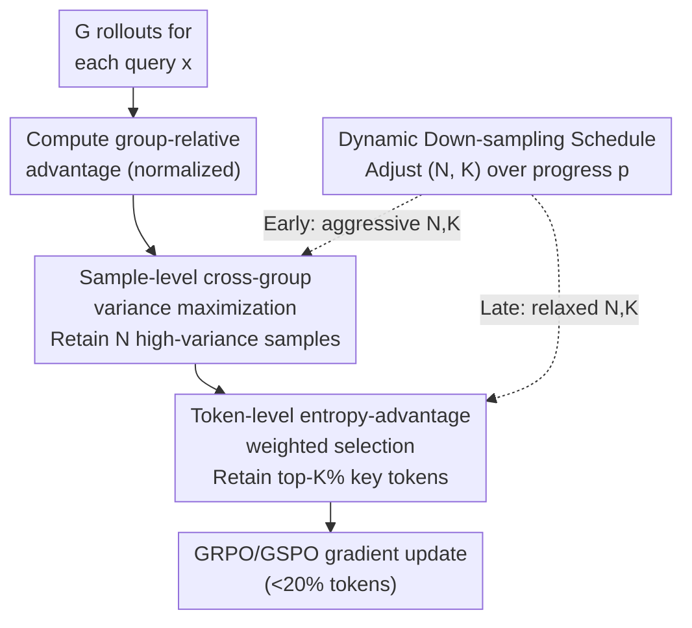

# Learning More with Less: A Dynamic Dual-Level Down-Sampling Framework for Efficient Policy Optimization

**Conference**: ICLR 2026  
**arXiv**: [2509.22115](https://arxiv.org/abs/2509.22115)  

**Authors**: Chao Wang, Tao Yang, Hongtao Tian et al. (Tsinghua University & Tencent WeChat)  
**Code**: Publicly available (Supplementary Materials)  
**Area**: LLM Alignment / Reinforcement Learning  

**Keywords**: GRPO, policy optimization, down-sampling, advantage variance, token selection, curriculum learning

## TL;DR

The authors propose the **D3S** (Dynamic Dual-Level Down-Sampling) framework, which maximizes advantage variance at the sample level and prioritizes high-entropy + high-advantage tokens at the token level. Combined with a dynamic scheduling strategy, it achieves faster convergence and superior performance using fewer than 20% of tokens.

## Background & Motivation

1. Critic-free methods (GRPO/GSPO) estimate advantages through group-relative rewards, eliminating the memory burden of critic networks. However, **efficiency bottlenecks** persist.

2. A large number of uninformative samples in large groups (e.g., all-correct or all-incorrect groups) dilute critical learning signals, drowning valuable gradients in the average effect of massive indistinguishable samples.

3. Small groups suffer from limited optimization precision due to insufficient sampling diversity, creating an inherent **group size trade-off**.

4. Razin et al. found that increasing reward variance $\text{Var}(R)$ accelerates convergence. However, since GRPO normalizes advantages, the variance remains constant at 1, meaning **maximizing $\text{Var}(R)$ cannot change the upper bound of the gradient norm**.

5. At the token level, many low-information tokens (simple or neutral tokens) dilute gradient signals. Wang et al. found that the top 20% of high-entropy tokens dominate the policy gradient.

6. Goal: Can the most valuable data be selected at both sample and token levels simultaneously to obtain stronger gradient signals with less computation?

## Method

### Overall Architecture

D3S addresses the issue where critic-free GRPO/GSPO treats all rollouts in a large group and all tokens in a response equally, resulting in slow convergence as uninformative samples dilute learning signals. D3S wraps a "select data, then calculate gradient" down-sampler around the policy optimization: for each batch, it first estimates group-normalized advantages using all rollouts, then selects a subset of samples that maximizes advantage variance. At the token level, it retains only key tokens with high entropy $\times$ high advantage. A dynamic scheduler adjusts the retention rates of both levels over time. Ultimately, fewer than 20% of tokens enter the gradient update, but they carry more concentrated signals and a higher gradient norm upper bound.

### Key Designs

**1. Sample-level cross-group advantage variance maximization: Filtering zero-signal samples**

GRPO suffers when groups are filled with "undifferentiated" responses (all-correct/incorrect), where advantages are near zero and dilute the gradient. D3S actively retains the subset with the highest variance. For $G$ rollouts of query $x$, it first selects $\hat{\mathcal{S}}_{\text{query}} = \arg\max_{\hat{S},\,|\hat{S}|=N_{\hat{s}}} \text{Var}(A_{\hat{S}})$, implemented by taking $N_{\hat{S},\text{pos}}$ samples with the largest positive advantages and $N_{\hat{S},\text{neg}}$ samples with the smallest negative advantages. To account for distribution differences across groups (e.g., some groups are entirely zeroed out), a second cross-group selection is performed: $\hat{\mathcal{S}}_{\text{batch}} = \arg\max_{\hat{S},|\hat{S}|=N} \text{Var}(A_{\hat{S}})$. Crucially, advantages are normalized only within groups and not re-normalized during cross-group selection to preserve original magnitudes. The authors provide theoretical support: while the gradient norm bound of GRPO is independent of $\text{Var}(R)$ (Proposition 1), the bound after down-sampling is proportional to $(\text{Var}(A'))^{1/3}$ (Proposition 2). Lemma 1 ensures that a subset with variance $\geq 1$ can always be drawn from a standardized set, guaranteeing the filtered gradient bound is not lower than the original.

**2. Token-level entropy-advantage weighted selection: Updating only at key decision points**

Even within selected samples, responses contain simple tokens (where the model is confident and correct) and neutral tokens. D3S defines generation entropy for each token as $H_{i,t} = -\sum_{j=1}^{V} \pi_\theta(\text{token}_j \mid x_i, y_{i,<t}) \log \pi_\theta(\text{token}_j \mid x_i, y_{i,<t})$. It then selects the top-$K\%$ tokens based on the score $|A_{i,t}| \times H_{i,t}$: $\mathcal{T} = \text{top}_{K\%}(y_{i,t},\; y_{i,t} \in \hat{\mathcal{S}},\; \text{key} = |A_{i,t}| \times H_{i,t})$. This metric requires both high "influence" ($|A_{i,t}|$) and high "uncertainty" ($H_{i,t}$), focusing optimization on critical rewards where the model is most undecided.

**3. Dynamic down-sampling scheduling: Fast acceleration early, preventing overfitting late**

Fixed aggressive down-sampling can lead to reward hacking and overfitting (as seen in D1S/D2S results). Inspired by curriculum learning, D3S uses linear interpolation based on training progress $p \in [0,1]$ to control the retention parameters $N_s^{(p)}$ and $K^{(p)}$:

$$[N_s^{(p)}, K^{(p)}] = (1-p) \cdot [N_{\text{init}}, K_{\text{init}}] + p \cdot [N_{\text{final}}, K_{\text{final}}]$$

At $p=0$, aggressive settings (few samples/tokens) enable fast learning. As $p \to 1$, the settings relax to standard levels to maintain generalization.

## Key Experimental Results

### Main Results (Pass@1 / Pass@8, 32-way parallel generation)

| Model/Method | AIME24 | AIME25 | AMC23 | GSM8k | MATH | Minerva | Olympiad | Average |
|-----------|--------|--------|-------|-------|------|---------|----------|------|
| Qwen2.5-Math-7B Base | 8.9/33.2 | 2.3/13.4 | 22.8/70.4 | 30.1/83.2 | 27.9/64.6 | 8.4/33.7 | 4.1/14.6 | 14.9/44.7 |
| + GRPO | 13.2/37.6 | 5.5/21.6 | 47.0/83.5 | 64.9/94.3 | 48.5/70.2 | 19.8/45.0 | 9.7/19.8 | 29.8/53.1 |
| + GRPO+PODS | 16.1/40.5 | 7.8/24.5 | 52.8/81.5 | 73.3/95.0 | 53.0/71.1 | 24.6/47.5 | 11.0/20.7 | 34.1/54.4 |
| + **GRPO+D3S** | **20.3/48.2** | 7.9/25.8 | **54.4/87.1** | 73.4/95.7 | 52.2/71.5 | 25.0/48.2 | 10.7/20.8 | **34.3/56.8** |
| + **GSPO+D3S** | 18.3/43.3 | **8.3/26.9** | 53.2/83.8 | **76.0/96.1** | **54.9/71.4** | **28.4/51.1** | **11.5/21.1** | **35.8/56.2** |
| Llama3.1-8B + GRPO | 2.0/5.0 | 0.0/0.0 | 13.7/33.4 | 78.6/93.5 | 31.5/52.0 | 15.9/35.6 | 2.1/7.2 | 20.5/32.4 |
| + **GRPO+D3S** | **5.3/20.7** | 0.1/0.8 | **20.3/50.8** | **79.0/95.0** | **35.9/59.2** | **22.5/44.3** | **3.3/10.7** | **23.8/40.2** |

### Ablation Study (Qwen2.5-Math-7B, Pass@1/Pass@8)

| Method | AIME24 | AIME25 | AMC23 | MATH | Average |
|------|--------|--------|-------|------|------|
| GRPO | 13.2/37.6 | 5.5/21.6 | 47.0/83.5 | 48.5/70.2 | 29.8/53.1 |
| +D1S (Sample only) | 13.2/42.9 | 5.9/20.2 | 50.6/84.4 | 50.1/70.5 | 31.3/54.2 |
| +D1S-Cross (+Cross-group) | 17.3/40.0 | 7.7/25.6 | 51.9/83.3 | 52.8/70.9 | 34.1/54.7 |
| +D2S (+Token level, no schedule) | 16.9/42.2 | 6.0/21.2 | 49.6/82.8 | 49.5/70.7 | 31.3/54.1 |
| +**D3S** (Full) | **20.3/48.2** | **7.9/25.8** | **54.4/87.1** | 52.2/71.5 | **34.3/56.8** |

## Key Findings

1. **Dual-level down-sampling** effectively eliminates uninformative signals during early training, accelerating policy convergence.
2. Down-sampling methods without dynamic scheduling (D1S/D2S) suffer from **overfitting** in later stages, eventually being surpassed by GRPO.
3. **Dynamic scheduling** is crucial for balancing early efficiency bonuses with late-stage generalization.
4. D3S increases the Sample Usefulness Rate from ~70% to nearly 100%, with cross-group operations filtering ambiguous data within batches.
5. D3S manages **entropy fluctuations** better: it reduces entropy in well-aligned models while encouraging exploration in under-aligned models (e.g., Llama3.1).
6. KL divergence analysis indicates that D3S maintains a smaller deviation from the reference model, reducing overfitting risk.

## Highlights & Insights

- **Theoretically Sound**: Starting from the gradient norm upper bound, the authors rigorously prove that maximizing advantage variance is superior to reward variance and derive a positive correlation with $(\text{Var}(A'))^{1/3}$.
- **Elegant Indexing**: The $|A| \times H$ metric for token selection intuitively targets "influence" times "uncertainty" and is empirically validated.
- **Plug-and-Play**: D3S is a modular framework compatible with both GRPO and GSPO, remains effective across Qwen/Llama architectures, and scales across 1.5B/7B/8B parameters.
- **Efficiency**: Achieves up to 5.51× training acceleration while improving final performance.

## Limitations & Future Work

- Validated only on **mathematical reasoning** tasks; effectiveness in code generation, general dialogue, or multimodal tasks is unexplored.
- Sample-level cross-group operations may introduce additional **communication overhead** in distributed training settings.
- The dynamic schedule currently uses simple linear interpolation; non-linear schedules (e.g., cosine, exponential) might be superior.
- Detailed analysis of D3S behavior under different reward distributions (sparse vs. dense rewards) is missing.
- Token entropy calculation requires the full vocabulary distribution, incurring some extra computational cost.

## Related Work & Insights

| Method | Core Strategy | D3S Advantage |
|------|----------|-----------|
| PODS (Xu, 2025) | Maximize $\text{Var}(R)$ for samples | D3S proves maximizing $\text{Var}(A)$ provides a tighter gradient bound. |
| Razin (2024, 2025) | Reward variance for acceleration | D3S extends this insight to the advantage level and adds token-level selection. |
| ETPO (Wen, 2024) | Entropy-regularized token optimization | D3S uses $|A| \times H$ as a joint metric to focus on high-impact + high-uncertainty tokens. |
| LPPO (Chen, 2025) | Dynamic weighting by progress | D3S theoretically guarantees gradient bound increases and operates on two levels. |

## Rating

- **Novelty**: ⭐⭐⭐⭐ — The combination of dual-level down-sampling and dynamic scheduling is novel, backed by a unique theoretical perspective on advantage variance.
- **Experimental Thoroughness**: ⭐⭐⭐⭐ — Comprehensive experiments across multiple models, benchmarks, and algorithms, including ablation and dynamic analysis.
- **Writing Quality**: ⭐⭐⭐⭐ — Clear logic from theory to method, intuitive visualizations, and detailed proofs.
- **Value**: ⭐⭐⭐⭐ — Strong practical utility as a plug-and-play module for RLHF efficiency optimization.

## Summary

The D3S framework selects the most valuable training data through sample-level advantage variance maximization and token-level entropy-advantage weighted selection, balanced by a dynamic schedule. Theoretical analysis establishes a positive correlation between advantage variance and the gradient norm upper bound. Experimental results across seven mathematical reasoning benchmarks demonstrate consistent performance gains and significant training acceleration (up to 5.51×). D3S provides a systematic solution for data utilization efficiency in RLHF.

<!-- RELATED:START -->

## Related Papers

- [\[ICLR 2026\] Inverse Reinforcement Learning with Dynamic Reward Scaling for LLM Alignment](inverse_reinforcement_learning_with_dynamic_reward_scaling_for_llm_alignment.md)
- [\[ICLR 2026\] RE-PO: Robust Enhanced Policy Optimization as a General Framework for LLM Alignment](re-po_robust_enhanced_policy_optimization_as_a_general_framework_for_llm_alignme.md)
- [\[ICML 2025\] Can RLHF be More Efficient with Imperfect Reward Models? A Policy Coverage Perspective](../../ICML2025/llm_alignment/can_rlhf_be_more_efficient_with_imperfect_reward_models_a_policy_coverage_perspe.md)
- [\[CVPR 2026\] MorphSeek: Fine-grained Latent Representation-Level Policy Optimization for Deformable Image Registration](../../CVPR2026/llm_alignment/morphseek_fine-grained_latent_representation-level_policy_optimization_for_defor.md)
- [\[NeurIPS 2025\] Greedy Sampling Is Provably Efficient for RLHF](../../NeurIPS2025/llm_alignment/greedy_sampling_is_provably_efficient_for_rlhf.md)

<!-- RELATED:END -->
