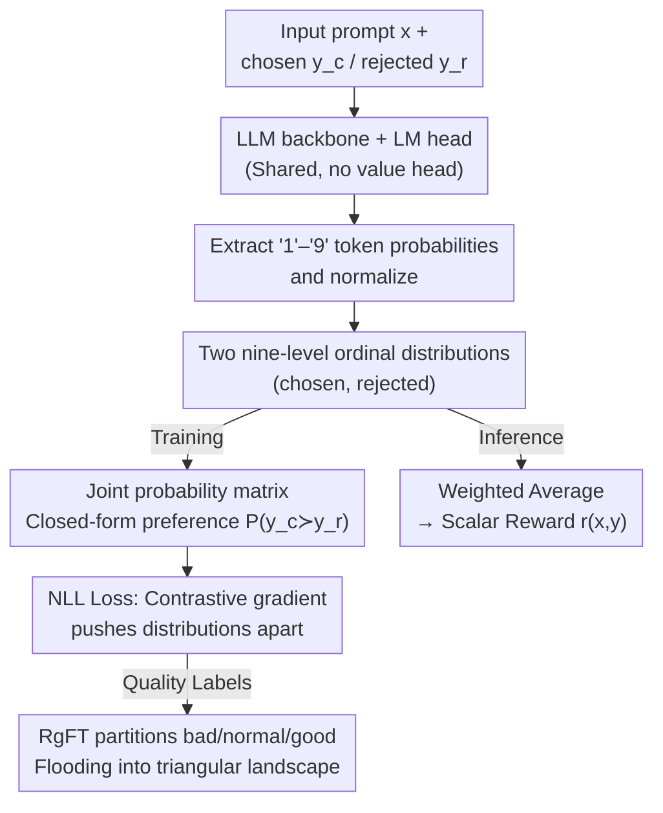

# Learning Ordinal Probabilistic Reward from Preferences (OPRM)

**Conference**: ICLR 2026  
**arXiv**: [2602.12660](https://arxiv.org/abs/2602.12660)  

**Code**: [https://github.com/ritzz-ai/OPRM](https://github.com/ritzz-ai/OPRM)  

**Area**: LLM Alignment / Reward Modeling  
**Keywords**: Ordinal rewards, probability distribution, Region Flooding Tuning, reward model, uncertainty estimation

## TL;DR

This paper proposes the Ordinal Probabilistic Reward Model (OPRM), which discretizes response quality into ordinal levels 1-9 and learns the full probability distribution. Combined with Region Flooding Tuning (RgFT), it achieves data-efficient training. It reaches 89.3% on RewardBench, an improvement of 2.9%-7.4% over existing RMs, while providing uncertainty estimation and label disagreement detection.

## Background & Motivation

**Background**: Reward models are classified into generative (GRM, high cost for point-wise supervision) and discriminative models (DRM, uses pairwise preferences but the scores are uncalibrated).

**Limitations of Prior Work**: Relative scores in DRM lack probabilistic interpretation and cannot assess uncertainty; GRMs require precise quality labels.

**Core Idea**: Ordinal discretization + full distribution = Efficiency of DRM + Interpretability of GRM.

## Method

### Overall Architecture

OPRM transforms reward modeling from "regressing a scalar" to "predicting a probability distribution." Given a prompt and a response, the model processes them through the LLM backbone, reuses the existing LM head (without introducing a separate value head) to extract the softmaxed vocabulary probabilities at the last token position, and normalizes the probabilities for numerical tokens '1' through '9' to obtain a distribution $p_\psi(s|x,y)$ covering nine ordinal quality levels.

During training, chosen and rejected pairs are processed. A joint probability matrix is formed by the Cartesian product of the two nine-level distributions, allowing for a closed-form calculation of the preference probability "chosen is better than rejected," which is optimized via negative log-likelihood. When preference pairs include labels for quality levels (good/normal/bad), Region Flooding Tuning (RgFT) further constrains the distribution to the corresponding partitions. During inference, the weighted average of the distribution for a single response is calculated to reconstruct a scalar reward. This workflow introduces no new parameters, and the variance of the distribution naturally serves as a confidence metric.

### Key Designs

**1. Probabilistic Reward Modeling: Transforming quality scores from point estimates to random variables**

Discriminative reward models output isolated relative scores that lack probabilistic meaning and cannot determine the model's confidence. OPRM treats the quality score $S$ as a random variable and learns the conditional density $p_\psi(s|x,y)$. The preference of one response over another is naturally expressed as the comparison of two distributions: $P(y_c \succ y_r|x) = \int\int \mathbb{1}(s_c > s_r)\, p_\psi(s_c|x,y_c)\, p_\psi(s_r|x,y_r)\, ds_r\, ds_c$. Since this integral lacks an analytical solution for continuous densities, OPRM discretizes the quality axis into nine levels (1-9), reducing the integral to a closed-form summation. This allows the model to be trained directly on preference pairs while upgrading "scores" to "distributions with width." The variance of the distribution naturally serves as a confidence index—broad distributions imply vague preferences, while sharp peaks indicate clear discrimination.

**2. Equivalence to Bradley-Terry: Proving the classic preference model is a special case**

To demonstrate that this distributional perspective is consistent with prior work, the authors prove that the widely used Bradley-Terry model is a degenerate case of OPRM. Specifically, when the quality distribution is fixed as a Gumbel distribution, the OPRM preference probability reduces to the logistic form of BT. This implies that OPRM retains the full expressive power of BT while relaxing the implicit assumption of a fixed distribution shape, enabling it to characterize multimodal preferences. When labels for a sample pair are contradictory, the learned distribution exhibits multiple peaks, which can be utilized for data quality filtering.

**3. Gradient Dynamics: Using contrastive gradients to push distributions apart**

The discretized objective function possesses a clean gradient form. The gradient for the chosen response at level $k$ is $\partial J / \partial p_c(k) = P(s_r < k)$, and for the rejected response, it is $\partial J / \partial p_r(k) = P(s_c > k)$. Intuitively, these gradients shift the probability mass of the chosen response toward higher partitions and compress the rejected response into lower partitions. As long as the two distributions have successfully not been separated, contrastive pressure is applied. Therefore, the model is highly sensitive to difficult samples where the chosen response is only slightly better than the rejected one, effectively utilizing subtle differences in margin.

**4. Region Flooding Tuning (RgFT): Generating useful gradients from coarse-grained labels**

Preference pairs indicate which response is better but do not specify absolute quality ranges. When good/normal/bad quality labels are available, a naive approach would be to constrain distributions strictly to corresponding sub-intervals; however, hard constraints result in zero gradients within the interval, causing training to stagnate. Region Flooding Tuning (RgFT) converts hard constraints into a triangular probability landscape: providing the highest incentive at the center of the target region with linear decay toward the edges. Consequently, the distribution is guided toward the correct interval while retaining gradients that move toward the interval center and higher-margin directions. RgFT naturally supports semi-supervised learning by mixing labeled and preference-only samples. Experiments show that distribution calibration can be achieved with only approximately 20% labeled data, demonstrating high data efficiency.

## Key Experimental Results

### Main Results (4 Benchmarks, 10+ Tasks)

| Model | RewardBench | RMB-Chat | RMB-Safety | RMB-Code | Overall* |
|------|-------------|----------|------------|----------|----------|
| Skywork-Reward-V2 (8B) | 92.0 | 70.7 | 76.2 | 67.8 | 71.6 |
| ArmoRM (8B) | 89.5 | 72.1 | 74.8 | 65.3 | 70.7 |
| **OPRM-Qwen2.5-14B** | **89.3** | **76.4** | **78.5** | **70.1** | **73.8** |

### Ablation Study

| Configuration | RMB Overall | Function |
|------|-------------|------|
| OPRM (No RgFT) | 71.2 | Baseline probabilistic reward |
| + RgFT (good/bad only) | 72.8 | Binary classification labels |
| + RgFT (good/normal/bad) | **73.8** | Optimal three-level labels |
| + Full quality labels | 73.5 | Slight drop with more labels |

### Key Findings

- OPRM consistently outperforms BT and GRM baselines across three benchmarks outside of RewardBench, with average gains between 2.9% and 7.4%.
- RgFT effectively calibrates distributions using a small amount of quality labels (20% of the data), exhibiting extreme data efficiency.
- Multimodal distributions can detect label disagreement: inconsistent preference pairs lead to bimodal distributions, which are useful for data quality filtering.
- OPRM is more sensitive to subtle margin differences, showing its greatest advantage on "hard" samples where the chosen response is only slightly superior.

## Highlights & Insights

- **Unified Advantages of DRM and GRM**: No additional value head is required (vs. DRM), and no CoT critique is needed (vs. GRM); distributions are obtained directly from the LM head.
- Ordinal discretization preserves the ordering of quality while avoiding the cost of precise point-wise labeling.
- The "flooding" concept in RgFT is clever, softening hard interval constraints into gradient-friendly triangular landscapes.
- Uncertainty estimation can be utilized for risk-aware selection in Best-of-N sampling — choosing responses with high means and low variance.

## Limitations & Future Work

- The selection of granularity for levels 1-9 lacks theoretical guidance; settings that are too coarse or too fine may impact performance.
- The integration with RLHF/DPO training has not been explored; additional design is required to use OPRM's distributional rewards in PPO.
- The model relies on the LLM's intrinsic ordinal understanding of numerical tokens, which smaller models might lack.
- In the semi-supervised setting of RgFT, the sensitivity of performance to the proportion of labeled data has not been fully analyzed.

## Related Work & Insights

- **vs. Skywork-Reward-V2**: Skywork focuses on data curation, whereas OPRM focuses on model architectural innovation—the two are complementary.
- **vs. Bradley-Terry**: BT is a special case of OPRM under Gumbel distribution assumptions; OPRM escapes this limitation by learning a distribution with higher degrees of freedom.
- **vs. CLoud/Critic-RM**: GRMs are time-consuming due to CoT critique generation, whereas OPRM obtains the distribution in a single forward pass.
- **vs. Ordinal Regression Literature (SORD/ALDL)**: Introducing deep ordinal regression concepts into preference learning represents a successful cross-domain knowledge transfer.

## Rating

- Novelty: ⭐⭐⭐⭐ The unified perspective of ordinal probabilistic rewards is novel, and the proof of BT as a special case is elegant.
- Experimental Thoroughness: ⭐⭐⭐⭐ 4 benchmarks + extensive ablations + distribution visualizations.
- Writing Quality: ⭐⭐⭐⭐ Complete theoretical derivations and clear motivation.
- Value: ⭐⭐⭐⭐ Provides a new paradigm for reward models; distribution outputs open new application scenarios.

<!-- RELATED:START -->

## Related Papers

- [\[ICLR 2026\] Beyond Binary Preferences: A Principled Framework for Reward Modeling with Ordinal Feedback](beyond_binary_preferences_a_principled_framework_for_reward_modeling_with_ordina.md)
- [\[ICLR 2026\] Omni-Reward: Towards Generalist Omni-Modal Reward Modeling with Free-Form Preferences](omni-reward_towards_generalist_omni-modal_reward_modeling_with_free-form_prefere.md)
- [\[ICLR 2026\] Aligning Deep Implicit Preferences by Learning to Reason Defensively](aligning_deep_implicit_preferences_by_learning_to_reason_defensively.md)
- [\[ICLR 2026\] Inverse Reinforcement Learning with Dynamic Reward Scaling for LLM Alignment](inverse_reinforcement_learning_with_dynamic_reward_scaling_for_llm_alignment.md)
- [\[ICLR 2026\] RewardBench 2: Advancing Reward Model Evaluation](rewardbench_2_advancing_reward_model_evaluation.md)

<!-- RELATED:END -->
