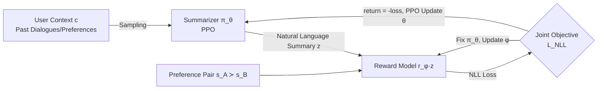

# Learning to Summarize User Information for Personalized RLHF (PLUS)

**Conference**: ICLR 2026  
**OpenReview**: [https://openreview.net/forum?id=Ar078WR3um](https://openreview.net/forum?id=Ar078WR3um)  
**Code**: Open source (based on OpenRLHF)  
**Area**: LLM Alignment / Personalized RLHF  
**Keywords**: Pluralistic alignment, personalized reward model, RLHF, user summary, PPO, co-adaptation  

## TL;DR
PLUS utilizes RL (PPO) to train a "user summarizer" that compresses each user's preferences, characteristics, and conversation history into a **natural language summary** $z$. This summary conditions the reward model, and both components undergo online co-adaptation. This approach improves reward model accuracy by 11–77% relative to Bradley-Terry without assuming "identical preferences for all users."

## Background & Motivation
**Background**: Standard RLHF employs a Bradley-Terry-Luce (BTL) reward model to fit the entire user population, implicitly assuming "homogeneous preferences." When two users exhibit opposite preferences for two responses to the same prompt without additional context, BTL cannot distinguish between them. As assistants like ChatGPT/Gemini approach billions of daily active users with highly heterogeneous needs, "pluralistic alignment" has become essential.

**Limitations of Prior Work**: Existing personalized reward models (VPL, DPL, etc.) typically compress users into a latent vector or linear weights—VPL, for instance, uses a VAE to learn a 512-dimensional user embedding. Compressing rich textual context into a fixed-length vector results in information loss and **poor interpretability** (a vector cannot be understood, edited, or trusted by a user). Another approach involves directly inserting the entire conversation history into the reward model's prompt (ICL), but this suffers from low sample efficiency and sensitivity to topic drift.

**Key Challenge**: The goal is to retain the powerful "reasoning with text" capability and interpretability of LLMs while ensuring user representations are compact enough to generalize to new users and topics. Fixed-length vectors lose information, while full-scale ICL is too bloated.

**Goal**: In a realistic setting without User IDs (due to privacy or generalization needs), learn a user representation that is genuinely useful for downstream reward prediction and human-readable, based solely on context $c$ (e.g., past conversations).

**Key Insight**: **Use natural language summaries as latent user variables**. Instead of pre-defining criteria for a "good summary," the quality of a summary is defined by its ability to assist reward prediction. Thus, the summarizer and reward model must be trained together through **online co-adaptation** under a joint objective.

## Method

### Overall Architecture
PLUS consists of two interdependent modules: a **summarizer** $\pi_\theta$ trained via PPO, which samples a natural language summary $z\sim\pi_\theta(\cdot|c)$ from user context $c$; and a **summary-conditioned reward model** $r_\phi(\cdot|z)$, which predicts user preferences conditioned on $z$. Both share a joint objective—minimizing the negative log-likelihood of preference conditioned on the summary. Consequently, the reward model provides reward signals for the summarizer, while the summarizer provides increasingly discriminative conditions for the reward model, forming an alternating optimization loop.

### Key Designs

**1. Using text summaries as latent user variables and defining summary quality by "reward prediction accuracy"**: Conventional personalization methods model user $z$ as embedding vectors or linear weights. PLUS instead defines $z$ as a natural language sequence generated by the summarizer $\pi_\theta$. Crucially, the authors **reject** pre-setting any ground-truth standards for "what makes a good summary" and do not pre-train the summarizer. Instead, they assert that a summary's quality is solely determined by whether it allows the downstream reward model to predict preferences more accurately. This binds the summarizer and reward model to the same objective—minimizing negative log-likelihood on a user-conditioned preference dataset $D'=\{(s_A^i,s_B^i,c^i)\}$:
$$L_{NLL}(\phi,\theta) = -\hat{\mathbb{E}}_{(s_A,s_B,c)\sim D',\,z\sim\pi_\theta(\cdot|c)}\Big[\log\sigma\big(r_\phi(s_A|z)-r_\phi(s_B|z)\big)\Big]$$
Note that $z$ is no longer a given User ID but is learned from context $c$, allowing it to generalize naturally to unseen users.

**2. Online co-adaptation: Breaking coupling via alternating freeze-update**: In $L_{NLL}$, $\theta$ and $\phi$ are interdependent. PLUS designs an alternating training scheme—**Fixing the summarizer to train the reward model**: Using summaries $z$ sampled from the current summarizer, standard preference NLL updates are performed on $\phi$ for $M_\phi$ steps. **Fixing the reward model to train the summarizer**: Using the latest $\phi$ to provide reward signals for the summarizer, $\theta$ is updated for $M_\theta$ steps. This ensures the summarizer extracts information most useful for the "latest version" of the reward model. This step is the soul of PLUS: ablations show that even using GPT-4o as a summarizer with a trained 3B reward model cannot outperform a co-trained "3B summarizer + 0.5B reward model."

**3. Formulating summary generation as an RL post-training problem (PPO + Trajectory-level sparse rewards)**: The optimal weights for the summarizer cannot be obtained directly via supervised learning—the quality of a summary is only known after the entire sequence is sampled and fed into the reward model. Thus, the authors formalize the generation of summary $(z_1,\dots,z_H)$ as an RL problem, providing a reward only at the end of the sequence $t=H$, equal to the log-likelihood of the preference under that summary:
$$R_\phi(z_t,s_A,s_B) = \begin{cases} 0, & t<H \\ \log\sigma\big(r_\phi(s_A|z_t)-r_\phi(s_B|z_t)\big), & t=H \end{cases}$$
GAE is then used to distribute this sequence-level return into token-level advantages $A_t^{GAE}$ for the PPO objective $L_{PPO}$.

**4. Selecting PPO to handle non-stationary rewards (MARL perspective)**: Since the reward model is continuously updated, the summarizer faces **non-stationary** rewards. This is essentially a Multi-Agent RL (MARL) problem. The authors chose PPO because of its robustness under non-stationary rewards, serving as a strong baseline in MARL. This engineering choice prevents divergence in the "moving target" setting.

## Key Experimental Results

### Main Results: Reward Model Accuracy on Prepared Benchmarks (Held-out)

| Method | Pets (Qwen-0.5B) | UF-P2 (Qwen-0.5B) | UF-P4 (Qwen-0.5B) |
|---|---|---|---|
| BTL | 44.15 | 58.12 | 53.53 |
| DPL | 46.20 | 58.53 | 55.22 |
| VPL | **100** | 58.37 | 54.20 |
| ICL | **100** | 59.62 | 57.22 |
| PLUS-untrained | 96.20 | 59.90 | 56.89 |
| **PLUS** | 99.80 | **69.40** | **62.10** |
| Oracle | 100 | 69.10 | 70.60 |

Key takeaway: While VPL/ICL reach 100% on the simple Pets dataset, on UltraFeedback (where topics vary but user groups remain stable), VPL barely improves over BTL. PLUS achieves a 10.4–17.7% gain, nearly matching the Oracle, and a 3B PLUS outperforms 7B/8B ICL models.

### Robustness: Pets-OOD (Distribution shift in user preference content: Cats/Dogs → Rabbits/Birds)

| Method | OOD User Context Accuracy |
|---|---|
| BTL / DPL | 49.5 / 49.0 |
| VPL | 44.83 |
| ICL | 72.50 |
| PLUS-untrained | 85.83 |
| **PLUS** | **93.67** |

PLUS is the only method maintaining >90% accuracy under content drift, indicating it learns a general algorithm for extracting user information rather than memorizing specific users.

### Ablation Study: Co-adaptation vs. Fixed Components (UltraFeedback)

| Summarizer | Reward Model | UF-P2 | UF-P4 |
|---|---|---|---|
| Trained 3B | Static 0.5B | 53.45 | 49.50 |
| Static 3B | Trained 0.5B | 59.90 | 56.40 |
| GPT-4o | Trained 3B | 59.30 | 60.80 |
| **Trained 3B** | **Trained 0.5B** | **69.40** | **61.80** |
| **Trained 3B** | **Trained 3B** | **69.85** | **62.45** |

The co-trained "3B Summarizer + 0.5B RM" significantly outperforms "GPT-4o Summarizer + Trained 3B RM," proving that summaries must be defined by the reward model's loss rather than an external fixed standard.

### Key Findings
- **Flexible inputs beyond preference labels**: PLUS can learn from natural conversations without chosen/rejected pairs (non-preference) or user-guide prompts (e.g., "User cares about honesty..."), outperforming ICL by 9–16%.
- **Real-world PRISM Data (1500 users/75 countries/20 LLMs)**: One of the first works to report pluralistic reward modeling on PRISM. Reward accuracy is 62.9% (BTL 59.8, VPL 60.4). While numerical gains are modest due to high variance, the value of summaries is realized in downstream tasks.
- **Zero-shot personalization of proprietary models**: Feeding PLUS summaries into GPT-4o as an LLM-as-judge improves accuracy. For personalized response generation, PLUS-conditioned responses achieve a win rate of **72% (GPT-4o)** and **69% (GPT-4.1)** over default GPT.

## Highlights & Insights
- **"Quality defined by downstream task" paradigm**: By letting the reward model loss define "what a good summary is," the authors transform a difficult-to-supervise generation problem into an RL problem.
- **Interpretability as a differentiator**: Unlike VPL's black-box vectors, natural language summaries show users exactly which preferences are being utilized, supporting transparency and user edits.
- **Small model co-training > Large model assembly**: 3B + 0.5B co-trained models beating GPT-4o + 3B suggests that the bottleneck for personalized RLHF is the mutual shaping of the summarizer and reward model.
- **MARL Perspective**: Treating personalized RLHF as a Multi-Agent RL problem provides clarity and justifies the use of PPO.

## Limitations & Future Work
- **PPO sensitivity**: PPO in a MARL setting is sensitive to hyperparameters like learning rate. Suggested mitigations include alternating frozen phases or using warm-starts.
- **PRISM accuracy**: Reward accuracy remains relatively low (~63%), and all pluralistic methods struggle with OOD new users, indicating that modeling real-world high-variance preferences is far from solved.
- **Privacy**: Storing user-specific information involves privacy risks; sensitive data must be stripped before deployment.
- Future work could explore interactive user editing of summaries.

## Related Work & Insights
- **Personalized/Pluralistic RLHF**: VPL and DPL represent users as vectors or weights. PLUS differentiates itself by using **text**, balancing expressiveness and interpretability.
- **LLM Summary Tuning**: Similar to Wu et al. (2025) for recommendation personalization, but PLUS's innovation lies in the **online co-adaptation loop** between the summarizer and the reward model.
- **Inspiration**: The framework of "using RL to learn an optimal intermediate natural language representation for a downstream task" can be extended to query rewriting, memory compression in agents, and more.

## Rating
- **Novelty**: ⭐⭐⭐⭐⭐ Clear differentiation by replacing vectors with "reward-defined, co-trained" natural language summaries.
- **Experimental Thoroughness**: ⭐⭐⭐⭐ Covers 3 benchmarks, OOD, flexible inputs, PRISM, and proprietary models. Absolute PRISM values are a bit low.
- **Writing Quality**: ⭐⭐⭐⭐ Logical flow from motivation to method and ablation; intuitive examples for summaries.
- **Value**: ⭐⭐⭐⭐⭐ Highly practical for pluralistic alignment due to interpretability and zero-shot transferability.

<!-- RELATED:START -->

## Related Papers

- [\[ACL 2026\] PERSA: Reinforcement Learning for Professor-Style Personalized Feedback with LLMs](../../ACL2026/llm_alignment/persa_reinforcement_learning_for_professor-style_personalized_feedback_with_llms.md)
- [\[ACL 2026\] P-Check: Advancing Personalized Reward Model via Learning to Generate Dynamic Checklist](../../ACL2026/llm_alignment/p-check_advancing_personalized_reward_model_via_learning_to_generate_dynamic_che.md)
- [\[ICLR 2026\] Eliminating Inductive Bias in Reward Models with Information-Theoretic Guidance](eliminating_inductive_bias_in_reward_models_with_information-theoretic_guidance.md)
- [\[ICLR 2026\] General Exploratory Bonus for Optimistic Exploration in RLHF](general_exploratory_bonus_for_optimistic_exploration_in_rlhf.md)
- [\[ICLR 2026\] Unifying Stable Optimization and Reference Regularization in RLHF (DAR)](unifying_stable_optimization_and_reference_regularization_in_rlhf.md)

<!-- RELATED:END -->
