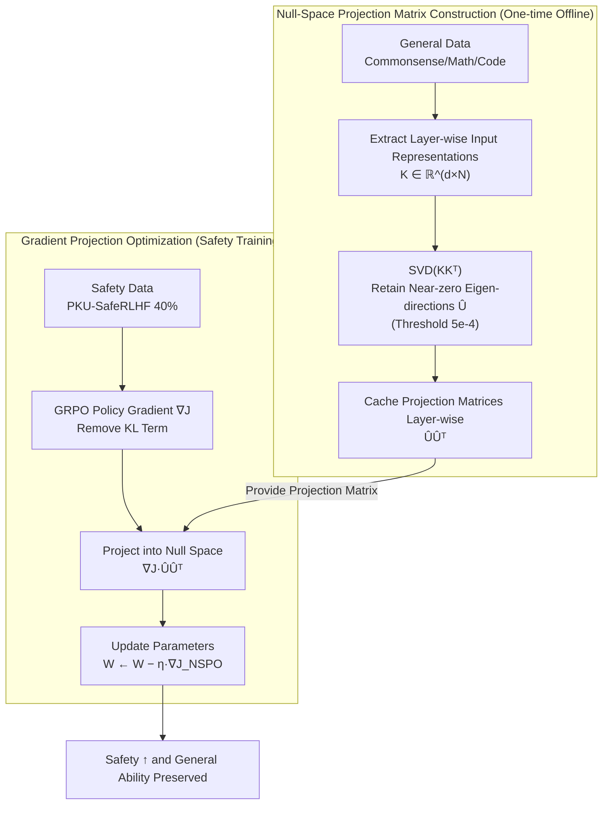

# Mitigating the Safety Alignment Tax with Null-Space Constrained Policy Optimization

**Conference**: ICLR 2026  
**arXiv**: [2512.11391](https://arxiv.org/abs/2512.11391)  
**Code**: [https://github.com/ivanniu/NSPO](https://github.com/ivanniu/NSPO)  
**Area**: Alignment RLHF  
**Keywords**: Safety Alignment, Null Space, Policy Optimization, Alignment Tax, gradient projection

## TL;DR
This paper proposes NSPO, which projects safety alignment policy gradients into the null space of general task representations. This ensures, from a geometric perspective, that safety optimization does not damage general capabilities. Using only 40% of safety data, it achieves SOTA on 7 safety benchmarks with almost no performance loss in mathematics, coding, or instruction following.

## Background & Motivation

**Background**: LLM safety alignment (refusing harmful requests, adhering to ethical standards) is typically achieved through reinforcement learning (PPO/GRPO/DPO) trained on safety datasets.

**Limitations of Prior Work**: Safety alignment often leads to an **alignment tax**, where models become overly conservative and experience performance degradation in general tasks such as mathematical reasoning and code generation. Existing methods (SafeRLHF, W-DOOR, BFPO) model safety and general capabilities as a bi-objective optimization, mitigating the tax by balancing weights or mixing in large amounts of general data, but they **do not explicitly resolve gradient conflicts between the two objectives during training**.

**Key Challenge**: There is a conflict between safety gradients and general capability gradients; updating parameters along the safety gradient can destroy learned general task representations.

**Goal**: How can damage to general capabilities be fundamentally avoided during safety alignment?

**Key Insight**: If a parameter update $\Delta$ resides in the null space of the general task input representations $K$ (i.e., $\Delta K = 0$), the model's output for general inputs remains unchanged after the update.

**Core Idea**: Project safety policy gradients into the null space of the general task representation matrix, geometrically ensuring that safety updates are orthogonal to general capabilities.

## Method

### Overall Architecture
NSPO addresses how to align for safety without harming general capabilities. It leverages a clean geometric fact: general capabilities are manifested as the base model mapping input representations $K$ of each layer to outputs $V=W_{\text{base}}K$. As long as the parameter update $\Delta$ falls within the null space of $K$ ($\Delta K = 0$), the updated model yields $(W+\Delta)K = WK = V$, keeping the outputs for all general inputs intact. Thus, the alignment tax is transformed into a constraint problem—restricting safety updates to the null space of general representations.

The framework is built upon GRPO and decoupled into offline and online stages. **One-time Offline**: Input representations $K$ for each linear transformation layer are collected from a small amount of general data. SVD is performed on the covariance matrix $KK^T$ to identify directions corresponding to near-zero eigenvalues, forming the null-space projection matrix $\hat{U}\hat{U}^T$, which is cached layer-wise. **Online Training**: Standard GRPO policy gradients (excluding the KL term) are calculated on safety data. Before each update, the gradient is multiplied by the cached projection matrix to push it into the null space. This ensures safety optimization only occurs in directions that "do not change general outputs."

### Key Designs

**1. Null-Space Projection Matrix Construction: Pre-calculating "Immobile Directions"**

To ensure updates do not destroy general capabilities, one must identify the parameter directions carrying general task representations. NSPO feeds general data (commonsense, math, code) into the base model $\pi_{\text{base}}$ to capture the input representations $K \in \mathbb{R}^{d \times N}$ ($d$ is the dimension, $N$ is the token count) for each linear transformation. The goal is to find the left null space of $K$. Since $N \gg d$, direct computation is prohibitive. NSPO instead decomposes the $d \times d$ non-centered covariance matrix $KK^T$ (which shares the same null space): $\{U, \Lambda, U^T\} = \text{SVD}(KK^T)$. Eigenvectors corresponding to non-zero eigenvalues are discarded, and those corresponding to near-zero eigenvalues (threshold $5\text{e-}4$) are aggregated into $\hat{U}$. The projection matrix is $\hat{U}\hat{U}^T$. This is a one-time offline $O(d^3)$ overhead.

**2. Safety Gradient Projection: Hard Constraints over Soft Balancing**

With the projection matrix, safety optimization is geometrically locked within the null space. At each step, the safety gradient $\nabla_W \mathcal{J}$ is calculated via GRPO and then projected:

$$\nabla_W \mathcal{J}_{\text{NSPO}} = (\nabla_W \mathcal{J}) \cdot \hat{U}\hat{U}^T$$

The projected gradient satisfies $\nabla_W \mathcal{J}_{\text{NSPO}} \cdot K = 0$. Consequently, the updated model's output for general inputs remains $(W - \eta \nabla_W \mathcal{J}_{\text{NSPO}})K = WK = V$. Unlike "soft constraints" like KL regularization or data mixing which compromise between objectives, this "hard constraint" geometrically prevents safety updates from encroaching on the general capability subspace. The authors prove two properties: **Stability** (projection is non-expansive, $\|\nabla_W \mathcal{J}_{\text{NSPO}}\|_2 \leq \|\nabla_W \mathcal{J}\|_2$) and **Descent Direction** (the projected gradient remains a valid direction for safety improvement).

**3. Removing KL Divergence Regularization: Projection as a Better Regularizer**

NSPO removes the $D_{\text{KL}}[\pi_\theta \| \pi_{\text{ref}}]$ term from the GRPO objective. While KL divergence usually prevents over-optimization, it can be counterproductive in safety alignment by pulling the policy toward an unsafe reference model $\pi_{\text{ref}}$. Null-space projection replaces the role of KL by preventing excessive deviation from the original model without pulling the policy toward unsafe directions.

### Loss & Training
The training objective is the GRPO policy gradient term with null-space projection and no KL term, using default GRPO hyperparameters ($\epsilon = 0.2$). Training uses 40% of the PKU-SafeRLHF dataset (~11K samples) without any general task data. Projection matrices are cached layer-wise using an offloading mechanism to keep memory overhead at $O(d^2)$. Training projection overhead $O(d^3)$ is significantly smaller than the $O(n^2 d + n d^2)$ of forward/backward passes.

## Key Experimental Results

### Main Results

**Safety Performance (Llama3-8B-Instruct, ASR% ↓ Lower is Better)**:

| Method | AdvBench | HarmBench | SORRY-Bench | ALERT |
|------|---------|-----------|-------------|-------|
| Base | 1.36 | 7.50 | 34.15 | 3.81 |
| SafeRLHF | 14.39 | 41.34 | 44.77 | 13.66 |
| W-DOOR | 0.75 | 2.81 | 30.46 | 1.86 |
| BFPO | 0.64 | 4.16 | 29.73 | 7.22 |
| **NSPO** | **0.06** | **0.18** | **16.81** | **1.00** |

**General Ability Preservation (Qwen2.5-7B-Instruct)**:

| Method | MATH | HumanEval | IFEval | MMLU |
|------|------|-----------|--------|------|
| Base | High Baseline | High Baseline | High Baseline | High Baseline |
| NSPO | ~No Loss | ~No Loss | ~No Loss | ~No Loss |
| Others | Significant Drop | Significant Drop | Partial Drop | Partial Drop |

### Ablation Study

| Config | Safety | General Ability | Description |
|------|--------|---------|------|
| NSPO (Full) | Best | Preserved | Null-space projection + No KL |
| No Projection (Std GRPO) | Improved | Decreased | Safety gradients damage general tasks |
| Random Projection | Poor | Poor | Random directions fail both objectives |
| With KL Divergence | Slightly Worse | Better | KL pulls toward unsafe reference model |

### Key Findings
- NSPO exceeds baselines using full data while utilizing only 40% of safety data (~11K samples).
- Consistent effectiveness on Llama3-8B and Qwen2.5-7B suggests architecture independence.
- Computational overhead is minimal: one-time $O(d^3)$ SVD and training-time $O(d^3)$ projection.
- High data efficiency: only 1000 samples of general data are needed to construct projection matrices.

## Highlights & Insights
- **Geometric Solution to Alignment Tax**: Instead of soft constraints (KL, mixed data), it uses hard geometric constraints (null-space projection) to eliminate safety gradient interference. This is transferable to continual learning or multi-task fine-tuning.
- **Theoretical Guarantee of Descent**: Proving that the projected gradient is still a descent direction is crucial to guarantee that safety can still be learned under strict constraints.
- **Removing KL is Better**: Overturning the standard practice of KL regularization, NSPO shows that for safety alignment, KL can be harmful and projection is a more suitable regularization alternative.

## Limitations & Future Work
- The dimension of the null space depends on the rank of general task representations; if they cover most of the parameter space, the null space might be too small for safety learning.
- Only validated in safety alignment; its applicability to helpfulness alignment or general multi-task learning requires further study.
- The eigenvalue threshold (5e-4) is manually set and lacks an adaptive selection mechanism.
- Whether 1000 samples are sufficient to represent the entire distribution of general capabilities remains a question.

## Related Work & Insights
- **vs SafeRLHF**: SafeRLHF uses a constrained MDP framework (soft constraint), while NSPO provides a hard geometric constraint, yielding significantly better safety and general task preservation.
- **vs W-DOOR/BFPO**: These methods balance objectives through preference ranking but require more data and still suffer from alignment tax.
- **vs Continual Learning (e.g., LoRA, EWC)**: The null-space approach shares similarities with EWC in protecting important parameter directions, but NSPO is more direct by using geometric projection rather than a penalty.

## Rating
- Novelty: ⭐⭐⭐⭐⭐ A fresh geometric perspective on LLM safety alignment with sound theory.
- Experimental Thoroughness: ⭐⭐⭐⭐⭐ Tested on 7 safety and 7 general benchmarks across two models with extensive ablations.
- Writing Quality: ⭐⭐⭐⭐ Clear theoretical derivations and comprehensive experiments.
- Value: ⭐⭐⭐⭐⭐ Addresses the core pain point of the alignment tax with a simple and efficient method.

<!-- RELATED:START -->

## Related Papers

- [\[ICLR 2026\] AlphaSteer: Learning Refusal Steering with Principled Null-Space Constraint](alphasteer_learning_refusal_steering_with_principled_null-space_constraint.md)
- [\[ICLR 2026\] Superficial Safety Alignment Hypothesis](superficial_safety_alignment_hypothesis.md)
- [\[ACL 2025\] Safety Alignment via Constrained Knowledge Unlearning](../../ACL2025/llm_alignment/safety_alignment_via_constrained_knowledge_unlearning.md)
- [\[ICLR 2026\] Alignment-Weighted DPO: A Principled Reasoning Approach to Improve Safety Alignment](alignment-weighted_dpo_a_principled_reasoning_approach_to_improve_safety_alignme.md)
- [\[ICLR 2026\] Is On-Policy Data always the Best Choice for Direct Preference Optimization-based LM Alignment?](is_on-policy_data_always_the_best_choice_for_direct_preference_optimization-base.md)

<!-- RELATED:END -->
