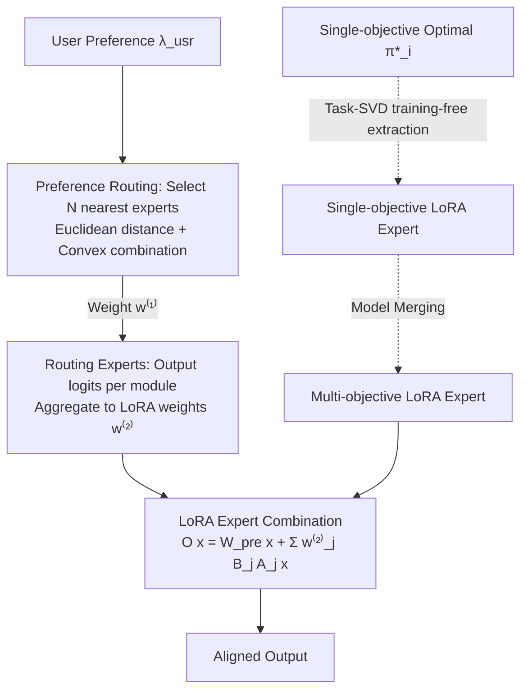

# Multi-objective Large Language Model Alignment with Hierarchical Experts

**Conference**: ICLR 2026  
**OpenReview**: [https://openreview.net/forum?id=UhmEdfAk46](https://openreview.net/forum?id=UhmEdfAk46)  
**Code**: Open-sourced (links provided in the paper, specific repository to be confirmed)  
**Area**: LLM Alignment / Multi-objective Alignment / Parameter Efficiency  
**Keywords**: Multi-objective alignment, Pareto front, LoRA, Mixture-of-Experts, Model Merging, Preference Controllability  

## TL;DR
HoE decomposes multi-objective alignment into a series of "single-preference subproblems" using a three-layer Mixture-of-Experts consisting of training-free extracted LoRA experts, lightweight routing experts, and parameter-free preference routing. It covers the entire Pareto front in a plug-and-play manner without retraining the backbone, responding to arbitrary user preference weights.

## Background & Motivation
**Background**: Human preferences are highly diverse and often conflicting—objectives like "helpfulness," "harmlessness," and "humor" have different relative weights for different users and scenarios. The core requirement of Multi-Objective Alignment (MOA) is to make an LLM dynamically controllable according to a user-provided preference weight vector $\lambda=(\lambda_1,\dots,\lambda_N)$, effectively allowing a single model to traverse anywhere along the Pareto front.

**Limitations of Prior Work**: Existing approaches have significant drawbacks. MORLHF and MODPO follow linear scalarization, requiring a separate model for each preference, which leads to storage and training costs exploding linearly with the number of preferences. MOD, Args, and PAD perform logits fusion during decoding, requiring multiple forward passes. RiC and DPA insert preferences into prompts, relying on structured prompting and struggling with strongly conflicting objectives. LoraMoE uses LoRA as experts but requires joint training of all experts from scratch, making knowledge sharing difficult and unsuitable for MOA.

**Key Challenge**: A single "unified" model trained uniformly across all weights cannot achieve the optimal performance of a specialized expert at a specific weight (e.g., $[0.5,0.5]$). There exist both **inter-objective conflicts** (optimizing helpfulness often sacrifices harmlessness) and **inter-preference competition** (the front of uniform training is dominated by points of specialized fronts). This constitutes a "controllability bottleneck."

**Goal**: To enable LLMs to approximate the optimal Pareto front in a plug-and-play manner with minimal parameter overhead and fine-grained control over arbitrary preference weights, without retraining any base models.

**Core Idea**: **Decomposition + Hierarchical Experts**—decompose the multi-objective problem into single-preference subproblems, assign each subproblem to a group of specialized "expert" parameters, and then assemble these local experts back into a complete front using a hierarchical MoE framework to bypass the controllability bottleneck.

## Method

### Overall Architecture
HoE consists of three hierarchical components organized top-down: **LoRA Experts** (coarse-grained, parameter blocks corresponding to fixed preferences), **Routing Experts** (lightweight, module-level fine-grained adaptive selection), and **Preference Routing** (parameter-free, mapping user preferences to neighboring experts). During inference, a user preference vector $\lambda_{usr}$ is "located" by preference routing to neighboring experts, then "refined" by routing experts into LoRA-level mixing weights, and finally "realized" by LoRA experts during the forward pass to assemble a localized model tailored to that preference.

### Key Designs

**1. Training-free LoRA Expert Extraction: Extracting composable adapters from existing models.** HoE does not retrain any alignment models. Instead, it takes a set of existing single-objective optimal policies $\{\pi_1^*,\dots,\pi_N^*\}$ and defines task vectors $\tau_i=\theta_i-\theta_{pre}$ (the difference between fine-tuned and pre-trained weights) based on Task Arithmetic. This vector naturally encodes the capability for the $i$-th objective. Using task-aware truncated SVD (task-SVD), $\tau_i$ is compressed into low-rank adapters $A_i\in\mathbb{R}^{d_{in}\times r}, B_i\in\mathbb{R}^{r\times d_{out}}$ where $r\ll\min(d_{in},d_{out})$. By selecting high-magnitude components and layer-wise truncation, highly specialized LoRA experts are obtained with almost no performance loss.

**2. Multi-objective LoRA Experts: Filling the Pareto front via model merging.** Linear combinations of single-objective experts often fail to recover optimality at intermediate points (e.g., $\lambda=[0.5,0.5]$). HoE adopts non-linear model merging strategies to amplify parameters beneficial to all tasks and suppress conflicting ones, synthesizing new expert parameters $\tau_\lambda=\text{Merge}(\{\tau_i\}_{i\in[N]},\lambda)$. These are then compressed via task-SVD into adapters specialized for specific objective combinations, compensating for the limitations of linear fusion.

**3. Routing Experts: Input-adaptive selection with negligible parameters.** To avoid parameter explosion when scaling LoRA experts, HoE inserts a lightweight linear routing layer in each Transformer block. This "routing expert" reads the same hidden state $x$ as the LoRA and scores all experts. Each routing expert $\eta_\lambda$ is bound to a target preference $\lambda^{(e)}$ and only activates the $N$ nearest LoRA experts in the preference space. Crucially, **all LoRA expert parameters remain frozen**, and only these tiny routing layers are trained, allowing for more efficient module-level adaptive capacity utilization than static combinations.

**4. Tchebycheff Scalarization + Online Mirror Descent: Stabilizing training in non-convex regions.** The training objective for routing experts is to maximize the scalarized multi-objective reward aligned with $\lambda^{(e)}$. To handle non-convex regions of the Pareto front, HoE avoids linear scalarization (which tends to push policies to the edges) and uses Tchebycheff scalarization: $J(\theta|\lambda)=\max_\theta \min_i\{\lambda_i(R_i(\theta)-z_i^*)\}$. This max–min problem is solved using Online Mirror Descent (OMD), maintaining a smoothed distribution $w$ over objectives, rewritten as $J(\theta|\lambda)=\max_\theta\sum_i w_i(R_i(\theta)-z_i^*)$. $w$ is updated online via temporal differences to stabilize training, eventually embedded in PPO with convergence guarantees of $O(\log N/T)$.

**5. Parameter-free Preference Routing and Hierarchical Assembly: Connecting "Locate-Refine-Realize" in a single forward pass.** The preference routing layer contains no parameters and selects the $N$ experts nearest to $\lambda_{usr}$ via Euclidean distance. Inference follows three steps: ① Preference routing expresses $\lambda_{usr}$ as a convex combination of neighboring expert preferences $\lambda_{usr}=\sum_{i\in\Lambda_{selected}} w_i^{(1)}\lambda_i$; ② Routing experts produce logits based on input $x$, aggregated with $w^{(1)}$ to get LoRA weights $w^{(2)}=\sum_i w_i^{(1)}\vec\eta_{\lambda_i}(x)$; ③ The final output is $O(x)=W_{pre}x+\sum_j w_j^{(2)} B_j A_j x$.

## Key Experimental Results

### Main Results
- **Scale**: 6 NLP tasks, 16 objectives (Helpful, Harmless, Humor, Correctness, Coherence, etc.), 200 different preferences, 15 recent baselines; covering bi-objective, tri-objective, and multi-objective scenarios.
- **Datasets**: include Helpful Assistant, Math, Reddit Summary, Beaver Tail, HelpSteer, etc.
- **Metrics**: Pareto fronts plotted using scores from open-source reward models, supplemented by GPT-4 win rates.

| Scenario | Key Results |
|------|----------|
| Bi-objective (7 setups) | HoE approaches the theoretical upper bound of MORLHF; **fully dominates** RS and MOD; outperforms RiC in 5 out of 7 cases. |
| Tri-objective (Helpful/Harmless/Humor) | Dominates RS and MOD on the Pareto front; outperforms RiC across most weights. |
| Strict Generalization (Llama3.1-8B) | Ranks **1st in 11 out of 14** evaluation setups; only slightly surpassed by PAD in the remaining 3. |
| Multi-objective (5 labels) | Highest average score; outperforms MOD/RS/RiC across all objectives. |
| Method Attributes | 1 model stored, 1 inference pass, 0 models trained, Pareto controllable—lowest comprehensive overhead. |

### Ablation Study

| Ablation | Configuration | Conclusion |
|--------|------|------|
| Expert Composition | 2 LoRA + 1 Router | Minor local improvement due to parameter limits. |
| | 3 LoRA | Expands front significantly near preferences but degrades rapidly elsewhere. |
| | 3 LoRA + 1 Router | Nearly complete front; strong synergy between routing experts and LoRA. |
| LoRA Rank | rank=256 | Math tasks are more sensitive to rank; 256 balances performance and efficiency. |
| Scalarization | Linear vs Tchebycheff | Linear scalarization is unstable; Tchebycheff (OMD) ensures stability and full coverage. |

### Key Findings
- **LoRA experts provide the primary gain but with diminishing returns, while routing experts provide complementary gains with far fewer parameters.** The synergy between the two is key to balancing performance and efficiency.
- **Token-level switching**: Case studies show that under mixed preferences, early tokens are dominated by the "Helpful" expert while later tokens activate "Harmless/Humor" experts more to resolve adversarial prompts. This token-level interpretability is unique to HoE.

## Highlights & Insights
- **"Decompose then Assemble" transforms the controllability bottleneck into an expert routing problem**: Instead of forcing one model to cover the entire front, each expert handles its local optimum, and hierarchical routing stitches them together.
- **Nearly training-free**: Single-objective experts are extracted from existing models via task-SVD, and multi-objective experts are synthesized via merging. Only the minimal routing layers require training, drastically reducing costs compared to MORLHF or MODPO.
- **Three-layer abstraction**: Preference Routing (localization) → Routing Experts (refinement) → LoRA Experts (realization). New objectives can be added by extending preference vectors without retraining existing experts.
- **The choice of Tchebycheff + OMD is theoretically grounded**: It addresses the failure of linear scalarization in non-convex front regions with an $O(\log N/T)$ convergence guarantee.

## Limitations & Future Work
- **Dependence on existing optimal models**: The training-free advantage relies on having high-quality single-objective policies $\pi_i^*$. If an objective lacks a pre-existing model, the initial alignment cost must still be paid.
- **Disadvantage in high-conflict scenarios**: In extremely conflicting settings, HoE is slightly outperformed by RiC/PAD, potentially because offline expert combinations are less flexible than online training in extreme conflict zones.
- **Expert number vs. Pareto coverage**: The optimal strategy for the number and placement of expert preferences remains to be systematically explored.
- **Error accumulation**: Low-rank compression and model merging introduce approximations; the quality of synthesized multi-objective experts as the number of objectives grows requires further investigation.

## Related Work & Insights
- **Multi-objective Alignment Taxonomy**: Includes linear scalarization retraining (MORLHF, MODPO), decoding-time fusion (MOD, PAD), in-context preference injection (DPA, RiC), and steering vectors. HoE is positioned as "Low Storage/Inference/Training + Pareto Controllable."
- **Knowledge Fusion**: Task Arithmetic and model merging are the direct technical sources for HoE's extraction and synthesis. Compared to LoraMoE, HoE avoids joint training and improves knowledge sharing.
- **Insight**: Combining "Model Merging + LoRA-MoE + Preference Geometric Routing" provides a low-cost paradigm for assembling controllable alignment from existing model parts.

## Rating
- **Novelty**: ⭐⭐⭐⭐
- **Experimental Thoroughness**: ⭐⭐⭐⭐
- **Writing Quality**: ⭐⭐⭐⭐
- **Value**: ⭐⭐⭐⭐

<!-- RELATED:START -->

## Related Papers

- [\[ICLR 2026\] OrthAlign: Orthogonal Subspace Decomposition for Non-Interfering Multi-Objective Alignment](orthalign_orthogonal_subspace_decomposition_for_non-interfering_multi-objective_.md)
- [\[ICLR 2026\] Towards Understanding Valuable Preference Data for Large Language Model Alignment](towards_understanding_valuable_preference_data_for_large_language_model_alignmen.md)
- [\[ICLR 2026\] IDEAL: Data Equilibrium Adaptation for Multi-Capability Language Model Alignment](ideal_data_equilibrium_adaptation_for_multi-capability_language_model_alignment.md)
- [\[ICLR 2026\] Semantic-aware Wasserstein Policy Regularization for Large Language Model Alignment](semantic-aware_wasserstein_policy_regularization_for_large_language_model_alignm.md)
- [\[ICLR 2026\] Test-Time Alignment for Large Language Models via Textual Model Predictive Control](test-time_alignment_for_large_language_models_via_textual_model_predictive_contr.md)

<!-- RELATED:END -->
