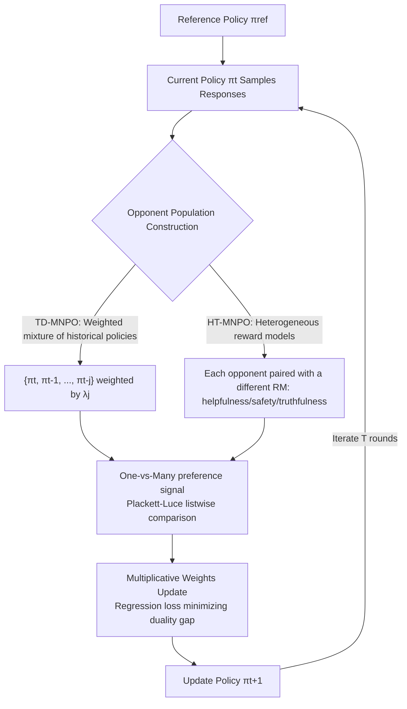

# Multiplayer Nash Preference Optimization

**Conference**: ICLR 2026  
**OpenReview**: [https://openreview.net/forum?id=x7aLhLMVn1](https://openreview.net/forum?id=x7aLhLMVn1)  
**Code**: [https://github.com/smiles724/MNPO](https://github.com/smiles724/MNPO)  
**Area**: LLM Alignment / Nash Preference Optimization  
**Keywords**: RLHF, Nash learning from human feedback, Multiplayer games, Preference non-transitivity, Heterogeneous reward models  

## TL;DR
This work generalizes Nash learning from human feedback (NLHF) from "two-player games" to "n-player games," allowing a policy to simultaneously compete against an entire population of opponents (historical checkpoints or multiple heterogeneous reward models). By using multiplicative weights updates to find approximate Nash equilibria, the method more stably and comprehensively captures non-transitive and heterogeneous human preferences in the real world.

## Background & Motivation
**Background**: Mainstream RLHF is built on the Bradley–Terry (BT) hypothesis, which assumes the existence of a scalar reward function $r^*$ where preferences satisfy transitivity. However, empirical studies repeatedly show that real human preferences are **non-transitive** (A>B, B>C, but C>A) and **heterogeneous** (different annotators or dimensional standards often conflict), rendering the BT hypothesis invalid. To bypass this, recent works have reformulated alignment as "finding a Nash equilibrium in a game defined by a general preference oracle," leading to NLHF algorithms like INPO, ONPO, SPPO, and EGPO, which offer better theoretical guarantees and empirical stability.

**Limitations of Prior Work**: All existing NLHF methods are locked into a **two-player** framework—a single policy competing against a single opponent. Yet, alignment in reality is never a "one-on-one duel"; it involves complex signals from multiple annotators, evaluation standards, reward models, and sequences of historical checkpoints. Compressing this complex landscape into a single opponent introduces **single-opponent bias**: the policy competes against only one distribution at each step, causing optimization oscillation, narrow exploration, and fragile approximation of the overall preference population.

**Key Challenge**: Real preferences represent "one-vs-many" group competition, while existing methods only perform "one-vs-one." **Goal**: Establish a framework that explicitly models alignment as "competing against a whole population rather than a single synthetic opponent," inheriting the equilibrium guarantees of two-player methods while gaining richer competitive dynamics and better preference coverage.

**Core Idea**: **[Multiplayer Nash Game]** Alignment is formulated as an n-player game where each policy competes against a group of opponents while being KL-regularized toward a reference model. **[Homogeneous Case ⇒ Strong Guarantees]** When all players share the same preference oracle (e.g., competing against their own historical trajectories), the symmetric game yields an $O(1/\sqrt{T})$ convergence guarantee via multiplicative weights updates. **[Unified Perspective]** By adjusting the number of players, opponent sets, distance metrics, and target reward margins, methods like DPO, IPO, SPPO, and INPO become special cases of this framework.

## Method

### Overall Architecture
MNPO generalizes the two-player preference game to an n-player game: each policy $\pi_i$ maximizes its average preference win rate against the remaining $n-1$ opponents while being KL-regularized toward a reference policy $\pi_{\text{ref}}$. In the homogeneous setting (all players share one oracle), iterative approximation of the Nash equilibrium is achieved via multiplicative weights updates, implemented as a trainable regression-style loss. The implementation algorithm **TD-MNPO** instantiates the "opponent population" as a weighted mixture of historical policies, while **HT-MNPO** instantiates opponents as heterogeneous players, each with a different reward model.

### Key Designs

**1. From Two-Player to n-Player: Symmetric Games for Group Competition.** MNPO generalizes the two-player objective $J(\pi_1,\pi_2)$ to an objective for each player against the rest of the group:
$$J\big(\pi_i,\{\pi_j\}_{j\neq i}\big)=\mathbb{E}_{x}\Big[\mathbb{E}_{y_i\sim\pi_i,\{y_j\sim\pi_j\}}\big[P(y_i\succ\{y_j\}_{j\neq i}\mid x)\big]-\tau\,\mathrm{KL}(\pi_i\|\pi_{\text{ref}})\Big].$$
The oracle $P$ here is no longer a pairwise comparison but a "one-vs-many" comparison of $y_i$ against a set of opponent responses. Three properties make this meaningful: all players are **treated symmetrically** (at equilibrium $\pi_1^*=\cdots=\pi_n^*$), each player's update depends only on their own actions and the aggregated behavior of opponents (**decentralized**, avoiding complex coupling), and it reduces exactly to the two-player objective when $n=2$. This turns "competing against a whole preference group" from a slogan into a definable, solvable game object, where the duality gap $\mathrm{DualGap}(\pi)=\max_{\pi'}J(\pi',O_\pi)-J(\pi,O_\pi)$ directly quantifies the distance to the Nash policy.

**2. Trainable Plackett–Luce One-vs-Many Rewards + Multiplicative Weights Update.** To support "one-vs-many," the authors replace the pairwise logistic term with a softmax over multiple candidates—the Plackett–Luce model. The preference probability of $y_i$ over $k-1$ opponents is written as $\exp R(x,y_i)$ divided by the sum of all $\exp R$; this reverts to Bradley–Terry when $k=2$. For solving, the multiplicative weights update from Freund & Schapire is utilized:
$$\pi^{(t+1)}_i(y\mid x)\propto\Big(\prod_{j\neq i}\pi^{(t)}_j(y\mid x)\Big)^{\frac{1}{n-1}}\exp\Big(\tfrac{\eta}{n-1}\textstyle\sum_{j\neq i}P(y\succ\pi^{(t)}_j\mid x)\Big),$$
guaranteeing that the average policy $\bar\pi^{(T)}$ converges to an approximate Nash equilibrium at a rate of $\epsilon=O(1/\sqrt{T})$. However, this update involves a normalization factor $Z$ that is hard to compute over exponential response spaces. The key trick is to observe the **log-ratio** $h_t(\pi,y,y')$ of response pairs; the normalization factor cancels out during subtraction. Thus, the Nash update is equivalent to minimizing a regression objective $L_t(\pi)$, whose unique minimum is precisely $\pi^{(t+1)}$ (Lemma 1). By further replacing difficult preference terms with a hyperparameter $\eta$, a self-consistent loss $L'_t$ is obtained. This step bridges "game-theoretic guarantees" with "end-to-end training."

**3. TD-MNPO: Instantiating the Opponent Population as a Time-Weighted Mixture.** The core engineering question in an n-player game is "where the opponent set $\{\pi_j\}$ comes from." Inspired by DNO/SPIN/INPO's use of historical iterations, TD-MNPO takes a weighted mixture (coefficients $\lambda_j\in[0,1]$) of recent historical policies $\{\pi_{t-j}\}$ at step $t$. The loss is formulated as:
$$L^{t,D}_{\text{TD}}=\mathbb{E}_{y,y'\sim\pi,\,y_w,y_l\sim\lambda_P}\,D\Big[\log\tfrac{\pi(y_w\mid x)}{\pi(y_l\mid x)}-\textstyle\sum_{j}\lambda_j\log\tfrac{\pi_{t-j}(y_w\mid x)}{\pi_{t-j}(y_l\mid x)}\,\Big\|\,\eta\delta^\star\Big].$$
Mixing multiple past policies results in smoother evolution, robustness to recent jitters, and more stable convergence. Notably, this unified formula subsumes existing methods as special cases: by tuning $n$, the opponent set, the distance metric $D$, and the target margin $\delta^\star$, one can recover SimPO ($n=1$), DPO ($n=2$, opponent=$\pi_{\text{ref}}$, $D_{\text{bwd}}$), SPPO, IPO, and INPO ($n=3$, opponents=$\pi_t,\pi_{\text{ref}}$). MNPO thus provides a unified framework for offline/online preference optimization.

**4. HT-MNPO: Multi-dimensional Alignment under Heterogeneous Oracles.** In reality, preferences come from **heterogeneous** sources (individual reward models for helpfulness, safety, and conciseness). HT-MNPO replaces the "historical policy mixture" with a "mixture of opponent policies bound to different oracles $P_i$." Each player $\pi_i$ is paired with an independent reward model $r_i$ and internalizes its own target margin $\delta^\star_i$. The trade-off is that when $P_i\neq P_j$, the game becomes general-sum, losing symmetry and formal convergence guarantees. Consequently, approximate stationary points are characterized using player-specific duality gaps $\mathrm{DualGap}_i$ (where no player has a strong incentive to deviate unilaterally). The authors argue this framework remains "natural and principled"—each policy optimizes against the current opponent distribution according to its own oracle, empirically finding effective solutions in multi-RM scenarios that correspond to real-world conflicting alignment needs.

## Key Experimental Results

Settings: Online RLHF framework using Gemma-2-9B-it as the base model with T=3 iterations. TD-MNPO uses ArmoRM-Llama3-8B as the oracle, while HT-MNPO additionally uses Skywork-Reward-V2 and Athene-RM-8B to simulate heterogeneous preferences. Evaluation is conducted using GPT-5-mini as the judge.

### Main Results: Instruction Following / Preference Alignment (GPT-5-mini Judging)

| Method | AlpacaEval 2.0 (LC WR) | Arena-Hard (WR) | MT-Bench |
|------|------------------------|------------------|----------|
| SFT (9B) | 50.15 | 44.97 | 6.49 |
| DPO | 54.35 | 45.63 | 6.87 |
| SimPO | 55.16 | 45.04 | 6.87 |
| SPPO | 55.97 | 43.89 | 6.86 |
| INPO | 56.09 | 48.03 | 6.95 |
| **TD-MNPO** | **57.27** | **52.26** | 7.03 |
| **HT-MNPO (ArmoRM)** | 57.63 | 50.93 | **7.52** |
| **HT-MNPO (Athene)** | **59.64** | 51.17 | 7.07 |

On Arena-Hard, TD-MNPO outperforms the runner-up INPO by 4.23 points and exceeds much larger models like Tulu-2-DPO-70B and Mixtral-8x22B-it.

### Academic Ability / Math & Code (Avoiding Alignment Tax)

| Method | Knowledge+Common Sense AVG | Math+Code AVG | AIME-24 | HumanEval |
|------|---------------|----------------|---------|-----------|
| SFT | 70.28 | 46.61 | 0 | 60.37 |
| SimPO | 69.60 (TruthfulQA drops to 63.40) | 45.82 | 0 | 57.32 |
| INPO | 70.25 | 47.10 | 0 | 59.15 |
| **TD-MNPO** | **71.08** | **48.10** | **3.33** | **61.59** |
| HT-MNPO (Skywork) | 71.80 | 47.86 | 0 | 59.76 |

### Key Findings
- **Comprehensive Lead**: Consistently outperforms DPO/SimPO/SPPO/INPO across three instruction-following benchmarks, proving that the multiplayer formula provides alignment gains.
- **No Alignment Tax**: While SimPO drops from 70.75 to 63.40 on TruthfulQA, MNPO achieves the highest average scores in Knowledge/Common Sense/Math/Code, indicating the multiplayer framework improves alignment while preserving foundational abilities.
- **Excellence in Hard Tasks**: MNPO is the only method to achieve a non-zero score (3.33) on AIME-24, where all benchmarks including SFT scored 0. It also leads on HumanEval, suggesting that multi-policy competition is particularly beneficial for complex reasoning requiring multiple solution paths.
- **Heterogeneity Outperforms Homogeneity**: HT-MNPO is stronger than TD-MNPO on most metrics, validating that incorporating multiple heterogeneous reward models provides better coverage of multidimensional preferences.

## Highlights & Insights
- **Single-Opponent Bias is a Real Issue**: This paper clearly identifies that the entire NLHF family is stuck in two-player modes, whereas real preferences are naturally "one-vs-many." This framing itself is highly valuable.
- **Bridges Theory and Engineering**: By using log-ratios to eliminate the intractable normalization factor and converting MWU into a regression loss with a unique minimum (Lemma 1 + Proposition 1), the authors allow game-theoretic guarantees to be applied to end-to-end trainable objectives.
- **Unified Framework Subsumes RLHF Methods**: Table 1 maps SimPO/DPO/IPO/SPPO/INPO as special cases of TD-MNPO, offering a unified coordinate system for understanding and extending preference optimization.
- **Pragmatic Split between Homogeneity and Heterogeneity**: The authors provide convergence proofs for the homogeneous setting while frankly acknowledging the lack of formal guarantees for HT-MNPO, instead using player-specific duality gaps to describe stationary points. This stance is theoretically honest and aligns with real-world multi-evaluator scenarios.

## Limitations & Future Work
- **Lack of Convergence Proof for Heterogeneous Settings**: HT-MNPO lacks formal convergence to a Nash equilibrium in general-sum games, only guaranteeing approximate stationary points. Paradoxically, HT-MNPO performs best in experiments, leaving a gap between theory and the strongest empirical results.
- **Oracle Simulated by Reward Models**: To save on human annotation, "heterogeneous human preferences" were simulated using three RMs (ArmoRM/Skywork/Athene). Whether this truly represents non-transitive, conflicting human preferences remains to be validated.
- **Scale and Cost**: Validation was limited to a 9B base model and T=3 iterations. Multiplayer settings involve maintaining multiple historical/heterogeneous policies, and training/sampling costs rise with the number of players. The overhead for scaling to larger models or more players is not fully discussed.
- **Dependency on Judges**: The core conclusions rely on GPT-5-mini as a single LLM judge. The impact of length/style bias and judge consistency on the robustness of these conclusions deserves further evaluation.

## Related Work & Insights
- **NLHF Lineage**: Built upon the general preference oracle games of Munos et al., as well as INPO (no-regret), SPPO, ONPO (optimistic mirror descent), and EGPO (extragradient), unifying their two-player formulas into an n-player framework.
- **Iterative/Self-Play Preference Optimization**: TD-MNPO's opponent construction directly draws from DNO, SPIN, and INPO's use of historical iterations, essentially expanding "self-play" from two players to a population level.
- **Reward-Aware Preference Optimization**: Reward-aware PO (RPO) provides an interface for incorporating scalar rewards into implicit preference models. MNPO's loss is proven to be a special case of RPO under squared distance, enabling it to utilize convenient reward signals while retaining the ability to handle non-transitivity.
- **Inspiration**: The idea of "replacing a single opponent with an opponent population/historical mixture" could translate to GRPO or self-play reasoning RL. Furthermore, "incorporating heterogeneous reward models into a single game" offers a new paradigm for multi-objective alignment (safety vs. utility vs. conciseness) beyond simple weighted sums.

## Rating
- **Novelty**: ⭐⭐⭐⭐ — Systematically generalizes NLHF to n players and unifies half the preference optimization family in one table. Significant theoretical contribution despite build-up on MWU and self-play.
- **Experimental Thoroughness**: ⭐⭐⭐⭐ — Covers 3 instruction benchmarks + 11 academic ones with math/code. Shows strong results without the alignment tax, though limited by 9B scale, RM simulation, and a single LLM judge.
- **Writing Quality**: ⭐⭐⭐⭐ — Evolution from motivation to theory to algorithm is clear. Formulaic derivations and Table 1 mappings are persuasive. Notation is dense but logically consistent.
- **Value**: ⭐⭐⭐⭐ — Provides an extensible unified framework for aligning non-transitive, heterogeneous human preferences. Directly valuable for multi-objective/multi-evaluator alignment and self-play RLHF.

<!-- RELATED:START -->

## Related Papers

- [\[ICLR 2026\] Semi-Supervised Preference Optimization with Limited Feedback](semi-supervised_preference_optimization_with_limited_feedback.md)
- [\[ICLR 2026\] Keep the Best, Forget the Rest: Reliable Alignment with Order-Aware Preference Optimization](keep_the_best_forget_the_rest_reliable_alignment_with_order-aware_preference_opt.md)
- [\[ICLR 2026\] Stackelberg Learning from Human Feedback: Preference Optimization as a Sequential Game](stackelberg_learning_from_human_feedback_preference_optimization_as_a_sequential.md)
- [\[ICLR 2026\] When Data Is the Algorithm: A Systematic Study and Curation of Preference Optimization Datasets](when_data_is_the_algorithm_a_systematic_study_and_curation_of_preference_optimiz.md)
- [\[ICML 2026\] Autoregressive Direct Preference Optimization](../../ICML2026/llm_alignment/autoregressive_direct_preference_optimization.md)

<!-- RELATED:END -->
