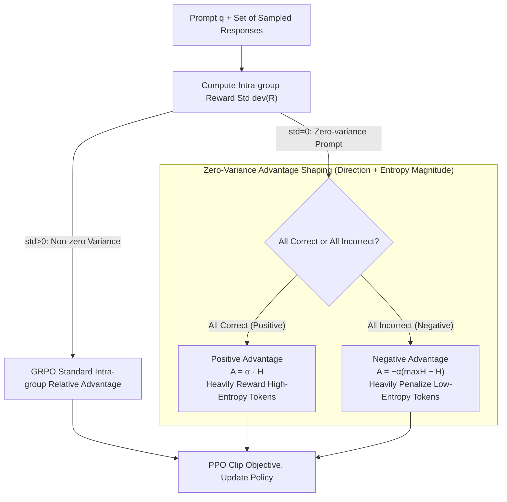

# No Prompt Left Behind: Exploiting Zero-Variance Prompts in LLM Reinforcement Learning via Entropy-Guided Advantage Shaping

**Conference**: ICLR 2026  
**arXiv**: [2509.21880](https://arxiv.org/abs/2509.21880)  
**Code**: [https://bltnynk.github.io/publications/rl-zvp/](https://bltnynk.github.io/publications/rl-zvp/) (Project Page)  
**Area**: Alignment RLHF  
**Keywords**: GRPO, Zero-Variance Prompts, Reinforcement Learning, Entropy-Guided Advantage Shaping, Mathematical Reasoning

## TL;DR
It is discovered that many "zero-variance prompts" (where all sampled responses are either all correct or all incorrect) are discarded during GRPO training. The RL-ZVP algorithm is proposed to extract learning signals from these prompts via entropy-guided advantage shaping, achieving improvements of up to 8.61 accuracy points and 7.77 pass rate points across six mathematical reasoning benchmarks compared to GRPO.

## Background & Motivation
Reinforcement Learning with Verifiable Rewards (RLVR) has become a mainstream method for enhancing the reasoning capabilities of LLMs. GRPO is a representative algorithm: it samples a set of responses for each prompt, calculates rewards based on correctness, and updates the policy using relative advantages within the group.

However, GRPO has a commonly overlooked efficiency bottleneck: **zero-variance prompts**. When all sampled responses for a specific prompt are either all correct or all incorrect, the intra-group reward standard deviation is zero. After normalization, the advantage values for all responses become zero—meaning the model derives zero training signal from these prompts.

**Key Challenge**: Experiments show that zero-variance prompts account for 30% to 99% of training data. In early training, models are too weak to solve any problems, generating many all-incorrect prompts; in late training, as models improve, many problems are solved correctly by all samples, likewise generating zero variance. Given that rollout generation accounts for approximately 50% of total training time, these "wasted" sampling costs are substantial.

**Limitations of Prior Work**: Dynamic sampling in DAPO (GRPO-DS) and GRESO choose to filter out zero-variance prompts before or after training, treating them as uninformative noise. However, this approach requires an additional 3x–5x rollout budget to fill the training batch.

**Core Idea**: Zero-variance prompts are not useless; they contain valuable learning signals—all-correct prompts should be reinforced, and all-incorrect prompts should be penalized. The specific magnitude of reinforcement/penalty should be regulated by token-level features such as entropy.

## Method

### Overall Architecture
RL-ZVP addresses the "waste of zero-variance prompts" in GRPO training. When rewards for a sample group have zero standard deviation, all advantages collapse to zero, contributing nothing to the gradient despite the sampling cost. RL-ZVP transforms GRPO into a shunt system: it first checks the standard deviation of rewards for each prompt's group. Non-zero variance prompts (std > 0) follow the original GRPO advantage logic. Zero-variance prompts (std = 0) are intercepted and categorized as **positive prompts** (all-correct) or **negative prompts** (all-incorrect), and a non-zero advantage is assigned to each token. This token-level advantage is characterized by two factors: direction (determined by correctness) and magnitude (determined by token entropy). Both branches eventually flow into the same PPO clip objective for policy updates, making RL-ZVP a strict generalization of GRPO that integrates seamlessly into existing training pipelines.

### Key Designs

**1. Advantage Direction: Providing Non-Zero Update Signs for All-Correct/All-Incorrect Prompts**

GRPO's pain point is direct: once the reward standard deviation is zero, normalized advantages collapse to zero, and the model fails to react to the fact that "this group was entirely correct" or "entirely incorrect." RL-ZVP observes (per Remark 2 in the paper) that in the PPO gradient, the importance sampling ratio is always positive, so the **sign** of the advantage equals the **direction** of the gradient update for each token. Accordingly, it assigns signs directly to zero-variance prompts: positive prompts (all-correct) receive positive advantages to increase the probability of these correct behaviors and reinforce certainty; negative prompts (all-incorrect) receive negative advantages to suppress incorrect behaviors and push the model to explore alternate paths. Restoring this sign alone brings zero-variance prompts—which comprise 30%–99% of training—back into the gradient calculation.

**2. Entropy-Guided Advantage Magnitude: Scaling Updates by Token Entropy with Asymmetric Handling**

Providing a sign is insufficient; applying the same update magnitude to every token treats critical reasoning steps and general text completion identically. This is the core design: RL-ZVP uses the entropy $H_{i,t}$ of each token (the entropy of the next-token distribution over the vocabulary $V$, $H_{i,t} = -\sum_{j=1}^{|V|} \pi_\theta(v_j \mid q, o_{i,<t}) \log \pi_\theta(v_j \mid q, o_{i,<t})$) to adjust the magnitude, with symmetric strategies for correct vs. incorrect answers. Combining direction and magnitude, the token-level advantage for zero-variance prompts is defined as:

$$\hat{A}^{ZVP}(o_{i,t}) = \begin{cases} \alpha\, H_{i,t}, & \text{All Correct (Positive Prompt)}\\[4pt] -\alpha\left(\max_{k} H_{i,k} - H_{i,t}\right), & \text{All Incorrect (Negative Prompt)}\end{cases}$$

Here, $\alpha$ is a unified scaling factor controlling the intensity of zero-variance prompts injected into the gradient. For correct answers, higher entropy correlates with higher advantage—high-entropy tokens are often reasoning pivot points or conjunctions where the model was hesitant but chose correctly. Rewarding them encourages reasoning behaviors like reflection and verification while avoiding over-reinforcing filler text. For incorrect answers, the formula $\max_k H_{i,k} - H_{i,t}$ inverts the role of entropy: tokens closer to the entropy peak (high uncertainty) are penalized less, while low-entropy tokens (where the model was confident but wrong) are penalized most heavily. The intuition is to allow room for future exploration at high-uncertainty points while strictly punishing "stubborn" errors. 

### Loss & Training
During training, each mini-batch is shunted by prompt (Algorithm 1): prompts with std > 0 use standard GRPO advantages, while those with std = 0 use $\hat{A}^{ZVP}$. Both are fed into the same PPO clip objective, making the objective function isomorphic to GRPO. Implementation uses the verl framework with a batch size of 512 and mini-batch size of 32. The scaling factor $\alpha$ is optimal at 0.10 or 0.20—too small (0.05) yields a signal that is too weak, while too large (0.30) destabilizes training.

## Key Experimental Results

### Main Results (Qwen3-1.7B-Base + MATH)

| Dataset | Metric | RL-ZVP (Ours) | GRPO | GRPO-DS-g* | Gain (vs GRPO) |
|--------|------|--------|------|------------|---------------|
| Minerva | Acc@8 | 29.96 | 29.09 | 29.96 | +0.87 |
| AMC23 | Acc@8 | 48.75 | 42.19 | 46.25 | +6.56 |
| MATH500 | Acc@8 | 70.98 | 69.09 | 70.72 | +1.89 |
| AIME24 | Acc@8 | 12.50 | 8.75 | 7.50 | +3.75 |
| AIME25 | Acc@8 | 6.25 | 4.17 | 7.50 | +2.08 |
| OlympiadBench | Acc@8 | 35.11 | 33.20 | 35.68 | +1.91 |

### Main Results (Qwen3-8B-Base + DAPO-Math-17k)

| Dataset | Metric | RL-ZVP (Ours) | GRPO | Gain |
|--------|------|--------|------|------|
| MATH500 | Acc@8 | 89.73 | 83.00 | +6.73 |
| OlympiadBench | Acc@8 | 58.20 | 49.59 | +8.61 |
| AIME25 | Pass@8 | 39.36 | 31.59 | +7.77 |
| Average | Acc@8 | - | - | +5.15 |

### Ablation Study

| Configuration | Avg Acc@8 | Avg Pass@8 | Description |
|------|-----------|------------|------|
| Full RL-ZVP | 49.90 | 69.77 | Best |
| w/o Negative Prompts | 47.75 | 66.26 | Decrease |
| w/o Positive Prompts | 47.25 | 66.70 | Decrease |
| w/o Entropy Scaling | 46.88 | 66.05 | Greatest Decrease |
| GRPO Baseline | 46.79 | 66.41 | Baseline |

### Key Findings
- RL-ZVP significantly outperforms filtering strategies (GRPO-DS, GRESO) under the same rollout budget; even with 3-5x the rollouts, filtering strategies underperform.
- Entropy scaling (advantage magnitude design) is the most critical component—simple +1/-1 advantages are insufficient.
- RL-ZVP exhibits higher training stability, preventing the early performance collapse observed in GRPO at the 8B scale.
- 1.7B models trained with RL-ZVP show longer reasoning chains and more systematic problem-solving strategies (e.g., self-reflection).
- $\alpha$ requires careful tuning: 0.05 is too weak, 0.30 causes instability.

## Highlights & Insights
- Challenges the common assumption that "zero-variance prompts are useless," proving they are untapped sources of learning signals.
- Methodological simplicity: Only modifies one branch of the advantage function without requiring extra models or modules.
- Entropy-guided token-level advantage shaping provides an elegant reward shaping solution.
- Successfully stimulates complex reasoning behaviors like reflection and verification even in small models (1.7B).

## Limitations & Future Work
- Validated only in binary reward scenarios for math; open-ended QA and safety alignment remain to be explored.
- $\alpha$ is a fixed hyperparameter; adaptive scheduling might be more robust.
- Experiments are limited to models under 8B; scaling behavior for larger models (14B/32B) is unknown.
- Zero-variance prompt characteristics in non-math tasks may differ.

## Related Work & Insights
- **vs GRPO**: GRPO discards zero-variance prompts; RL-ZVP utilizes them as a strict generalization.
- **vs DAPO/GRESO**: These methods filter zero-variance prompts to avoid wasted rollouts; RL-ZVP proves direct utilization is superior.
- **vs Token-level reward shaping**: While works like PRIME explore token rewards, RL-ZVP focuses specifically on the ubiquitous zero-variance scenario.

## Rating
- Novelty: ⭐⭐⭐⭐ Target point is precise; the perspective of "mining discarded signals" is highly insightful.
- Experimental Thoroughness: ⭐⭐⭐⭐⭐ Solid evaluation across two model scales, multiple datasets, and various baselines.
- Writing Quality: ⭐⭐⭐⭐ Clear motivation, simple formulas, and detailed result analysis.
- Value: ⭐⭐⭐⭐ Provides direct methodological improvement for the RLVR community.

<!-- RELATED:START -->

## Related Papers

- [\[ICLR 2026\] Inverse Reinforcement Learning with Dynamic Reward Scaling for LLM Alignment](inverse_reinforcement_learning_with_dynamic_reward_scaling_for_llm_alignment.md)
- [\[ICLR 2026\] Text2Grad: Reinforcement Learning from Natural Language Feedback](text2grad_reinforcement_learning_from_natural_language_feedback.md)
- [\[ACL 2025\] SynthesizeMe! Inducing Persona-Guided Prompts for Personalized Reward Models in LLMs](../../ACL2025/llm_alignment/synthesizeme_persona_prompts.md)
- [\[ICLR 2026\] AlphaAlign: Incentivizing Safety Alignment with Extremely Simplified Reinforcement Learning](alphaalign_incentivizing_safety_alignment_with_extremely_simplified_reinforcemen.md)
- [\[ICML 2026\] TruthRL: Incentivizing Truthful LLMs via Reinforcement Learning](../../ICML2026/llm_alignment/truthrl_incentivizing_truthful_llms_via_reinforcement_learning.md)

<!-- RELATED:END -->
