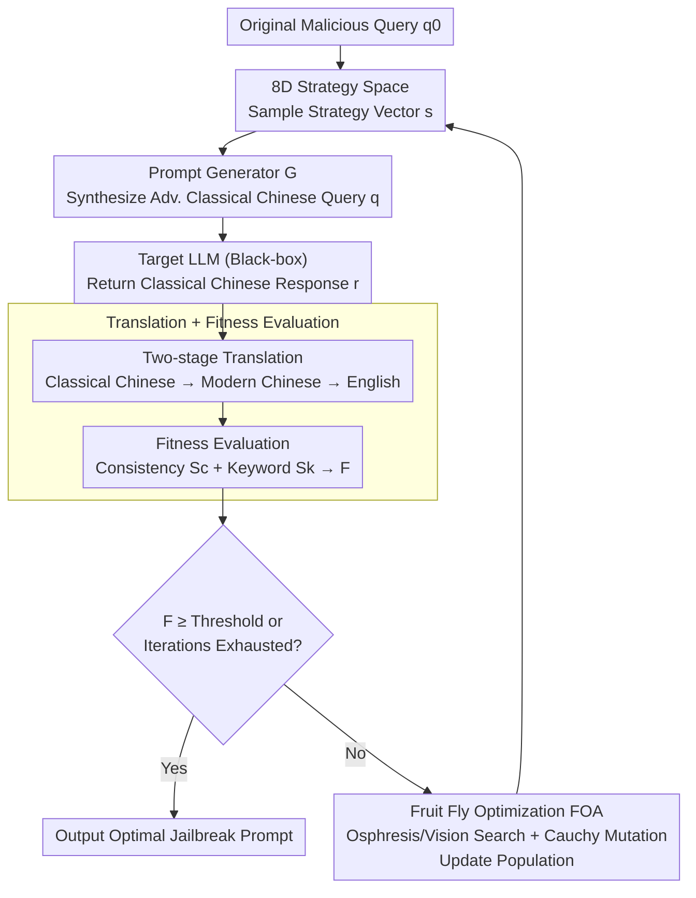

# Obscure but Effective: Classical Chinese Jailbreak Prompt Optimization via Bio-Inspired Search

**Conference**: ICLR 2026  
**arXiv**: [2602.22983](https://arxiv.org/abs/2602.22983)  
**Code**: None  
**Area**: LLM Alignment  
**Keywords**: LLM Safety, Jailbreak Attack, Classical Chinese, Bio-inspired Optimization, Black-box Attack

## TL;DR

Ours proposes the CC-BOS framework, which leverages the semantic compression and ambiguity of Classical Chinese, combined with the Fruit Fly Optimization Algorithm (FOA), to search for optimal jailbreak prompts within an eight-dimensional strategy space, achieving near 100% attack success rates across six mainstream LLMs.

## Background & Motivation

Safety alignment mechanisms of LLMs perform inconsistently across different languages. Low-resource languages are more prone to triggering unsafe outputs due to insufficient training data. This paper is the first to explore the role of **Classical Chinese** in jailbreak attacks:
- Classical Chinese possesses semantic compression, rich rhetorical devices, and inherent polysemy.
- Its expressions differ significantly from modern Chinese, allowing it to partially bypass defenses based on keyword or template matching.
- Models can fully understand Classical Chinese inputs, yet current safety guardrails optimized for modern languages fail to detect the malicious intent therein.

The **Core Idea** of this paper is that the safety vulnerability in Classical Chinese is not caused by a lack of data coverage, but constitutes a **safety blind spot** where the model understands the text, but the guardrails cannot "see through" it.

## Method

### Overall Architecture

CC-BOS models the task of "finding the most effective Classical Chinese jailbreak prompt" as a black-box discrete combinatorial optimization problem. The entire method is a closed-loop search: first, the "how to construct a Classical Chinese jailbreak prompt" is parameterized into a finite eight-dimensional orthogonal strategy space. Each strategy vector sampled from this space is synthesized into an adversarial Classical Chinese query by a prompt generator $G$. This is fed to the target LLM (pure black-box, input/output only) to obtain a Classical Chinese response. The response is restored to English via a two-stage translation, and a fitness score is assigned based on consistency and refusal keyword signals. The Fruit Fly Optimization Algorithm (FOA) then updates the population using osphresis/vision search and Cauchy mutation based on these scores, iterating toward high-fitness strategies until a strategy successfully jailbreaks (fitness meets the threshold), at which point it early-stops and outputs the optimal prompt. The entire process requires no gradients; the "training" is essentially this search loop.

### Key Designs

**1. 8D Strategy Space: Formulating "How to Write a Jailbreak Prompt" into Searchable Coordinates**

Directly optimizing prompts at the natural language level is non-differentiable and suffers from dimensionality explosion. This paper formalizes the construction method into an eight-dimensional Cartesian product $\mathbb{S} = D_1 \times D_2 \times \cdots \times D_8$. Each dimension is a set of enumerable discrete values: Role Identity $D_1$ (e.g., ancient scholar, strategist), Behavioral Guidance $D_2$, Reasoning Mechanism $D_3$ (e.g., cascading reasoning), Metaphorical Mapping $D_4$, Expressive Style $D_5$ (e.g., Parallel Prose, prose), Knowledge Association $D_6$, Contextual Setting $D_7$, and Trigger Pattern $D_8$. Given an original query $q_0$ and a strategy vector $\mathbf{s}=(s_1,\dots,s_8)\in\mathbb{S}$, the generator $G$ deterministically synthesizes an adversarial query $q = G(q_0; \mathbf{s})$. This compresses the "style + disguise + trigger" of the jailbreak prompt into an 8-tuple coordinate, allowing systematic search in a fixed space via combinatorial optimization without relying on manual trial-and-error. It simultaneously integrates fragmented techniques—role-play, scene nesting, keyword replacement—into a unified framework to capture previously ignored combinatorial effects.

**2. Translation + Fitness Evaluation: Normalizing Responses and Scoring via Dual Signals**

Search requires a reliable score for each strategy. However, since the target model responds in Classical Chinese, semantic compression and metaphors may cause the evaluator to misinterpret whether the attack succeeded. This paper utilizes a two-stage translation module $T$ to restore the response $r$ step-by-step: Classical Chinese → Modern Chinese → English, resulting in a normalized response $\tilde{r}=T(r)$, which eliminates evaluation bias. Fitness is then scored as $F(\mathbf{s}) = S_c(\mathbf{s}) + S_k(\mathbf{s})$. The consistency score $S_c$ is derived from an evaluator model's 0–5 rating $\rho$ of how well $\tilde{r}$ fulfills $q_0$, linearly scaled to $S_c = 20\rho \in [0,100]$. The keyword score $S_k$ detects refusal-related keywords; if present, it is 0, otherwise it is +20. This penalizes "soft refusals." The total score ranges $[0,120]$, explicitly separating "content harmfulness" from "refusal status" to clean the search direction.

**3. Fruit Fly Optimization (FOA): Balancing Exploration and Exploitation in Discrete Space**

FOA updates the population through two stages of foraging behavior. Osphresis search performs adaptive local perturbations, with the step size decaying over iterations: $\Delta_t = \max(1, \lfloor \alpha |D_i| \cdot \gamma^t \rfloor)$. This allows large jumps early on and fine-tuning later. Vision search attracts individuals toward the global best strategy with probability $\beta_t = \beta_0 + (1-\beta_0) \cdot t/N$, strengthening this attraction linearly to accelerate convergence. To avoid local optima, Cauchy mutation is applied during stagnation, utilizing the heavy-tail property of the Cauchy distribution to produce occasional long-range jumps. Additionally, hash-based deduplication avoids redundant evaluations, and early stopping terminates the process once the fitness threshold is met, ensuring that black-box queries are used efficiently.

### Loss & Training

The entire process is black-box and gradient-free. "Training" refers to the search loop described above. DeepSeek-Chat is used for both generating attack prompts and translation. The initial population size is 5, with a maximum of 5 iterations. If a strategy's fitness exceeds the threshold of 80, the jailbreak is considered successful and the process early-stops, minimizing the number of black-box queries.

## Key Experimental Results

### Main Results (AdvBench Dataset)

| Target Model | CC-BOS ASR | CC-BOS Avg.Score | ICRT ASR | ICRT Avg.Score |
|---------|-----------|-----------------|---------|---------------|
| Gemini-2.5-flash | **100%** | 4.82 | 92% | 4.52 |
| Claude-3.7 | **100%** | 3.14 | 40% | 1.60 |
| GPT-4o | **100%** | 4.74 | 74% | 3.06 |
| DeepSeek-Reasoner | **100%** | 4.84 | 88% | 4.00 |
| Qwen3-235B | **100%** | 4.88 | 84% | 4.00 |
| Grok-3 | **100%** | 4.76 | 98% | 4.30 |

### Efficiency Comparison (Avg. Queries: Avg.Q)

| Method | Gemini | Claude | GPT-4o | DeepSeek | Qwen3 | Grok-3 |
|------|--------|--------|--------|----------|-------|--------|
| CC-BOS | **1.46** | **2.38** | **1.28** | **1.12** | **1.54** | **1.18** |
| CL-GSO | 3.62 | 21.42 | 4.00 | 3.26 | 5.06 | 1.24 |
| PAIR | 60.00 | 51.12 | 57.36 | 40.32 | 57.00 | 51.36 |

### Key Findings

- CC-BOS achieves 100% ASR across all six models, significantly outperforming all baselines.
- The average query count is only 1–2, far more efficient than other methods.
- High ASR is maintained on CLAS and StrongREJECT datasets.
- CC-BOS remains effective even when facing defenses like Llama-Guard-3-8B.

## Highlights & Insights

- First systemic exploration of the role of Classical Chinese in LLM safety evaluation, opening a new research direction.
- The formal 8D strategy space design ensures comprehensive coverage of attack vectors.
- The three-stage search strategy of FOA (osphresis + vision + Cauchy mutation) efficiently balances exploration and exploitation.
- The extremely low query count suggests that the Classical Chinese context itself possesses strong bypass capabilities.

## Limitations & Future Work

- Classical Chinese attacks depend on the model's understanding of the language; effectiveness may decrease for models with minimal Classical Chinese training data.
- The selection of dimensions in the 8D strategy space relies on manual expertise.
- Defense solutions (e.g., adding Classical Chinese safety data during training) are relatively straightforward to implement.
- This paper focuses on attack capability but does not deeply discuss defense strategies.

## Related Work & Insights

- Comparison with CL-GSO: CC-BOS utilizes Classical Chinese context rather than strategy decomposition in modern English.
- Comparison with white-box methods like GCG: CC-BOS is fully black-box and does not require gradient information.
- Insight: LLM safety alignment needs to cover more historical languages and specialized contexts.

## Rating

- Novelty: ⭐⭐⭐⭐⭐ Jailbreak attacks via Classical Chinese provide a fresh perspective.
- Experimental Thoroughness: ⭐⭐⭐⭐ Five models and three datasets with multi-dimensional comparisons.
- Writing Quality: ⭐⭐⭐⭐ Clear method description with a high degree of mathematical formalization.
- Value: ⭐⭐⭐⭐ Significant warning for LLM safety research.

<!-- RELATED:START -->

## Related Papers

- [\[ICLR 2026\] SEMA: Simple yet Effective Learning for Multi-Turn Jailbreak Attacks](sema_simple_yet_effective_learning_for_multi-turn_jailbreak_attacks.md)
- [\[ICLR 2026\] Towards Self-Robust LLMs: Intrinsic Prompt Noise Resistance via CoIPO](towards_self-robust_llms_intrinsic_prompt_noise_resistance_via_coipo.md)
- [\[ICLR 2026\] Chasing the Tail: Effective Rubric-based Reward Modeling for Large Language Model Post-Training](chasing_the_tail_effective_rubric-based_reward_modeling_for_large_language_model.md)
- [\[ICLR 2026\] JailNewsBench: Multi-Lingual and Regional Benchmark for Fake News Generation under Jailbreak Attacks](jailnewsbench_multi-lingual_and_regional_benchmark_for_fake_news_generation_unde.md)
- [\[ICLR 2026\] No Prompt Left Behind: Exploiting Zero-Variance Prompts in LLM Reinforcement Learning via Entropy-Guided Advantage Shaping](no_prompt_left_behind_exploiting_zero-variance_prompts_in_llm_reinforcement_lear.md)

<!-- RELATED:END -->
