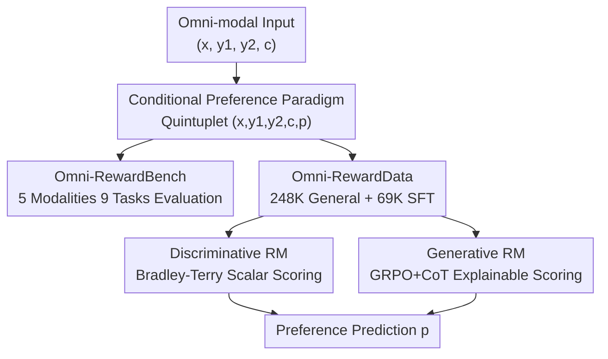

# Omni-Reward: Towards Generalist Omni-Modal Reward Modeling with Free-Form Preferences

**Conference**: ICLR 2026  
**OpenReview**: [https://openreview.net/forum?id=9C4gVbPqSy](https://openreview.net/forum?id=9C4gVbPqSy)  
**Code**: https://github.com/HongbangYuan/OmniReward  
**Area**: Alignment RLHF / Multi-modal VLM / Reward Modeling  
**Keywords**: Reward Model, Omni-modal, Free-form Preference, RLHF, Bradley-Terry

## TL;DR
This paper proposes Omni-Reward, which extends reward modeling from "text/image only with fixed binary preferences" to "covering text/image/video/audio/3D with dynamic scoring based on free-form text preferences." It introduces a unified benchmark (Omni-RewardBench, 5 modalities, 9 tasks), a large-scale preference dataset (Omni-RewardData, 248K general + 69K instruction-tuned pairs), and two reward models (Discriminative BT version + Generative R1 version). Omni-Reward achieves a 20% gain over its base model on its own benchmark and reaches or exceeds SOTA on public leaderboards like VL-RewardBench.

## Background & Motivation

**Background**: RLHF is the mainstream approach for aligning model behavior with human preferences, with the Reward Model (RM) serving as its core—learning a "proxy for human preferences" to score candidate responses and guide reinforcement learning. With the rise of any-to-any omni-modal models like GPT-4o, Gemini, and Qwen2.5-Omni, AI must now understand and generate content across text, image, video, audio, and 3D modalities.

**Limitations of Prior Work**: Existing RMs suffer from two structural flaws. First is **Modality Imbalance**: most RMs focus only on text and images, providing almost no support for video, audio, or 3D, making alignment in these modalities impossible. Second is **Preference Rigidity**: current preference data is annotated based on high-level consensus values like "helpfulness and harmlessness." Once trained, RMs lock an implicit, fixed preference view into their parameters, failing to capture the diversity of personalized preferences.

**Key Challenge**: Human preferences are naturally not divisible into neat binary categories. For the same question, a researcher might want a rigorous definition with formulas, while a general reader might prefer an intuitive analogy; their preferences for the same pair of answers would be opposite. Fixed binary RMs cannot express this in scenarios where the "evaluation criteria itself changes."

**Goal**: To build a true "generalist omni-modal RM" that covers rewards for both understanding and generation across rare modalities (video, audio, 3D) and dynamically adjusts scoring based on free-form text preferences or multi-dimensional criteria provided by the user.

**Key Insight**: The authors simultaneously address evaluation, data, and models, explicitly feeding the "free-form preference" $c$ as an input condition to the RM. This transforms evaluation criteria from being "locked in weights" to being "specifiable at runtime."

**Core Idea**: Upgrade samples from binary $(x, y_1, y_2, p)$ to conditional $(x, y_1, y_2, c, p)$. Given a prompt $x$, two candidates $y_1/y_2$, and a free-form preference/criterion $c$, the RM predicts the preferred answer $p$ under that criterion, enabling a single model to support any modality and any preference.

## Method

### Overall Architecture
Omni-Reward is a tripartite system: Evaluation, Data, and Model. On the evaluation side, Omni-RewardBench is constructed: prompts are collected from 9 cross-modal tasks, responses are generated by multiple models, and three annotators write free-form criteria and label preferences (including "ties"), resulting in 3,725 high-quality human-labeled pairs. On the data side, Omni-RewardData is built: one part aggregates existing preference datasets for "general preferences" (248K pairs), and the other uses GPT-4o to synthesize instruction-tuning data with free-form preference descriptions for "scoring by criteria" (69K pairs). On the model side, two RMs are trained: the discriminative Omni-RewardModel-BT (outputting scalar scores using Bradley-Terry) and the generative Omni-RewardModel-R1 (generating a Chain-of-Thought critic before predicted preference, trained via GRPO). All samples are represented as quintuplets $(x, y_1, y_2, c, p)$, where $c$ is injected as a system message.

### Key Designs

**1. Conditional Free-form Preference Paradigm: Moving Criteria from Weights to Input**

To address "Preference Rigidity," this paper no longer requires the RM to infer a fixed preference. Instead, it explicitly treats the evaluation criterion $c$ as input. Each sample is $(x, y_1, y_2, c, p)$, where $x$ is the prompt, $y_1/y_2$ are candidates, $c$ is a free-form text criterion (e.g., "scientific level with formal definitions" vs. "intuitive analogies for non-technical readers"), and $p$ is the preferred answer under $c$. Two difficulty levels are provided: "w/o Ties" where $p \in \{y_1, y_2\}$ forces a choice, and "w/ Ties" where $p \in \{y_1, y_2, \text{tie}\}$ allows parity. This allows the same pair of answers to have opposite labels under different $c$, forcing the RM to "understand the criteria" rather than memorize a single preference.

**2. Omni-RewardBench: The First Free-form Preference Benchmark for 5 Modalities**

To expose modality imbalance, the authors constructed the first omni-modal RM benchmark with free-form preferences, covering 9 tasks across text, image, video, audio, and 3D (Understanding: T2T, TI2T, TV2T, TA2T; Generation/Editing: T2I, T2V, T2A, T23D, TI2I). The process involves "Prompt collection → Multi-model generation → Criterion writing → Triple independent annotation," with strict quality control: 23% of samples with invalid criteria and 15% with conflicting preferences were discarded. Rare modalities like audio and 3D are accessed via MLLMs using unified methods—e.g., 3D objects are rendered into multi-view images for visual MLLMs. This benchmark quantifies for the first time how poorly RMs perform on audio/3D (with the strongest models hitting only ~30% accuracy on T2A).

**3. Omni-RewardData: Dual-source Data for General Preferences and Controlled Scoring**

To make the RM both understand general values and follow specific criteria, two data streams are used. The **General Preference** part aggregates 248K pairs from high-quality sources like Skywork-Reward (T2T 50K), RLAIF-V/OmniAlign-V (TI2T 133K), HPDv2/EvalMuse (T2I), and VideoDPO/VisionReward (T2V) to learn broad consensus. The **Instruction-tuning** part synthesizes 69K pairs specifically for "scoring by $c$": $(x, y_1, y_2)$ are sampled from existing sets, GPT-4o generates a free-form preference $c$ supporting either $y_1$ or $y_2$, and the consistency of $p$ is cross-validated by GPT-4o-mini, Qwen2.5-VL-7B, and Gemma-3-12B. Ablations show this instruction-tuning data is crucial for enabling the model to dynamically adjust scores based on free-form preferences.

**4. Discriminative BT and Generative R1 Models: Performance vs. Explainability**

Two complementary RMs are provided. The **Discriminative Omni-RewardModel-BT** uses MiniCPM-o-2.6 as a backbone, freezing vision/audio encoders and training only the language decoder and value head using the Bradley-Terry objective:

$$\mathcal{L}_{BT} = -\log \frac{\exp(r_{BT}(c, x, y_c))}{\exp(r_{BT}(c, x, y_c)) + \exp(r_{BT}(c, x, y_r))}$$

Where $y_c$ is the chosen and $y_r$ is the rejected answer, with $c$ injected as a system message. For interpretability, the **Generative Omni-RewardModel-R1** uses Qwen2.5-VL-7B. Given $(c, x, y_1, y_2)$, it generates a CoT explanation $e$ before prediction $p'$, trained via GRPO (reward = consistency with ground truth $p$). It is **trained from scratch using only 3% of the data (10K samples)** without distillation from larger models.

### Loss & Training
The discriminative RM uses the Bradley-Terry loss shown above, updating only the LM decoder and value head. The generative RM uses GRPO, where the reward signal is based on the match between predicted and ground-truth preferences ($reward = 1$ if $p' = p$).

## Key Experimental Results

### Main Results
On Omni-RewardBench (w/ Tie setting, Overall accuracy, %), existing RMs perform poorly, while the BT version ranks first among open-source models:

| Model | Type | Overall (w/ Ties) |
|------|------|------|
| **Omni-RewardModel-BT** | **Ours (BT)** | **65.36** |
| Claude-3.5-Sonnet | Closed-source SOTA | 66.54 |
| Gemma-3-27B-it | Open-source SOTA | 65.12 |
| GPT-4o | Closed-source | 64.62 |
| UnifiedReward1.5 | Specialized RM | 59.69 |
| **Omni-RewardModel-R1** | **Ours (Generative)** | **60.18** |
| MiniCPM-o-2.6 | BT Backbone | 46.67 |

> The BT version shows a +18.7 gain (approx. 20%) over its backbone MiniCPM-o-2.6 and reaches 73.68% under the "w/o Ties" setting. R1 outperforms all specialized RMs using only 10K samples. Modality imbalance is stark: performance on T2A, T23D, and TI2I is generally the lowest.

On the public VL-RewardBench (Overall Acc, %), the BT version achieves SOTA:

| Model | Overall Acc | Macro Acc |
|------|------|------|
| **Omni-RewardModel-BT** | **76.3** | 66.8 |
| Skywork-VL-Reward | 73.1 | 69.0 |
| IXC-2.5-Reward | 65.8 | 70.0 |
| GPT-4o | 65.8 | 62.4 |

### Ablation Study
Ablation of training data components on Omni-RewardBench (w/ Tie, Overall %):

| Config | Overall | Description |
|------|---------|------|
| MiniCPM-o-2.6 | 46.67 | Pre-trained backbone |
| w/ T2T | 57.13 | Text preference only |
| w/ TI2T | 58.84 | Text-image understanding added |
| w/ T2I & T2V | 57.50 | Image/Video generation added |
| **w/ Full** | **65.36** | All data |
| w/ Preference-Only | 58.67 | No SFT, general preference only |

### Key Findings
- **Instruction-tuning data is key to mitigating preference rigidity**: Removing it (Preference-Only) leads to a drop from 65.36 to 58.67, proving that the ability to score based on free-form criteria is acquired through synthetic instruction data rather than general preference consensus.
- **Strong correlation and generalization across tasks**: Understanding tasks (T2T/TI2T/TV2T) show high correlation (0.8+), indicating transferability. The BT version achieved SOTA even on TA2T and T2A which were not in its training set.
- **Modality imbalance is an objective reality**: All models show significant weakness in rare modalities like T2A and T23D; even the strongest models barely exceed 30% on T2A.

## Highlights & Insights
- **"Outsourcing" the evaluation criteria is the most clever move**: Using the $(x, y_1, y_2, c, p)$ quintuplet allows the model to handle contradictory preferences. This conditional paradigm is applicable to any scoring task requiring personalization or multi-dimensionality.
- **"Reducing" 3D to multi-view images** for a visual MLLM is a practical trick to integrate rare modalities into a unified RM without building modality-specific encoders from scratch.
- **Generative R1 trained from scratch with only 3% data** suggests that "CoT + GRPO" is highly sample-efficient for reward modeling, making it accessible for teams with limited compute.
- **The benchmark itself is a major contribution**: It quantifies exactly how lacking current RMs are in modalities like audio/3D for the first time.

## Limitations & Future Work
- **R1 performance still lags behind BT** (60.18 vs 65.36): Explainability currently comes at the cost of some accuracy.
- **3D evaluation relies on multi-view rendering approximations** rather than true 3D representations, which might miss geometric or topological nuances.
- **Instruction-tuning data is synthesized by GPT-4o**, meaning the distribution of $c$ might carry synthetic biases compared to real user expressions.
- **The ceiling for "w/ Ties" remains low** (approx. 66 peak), indicating that identifying "ties" in a realistic setting remains an open challenge.

## Related Work & Insights
- **vs. Text/Image RMs (Skywork-Reward, HPSv2, PickScore)**: These cover limited modalities and fixed preferences. Omni-Reward expands to 5 modalities and runtime-specifiable criteria, offering broader generalization.
- **vs. Multi-modal Specialized RMs (IXC-2.5-Reward, UnifiedReward)**: While specialized RMs are strong in their specific domains, they lack cross-modal/cross-criteria transfer. Omni-Reward achieves better cross-task generalization through unified data and paradigms.
- **vs. R1-based Generative RMs**: This work adopts the "CoT + GRPO" approach but innovates by making the free-form preference $c$ a condition and validating sample efficiency in an omni-modal RM context.

## Rating
- Novelty: ⭐⭐⭐⭐⭐ First omni-modal + free-form preference RM benchmark/dataset/model suite.
- Experimental Thoroughness: ⭐⭐⭐⭐⭐ Eval includes 30+ baselines and 5 modal/9 task coverage.
- Writing Quality: ⭐⭐⭐⭐ Clear structure and well-defined contributions.
- Value: ⭐⭐⭐⭐⭐ Directly addresses the gap in omni-modal alignment; fully open-sourced.

<!-- RELATED:START -->

## Related Papers

- [\[ICLR 2026\] Robust Reward Modeling via Causal Rubrics](robust_reward_modeling_via_causal_rubrics.md)
- [\[ICLR 2026\] Beyond Binary Preferences: A Principled Framework for Reward Modeling with Ordinal Feedback](beyond_binary_preferences_a_principled_framework_for_reward_modeling_with_ordina.md)
- [\[ICLR 2026\] Learning Ordinal Probabilistic Reward from Preferences (OPRM)](learning_ordinal_probabilistic_reward_from_preferences.md)
- [\[ICLR 2026\] RewardBench 2: Advancing Reward Model Evaluation](rewardbench_2_advancing_reward_model_evaluation.md)
- [\[ICLR 2026\] Reward Model Routing in Alignment](reward_model_routing_in_alignment.md)

<!-- RELATED:END -->
