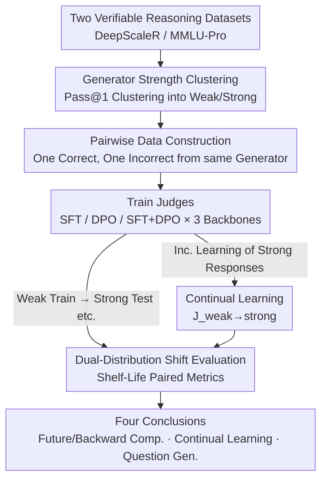

# On the Shelf Life of Fine-Tuned LLM-Judges: Future-Proofing, Backward-Compatibility, and Question Generalization

**Conference**: ICLR 2026  
**OpenReview**: [https://openreview.net/forum?id=fVTqNpny5r](https://openreview.net/forum?id=fVTqNpny5r)  
**Code**: https://github.com/iamjanvijay/judge-training-analysis  
**Area**: Alignment RLHF / LLM-as-judge Evaluation  
**Keywords**: LLM Judge, Distribution Shift, Future-proofing, Backward-compatibility, Continual Learning

## TL;DR
This paper formalizes the problem of "how long a fine-tuned LLM judge remains effective" as a **dual-distribution (question distribution $\times$ response distribution) shift** problem. Through systematic experiments on two reasoning datasets, three training recipes, and three backbones, it finds that judges struggle with "future-proofing" (significant performance drop on responses from stronger new models) but achieve "backward-compatibility" relatively easily (minimal drop on weaker legacy responses). Continual learning achieves a more balanced adaptation between old and new distributions, whereas all judges generalize poorly to new questions unseen during training.

## Background & Motivation

**Background**: LLM-as-judge has become a central component in the LLM development lifecycle—serving as reward models during training and as verifiers during inference (test-time scaling). Early approaches directly used zero-shot prompts with strong models as judges, but these judges have been repeatedly proven to harbor systematic biases such as stylistic preferences, length bias, and positional bias. Consequently, recent trends have shifted toward **fine-tuning specialized judges**: using smaller models trained on judge-specific data, which offers better performance and robustness against common biases.

**Limitations of Prior Work**: Existing evaluations only measure judge accuracy on **fixed datasets**, completely ignoring a critical reality in production deployment—**generators are constantly evolving**. A judge trained today using responses from the Gemma-2 or Qwen-2 generation will be used to evaluate Gemma-3 or Qwen-2.5 next year. Furthermore, it remains unclear whether replacing an old judge with a new one in an established evaluation pipeline maintains accuracy for historical responses. These "shelf-life" issues have not been systematically studied.

**Key Challenge**: The input to a judge consists of two sources that drift over time—**the source models of the responses are becoming stronger**, and **the questions being evaluated are becoming newer**. However, current training and evaluation paradigms treat judges as static, assuming identical training and test distributions. Once the generator generation shifts, a train-test distribution shift occurs, the impact of which has not been quantified.

**Goal**: To decompose the "shelf life" of a judge into four quantifiable practical questions: future-proofing, backward-compatibility, the efficacy of continual learning in balancing both, and generalization capability to new questions.

**Key Insight**: The authors propose a key observation: judge inputs can be **decoupled** into two independent drift sources—the "question distribution $\mathcal{Q}$" and the "response distribution $\mathcal{R}$". By separating them, one can isolate and quantify the respective impacts of "generator improvement" and "question updates" on judge performance.

**Core Idea**: Redefine automatic evaluation using a **dual-distribution formalization** $\mathcal{X} = \mathcal{Q} \times \mathcal{R} \times \mathcal{R}$. Simulate the model development timeline using clusters of weak and strong generators, and design a set of paired metrics to measure the "shelf life" of judges under various distribution shifts.

## Method

This paper is essentially a **measurement framework + systematic empirical study** rather than a proposal for a new judge training algorithm. Its "method" involves formalizing automatic evaluation as a dual-distribution problem, constructing a controlled experiment by splitting training/test distributions into weak/strong and seen/unseen combinations, and using specifically designed metrics to quantify performance degradation under each shift.

### Overall Architecture

The pipeline is as follows: Obtain two reasoning datasets with verifiable ground truths (Olympiad-level math from DeepScaleR and multi-domain knowledge questions from MMLU-Pro) $\rightarrow$ Measure the strength of a set of instruction models via Pass@1 and cluster them into "weak" and "strong" groups $\rightarrow$ Sample responses from each generator and pair them into "one correct, one incorrect" samples to build weak and strong datasets $\rightarrow$ Train judges using three recipes (SFT, DPO, SFT+DPO) on three backbones $\rightarrow$ Evaluate across different combinations of the dual-distribution to derive conclusions on future-proofing, backward-compatibility, continual learning, and question generalization.

### Key Designs

**1. Dual-Distribution Formalization: Decoupling Generator Evolution and Question Updates**

The limitation of existing evaluations is treating judge input as a single distribution, making it impossible to distinguish whether "performance dropped because responses became harder to judge or because the questions are novel." The authors propose defining the input distribution of a pairwise judge as:
$$\mathcal{X} = \mathcal{Q} \times \mathcal{R} \times \mathcal{R}$$
where $\mathcal{Q}$ is the question distribution (characterized by domain, difficulty, etc.) and $\mathcal{R}$ is the response distribution (characterized by style, model-specific habits, etc.), with both responses in a pair originating from the **same** generator. Training and test sets have respective $\mathcal{X}^{\text{train}} = \mathcal{Q}^{\text{train}} \times \mathcal{R}^{\text{train}} \times \mathcal{R}^{\text{train}}$ and $\mathcal{X}^{\text{test}}$. This allows isolating the impact of "generator evolution" by only varying $\mathcal{R}$ (weak $\to$ strong) and "question updates" by only varying $\mathcal{Q}$ (seen $\to$ unseen).

**2. Generator Strength Clustering and Pairwise Data Construction**

To simulate models becoming stronger over generations, an objective standard is required. The authors sample 20 responses per question for each generator and measure strength via **Pass@1**. On DeepScaleR, models naturally form two **distinct** clusters: a weak cluster (0.17–0.26: Gemma-2-9B, Qwen-2-7B, Llama-3.1-8B, Ministral-8B) and a strong cluster (0.42–0.50: Gemma-3-12B, Qwen-2.5-7B, Qwen-2.5-32B, etc.). The gap between 0.26–0.42 ensures robust clustering, which aligns with model release timelines. Pairwise samples are constructed by picking one correct and one incorrect response ($A^\star$) from the same generator.

**3. Four Groups of Shelf-Life Paired Metrics**

These metrics quantify performance drops under each shift. All metrics are based on consistent accuracy (accuracy accounting for response order bias). Let $\text{Acc}_e(J_t)$ be the accuracy of judge $J$ trained on distribution $t$ and evaluated on distribution $e$.

*Future-proofing* uses: $\text{FutureProof} = \text{Acc}_{\text{strong}}(J_{\text{weak}}) - \text{Acc}_{\text{weak}}(J_{\text{weak}})$, representing performance change when a weak-trained judge moves to a strong test set; $\text{RefreshAdvantage} = \text{Acc}_{\text{strong}}(J_{\text{strong}}) - \text{Acc}_{\text{strong}}(J_{\text{weak}})$, representing the gain from retraining on strong responses.

*Backward-compatibility* uses: $\text{BackCompatibility} = \text{Acc}_{\text{weak}}(J_{\text{strong}}) - \text{Acc}_{\text{weak}}(J_{\text{weak}})$, measuring whether a strong-trained judge can serve as a drop-in replacement for old responses; $\text{CompatibilityShift} = \text{Acc}_{\text{weak}}(J_{\text{strong}}) - \text{Acc}_{\text{strong}}(J_{\text{strong}})$, measuring the cost of evaluating weak responses relative to the judge's "home" distribution.

*Question generalization* fixes the response source: $\text{QuestionGen}_{\text{weak}} = \text{Acc}_{\text{weak,unseen}}(J_{\text{weak}}) - \text{Acc}_{\text{weak,seen}}(J_{\text{weak}})$.

**4. Continual Learning $J_{\text{weak}\to\text{strong}}$**

While retraining from scratch on strong responses is optimal for strong evaluation, it may lose compatibility with legacy responses. The authors simulate continual learning by performing DPO fine-tuning on $J_{\text{weak}}$ using strong generator responses to obtain $J_{\text{weak}\to\text{strong}}$. Evaluation replaces $J_{\text{weak}}$ in future-proofing and $J_{\text{strong}}$ in backward-compatibility with this model to see if it balances both.

### Loss & Training

Judges are trained using three recipes: SFT (positive samples $(x, y^+)$), DPO (pairwise $(x, y^+, y^-)$), and an SFT+DPO combination. Since SFT/DPO require Chain-of-Thought (CoT) explanations $C$ as supervision, the study follows distillation conventions: sampling judge outputs from a teacher model and partitioning them into positive $y^+$ and negative $y^-$ based on the ground-truth verdict $V^\star$. The backbones are Llama-3.1-8B, Ministral-8B, and Mistral-24B.

## Key Experimental Results

### Main Results (DeepScaleR, consistent accuracy difference in percentage points)

| Dimension | Metric | Typical Performance | Conclusion |
|-----------|--------|---------------------|------------|
| Future-proofing | FutureProof | All negative (−0.9 to −6.2) | Weak-trained judges **universally degrade** on strong responses |
| Future-proofing | RefreshAdvantage | All positive (up to +7.6) | Retraining on strong responses **consistently improves** performance |
| Backward-compatibility | BackCompatibility | Near zero, DPO even positive (e.g., +2.1) | Strong-trained judges **hardly lose performance** on weak responses |
| Backward-compatibility | CompatibilityShift | Mostly negative (e.g., −3.4) | A cost exists, but it is smaller than the future-proofing penalty |
| Question Gen. | QuestionGen | Almost entirely negative (down to −10.2) | **Failure to generalize** to unseen questions |

### Continual Learning & Training Recipes

| Configuration | Key Phenomenon | Description |
|---------------|----------------|-------------|
| $J_{\text{weak}\to\text{strong}}$ vs $J_{\text{weak}}$ | FutureProof increased across all models | Continual learning adapts better to the weak $\to$ strong shift |
| $J_{\text{weak}\to\text{strong}}$ vs $J_{\text{strong}}$ | RefreshAdvantage approaches 0 | The advantage of retraining from scratch is mostly eliminated |
| DPO vs SFT (RefreshAdvantage) | DPO shows largest gain (+7.6 vs SFT) | DPO benefits most from retraining, especially with larger models |
| SFT vs DPO (QuestionGen) | SFT shows smallest drop | SFT recipe is more stable regarding question generalization |

### Key Findings
- **Future-proofing is a major challenge**: No FutureProof value was positive across any model/recipe combination. There was no simple pattern across model families; the authors recommend evaluating per model.
- **Backward-compatibility is "free"**: Indicators show that retraining on new responses allows the judge to act as a drop-in replacement for the old one without losing legacy performance. "Retraining is always worth it."
- **Strong-to-weak is easier than weak-to-strong**: CompatibilityShift drops are generally smaller than FutureProof drops, confirming that evaluating stronger models is the more difficult directional shift.
- **Scale counter-intuition**: The largest model (Mistral-24B) showed the largest drops in CompatibilityShift and QuestionGen, suggesting larger judges do not naturally generalize better.

## Highlights & Insights
- **Dual-distribution decoupling is a foundational contribution**: By breaking down whether a judge "expires" into controlled experiments, performance drops can be attributed to specific sources. This methodology is applicable to any reward modeling scenario where drift occurs.
- **Retraining is the optimal strategy**: Poor future-proofing combined with high backward-compatibility means maintainers should **proactively retrain** with the latest generator responses.
- **Recipe tradeoffs**: DPO is most effective for adapting to new models (RefreshAdvantage), while SFT is more stable for question generalization, suggesting choice of recipe depends on the target objective.

## Limitations & Future Work
- **Limited Continual Learning verification**: $J_{\text{weak}\to\text{strong}}$ was only tested on one configuration (DeepScaleR + DPO) due to compute constraints.
- **Verifiable tasks only**: The study focuses on tasks with objective ground truths (Math/Knowledge) where pairs are created automatically. The transferability to open-ended generation or stylistic preference is unknown.
- **Coarse clustering**: Using a binary Pass@1 split (weak/strong) might overlook more nuanced behaviors in continuous generator drift.
- **Diagnostic rather than prescriptive**: The paper quantifies the severity of the problem and shows that continual learning helps, but it does not provide a definitive method for training inherently "future-proof" judges.

## Related Work & Insights
- **vs. Weak-to-Strong Generalization (Burns et al. 2023)**: While they study using weak supervisors to improve strong models, this work focuses on the judge side—how judges trained on weak responses handle strong ones.
- **vs. Existing LLM-as-judge Bias Analysis**: Prior work mostly analyzed biases (positional, length) in **static** judges. This work shifts to a **dynamic** setting where generator evolution introduces response distribution shifts.

## Rating
- Novelty: ⭐⭐⭐⭐⭐ Formalizing "judge shelf life" via dual-distribution shifts is a previously unstudied perspective.
- Experimental Thoroughness: ⭐⭐⭐⭐ Solid grid across datasets, recipes, and backbones, though CL coverage is limited to verifiable tasks.
- Writing Quality: ⭐⭐⭐⭐⭐ Clear definitions and metrics with logical progression.
- Value: ⭐⭐⭐⭐⭐ Direct practical guidance for deploying judges and reward models in evolving production environments.

<!-- RELATED:START -->

## Related Papers

- [\[ICLR 2026\] Enhancing Trustworthiness of Fine-Tuned LLMs via Regularized Subset Selection](enhancing_trustworthiness_of_fine-tuned_llms_via_regularized_subset_selection.md)
- [\[ACL 2026\] Compatibility-Aware Dynamic Fine-Tuning for Large Language Models](../../ACL2026/llm_alignment/compatibility-aware_dynamic_fine-tuning_for_large_language_models.md)
- [\[ICLR 2026\] Weak-to-Strong Generalization with Failure Trajectories](weak-to-strong_generalization_with_failure_trajectories.md)
- [\[ICLR 2026\] TS²: Sparsemax+ for Training and Softmax for Testing for Accurate and Diverse LLM Fine-tuning](ts2_training_with_sparsemax_testing_with_softmax_for_accurate_and_diverse_llm_fi.md)
- [\[ICLR 2026\] Fluent Alignment with Disfluent Judges: Post-training for Lower-Resource Languages](fluent_alignment_with_disfluent_judges_post-training_for_lower-resource_language.md)

<!-- RELATED:END -->
