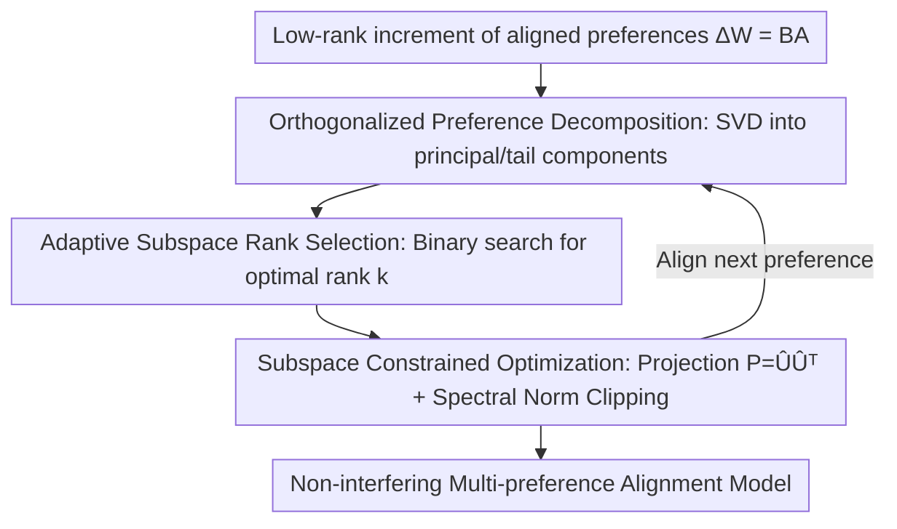

# OrthAlign: Orthogonal Subspace Decomposition for Non-Interfering Multi-Objective Alignment

**Conference**: ICLR 2026  
**OpenReview**: [https://openreview.net/forum?id=rO2uXIP019](https://openreview.net/forum?id=rO2uXIP019)  
**Code**: https://github.com/233liang/OrthAlign  
**Area**: Alignment RLHF  
**Keywords**: Multi-preference alignment, orthogonal subspace, SVD, spectral norm constraint, parameter-level conflict

## TL;DR
Addressing the multi-objective alignment dilemma where "improving one preference harms another," OrthAlign constrains parameter updates of different preferences into mutually orthogonal subspaces. This ensures that optimization directions for each preference are mathematically non-interfering, achieving simultaneous alignment of helpful/harmless/truthful without sacrificing individual performance. It achieves a maximum single-item improvement of 50.89% and an average overall reward increase of 13.96%.

## Background & Motivation

**Background**: Large language model alignment typically requires satisfying the "3H" criteria—Helpful, Harmless, and Truthful. Mainstream approaches include SFT/RLHF/DPO, which are essentially optimized for a single objective. Multi-Preference Alignment (MPA) attempts to coordinate multiple conflicting objectives. Existing routes roughly fall into three categories: constraint-based training (adding penalty terms to the loss, e.g., MODPO, SPO), data synthesis/mixing (filtering training data by rules or conflict scores, e.g., RSDPO), and model merging (fusing multiple specialized models by weight, e.g., Reward-Soup, Knots, TSV).

**Limitations of Prior Work**: Constraint-based methods still pack gradients for multiple preferences into the same set of parameters during "simultaneous optimization," failing to eliminate internal parameter conflicts and causing unstable matrix updates. Data mixing methods rely heavily on manual annotation and expert scoring, introducing systematic biases that are difficult to remove. Model merging is a "compromise"—to achieve multi-preference, individual performance inevitably declines, falling into the "specialization vs. generalization" dilemma.

**Key Challenge**: The authors point out that the root of the conflict lies at the **parameter level** rather than the model behavior level. Gradients corresponding to different preferences are not orthogonal but interfere with each other, quantified by non-zero inner products: $\frac{|\langle \nabla_\theta L(D_i), \nabla_\theta L(D_j)\rangle|}{\|\nabla_\theta L(D_i)\|_2 \cdot \|\nabla_\theta L(D_j)\|_2} \neq 0$. As long as this inner product is non-zero, optimizing one preference will create perturbations in the critical directions of another. This is the ultimate source of the trade-off. Existing MPA methods focus on "trajectory guidance in the global parameter space" without directly addressing this parameter-level antagonism.

**Goal**: To eliminate conflicts directly at the parameter level—ensuring that parameter updates for "aligning new preferences" fall into a subspace orthogonal to the "critical directions of old preferences," forcing the inner product to be strictly zero while guaranteeing the stability of multi-step cumulative updates.

**Key Insight**: Singular Value Decomposition (SVD) can decompose a weight increment matrix into principal singular components and tail components. The feature space corresponding to the tail singular values is approximately orthogonal to the current preference information. If updates for new preferences are projected into this orthogonal complement space, the new preference can be learned without modifying the critical directions of the old preference.

**Core Idea**: Replace "constrained loss/model merging" with "orthogonal subspace decomposition + spectral norm clipping" to resolve multi-preference conflicts. Each preference update is confined to non-interfering orthogonal subspaces, supported by a theoretical proof ensuring that cumulative updates follow linear Lipschitz growth rather than exponential explosion.

## Method

### Overall Architecture
OrthAlign addresses **sequential preference alignment**: starting from an SFT base, the model aligns the first preference (e.g., safety), followed by the second and third. The key requirement is that subsequent alignments must not destroy previously aligned preferences. The overall pipeline consists of three clear steps: first, perform SVD on the low-rank increments of aligned preferences to separate "critical directions" from "near-zero-influence directions"; next, use an adaptive rule to further filter an optimal rank $k$ subspace from the zero-influence directions; finally, project the gradient updates of the new preference into this subspace, combined with spectral norm clipping for stability. Section 3.2 provides theoretical guarantees: when orthogonal subspace constraints + spectral norm constraints are met, the layer-wise Lipschitz upper bound grows linearly, ensuring stable cumulative updates.

### Key Designs

**1. Orthogonalized Preference Decoding: Separating Critical and Modifiable Directions of Old Preferences**

To ensure new preferences do not harm old ones, the model must identify which directions in the parameter space the old preferences occupy. The authors perform SVD on the low-rank adaptation matrix $\Delta W = BA$ ($B \in \mathbb{R}^{m\times r}$, $A \in \mathbb{R}^{r\times n}$) obtained from the first alignment, decomposing its transformation of a safe input $X_{safe}$ into two parts:

$$\Delta W X_{safe} = \underbrace{\sum_{i=1}^{r}\sigma_i(v_i^T X_{safe})\cdot u_i}_{\text{Preference Critical Directions}} + \underbrace{\sum_{j=r+1}^{\max(m,n)}\sigma_j(v_j^T X_{safe})\cdot u_j}_{\text{Near-zero Influence on Current Preference}}$$

The first $r$ singular components capture the most important directions for safety alignment, while the subsequent tail components have minimal impact on aligned behavior. This provides a geometric basis for "learning new preferences in tail directions"—as long as new preferences are updated in the space spanned by the second part, they will not touch the critical directions of the old preference.

**2. Adaptive Subspace Rank Selection: Tail Directions Might Be "Activated"**

A critical trap is that tail directions, though negligible now, may become non-trivial once their corresponding singular values are updated for a new preference, re-interfering with the old preference. The authors formalize this: $\sum_{j=r+1}\sigma_j(v_j^\top X_{safe})u_j \approx 0$, but after update $\sum_{j=r+1}\hat\sigma_j(\hat v_j^\top X_{safe})u_j \neq 0$. Thus, one cannot simply use the entire $\max(m,n)-r$ dimensional null space but must filter a subspace where the impact is strictly suppressed.

An adaptive rank selection rule (Algorithm 1, binary search) is designed: the last $k$ singular values are recalibrated to the mean of the first $r$ singular values $\hat\sigma_i = \frac{1}{r}\sum_{j=1}^{r}\sigma_j$ to **simulate potential updates**, reconstructing $\Delta W^{new}=U\hat\Sigma(k)V^\top$. Then, the maximum feasible $k$ is selected such that the reward shift is within tolerance $\gamma$:

$$k = \max_k \left\{ \left| R(U\hat\Sigma(k)V^\top; X_{safe}) - R(W; X_{safe}) \right| \le \gamma,\ \hat\sigma_i = \tfrac{1}{r}\sum_{j=1}^{r}\sigma_j \right\}$$

Where $R(W; X_{safe})$ is the expected positive reward. A smaller $\gamma$ results in a more conservative subspace. This step essentially leaves as much space as possible for the new preference while preserving the rewards of the old preference.

**3. Subspace Constrained Optimization: Projecting Gradients into Selected Subspaces**

After selecting the optimal rank $k$, the corresponding left singular vectors form matrix $\hat U$ to construct the projection matrix $P = \hat U\hat U^T$. Gradient updates for the new preference are then projected:

$$\Delta W_{new} = P\cdot \nabla_W L_{new}(W)$$

Each parameter increment is strictly limited to the subspace orthogonal to the old preference. This mathematically eliminates conflicts. Since this process is repeated for each new preference, it naturally fits sequential alignment.

**4. Stability Guarantees Under Spectral Norm Constraints: Linear Growth**

Orthogonality alone is insufficient—if update magnitudes are not constrained in sequential alignment, the spectral norm (the global Lipschitz upper bound) might accumulate super-linearly or even explode along the same principal direction. The authors add spectral norm clipping $\|\Delta W\|_2 \le \tau$ to each increment and provide two theoretical conclusions. First (Theorem 2a, Linear Lipschitz Accumulation): $\|W+\sum_{t=1}^{T}\Delta W_t\|_2 \le \|W\|_2 + \sum_{t=1}^{T}\|\Delta W_t\|_2 \le \|W\|_2 + T\tau$. Step-wise spectral control suppresses the growth of layer Lipschitz constants to at most linear. Second (Theorem 2b, Orthogonal Allocation): If updates fall into pairwise orthogonal subspaces $U_t \perp U_s$, then $\|\sum_{t=1}^{T}\Delta\theta_t\|^2 = \sum_{t=1}^{T}\|\Delta\theta_t\|^2$, meaning increments are "additively preserved" rather than canceling or overwriting each other.

### Loss & Training
The base alignment objective follows multi-source DPO: $L_{\pi_\theta} = -\sum_{i=1}^{k}\lambda_i \mathbb{E}_{(x,y_w,y_l)\sim D_i}\big[\log\sigma(\beta\log\frac{\pi_\theta(y_w|x)}{\pi_0(y_w|x)} - \beta\log\frac{\pi_\theta(y_l|x)}{\pi_0(y_l|x)})\big]$, where $\pi_0$ is the reference strategy and $\beta$ controls KL constraint strength. OrthAlign does not modify the objective but projects parameter increments (Eq. 10) and applies spectral norm clipping during backpropagation, making it a plug-and-play module for methods like DPO, MODPO, and SPO. Sequential alignment follows the order: harmless → helpful → truthful.

## Key Experimental Results

Experiments were conducted on LLaMA-3-SFT and Mistral-7B-SFT using 4 benchmarks (UltraFeedback, HelpSteer2, SafeRLHF-10k). Evaluation metrics include Helpful win rate (Alpaca-Eval), Harmless Rate (AdvBench), and TruthfulQA MC2.

### Main Results
Average scores for three-objective sequential alignment (harmless → helpful → truthful) on LLaMA-3:

| Method | UltraFeedback Avg↑ | HelpSteer2 Avg↑ |
|------|------|------|
| SFT | 50.04 | 50.04 |
| DPO Baseline | 63.55 | 63.78 |
| MODPO (ACL'24) | 64.55 | 67.49 |
| SPO (AAAI'25) | 64.57 | 65.46 |
| RSDPO (NAACL'24) | 72.12 | 69.92 |
| Knots (ICLR'25) | 69.27 | 70.13 |
| TSV-M (CVPR) | 66.30 | 67.51 |
| **OrthAlign (Ours)** | **75.15** | **75.95** |

OrthAlign also leads on the Mistral base (UltraFeedback 72.93 / HelpSteer2 73.51). The paper reports an average improvement of 20.23% for two-objective alignment and 13.96% for three-objective alignment compared to the strongest baseline. Single preference performance gains range from 34.61% to 50.89%.

### Ablation Study

Plug-and-play enhancement (Table 2, two-objective alignment on HelpSteer2 + SafeRLHF):

| Configuration | Harmless Rate↑ | Helpful Win Rate↑ | Note |
|------|------|------|------|
| DPO | 71.24 | 60.24 | Original |
| DPO-Orth | 93.84 (↑22.60) | 65.71 (↑5.47) | With OrthAlign |
| MODPO | 48.46 | 67.95 | Original |
| MODPO-Orth | 79.32 (↑30.86) | 71.02 (↑2.32) | Significant harmless gain |
| SPO | 71.15 | 61.24 | Original |
| SPO-Orth | 92.88 (↑21.73) | 67.28 (↑0.04) | Significant harmless gain |

Average performance improved by 14.96% across baselines, proving the value of OrthAlign as a general enhancement module.

Adaptive Rank Selection (RQ4): Harmlessness is highly sensitive to rank (dropping from 93.80% at rank 12 to 81.34% at rank 26), with the optimal safety interval at rank 16-18. The helpful win rate remains relatively stable between 63.59% and 65.79% from rank 14 onwards. This indicates that adaptive rank selection is crucial for "preserving safety without sacrificing utility."

### Key Findings
- **Spectral Norm + Orthogonality are both essential**: Orthogonality prevents interference, while the spectral norm ensures stability (linear Lipschitz). Together they suppress preference drift in sequential alignment.
- **Latent representation distribution barely drifts (RQ2)**: t-SNE visualization shows that latent state point clouds for the first and third alignments almost overlap, whereas baselines show significant cluster splitting.
- **Rank Trade-off**: Larger ranks favor utility, while smaller ranks favor safety. The adaptive rule selects the largest feasible rank that preserves previous preference rewards.

## Highlights & Insights
- Repoistions multi-objective alignment conflicts from the **optimization/data level** to the **parameter geometry level**, providing a quantitative criterion via gradient inner products.
- The observation that "tail singular directions are seemingly harmless but can be reactivated" is insightful, leading directly to the adaptive rank selection mechanism.
- The two Lipschitz theorems provide a clear explanation for sequential alignment stability: orthogonality ensures additive preservation, while spectral clipping ensures linear growth.
- As a plug-and-play module, OrthAlign can be applied to DPO/MODPO/SPO to yield significant gains, especially in harmlessness.

## Limitations & Future Work
- The method relies on SVD and projection matrix construction for each step, which may introduce computational overhead for very large models or many preferences.
- Evaluations focused on three preferences (3H); it remains to be seen whether the orthogonal complement space is sufficient for 4+ preferences.
- Adaptive rank selection depends on reward model $R$ reliability; noise in the reward could affect rank quality.
- Sensitivity to the sequence order of preferences (e.g., safety first vs. utility first) warrants further verification.

## Related Work & Insights
- **vs. Constrained Methods (MODPO / SPO)**: These use loss constraints to mitigate conflict but optimize in the same parameter space. OrthAlign eliminates interference via orthogonal projection at the geometric level.
- **vs. Model Merging (Reward-Soup / Knots / TSV-M)**: Merging specialized models is a compromise that degrades individual performance. OrthAlign aligns within a single model sequentially.
- **vs. Data Synthesis (RSDPO)**: These rely on multi-dimensional scoring and expert knowledge. OrthAlign modifies update directions without the burden of complex data curation.

## Rating
- Novelty: ⭐⭐⭐⭐⭐ Resolves conflicts via parameter orthogonality and SVD subspace projection with a solid theoretical foundation.
- Experimental Thoroughness: ⭐⭐⭐⭐ Extensive benchmarks and baselines, including latent visualization, though overhead analysis for many-objective scenarios is limited.
- Writing Quality: ⭐⭐⭐⭐ Motivation, methodology, and theory are tightly integrated.
- Value: ⭐⭐⭐⭐⭐ A plug-and-play, non-degrading solution for multi-preference alignment with strong transfer value to continual/multi-task alignment.

<!-- RELATED:START -->

## Related Papers

- [\[ICML 2026\] Simultaneous Multi-objective Alignment Across Verifiable and Non-verifiable Rewards](../../ICML2026/llm_alignment/simultaneous_multi-objective_alignment_across_verifiable_and_non-verifiable_rewa.md)
- [\[ICLR 2026\] Multi-objective Large Language Model Alignment with Hierarchical Experts](multi-objective_large_language_model_alignment_with_hierarchical_experts.md)
- [\[ICLR 2026\] Bradley–Terry and Multi-Objective Reward Modeling Are Complementary](bradley-terry_and_multi-objective_reward_modeling_are_complementary.md)
- [\[ICLR 2026\] IDEAL: Data Equilibrium Adaptation for Multi-Capability Language Model Alignment](ideal_data_equilibrium_adaptation_for_multi-capability_language_model_alignment.md)
- [\[ICML 2026\] GIST: Targeted Data Selection for Instruction Tuning with Gradient Subspace Projection](../../ICML2026/llm_alignment/gist_targeted_data_selection_for_instruction_tuning_via_coupled_optimization_geo.md)

<!-- RELATED:END -->
