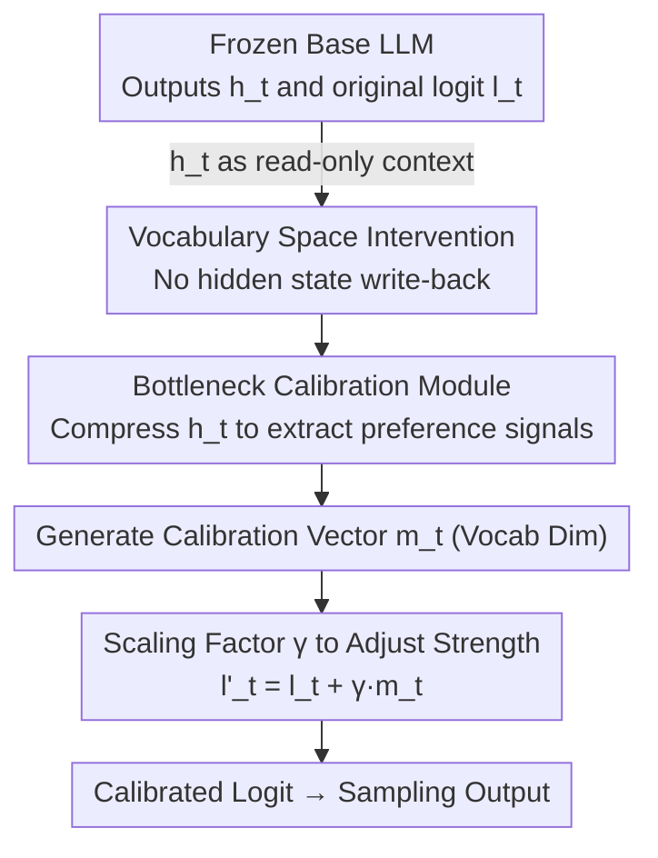

# PALC: Preference Alignment via Logit Calibration

**Conference**: ICLR 2026  
**OpenReview**: [https://openreview.net/forum?id=0cmuYj3WeG](https://openreview.net/forum?id=0cmuYj3WeG)  
**Code**: https://github.com/s4n9hyun/PALC  
**Area**: Alignment RLHF / LLM Efficiency / Test-time Alignment  
**Keywords**: Test-time alignment, logit calibration, representation engineering, bottleneck structure, preference optimization

## TL;DR
PALC attaches a minimal "calibration module" to a frozen LLM, moving the alignment intervention from the entangled latent space to the naturally decoupled vocabulary logit space. By treating hidden states as read-only context to generate position-dependent logit offsets, it achieves adjustable preference alignment at test time with only 0.002%–0.13% extra parameters and almost no inference overhead.

## Background & Motivation

**Background**: The mainstream approach to aligning LLMs with human preferences is training-time alignment (RLHF, DPO, and their parameter-efficient variants). While effective, these methods "bake" behaviors into the weights, resulting in static models that require retraining to change alignment targets. Consequently, the field is shifting toward test-time alignment—dynamically adjusting the behavior of a frozen model during inference without modifying its parameters.

**Limitations of Prior Work**: Test-time alignment is currently split into two paths with significant drawbacks. The first is **Guided Decoding** (ARGS, GenARM, CARDS, etc.), which uses an external reward model to score output probabilities and guide token selection; however, running two large models simultaneously doubles inference costs and spikes latency (GenARM latency 3.17×, ARGS 4.40×). The second is **Representation Engineering (RepE)**, which directly modifies the internal activations of a frozen LLM. However, internal representations exist in **superposition**—where the model uses overlapping, non-orthogonal directions to encode more features than neurons. Modifying activations to control one concept often inadvertently disrupts unrelated concepts, leading to a collapse in coherence.

**Key Challenge**: Existing methods are forced to choose between **computational efficiency** and **adaptive control**. Guided decoding is inefficient; RepE faces a "control dilemma"—static methods (CAA, BiPO) use fixed steering vectors that lack context-sensitivity, while dynamic methods (RE-Control) require gradient optimization at each generation step, squandering the computational savings intended for test time. The root cause is that **intervening in the latent space under superposition is inherently dangerous and inefficient.**

**Goal**: To achieve dynamic, position-dependent, and strength-adjustable alignment without sacrificing computational efficiency.

**Key Insight**: The authors observe that the latent space is problematic due to entanglement, whereas the **logit/vocabulary space** of the final layer is naturally decoupled—each dimension uniquely corresponds to a token. The impact of changing one logit on other token probabilities is predictable: $\partial p_i/\partial l_j = p_i(\delta_{ij}-p_j)$. By performing interventions only at this layer and treating hidden states as "read-only context," the superposition problem can be bypassed.

**Core Idea**: Use a lightweight bottleneck module to read hidden states and learn position-dependent calibration vectors in the **vocabulary logit space**. These vectors are directly added to the original logits to accomplish preference alignment, neither touching internal representations nor requiring an external reward model.

## Method

### Overall Architecture
PALC attaches a lightweight **calibration module** $\theta$ to a **frozen** base LLM ($\pi_\text{base}$). At each decoding step $t$, the base model outputs the final layer hidden state $h_t \in \mathbb{R}^H$ and original logits $l_t \in \mathbb{R}^V$ as usual. The calibration module **reads** $h_t$ as context and passes it through a bottleneck structure to compress it into a position-dependent calibration vector $m_t \in \mathbb{R}^V$. This vector is then added back to the original logits with a fixed scaling factor $\gamma$, resulting in calibrated logits $l'_t = l_t + \gamma \cdot m_t$, followed by standard softmax sampling. The critical point is that while $m_t$ depends computationally on $h_t$, it **does not write back to or modify** $h_t$—徹底 decoupling the "information source" (entangled hidden states) from the "intervention point" (decoupled logits).

### Key Designs

**1. Vocabulary Space Intervention: Moving Intervention from Entangled Latent Space to Decoupled Logits**

This directly addresses the superposition problem in RepE. Since multiple semantic concepts share overlapping directions in the hidden state, modifying one direction causes cascading pollution of other capabilities. Conversely, each dimension in the vocabulary logit space corresponds uniquely to a token, serving as a "naturally decoupled interface." PALC treats the hidden state $h_t$ strictly as **read-only context**, with intervention occurring only on the final logits. This approach is interpretable and controllable: adding a small amount $\Delta l_i$ to a logit $l_i$ changes the token probability by approximately $p_i(1-p_i)\Delta l_i$, with other tokens redistributed proportionally (Jacobian $\partial p_i/\partial l_j = p_i(\delta_{ij}-p_j)$), avoiding unpredictable cascading failures. This is the fundamental difference from methods like CAA/RE-Control that "directly modify activations"—the latter either lack adaptability due to static vectors or pay an efficiency price for online gradient optimization.

**2. Bottleneck Calibration Module: Forcing "Essential Preference Signals" via Low-Rank Subspace**

The calibration vector is generated through a bottleneck structure ($B \ll H$), formulated as dimensionality reduction followed by expansion: $z_t = \mathrm{ReLU}(W_\text{down} h_t)$, $m_t = W_\text{up} z_t$, where $W_\text{down}\in\mathbb{R}^{B\times H}$ compresses the hidden state to bottleneck dimension $B$, and $W_\text{up}\in\mathbb{R}^{V\times B}$ projects it to the vocabulary dimension. This "narrow-then-wide" constraint forces the module to extract only the most essential preference signals, reducing parameter counts to the extreme. For a 7B model ($H{=}4096,V{=}32000$) with $B{=}256$, it requires only ~9.2M parameters (0.13% of the base) with a per-token complexity of $O(B(H+V))$, less than 7% of the final layer projection. The authors theoretically demonstrate that the bottleneck induces a strong low-rank structure: the calibration space $\mathcal{C}=\{W_\text{up}W_\text{down}h\}$ has a dimension at most $B$, and preference optimization further reduces the effective dimension $d_\text{eff}=(\sum_i\sigma_i)^2/\sum_i\sigma_i^2 \ll B$ (where $\sigma_i$ are singular values of $W_\text{up}W_\text{down}$). This proves that human preferences are concentrated on a surprisingly low-dimensional manifold.

**3. Fixed Scaling Factor γ: Adjusting Alignment Strength at Inference with a Scalar**

Instead of learning complex token-level adaptive weights, PALC uses a fixed scalar $\gamma$ to scale the entire calibration vector: $l'_t = l_t + \gamma\cdot m_t$. Its value lies in **deployment flexibility**—the same trained module can slide between "preserving base capability" and "strengthening preference" by simply changing $\gamma$ at inference. $\gamma<1$ results in lighter intervention resembling the original model, while $\gamma>1$ yields stronger alignment. No retraining is required. Experiments show stable performance in the $\gamma\in[0.5,3.0]$ range (55.3%–58.2% win rate), with $\gamma{=}1.0$ being optimal, while $\gamma{=}10.0$ leads to a collapse to 38.7% due to excessive KL divergence from the base distribution.

### Loss & Training
PALC uses a **simplified preference loss** to train the calibration module end-to-end, directly increasing the log-likelihood margin between the "preferred response" and the "rejected response":

$$\mathcal{L} = -\mathbb{E}_{(x,y_w,y_l)\sim D}\left[\log\sigma\left(\log\pi_\text{PALC}(y_w|x) - \log\pi_\text{PALC}(y_l|x)\right)\right]$$

Log-probabilities are calculated only on the **response part** following the prompt to prevent the module from memorizing the prompt itself. It differs from standard DPO in three key ways: first, the **KL term relative to a reference model is removed**, as the frozen base already constrains the optimization space; second, **no reference model needs to be maintained or forwarded during training**, saving about half the VRAM and doubling throughput; third, the gradient flow naturally encourages **sparse calibration**, where the model learns to adjust logits only when strictly necessary. Configuration: 1 epoch on the HH-RLHF training set, batch size 4, gradient accumulation 4, learning rate $1\times10^{-5}$, $B{=}256$, inference $\gamma{=}1.0$.

## Key Experimental Results

### Main Results
The base model is `argsearch/llama-7b-sft-float32`, trained and evaluated on `Dahoas/full-hh-rlhf` (90/10 split). Evaluation uses GPT-5 for pairwise comparisons across five dimensions (helpfulness, harmlessness, relevance, accuracy, insightfulness), reporting Win+½Tie. The table below shows PALC's pairwise win rates against various baselines:

| PALC vs. | Win (%) ↑ | Tie (%) | Lose (%) ↓ | Win+½Tie (%) ↑ |
|----------|-----------|---------|------------|-----------------|
| Base Model | 54.67 | 7.00 | 38.33 | **58.17** |
| DPO | 39.33 | 3.67 | 57.00 | 41.17 |
| CAA (Static steering) | 76.00 | 2.33 | 21.67 | **77.17** |
| RE-Control (Online opt.) | 57.67 | 8.00 | 34.33 | 61.67 |
| ARGS (External Reward) | 55.33 | 0.33 | 44.33 | 55.50 |
| BiPO | 45.33 | 7.33 | 47.33 | 49.00 |
| GenARM (7B Reward) | 43.67 | 1.33 | 55.00 | 44.33 |

PALC significantly outperforms static RepE (CAA, 77.17%) and online-optimized RE-Control (61.67%), and is nearly on par with activation-space BiPO (49.00%). It trails behind DPO (41.17%) and the dual-7B GenARM (44.33%)—which the authors position as an **intentional trade-off of performance for efficiency** rather than a total replacement.

Efficiency Comparison (H100, 128 tokens, average of 10):

| Method | Extra Component | Time (s) ↓ | Relative Latency ↓ |
|------|----------|-----------|-----------|
| Base Model | — | 1.79 | 1.00× |
| **PALC** | Calibration Module (9.2M) | 1.93 | **1.08×** |
| BiPO | steering vector | 2.19 | 1.22× |
| RE-Control | Value Model (33.6M) | 2.32 | 1.30× |
| CAA | steering vector | 2.51 | 1.40× |
| GenARM | Autoregressive Reward (7B) | 5.67 | 3.17× |
| ARGS | Trajectory Reward (7B) | 7.88 | 4.40× |

With only 9.2M parameters and 8% extra latency, PALC dominates efficiency compared to methods relying on external reward models or online optimization.

### Ablation Study

| Config | Win+½Tie (%) | GPT-5 Quality Score | Explanation |
|------|--------------|--------------|------|
| $B{=}16$ | 53.7 | 3.84 | Usable even with extreme compression (0.59M params) |
| $B{=}64$ | 54.7 | 3.96 | Enters performance plateau |
| **$B{=}256$** | **58.2** | **3.96** | Optimal bottleneck dimension |
| $B{=}1024$ | 56.5 | 3.91 | Stable but with diminishing returns |
| $B{=}4096$ | 18.3 | 2.15 | Over-parameterization → Catastrophic collapse |
| $\gamma{=}0.5$ | 55.3 | 3.96 | Light intervention |
| **$\gamma{=}1.0$** | **58.2** | **3.96** | Optimal, uses learned calibration directly |
| $\gamma{=}3.0$ | 56.0 | 3.95 | Still stable |
| $\gamma{=}10.0$ | 38.7 | 3.07 | Excessive KL deviation → Below baseline |

### Key Findings
- **Preferences reside on an ultra-low-dimensional manifold**: Performance peaks at $B{=}256$, and $B{=}16$ still achieves 53.7%. This empirically validates the low-rank hypothesis ($d_\text{eff}\ll B$), which is the root cause of PALC's extreme parameter efficiency.
- **Over-parameterization is catastrophic**: At $B{=}4096$, the win rate plunges to 18.3%. The lack of structural constraint in a large bottleneck causes overfitting to spurious patterns in the training data, leading to harmful calibration.
- **Robustness of $\gamma$**: Performance is stable in the $[0.5, 3.0]$ range, allowing tuning without retraining. However, $\gamma{=}10.0$ triggers a collapse due to KL divergence, aligning with theoretical predictions.

## Highlights & Insights
- **Shifting the intervention space, not scaling the model**: Moving the alignment from "entangled latent space" to "decoupled logit space" bypasses both superposition pollution and the overhead of dual-model reward architectures. This is the first work to systematically explore learned logit-space calibration.
- **Bottleneck as Regularization**: The low-rank bottleneck does more than save parameters; it serves as a structural constraint against overfitting.
- **Transferability**: The "read-only context + additive logit intervention" paradigm can be extended to any scenario requiring test-time control of a frozen model (e.g., safety guardrails, style control) without the risk of collapsing internal representations.

## Limitations & Future Work
- Experiments are limited to a single base model (Llama-7B-SFT), one dataset (HH-RLHF), and one evaluator (GPT-5). Generalization across model scales (e.g., 70B), tasks, and preference dimensions remains to be fully verified.
- There is a noticeable performance gap compared to DPO/GenARM; PALC is an efficiency-first alternative rather than a total SOTA.
- The optimal $\gamma$ may vary by task. Strategies for automatically selecting $\gamma$ or extending it to multi-dimensional preference weights are natural future directions.

## Related Work & Insights
- **vs. Guided Decoding (ARGS / GenARM)**: These rely on external reward model scoring, requiring dual-model parallelism and 3–4× latency. PALC generates calibration using internal representations, running self-consistently with only 1.08× latency.
- **vs. Static RepE (CAA / BiPO)**: These add fixed steering vectors in the hidden space, hindered by superposition and lack of context sensitivity. PALC's position-dependent calibration in logit space is significantly more effective than CAA (77.17% win rate).
- **vs. Dynamic RepE (RE-Control)**: It performs per-step gradient optimization with 1.30× latency. PALC shifts the "dynamicity" into a pre-trained module, requiring only a single forward pass during inference.
- **vs. DPO**: DPO is a training-time method that modifies base weights. PALC's loss is a simplified DPO loss without the KL term. PALC trades partial performance for a 99%+ reduction in computational overhead for resource-constrained deployment.

## Rating
- Novelty: ⭐⭐⭐⭐⭐ First to systematically target learned logit space for alignment.
- Experimental Thoroughness: ⭐⭐⭐⭐ Strong baselines and ablations, though generalization across models/tasks needs more data.
- Writing Quality: ⭐⭐⭐⭐⭐ Clear logical flow from motivation (superposition) to solution (decoupled space).
- Value: ⭐⭐⭐⭐ Provides an extremely lightweight test-time alignment solution with high transferability.

<!-- RELATED:START -->

## Related Papers

- [\[ICLR 2026\] Sharpness-Aware Minimization in Logit Space Efficiently Enhances Direct Preference Optimization](sharpness-aware_minimization_in_logit_space_efficiently_enhances_direct_preferen.md)
- [\[ICLR 2026\] Annotation-Efficient Honesty Alignment via Confidence Elicitation and Calibration](annotation-efficient_honesty_alignment_via_confidence_elicitation_and_calibratio.md)
- [\[ICLR 2026\] Keep the Best, Forget the Rest: Reliable Alignment with Order-Aware Preference Optimization](keep_the_best_forget_the_rest_reliable_alignment_with_order-aware_preference_opt.md)
- [\[ICLR 2026\] Robust Preference Alignment via Directional Neighborhood Consensus](robust_preference_alignment_via_directional_neighborhood_consensus.md)
- [\[ICLR 2026\] Towards Understanding Valuable Preference Data for Large Language Model Alignment](towards_understanding_valuable_preference_data_for_large_language_model_alignmen.md)

<!-- RELATED:END -->
