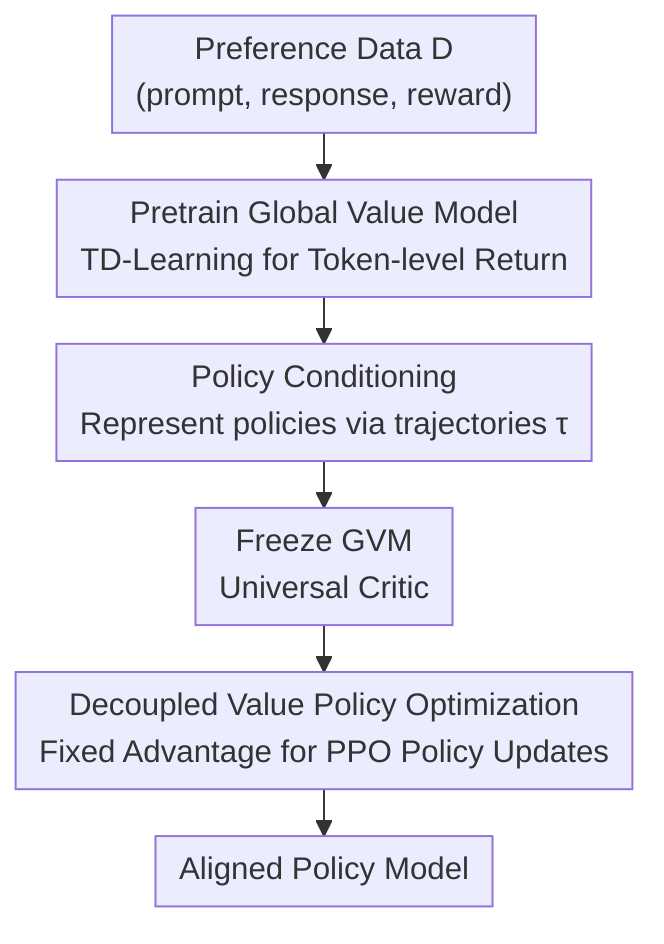

# Pretrain Value, Not Reward: Decoupled Value Policy Optimization

**Conference**: ICLR 2026  
**OpenReview**: [https://openreview.net/forum?id=qirGds1BmK](https://openreview.net/forum?id=qirGds1BmK)  
**Code**: https://github.com/microsoft/DKI_LLM/tree/main/dvpo  
**Area**: Alignment RLHF / LLM Efficiency  
**Keywords**: RLHF, Value Model, Critic Pretraining, PPO, Token-level Credit Assignment

## TL;DR
The authors argue that under fixed preference data, "training a reward model followed by online critic learning" is informationally equivalent to "directly pretraining a value model." Consequently, they propose DVPO: pretraining a Global Value Model (GVM) offline and freezing it as a universal critic to guide policy optimization. This eliminates online critic training, matches or exceeds mainstream RLHF methods on MT-Bench / Alpaca-Eval / Arena-Hard, while saving 30–40% VRAM and 30–45% training time.

## Background & Motivation
**Background**: RLHF is a core method for aligning LLMs with human preferences. Since language models lack interactive environments providing ground-truth rewards, the standard approach involves training a Reward Model (RM) from preference data and using it to supervise an online critic (PPO route), or indirectly estimating value through trajectory sampling (DPO, ReMax, GRPO routes).

**Limitations of Prior Work**: Both paths are expensive and unstable. In actor-critic methods like PPO, joint training leads to "critic drift"—the value function chases a constantly changing policy, resulting in a moving target. Furthermore, loading the policy, value, reward, and reference models simultaneously imposes immense VRAM and computational overhead. Sampling-based methods (ReMax / GRPO) discard token-level credit assignment, assigning a single scalar reward to an entire sentence, which leads to high variance and unstable training.

**Key Challenge**: The authors highlight an overlooked fact: **once preference data is collected, no new ground-truth reward signals are introduced during training**. Therefore, learning a value function online from a fixed RM introduces no new information. Deriving value from a pretrained RM is informationally equivalent to pretraining a value model on the same data. Online critic training is thus redundant.

**Key Insight**: The authors observe that rewards in open-ended tasks are largely "policy-invariant"—the return for an answer depends primarily on its correctness/preference rather than the specific stochasticity of a policy. This allows "amortizing" value estimation into a **Global Value Model (GVM)**: pretrained once on diverse trajectories and reused across policies as a frozen critic.

**Core Idea**: Replace "online joint critic training" with "offline pretraining of a frozen global value model," reconfiguring RLHF into "pure policy optimization" guided by a single pretrained value model.

## Method

### Overall Architecture
DVPO decouples RLHF into two stages. **Phase 1** uses offline trajectory data to train a policy-conditioned action-value function $Q_\phi(\tau, s, a)$ (the GVM), which predicts the return-to-go for taking action $a$ at state $s$ and continuing with the policy represented by trajectory $\tau$; this uses the same data as RM training without extra annotation. **Phase 2** freezes $Q_\phi$ as a fixed critic. Policy optimization is conducted using a standard PPO objective where the advantage function is derived directly from the frozen GVM. This decouples actor and critic learning dynamics, eliminating the "moving target" problem.

The task is modeled as an MDP: state $s_t=[x, y_{<t}]$ is the prompt plus the generated prefix, and action $a_t=y_t$ is the next token. Sentence-level rewards $r(x,y)$ are processed into token-level signals via a simplified TD approach—intermediate rewards are zeroed, and the sentence reward is applied at the final step, simplifying cumulative return from step $t$ to $G_t = \gamma^{T-t} r(x,y)$.

### Key Designs

**1. Value/Reward Equivalence: Theoretical Redundancy of Online Critics**

This is the theoretical foundation. In RLHF with fixed feedback, the standard pipeline trains $R_\phi$, then derives value—either by learning a critic online (PPO) or by normalizing $R_\phi$ scores across samples. The authors posit that these paths consume no new supervision beyond the original data $D$. Thus, "training RM + estimating value" is equivalent to "directly pretraining value model $Q_\psi$." Lemma 3.1 formalizes this: if $|R_\phi(s,a)-r(s,a)|\le\epsilon_R$, and the approximation errors for the reward-induced value $\tilde{Q}^R_\phi$ and pretrained GVM $Q_\psi$ are $\le\epsilon_Q$, then the difference between their induced policy gradients is bounded: $\|\nabla_\theta J_{\tilde{Q}^R_\phi}(\pi_\theta)-\nabla_\theta J_{Q_\psi}(\pi_\theta)\|\le\kappa(\epsilon_R,\epsilon_Q)$, where $\kappa\to0$ as $\epsilon_R,\epsilon_Q\to0$. The emphasis is that deriving value from a fixed RM adds no new information compared to direct pretraining. A convergence corollary shows that as long as policy updates are KL-clipped and GVM error is bounded, DVPO inherits PPO's monotonic improvement guarantees.

**2. Global Value Model (GVM): Learning Token-level Value via TD-Learning**

To address the lack of credit assignment in sampling methods, GVM learns a token-level action-value function. The training objective is a standard TD loss:

$$\mathcal{L}_{\text{GVM}}(\phi) = \mathbb{E}_{(\tau, s_t, a_t, r_t, s_{t+1}, a_{t+1})\in D}\left[\big(r_t + \gamma Q_\phi(\tau, s_{t+1}, a_{t+1}) - Q_\phi(\tau, s_t, a_t)\big)^2\right]$$

The TD target $G_t = r(s_t,a_t)+\gamma Q_\phi(\tau, s_{t+1}, a_{t+1})$ uses bootstrapping to reflect both immediate and future returns. This prefix-based TD learning allows GVM to assign different values to different parts of a response—assigning high values to critical reasoning tokens and lower values to misleading continuations. Compared to RMs, GVM training requires similar VRAM (same base plus one linear head) and a single backward pass per step.

**3. Trajectory Conditioning: Enabling Cross-Policy Generalization**

Traditional actor-critic requires the critic to adapt online to the evolving actor, causing critic drift. The authors seek a global $Q_\phi$ that generalizes across policies without relearning. Instead of explicit conditioning on policy parameters, they use trajectories $\tau$ sampled from the target policy (sequences of QA pairs) as context. These trajectories implicitly reveal policy characteristics (style, correctness, expertise), thereby determining which policy $\pi(\cdot|s)$ is being approximated. Formally, $Q_\phi(\tau,s,a)\approx\mathbb{E}\big[\sum_{t=0}^\infty\gamma^t r(s_t,a_t)\mid s_0=s,a_0=a,\tau\big]$. Analysis confirms the "global" nature of GVM: it is policy-agnostic and evaluates how each action contributes to the final outcome. This allows GVM to remain more accurate than PPO's A/C critic under distribution shift (e.g., new prompts in HH-RLHF).

**4. Decoupled Value Policy Optimization: Freezing the Critic to Eliminate the Moving Target**

Once GVM converges, its parameters are frozen to guide policy updates. The policy uses a clipped PPO objective $\mathcal{L}_{\text{PPO}}(\theta)=\mathbb{E}\big[\min(r_t(\theta)\hat{A}_t,\ \text{clip}(r_t(\theta),1-\epsilon,1+\epsilon)\hat{A}_t)\big]$, with importance ratio $r_t(\theta)=\pi_\theta(a_t|s_t)/\pi_{\theta_{\text{old}}}(a_t|s_t)$. The key difference is the advantage function: it uses the fixed value estimates $\hat{A}_t=\tilde{Q}_\phi(\tau,s_t,a_t)$ computed during GVM training, acting as a **static advantage**. Since feedback is fixed, this static $Q_\phi$ contains all necessary supervision; because the critic no longer changes with the policy, the actor-critic "moving target" problem is eliminated, leading to smoother training. DVPO introduces no stronger assumptions than standard PPO—it simply replaces an online critic with a pretrained frozen GVM.

## Key Experimental Results

### Main Results

Base setting (initialized from SFT, GVM trained on UltraFeedback, RL on 10K held-out prompts), MT-Bench score out of 10:

| Model | Method | MT-Bench | Arena-Hard | AlpacaEval2 |
|------|------|----------|-----------|-------------|
| Llama3.2-3B | SFT | 5.22 | 10.4 | 8.19 |
| Llama3.2-3B | PPO | 5.33 | 13.5 | 11.54 |
| Llama3.2-3B | GRPO | 5.46 | 13.4 | 10.86 |
| Llama3.2-3B | **DVPO** | **5.73** | **15.1** | **12.33** |
| Llama3-8B | PPO | 4.98 | 11.7 | 11.14 |
| Llama3-8B | **DVPO** | **5.01** | **11.8** | **11.33** |

Instruction setting (starting from aligned models, closer to real RLHF), DVPO gains are more significant:

| Model | Method | MT-Bench | Arena-Hard | AlpacaEval2 |
|------|------|----------|-----------|-------------|
| Mistral-7B | Instruction | 6.60 | 12.6 | 17.11 |
| Mistral-7B | DPO | 6.30 | 16.3 | 26.80 |
| Mistral-7B | GRPO | 6.31 | 21.8 | 27.19 |
| Mistral-7B | **DVPO** | **6.79** | **24.7** | **27.43** |
| Llama3-8B | PPO | 7.55 | 36.3 | 34.98 |
| Llama3-8B | **DVPO** | **7.72** | **39.2** | **42.59** |

Relative to Mistral-7B-Instruct, DVPO gained +12.1% on Arena-Hard and +10.32% LC win rate on Alpaca-Eval; it outperformed DPO by 8.4 points on Arena-Hard for Mistral.

### Ablation Study

GVM vs ScalarRM (same data, RewardBench subset) and GVM vs PPO online critic (A/C value model):

| Comparison | Configuration | Llama3-8B | Mistral-7B | Observation |
|------|------|-----------|-----------|------|
| RewardBench Chat-Hard | GVM | 67.5 | 61.4 | GVM stronger on hard samples |
| RewardBench Chat-Hard | ScalarRM | 58.5 | 52.4 | Sentence BT loss weak on hard cases |
| UltraFeedback Test Set | GVM | 68.1 | 64.5 | More accurate value estimation |
| UltraFeedback Test Set | A/C critic | 60.6 | 57.6 | Drift due to policy coupling |
| HH-RLHF (OOD) | GVM | 63.3 | 60.8 | Lead maintained under shift |
| HH-RLHF (OOD) | A/C critic | 57.5 | 53.8 | Poorer generalization |

Computational Overhead (Table 6): PPO VRAM is $2\times m_{\text{train}}$ (training policy and value), while DVPO/ReMax/GRPO are $1\times m_{\text{train}}$. However, GRPO requires multiple generations per prompt ($n\times c_{\text{gene}}$), whereas DVPO requires only $1\times c_{\text{gene}}$. Overall, DVPO achieves the best balance, saving 30–40% VRAM and 30–45% training time.

### Key Findings
- GVM and ScalarRM have comparable **overall averages** on RewardBench but different distributions: ScalarRM is better on Chat (easy) as BT loss captures global preferences, while GVM is stronger on Chat-Hard (difficult) as token-level TD generalizes better—suggesting fine-grained value is more critical for complex tasks.
- GVM significantly outperforms PPO's online critic, with advantages transferable across backbones. This is because A/C critics are tied to the current policy while GVM is policy-agnostic, learning from large-scale preference which state transitions increase/decrease returns.
- Fine-grained token feedback is the source of the performance edge: ReMax/GRPO assign equal weight to all tokens via a scalar, whereas DVPO provides distinct returns per token while maintaining PPO’s on-policy exploration.

## Highlights & Insights
- **The observation that "value learning is redundant under fixed feedback" is profound**: Standard RLHF frameworks assume RM then online critic; the authors demonstrate that if no new rewards are added, deriving value from a fixed RM is redundant. Theoretical motives align perfectly with engineering practice.
- **Substantiating "Global"**: GVM's policy-agnostic nature is not just a claim—it is achieved via implicit policy conditioning with sampled trajectories. OOD experiments (HH-RLHF) prove it is more robust than A/C critics.
- **Structural Efficiency**: Removing the online critic cuts PPO training VRAM from $2\times$ to $1\times$. Since GVM overhead is similar to RM training, the "RM budget" is essentially traded for a more effective value model.

## Limitations & Future Work
- DVPO assumes offline preference data provides sufficient coverage of relevant trajectories and that GVM can approximate token-level returns within a bounded error. However, data diversity is a requirement for reward learning itself, not specific to GVM.
- **Static critics fail in highly non-stationary scenarios**: Once frozen, the GVM does not update with the policy. The equivalence analysis only holds when no new reward signals are introduced during training. If new human/environment feedback is available, the static GVM remains stagnant. The proposed "semi-online" solution involves periodic GVM refreshes with new data.
- Personal observation: DVPO's absolute gain over PPO on Base/8B is relatively small (5.01 vs 4.98 on MT-Bench). The primary selling point is "equalizing performance with higher efficiency and stability." The substantial lead in the Instruction setting is more compelling. Additionally, the TD setup for sentence-level rewards (zero intermediate, end-of-sentence rewards) is coarse; token-level value depends heavily on GVM generalization rather than true intermediate supervision.

## Related Work & Insights
- **vs PPO**: PPO jointly trains actor and critic with RM feedback, requiring four models and suffering from critic drift; DVPO pretrains and freezes GVM, decoupling learning for half the VRAM and better stability.
- **vs DPO**: DPO bypasses reward and actor-critic but lags behind online RL due to its offline nature; DVPO retains on-policy exploration while removing the online critic, outperforming DPO on several benchmarks.
- **vs ReMax / GRPO (reward-only)**: These use sentence-level scalar rewards and lack token-level value estimation, suffering from high variance. DVPO provides token-level supervision, saving resources while outperforming them.
- **vs Value-guided Decoding / AC Value Pretraining**: The former incurs high inference costs during decoding; the latter (e.g., Yuan et al. 2025) retains the expensive actor-critic architecture. DVPO pretrains value and completely removes the online critic.

## Rating
- Novelty: ⭐⭐⭐⭐ The perspective on reward/value redundancy is clear; Lemma 3.1 elevates an engineering choice to a theoretical insight.
- Experimental Thoroughness: ⭐⭐⭐⭐ Dual settings (Base/Instruction), multiple backbones, and detailed analysis of RewardBench and distribution shifts. Absolute gains on Base models are minor.
- Writing Quality: ⭐⭐⭐⭐ Logical flow from motivation to method; theory and experiments are well-integrated.
- Value: ⭐⭐⭐⭐ Provides a practical roadmap for "efficient and stable RLHF" with open-source code.

<!-- RELATED:START -->

## Related Papers

- [\[ICLR 2026\] Reward Models Inherit Value Biases from Pretraining](reward_models_inherit_value_biases_from_pretraining.md)
- [\[ICLR 2026\] Group-Normalized Implicit Value Optimization for Language Models](group-normalized_implicit_value_optimization_for_language_models.md)
- [\[ICLR 2026\] EigenBench: A Comparative Behavioral Measure of Value Alignment](eigenbench_a_comparative_behavioral_measure_of_value_alignment.md)
- [\[ICML 2026\] Toward Stable Value Alignment: Introducing Independent Modules for Consistent Value Guidance](../../ICML2026/llm_alignment/toward_stable_value_alignment_introducing_independent_modules_for_consistent_val.md)
- [\[ICLR 2026\] Cognitive models can reveal interpretable value trade-offs in language models](cognitive_models_can_reveal_interpretable_value_trade-offs_in_language_models.md)

<!-- RELATED:END -->
