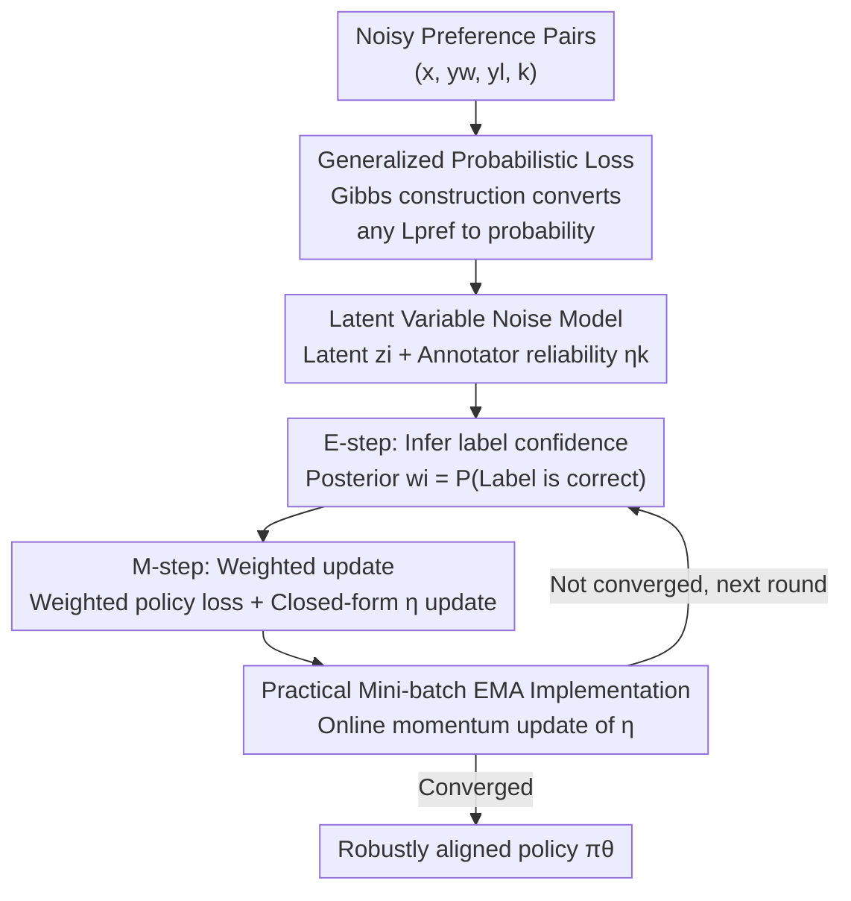

# RE-PO: Robust Enhanced Policy Optimization as a General Framework for LLM Alignment

**Conference**: ICLR 2026  
**OpenReview**: [https://openreview.net/forum?id=jDKpOvTCM8](https://openreview.net/forum?id=jDKpOvTCM8)  
**Code**: https://repo-alignment.github.io  
**Area**: Alignment RLHF  
**Keywords**: Preference Alignment, Label Noise, EM Algorithm, Annotator Reliability, DPO

## TL;DR
RE-PO treats the "correctness" of each preference label as a latent variable, utilizing the EM algorithm during training to update the policy while simultaneously inferring the confidence of each data point to perform adaptive downweighting of noisy preference data. It unifies a broad class of preference losses (DPO, IPO, SimPO, CPO, etc.) into the same probabilistic framework, enabling them to be "robustified," yielding improvements of up to 7.0 percentage points on AlpacaEval 2.

## Background & Motivation
**Background**: The mainstream paradigm for aligning LLMs with human preferences is RLHF, alongside direct alignment methods (DPO, IPO, SimPO, CPO, etc.) that reformulate alignment as a classification problem. These methods rely on an implicit assumption: the collected preference data is clean and every observed label is equally trustworthy.

**Limitations of Prior Work**: In reality, this assumption is almost always violated. Large-scale preference datasets are often aggregated from various crowdsourced annotators or teacher models, containing significant label noise due to distractions, misunderstandings, differences in expertise, or even adversarial/perfunctory labeling. Existing analyses suggest that 20% to 40% of preference pairs in modern alignment datasets may be noisy or contradictory. Classic learning-with-noise theory indicates that standard losses overfit these contaminated signals; Gao et al. further found that a 10 percentage point increase in label noise can lead to a drop of dozens of percentage points in downstream win rates.

**Key Challenge**: Direct alignment methods use **hard labels**, treating human feedback as a black-and-white, absolutely credible binary choice. A misclick is given the same weight as a deliberate judgment. Models cannot distinguish reliable feedback from noise, leading to significant degradation as error rates rise.

**Goal**: To enable accurate and stable preference model learning even when training data contains substantial noise, and to ensure this mechanism can be applied to various existing alignment losses rather than being a patch specific to DPO.

**Key Insight**: The authors draw inspiration from classic crowdsourcing methods for learning from unreliable annotators (Dawid–Skene model, Crowd-BT). Since labels may be incorrect, they should not be treated as ground truth. Instead, the "correctness of the label" is treated as a latent variable to be inferred while estimating annotator reliability.

**Core Idea**: Replace hard labels with soft confidence weights. The correctness of each observed preference is treated as a latent variable $z_i$. The posterior probability $w_i$ that "this label is correct" is calculated via EM during training and used as an adaptive weight to update the policy, ensuring highly reliable feedback contributes more while suspicious samples are suppressed.

## Method

### Overall Architecture
RE-PO addresses the issue of potentially incorrect preference labels by transforming standard preference optimization into an EM iteration. In each round, the reliability of each label is estimated (E-step), and these reliability scores serve as weights to update the policy and annotator reliability (M-step). This alternating process gradually downweights potentially contaminated labels and highlights reliable supervision.

To make this mechanism applicable beyond DPO, the authors first perform "generalization": using a Gibbs construction inspired by the Boltzmann distribution to convert any preference loss $L_{\text{pref}}$ into a noise-free preference probability $p(y_w \succ^* y_l \mid x, \theta)$. With this probability, the E-step can calculate posteriors and the M-step can calculate weighted likelihoods, allowing DPO, IPO, SimPO, and CPO to be integrated into the same EM workflow. Finally, for scalability, the update of reliability $\eta$ is implemented as an online update using EMA over mini-batches.

### Key Designs

**1. Latent Variable Noise Model: Explicitly modeling "label correctness" as a latent variable**

A fundamental flaw of DPO is the default assumption that every preference in the dataset is correct. RE-PO addresses this by assuming that for each sample $(x_i, y_{w,i}, y_{l,i})$, there exists a **noise-free ground-truth preference** $y_{w,i} \succ^* y_{l,i}$, while the observed label is merely a potentially contaminated version. A binary latent variable $z_i \in \{0,1\}$ is introduced: $z_i=1$ indicates the observed label matches the noise-free truth, while $z_i=0$ indicates it is flipped. The reliability of annotator $k$ is parameterized as $\eta_k \triangleq p(z_i=1 \mid k_i=k)$, representing the probability that the annotator provides a correct label. Thus, the probability of a single observed preference is the result of marginalizing over $z_i$:

$$p(y_{w,i} \succ_{k_i} y_{l,i} \mid x_i, \theta, \eta) = p(y_{w,i} \succ^* y_{l,i} \mid x_i, \theta)\,\eta_{k_i} + p(y_{l,i} \succ^* y_{w,i} \mid x_i, \theta)\,(1-\eta_{k_i}).$$

This mixture form is the foundation of the EM process—it blends "potentially correct" and "potentially flipped" cases weighted by reliability, adding a learnable dimension of reliability compared to hard labels.

**2. General Probabilistic Loss: Unifying preference losses into one probabilistic framework via Gibbs construction**

For RE-PO to be effective beyond DPO, various preference losses must be unified into probabilities. Inspired by the Boltzmann distribution, the authors score each ranking by $\exp(-L_{\text{pref}})$, defining the noise-free preference probability as:

$$p(y_w \succ^* y_l \mid x, \theta) = \sigma\big(L_{\text{pref}}(x, y_l \succ y_w; \theta) - L_{\text{pref}}(x, y_w \succ y_l; \theta)\big).$$

The significance of this construction is twofold: for **likelihood-based losses** (e.g., DPO), it precisely restores the original probabilistic interpretation—substituting the standard DPO loss yields the Bradley–Terry model, maintaining "probabilistic equivalence"; for **non-likelihood-based losses** (e.g., the squared hinge loss of IPO), it induces a robust surrogate objective, which may differ from the original but remains a well-defined binary probability. Consequently, DPO, IPO, SimPO, and CPO can all use the same E-step/M-step, elevating RE-PO from a specific algorithm to a **general meta-framework**.

**3. EM Alternating Optimization: E-step calculates soft confidence, M-step provides closed-form reliability updates**

With the probabilistic model, RE-PO uses EM to maximize the marginal log-likelihood of observed data. The **E-step** calculates the posterior probability $w_i$ that the $i$-th label is correct under current parameters $\theta^{(t)}, \eta^{(t)}$, serving as a "soft label" or the model's confidence in the data:

$$w_i^{(t)} = \frac{p(y_{w,i} \succ^* y_{l,i} \mid x_i, \theta^{(t)})\,\eta_{k_i}^{(t)}}{p(y_{w,i} \succ^* y_{l,i} \mid x_i, \theta^{(t)})\,\eta_{k_i}^{(t)} + p(y_{l,i} \succ^* y_{w,i} \mid x_i, \theta^{(t)})\,(1-\eta_{k_i}^{(t)})}.$$

The **M-step** uses these confidence scores to update the policy and reliability independently. The policy is updated by minimizing the weighted loss: $L_{\text{RE-PO}}(\theta) = -\sum_i [\,w_i^{(t)} \log p(y_{w,i}\succ^* y_{l,i}) + (1-w_i^{(t)}) \log p(y_{l,i}\succ^* y_{w,i})\,]$. Each annotator's reliability $\eta_k$ has a simple closed-form solution—the average of all their label confidence scores: $\eta_k^{(t+1)} = \frac{1}{N_k}\sum_{i\in I_k} w_i^{(t)}$. In early training, when model predictions are near 0.5, $w_i \approx \eta_{k_i}$, acting as label smoothing. As the policy improves, $w_i \to 1$ for high-quality labels, while $w_i \to 0$ for noisy labels allows the $(1-w_i)$ term to dominate, **reversing** the optimization direction back toward true preferences.

**4. Practical Mini-batch EMA Implementation: Amortizing reliability updates across batches**

An exact M-step requires scanning the full dataset after each policy update, which is computationally expensive. RE-PO uses Exponential Moving Average (EMA) for online soft updates: $\eta_k \leftarrow (1-\alpha)\eta_k + \alpha \cdot \frac{\sum_{i\in B\cap I_k} w_i}{N_{k,B}}$. This allows reliability to maintain stability from historical estimates while incorporating information from new batches. Theoretically, the authors prove (Theorem 4.1) that under ideal settings (perfect calibration, full batch), this iterative reliability estimate converges to the true value $\eta_k^\star$.

### Loss & Training
The training objective is the weighted RE-PO loss $L_{\text{RE-PO}}(\theta)$. Following Algorithm 1: for each batch, calculate $w_i$ using current $\theta, \eta_{k_i}$, then compute the weighted loss to update $\theta$ via AdamW, and finally apply EMA updates to $\eta_k$ for each annotator in the batch. Key hyperparameters: initial reliability $\eta_0 \in [0.5, 1]$ (0.9 used in main experiments), EMA momentum $\alpha$ (0.1 used). For single-annotator datasets (e.g., UltraFeedback subsets), set $K=1$ as a single virtual annotator.

## Key Experimental Results

### Main Results
The method was evaluated using Mistral-7B-Instruct-v0.2 and Llama-3-8B-Instruct, fine-tuned on UltraFeedback preference sets. AlpacaEval 2 reports LC (Length-Controlled Win Rate) and WR (Win Rate) in percentage points. Comparison of Standard / Label Smoothing (LS) / RE-PO across algorithm families:

| Algorithm | Base Model | Standard (LC/WR) | w/ LS | w/ RE-PO |
|-----------|------------|------------------|-------|----------|
| DPO | Mistral-7B | 28.5 / 28.6 | 29.7 / 27.5 | **35.5 / 33.0** |
| DPO | Llama-3-8B | 40.8 / 42.9 | 41.3 / 42.6 | **44.1 / 46.2** |
| IPO | Llama-3-8B | 43.6 / 41.6 | 40.3 / 38.2 | **48.3 / 48.6** |
| CPO | Llama-3-8B | 35.9 / 40.3 | 35.3 / 34.8 | **40.1 / 43.8** |

RE-DPO on Mistral-7B improved LC from 28.5 to 35.5 (+7.0) and WR from 28.6 to 33.0 (+4.4). Compared to specialized robust baselines, RE-DPO (Llama-3-8B 44.1/46.2) outperformed rDPO (37.3/35.4) and Hölder-DPO (39.3/38.2).

### Multi-Annotator Experiments (MultiPref)
Conducted on a real multi-annotator dataset (227 annotators), with individual $\eta_k$ for each:

| Method | Mistral-7B (LC/WR) | Llama-3-8B (LC/WR) |
|--------|--------------------|--------------------|
| DPO | 28.8 / 26.4 | 36.7 / 39.3 |
| RE-DPO | **31.8 / 28.8** | **41.1 / 44.4** |

### Ablation Study
RE-DPO + Mistral-7B, sweeping initial $\eta_0$ and EMA momentum $\alpha$:

| Hyperparameter | Value | AlpacaEval2 LC | Note |
|----------------|-------|----------------|------|
| $\eta_0$ | 0.99 | 30.9 | Overly optimistic; trusts noisy labels too much early on |
| $\eta_0$ | **0.9 (Ours)** | **35.5** | Optimal balance |
| $\eta_0$ | 0.55 | 31.4 | Overly pessimistic; slows matching of noise-free preferences |
| $\alpha$ | 0.001 | 30.9 | Reliability update too slow to track model evolution |
| $\alpha$ | **0.1 (Ours)** | **35.5** | Optimal |
| $\alpha$ | 1.0 | 31.1 | Only considers current batch; estimates too volatile |

### Key Findings
- RE-PO, as a "plug-and-play robust layer," universally matches or exceeds standard implementations across four loss families and two base models, often achieving the best performance within each family.
- Initial reliability $\eta_0=0.9$ and EMA $\alpha=0.1$ are the sweet spots; model performance is particularly sensitive to $\alpha$.
- Controlled synthetic noise experiments (using Qwen2.5-0.5B-Instruct for near-perfect calibration) show that RE-PO reliability estimates closely track the ground truth established by GPT-4o labels, even with approximate model calibration.
- Qualitative analysis (Appendix F) indicates that samples assigned low confidence $w_i$ are mostly off-topic, inconsistent with prompts, or less reasonable than the alternative, confirming that RE-PO identifies and downweights noise at the sample level.

## Highlights & Insights
- **Adapting crowdsourcing ideas to LLM alignment**: Reusing annotator reliability and latent variable modeling for preference data provides soft confidence weights and interpretable $\eta_k$, supported by sound theory.
- **Gibbs construction as a universal lever**: Scoring by $\exp(-L_{\text{pref}})$ allows any preference loss to be robustified, which is the key to elevating it from a single algorithm to a general framework.
- **Self-correcting training dynamics**: The behavior where $w_i$ acts as smoothing early on and reverses optimization for noisy labels later—growing more confident in rejecting errors as the model improves—is achieved purely through EM self-consistency without extra teacher models.
- **Transferability**: Any alignment objective written as a preference contrast loss can theoretically utilize this EM weighting, and multi-annotator scenarios directly enable data quality auditing via per-annotator reliability.

## Limitations & Future Work
- **Theoretical dependence on perfect calibration**: Theorem 4.1 assumes perfect calibration and full-batch training; if the base model is severely miscalibrated initially, the E-step might assign high confidence to mislabeled data. 
- **Reliance on instruction-following models**: Experiments primarily use Mistral/Llama instruct models with existing zero-shot preference capabilities, potentially avoiding failure modes present in weaker models or cold-starts.
- **Shift in non-likelihood loss objectives**: For losses like IPO, the Gibbs-induced probability differs from the original training objective, meaning "robustification" optimizes a surrogate target.
- **Granularity of reliability**: Current modeling by annotator ($\eta_k$) does not fully capture systematic biases or noise that varies with prompt difficulty.

## Related Work & Insights
- **vs DPO/IPO/SimPO/CPO**: These use hard labels and trust all preferences equally. RE-PO does not change their loss forms but wraps them in EM soft weighting.
- **vs ROPO**: ROPO uses noise-tolerant losses and downweights high-uncertainty samples. RE-PO explicitly models the data generation process (annotator reliability + label correctness) to provide fine-grained, sample-specific posterior weights.
- **vs rDPO / Hölder-DPO**: rDPO requires a known global noise rate; Hölder-DPO uses redescending losses to suppress outliers. RE-PO automatically infers rates via EM and outperforms both experimentally.
- **vs Selective DPO**: Selective DPO filters based on sample difficulty relative to model capability; RE-PO focuses on label contamination. The two are complementary.

## Rating
- Novelty: ⭐⭐⭐⭐ Cleverly grafts crowdsourcing reliability modeling and Gibbs generalization onto preference alignment.
- Experimental Thoroughness: ⭐⭐⭐⭐ Extensive coverage across four loss families, two base models, and single/multi-annotator settings.
- Writing Quality: ⭐⭐⭐⭐ Clear chain of motivation, method, theory, and experiment.
- Value: ⭐⭐⭐⭐ Highly practical for real-world noisy preference data as a plug-and-play solution without requiring known noise rates.

<!-- RELATED:START -->

## Related Papers

- [\[ACL 2026\] Teaching LLM to be Persuasive: Reward-Enhanced Policy Optimization for Alignment from Heterogeneous Rewards](../../ACL2026/llm_alignment/teaching_llm_to_be_persuasive_reward-enhanced_policy_optimization_for_alignment_.md)
- [\[ICLR 2026\] Robust Preference Alignment via Directional Neighborhood Consensus](robust_preference_alignment_via_directional_neighborhood_consensus.md)
- [\[ICLR 2026\] The Alignment Auditor: A Bayesian Framework for Verifying and Refining LLM Objectives](the_alignment_auditor_a_bayesian_framework_for_verifying_and_refining_llm_object.md)
- [\[ICLR 2026\] Learning More with Less: A Dynamic Dual-Level Down-Sampling Framework for Efficient Policy Optimization](learning_more_with_less_a_dynamic_dual-level_down-sampling_framework_for_efficie.md)
- [\[ICLR 2026\] Mitigating the Safety Alignment Tax with Null-Space Constrained Policy Optimization](mitigating_the_safety_alignment_tax_with_null-space_constrained_policy_optimizat.md)

<!-- RELATED:END -->
