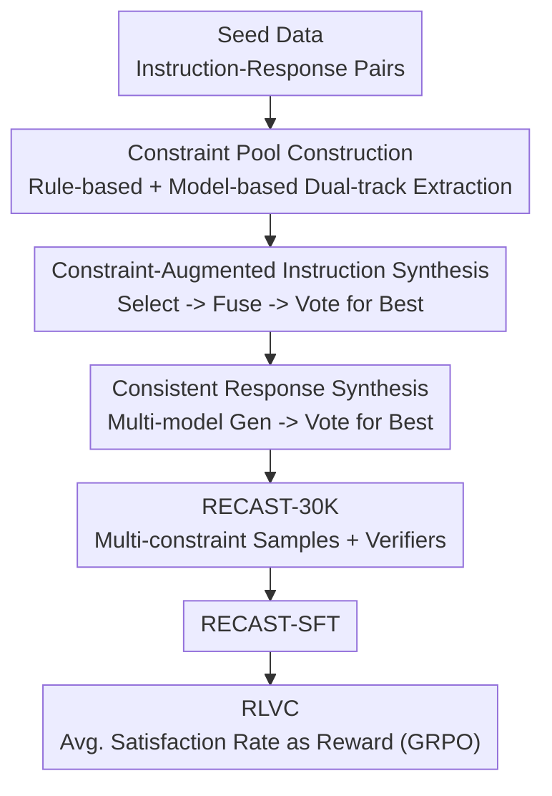

# RECAST: Expanding the Boundaries of LLMs' Complex Instruction Following with Multi-Constraint Data

**Conference**: ICLR 2026  
**OpenReview**: [https://openreview.net/forum?id=90tCp2KszA](https://openreview.net/forum?id=90tCp2KszA)  
**Code**: https://github.com/Thekey756/RECAST  
**Area**: Alignment RLHF / Instruction Following  
**Keywords**: Complex Instruction Following, Multi-Constraint, Data Synthesis, Verifiable Reward, Reinforcement Learning

## TL;DR
RECAST performs reverse mining of verifiable constraints from real "instruction-response" pairs and reassembles them into high-complexity training data (RECAST-30K, 30K samples / 19 constraint types), with more than ten constraints per instruction, supported by a dual-track rule and model-based verifier. SFT using this data enables small models to surpass much larger ones in complex instruction following; further applying Reinforcement Learning with Verifiable Constraints (RLVC) using "constraint satisfaction rate" as a reward provides additional gains without damaging general capabilities.

## Background & Motivation
**Background**: As LLM applications broaden and users become more adept at prompt engineering, instructions containing multiple explicit requirements (role settings, word counts, keywords, formatting, tone, factual consistency, etc.) have become the norm. Existing work to improve instruction following relies either on manually constructed evaluation sets (lacking training sets and scalability) or on LLM-based rewriting for augmentation (AutoIF, Evol-Instruct, etc.).

**Limitations of Prior Work**: The authors identify two primary flaws. First, the **number of constraints** is limited—surveying existing datasets shows that samples rarely exceed 10 constraints, whereas real-world scenarios (e.g., drafting M&A terms or corporate assistants executing business rules) often require satisfying over a dozen constraints simultaneously. Second, constraints are too **monotonous or difficult to verify**—AutoIF relies only on code-verifiable constraints with narrow coverage, while rewriting-based augmentation often generates homogeneous or contradictory constraints without associated validation methods.

**Key Challenge**: To train models capable of handling over a dozen constraints, high-quality data that is "dense in constraints, diverse in types, and individually verifiable" is required. However, achieving all three simultaneously is difficult: manual authoring is unscalable, and generating constraints from scratch via LLMs leads to homogeneity and fails to guarantee that the response actually satisfies them.

**Goal**: (1) Create high-quality training/evaluation data with constraint densities far exceeding existing benchmarks; (2) Ensure every constraint includes an associated verification method; (3) Utilize this verifiability for RL to compel models to satisfy multiple constraints simultaneously.

**Key Insight**: Rather than "generating constraints from scratch and asking models to satisfy them," RECAST takes the **reverse** approach—since real responses implicitly satisfy numerous constraints, these constraints can be **extracted** from existing "instruction-response" pairs. This ensures constraints are naturally realistic and satisfied by the corresponding response, providing ready-made verification signals.

**Core Idea**: Realistic Extraction of Constraints for Augmented inStruction synThesis—verifiable constraints are first mined from seed response data to build a constraint pool, then multiple constraints are naturally fused into the original instructions to resynthesize consistent responses, pushing constraint density higher "out of thin air." The verifiability of these constraints is then used to derive RL rewards (RLVC).

## Method

### Overall Architecture
RECAST consists of a "three-stage data synthesis pipeline + an RL training scheme." The data input consists of standard seed "instruction-response" data (using Tülu 3 Persona IF), and the output is RECAST-30K: each sample includes an instruction rewritten with multiple constraints, a response satisfying all constraints, and annotations for each constraint and its verification method. After obtaining the data, SFT is performed (RECAST-30K-SFT), followed by Reinforcement Learning (RECAST-30K-RLVC) using GRPO with "average constraint satisfaction rate" as the reward.

The pipeline comprises four steps: ① Seed data collection; ② Constraint pool construction (dual-track rule-based + model-based verification); ③ Constraint-augmented instruction synthesis (Select constraints -> Fusion into instruction -> Vote for best instruction); ④ Consistent response synthesis (Multi-model candidate generation -> Vote for best response). Subsequently, RLVC reuses the constraint verifiers to quantify "how many constraints are satisfied" as the reward for GRPO.

### Key Designs

**1. Reverse Extraction from Real Responses: High Density and Verifiability via Dual-track Extraction**

To ensure an instruction carries over a dozen constraints that are realistically satisfiable, RECAST **infers** constraints from seed responses rather than generating them randomly: "which requirements, not previously in the instruction, did this response already satisfy?" RECAST utilizes two extraction tracks: **Rule-based verifiable constraints** cover structure (number of paragraphs), vocabulary (required/forbidden keywords), and quantity (character limits), which are determined by deterministic programs. The authors implemented 9 rule extractors to scan responses and identify programmable attributes. **Model-based verifiable constraints** cover style (formality), tone (politeness), and content characteristics (persuasiveness), which require semantic judgment. This process involves determining which types from a 10-class taxonomy apply, using an LLM to generate specific instances, and filtering out constraints the response does not actually satisfy. Combined, these tracks cover both objective and subjective dimensions, with each constraint carrying its own verification method—the foundation for RL.

**2. Constraint-Augmented Instruction Synthesis: Natural Fusion Instead of Mechanical Stacking**

Given a constraint pool, multiple selected constraints must be written into a coherent instruction. This involves three steps: first, an LLM **selects** a subset of constraints from the pool that are relevant to the original instruction and mutually consistent; second, **multiple** LLMs independently fuse this subset naturally into the original instruction; finally, a **majority voting** mechanism scores the candidates based on linguistic fluency, semantic coherence, and constraint completeness, selecting the highest-scoring candidate as the final augmented instruction. This multi-model voting design offsets single-model bias.

**3. Consistent Response Synthesis: Eliminating Instruction-Response Mismatch**

Original seed responses might not satisfy newly added constraints, leading to supervision signal mismatch. RECAST uses a two-stage fix: **Diverse Response Generation**, where different LLMs independently generate multiple candidate responses for the augmented instruction to avoid bias; and **Response Quality Evaluation**, where majority voting considers constraint compliance, accuracy, and conciseness to select the best response. Each final sample is a triplet: "Multi-constraint instruction + Satisfactory response + Individual constraints and verifiers."

**4. RLVC: Transforming Individual Constraint Verifiability into Fine-grained Rewards**

The inherent verifiability of the data is exploited as an RL signal. Traditional RLHF provides a single holistic reward, leaving the model unaware of which specific constraint was violated. Since RECAST has verifiers for each constraint, it provides more informative rewards. The verification function is defined as:
$$f(x,y,c_i)=\begin{cases}V_{\text{rule-based}}(x,y,c_i) & c_i\text{ is a rule constraint}\\ V_{\text{model-based}}(x,y,c_i) & c_i\text{ is a model constraint}\end{cases}$$
Both verifier types return binary values (1 for satisfied / 0 for violated). For an instruction $x$ with constraint set $C=\{c_1,\dots,c_n\}$, the reward for response $y$ is the **average satisfaction rate of all constraints**:
$$R(x,y)=\frac{1}{|C|}\sum_{i=1}^{|C|} f(x,y,c_i)$$
Each constraint acts as an independent reward channel, providing fine-grained feedback. RLVC applies this reward to Group Relative Policy Optimization (GRPO), performing policy optimization through relative comparisons within a group.

## Key Experimental Results

### Main Results (RECAST-Test, Four Difficulty Levels, Average HSR)
RECAST-Test is a hierarchical benchmark with four difficulty levels and constraint densities far exceeding existing benchmarks. The primary metric is HSR (Hard Constraint Satisfaction Rate, where a sample is correct only if **all** constraints are simultaneously met), decomposed into RSR (Rules), MSR (Model), and OSR (Overall). The following table shows average satisfaction rates on the Qwen2.5-7B base:

| Method (Qwen2.5-7B base) | Average HSR(%) |
|--------------------------|------|
| Tülu 3 Persona IF (Direct training on seed) | 26.83 |
| Conifer | 22.21 |
| Evol-Instruct | 16.46 |
| ShareGPT | 19.13 |
| **RECAST-30K-SFT** | **31.25** |
| **RECAST-30K-RLVC** | **32.33** |

Closed-source/Large scale reference: Gemini-2.5-Pro 39.75, DeepSeek-V3 35.50, GPT-4o 34.46, Qwen2.5-7B-Instruct 26.46, Llama-3.3-70B-Instruct 24.75. Notably, even Gemini-2.5-Pro averages below 40%, indicating that complex instruction following remains difficult; RECAST models enable a 7B model to outperform most same-sized instruct models and approach Qwen2.5-72B-Instruct (33.38).

### Ablation Study / Generalization

| Dimension | Setup | Result |
|----------|------|------|
| vs Inference-time DVR | Avg RSR (Qwen base) | RECAST-SFT 13.0% vs DVR 6.5% (+6.5 pts); Llama base 12.5% vs 7.0% (+5.5 pts) |
| External IF benchmark | IFEVAL / FollowBench | RECAST-SFT outperforms baselines; RLVC achieves SOTA on Llama3.1-8B and Qwen2.5-7B |
| General Capabilities | Avg GPQA / MUSR | RLVC reaches 34.64 on Llama3.1-8B and 38.39 on Qwen2.5-7B, with no degradation observed |

### Key Findings
- **Rule constraints are harder to satisfy than model constraints**: RSR is generally lower than MSR across models (e.g., GPT-4o L1 MSR 89.5 vs RSR 24.5), indicating that "objective but precise" requirements like word counts and keywords are current bottlenecks.
- **Higher difficulty leads to more significant RLVC gains**: The improvement of RECAST-30K-RLVC over SFT is concentrated in Levels 3–4, where fine-grained per-constraint rewards are more valuable for complex interactions.
- **Training-time > Inference-time**: The approach of baking constraints into weights (RECAST) is more robust than inference-time self-alignment (DVR), with complementary benefits.
- **No sacrifice of general capabilities**: While complex instruction following improves significantly, reasoning and knowledge benchmarks (GPQA/MUSR) remain stable.

## Highlights & Insights
- **"Extraction > Generation" Philosophy**: Reversing constraints from real responses solves the issues of constraint realism and response compliance—constraints are from real distributions and satisfied by default, with free verification signals.
- **Verifiability connecting Data and RL**: The same dual-track verifiers are used for data filtering and directly as RL rewards, maximizing the utility of the "verifiable" attribute.
- **Average Satisfaction as Reward** is denser than a single holistic reward: Individual channels for each constraint inform GRPO of exactly what was missed, which is the primary reason for gains in high-difficulty levels.
- **Sample Efficiency of Small Models**: With only 30K SFT samples, Llama3.1-8B-Base outperforms 70B instruct models in complex following, highlighting that data complexity is more critical than sheer volume.

## Limitations & Future Work
- **Heavy Dependence on Seed Data Coverage**: Constraints are mined from Tülu 3 Persona IF; domains or constraint types not present in the seed data cannot be extracted.
- **Potential Noise in Model-Verifiable Constraints**: Subjective constraints rely on LLM judges, introducing potential bias in filtering and RL rewards.
- **Low Absolute Satisfaction Rates**: Even the strongest models average only ~40% on RECAST-Test, indicating that satisfying over a dozen simultaneous constraints is an unsolved problem.
- **Verifier-Trainer Co-sourcing**: The heavy use of GPT-4o as a judge in main experiments introduces potential preference bias; robustness across different evaluators requires further study.

## Related Work & Insights
- **vs Evol-Instruct / Conifer**: These rely on LLM rewriting or multi-level generation where constraints are "invented," risking homogeneity and lack of verifiability. RECAST extracts from real responses with verifiers.
- **vs AutoIF**: AutoIF is limited to code-verifiable constraints; RECAST includes subjective semantic constraints via a rule+model dual-track system.
- **vs DVR (Divide-Verify-Refine)**: DVR performs self-correction during inference; RECAST trains the capability into weights, proving more robust and complementary.

## Rating
- Novelty: ⭐⭐⭐⭐ The philosophy of reverse-extracting verifiable constraints from real responses, coupled with a unified verifiability-reward paradigm, is clean and practical.
- Experimental Thoroughness: ⭐⭐⭐⭐ Hierarchical benchmark + multiple base models + external IF/general capability evaluations.
- Writing Quality: ⭐⭐⭐⭐ Clear framework and motivations; the pipeline steps are well-detailed.
- Value: ⭐⭐⭐⭐ Complex instruction following is a core requirement for real-world deployment; the dataset and RLVC paradigm are highly reusable.

<!-- RELATED:START -->

## Related Papers

- [\[ACL 2025\] IOPO: Empowering LLMs with Complex Instruction Following via Input-Output Preference Optimization](../../ACL2025/llm_alignment/iopo_input_output_preference.md)
- [\[ACL 2026\] MDP-GRPO: Stabilized Group Relative Policy Optimization for Multi-Constraint Instruction Following](../../ACL2026/llm_alignment/mdp-grpo_stabilized_group_relative_policy_optimization_for_multi-constraint_inst.md)
- [\[ACL 2025\] Reverse Preference Optimization for Complex Instruction Following](../../ACL2025/llm_alignment/reverse_preference_optimization_for_complex_instruction_following.md)
- [\[ICLR 2026\] ContextIF: Enhancing Instruction-Following through Context Reward](contextif_enhancing_instruction-following_through_context_reward.md)
- [\[ICLR 2026\] IDEAL: Data Equilibrium Adaptation for Multi-Capability Language Model Alignment](ideal_data_equilibrium_adaptation_for_multi-capability_language_model_alignment.md)

<!-- RELATED:END -->
