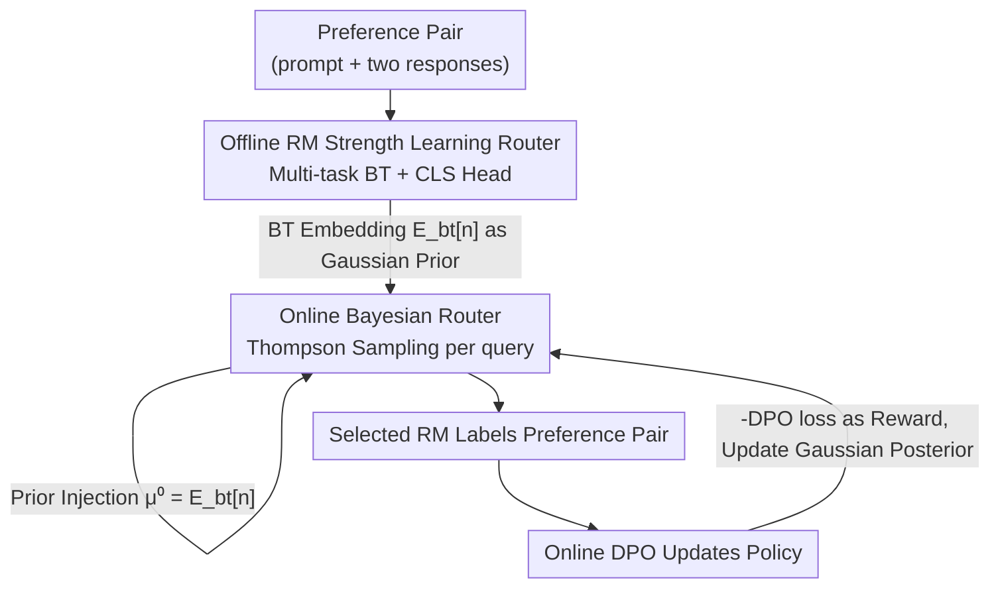

# Reward Model Routing in Alignment

**Conference**: ICLR 2026  
**OpenReview**: [https://openreview.net/forum?id=i3OKIHSsHC](https://openreview.net/forum?id=i3OKIHSsHC)  
**Code**: https://github.com/XinleWu/BayesianRouter  
**Area**: Alignment RLHF  
**Keywords**: Reward Model Routing, RLHF, Online DPO, Thompson Sampling, Contextual Bandits

## TL;DR
This paper proposes **BayesianRouter**, a hybrid routing framework that **selects the most suitable reward model for each preference pair** during RLHF/Online DPO training. In the offline phase, a multi-task router is trained on preference data to learn the expertise areas of various reward models (RMs). During the online phase, Bayesian Thompson Sampling is used to select models per query, injecting offline-learned strengths as Gaussian priors. This allows the router to adapt to policy distributions through linear updates during alignment. The method consistently outperforms single RMs, RM ensembles, and the existing LASER routing method on instruction-following and reasoning benchmarks.

## Background & Motivation
**Background**: RLHF/RLAIF has become the standard paradigm for aligning large language models. The mainstream approach uses **a fixed reward model (RM)** throughout the training process to score policy model responses (scalar rewards in PPO) or perform pairwise comparisons (DPO), thereby injecting human preferences into the policy.

**Limitations of Prior Work**: A single RM has three structural flaws. First, **limited generalization**—no single RM is the strongest across all tasks; RewardBench 2 shows some RMs lead in math/safety but lose in factuality. Second, **high cost**—using GPT-5 level models as RMs provides high quality but the cost of large-scale queries is prohibitive. Third, **over-optimization risk**—relying solely on a single RM amplifies over-fitting to its specific biases/noise, causing the policy to learn to exploit RM loopholes (reward hacking) rather than truly aligning with human intent.

**Key Challenge**: There is a contradiction between achieving the "complementary strengths of multiple RMs" and maintaining "low inference overhead." Naively running all $N$ RMs per query for an ensemble (e.g., majority voting) increases the cost per step from $O(1)$ to $O(N)$, leading to exploding training costs and potential conflicting signals when models disagree.

**Key Insight**: Routing is the middle ground—instead of aggregating all model outputs, it dynamically **selects only the most suitable RM for each input**, preserving model diversity while keeping overhead at $O(1)$. Prior work LASER first modeled RM selection as a contextual bandit (LinUCB), but it has three major flaws: **coarse granularity** (sharing one RM for a whole batch, despite different prompts needing different RMs), **insufficient exploration** (LinUCB relies on point estimation and optimism, easily locking into suboptimal arms early), and **inefficient cold start** (assuming all RMs are equally good at the beginning, requiring many interactions to identify strengths).

**Core Idea**: Combine "offline-learned RM strength priors" with "online Bayesian Thompson Sampling" by injecting the prior as the Gaussian mean into the online router. The offline prior addresses the cold start and improves early routing accuracy, while the Bayesian posterior update handles distribution drift and exploration, selecting RMs per query instead of per batch.

## Method

### Overall Architecture
BayesianRouter is designed for **Online DPO**: at each step, given a prompt mini-batch, $k$ candidate responses are sampled for each prompt. An RM is needed to label them as a preference pair $(x, y_w, y_l)$, which is then used to update the policy with DPO loss. The problem is: which RM from the candidate pool $M=\{R_n\}_{n=1}^N$ should be used for this step?

The framework consists of two sequential phases: the **offline phase** trains an RM router on static preference corpora to learn the "expertise" representation of which RM is most likely to be correct given a preference pair, producing Bradley-Terry (BT) embeddings $E_{bt}[n]$ for each RM. The **online phase** uses Bayesian Thompson Sampling to select RMs for each preference pair during DPO training. Each RM maintains a Gaussian posterior $w_n\sim\mathcal{N}(\mu_n,\Sigma_n)$, which is updated with observed rewards. The bridge between phases is **prior injection**: the offline BT embeddings are set as the initial online posterior mean $\mu_n^{(0)}=E_{bt}[n]$, allowing the online router to start with offline knowledge and refine it through online rewards.

### Key Designs

**1. Offline RM Strength Learning Router: Characterizing Expertise in a Shared Embedding Space**

To address "cold start inefficiency," the system first learns from offline preference data $\hat{D}_{pref}=\{(x_i,y_i,y_i',\ell_i)\}$. **RM behavior data is collected** by running every candidate $R_n$ on every preference pair, recording a binary indicator $\delta_i^{(n)}\in\{0,1\}$ for agreement with the ground truth $\ell_i$. Unlike LASER, which only uses the prompt, this method encodes the **entire preference pair**, as RM judgment depends on the semantic content and contrast of the two responses. A shared encoder represents the prompt and each response as $e_i=\text{Enc}(x_i\Vert y_i)$ and $e_i'=\text{Enc}(x_i\Vert y_i')$, merged into a preference pair representation $h_i=\text{MLP}([e_i+e_i';\ |e_i-e_i'|])$.

Two heads perform **multi-task learning** on $h_i$. The primary **Bradley–Terry (BT) head** learns an RM embedding matrix $E_{bt}$ from "disagreement samples" $D_{bt}=\{(q_i,n,n')\mid\delta_i^{(n)}=1,\delta_i^{(n')}=0\}$. The BT score $s_i^n=\langle h_i,E_{bt}[n]\rangle$ is optimized via a pairwise logistic loss $L_{bt}=-\frac{1}{|D_{bt}|}\sum\log\sigma(s_i^n-s_i^{n'})$. An auxiliary **Classification (CLS) head** independently predicts the behavior label $\delta_i^{(n)}$ for each RM using binary cross-entropy $L_{cls}$, utilizing the entire $D_{beh}$ to refine the shared representation. Only the **BT embeddings $E_{bt}$** are kept as the online prior.

**2. Online Bayesian Thompson Sampling Router: Posterior Sampling for Robust Exploration**

To address LASER's "insufficient exploration and coarse granularity," the authors observed that LinUCB often **collapses to a single arm** after a few batches. This method models online routing as **contextual partial feedback learning**, using Bayesian linear regression to model the expected utility $r=w_n^\top h_i+\varepsilon$, where $\varepsilon\sim\mathcal{N}(0,\sigma^2)$. Each RM maintains a Gaussian posterior $w_n\sim\mathcal{N}(\mu_n,\Sigma_n)$. For each preference pair, weight vectors $w_n^{(t)}\sim\mathcal{N}(\mu_n^{(t)},\Sigma_n^{(t)})$ are **sampled** from the posteriors, and the RM is selected via $n_i^*=\arg\max_n h_i^\top w_n^{(t)}$.

The posterior is updated using cumulative sufficient statistics after observing rewards on selected samples $I_n^{(t)}$:

$$\Sigma_n^{(t+1)}=\Big(\Sigma_n^{(t)-1}+\tfrac{1}{\sigma^2}\sum_{i\in I_n^{(t)}}h_ih_i^\top\Big)^{-1},\quad \mu_n^{(t+1)}=\Sigma_n^{(t+1)}\Big(\Sigma_n^{(t)-1}\mu_n^{(t)}+\tfrac{1}{\sigma^2}\sum_{i\in I_n^{(t)}}\hat{r}_i^n h_i\Big).$$

The reward signal $\tilde{r}_i^n=-L_{DPO}^i$ (lower DPO loss equals higher reward) is used, then processed via **quantile normalization** for stability.

**3. Offline-Online Prior Injection: Principles of Integration**

A key insight is that **the offline BT head and the online Bayesian router are both linear models on preference pair embeddings**: the offline part calculates $\langle h,E_{bt}[n]\rangle$ and the online part calculates $\langle h,w_n\rangle$. Thus, **prior injection** sets $\mu_n^{(0)}=E_{bt}[n]$. This allows the online router to begin with knowledge of RM expertise, mitigating cold start issues and refining the weights as the policy induces distribution shifts.

### Loss & Training
Offline Router: $L_{total}=L_{bt}+\lambda L_{cls}$, optimizing the encoder $W_e$, MLP $W_l$, and heads $E_{bt}, E_{cls}$. Policy side: standard online DPO loss, where $\pi_{ref}$ is the initial policy $\pi_0$. Online router reward $\hat{r}_i^n$ is derived from $-L_{DPO}^i$ via quantile normalization, with posterior updates performed incrementally.

## Key Experimental Results

### Main Results
The policy model is initialized as LLaMA3-SFT-v2. The RM pool includes 4 models from RewardBench 2. The offline router uses SmolLM2-135M-Instruct as the encoder.

| Method | AlpacaEval-2 | MT-Bench | Arena-Hard | GSM8K | MMLU |
|------|------|------|------|------|------|
| SFT | 50.00 | 50.00 | 50.00 | 67.63 | 54.29 |
| Best Single RM (RM1) | 61.86 | 56.25 | 64.80 | 74.22 | 57.03 |
| Majority vote | 60.75 | 53.75 | 63.40 | 74.22 | 56.71 |
| UWO (Uncertainty Weighted) | 61.74 | 56.25 | 63.60 | 74.30 | 56.43 |
| LASER (Batch-level LinUCB) | 60.50 | 51.25 | 62.40 | 74.00 | 56.35 |
| **BayesianRouter** | **63.23** | **58.75** | **66.20** | **75.66** | **57.39** |

Across instruction-following and reasoning benchmarks, BayesianRouter consistently outperforms single RMs, ensembles, and LASER, while only requiring $O(1)$ RM calls.

### Ablation Study

| Configuration | AlpacaEval-2 | Arena-Hard | GSM8K | Note |
|------|------|------|------|------|
| w/o offline | 60.99 | 63.20 | 74.37 | Online Bayesian only |
| w/o online | 61.61 | 64.40 | 74.68 | Subject to distribution drift |
| Weighted-score | 61.12 | 63.80 | 74.37 | Naive integration of scores |
| **Ours (Prior Injection)** | **63.23** | **66.20** | **75.66** | Full Model |

### Key Findings
- **Components are complementary**: "w/o offline" and "w/o online" show significant performance drops.
- **Prior injection exceeds weighted scores**: Even with an optimal $\alpha$ for weighting, prior injection performs better, proving the effectiveness of using BT embeddings as posterior means.
- **Gains from accurate routing**: Controlled simulations show BayesianRouter achieves the highest labeling accuracy (88.23).
- **Rewards do not collapse to "yes-man" RMs**: Although $-L_{DPO}$ might seem to favor RMs aligned with the current policy, exploration ensures that low-quality RMs that exploit the policy are penalized as the distribution shifts.

## Highlights & Insights
- **Aligning "Offline Knowledge → Online Prior" via Linear Models**: Treats $E_{bt}[n]$ as the prior mean $\mu_n^{(0)}$, making initialization principled and parameter-free.
- **Per-query Routing**: Refines the granularity from batch-level to instance-level, a significant improvement over LASER.
- **Preference Pair Encoding**: Uses $[e+e';|e-e'|]$ to capture contrasting information between the two responses.
- **Thompson Sampling vs. LinUCB**: Sampling from the posterior effectively avoids the "collapse to a single arm" seen in optimism-based methods.

## Limitations & Future Work
- Evaluation was limited to the DPO family; utility in PPO-based RL is not yet verified.
- The quality of the offline prior is bounded by the diversity of preference data.
- The RM pool size was $N=4$; performance with much larger pools ($N > 50$) is unexplored.
- Using $-L_{DPO}$ as a proxy for reward relies on the assumption that high-quality RMs have more stable training trajectories.

## Related Work & Insights
- **vs. LASER**: Both model RM routing as contextual bandits. However, LASER uses LinUCB per batch with only prompt inputs. This work uses Thompson Sampling per query, entire preference pairs, and offline priors.
- **vs. RM Ensembles**: Ensembles Aggregate $N$ models at $O(N)$ cost; this routing approach achieves better performance at $O(1)$.
- **vs. LLM Inference Routing**: While inference routing balances cost/accuracy for response generation, this specifically tackles reward models during the alignment phase using offline-to-online adaptation.

## Rating
- Novelty: ⭐⭐⭐⭐ 
- Experimental Thoroughness: ⭐⭐⭐⭐ 
- Writing Quality: ⭐⭐⭐⭐ 
- Value: ⭐⭐⭐⭐ 

<!-- RELATED:START -->

## Related Papers

- [\[ICLR 2026\] RewardBench 2: Advancing Reward Model Evaluation](rewardbench_2_advancing_reward_model_evaluation.md)
- [\[ICML 2025\] On the Robustness of Reward Models for Language Model Alignment](../../ICML2025/llm_alignment/on_the_robustness_of_reward_models_for_language_model_alignment.md)
- [\[ICLR 2026\] Evaluating and Improving Cultural Awareness of Reward Models for LLM Alignment](evaluating_and_improving_cultural_awareness_of_reward_models_for_llm_alignment.md)
- [\[ICLR 2026\] Towards Understanding Valuable Preference Data for Large Language Model Alignment](towards_understanding_valuable_preference_data_for_large_language_model_alignmen.md)
- [\[ICLR 2026\] Multi-objective Large Language Model Alignment with Hierarchical Experts](multi-objective_large_language_model_alignment_with_hierarchical_experts.md)

<!-- RELATED:END -->
