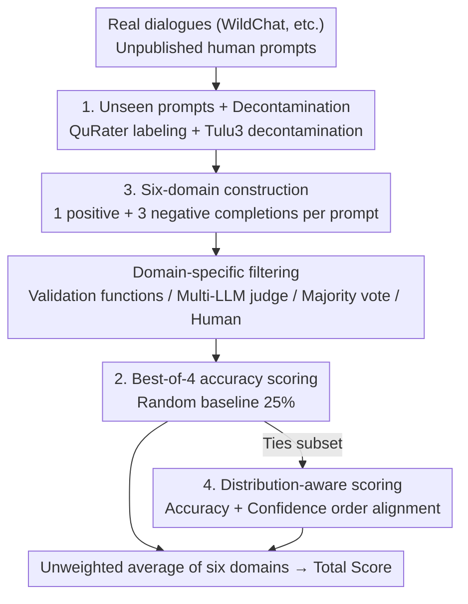

# RewardBench 2: Advancing Reward Model Evaluation

**Conference**: ICLR 2026  
**OpenReview**: [https://openreview.net/forum?id=fb0G86Dewb](https://openreview.net/forum?id=fb0G86Dewb)  
**Code**: Open-sourced after acceptance (Code Apache 2.0, Data ODC-By)  
**Area**: Alignment RLHF  
**Keywords**: Reward Model, Evaluation Benchmark, best-of-N, RLHF, Downstream Correlation

## TL;DR
This paper introduces RewardBench 2, a reward model evaluation benchmark utilizing completely new, unseen human prompts and transitioning from a "1-vs-1" to a "1-vs-3 (1 positive, 3 negatives)" format. Covering six major domains (including new areas like Ties, Precise IF, and Factuality), it is on average 20 points more difficult than the original RewardBench and exhibits significantly stronger correlation with downstream applications such as best-of-N sampling and PPO training.

## Background & Motivation

**Background**: Reward Models (RM) are central to nearly every stage of language model post-training, including RLHF, online direct alignment, data filtering, and inference-time scaling (best-of-N sampling), where they provide a scalar score for text. The community has begun establishing best practices for RM evaluation, ranging from skill-specific benchmarks like RewardBench and RM-Bench to various benchmarks measuring alignment with human preferences.

**Limitations of Prior Work**: Improvements in evaluation scores have not consistently reflected downstream RM effectiveness; in many scenarios, simpler direct alignment algorithms (e.g., DPO) perform better. More critically, most existing RM benchmarks **directly reuse prompts from downstream evaluations** (e.g., questions from AlpacaEval or MATH), which risks contaminating conclusions about the correlation between benchmark scores and downstream performance: it is unclear if the correlation is genuine or a result of data contamination. Furthermore, the dominant "1 chosen vs. 1 rejected" binary format has a high random baseline of 50%, compressing the gap between strong and weak RMs and leaving little room for performance differentiation.

**Key Challenge**: A superior RM benchmark must simultaneously satisfy two requirements often decoupled in prior work: it must be **accuracy-based** (to avoid the subjectivity of LM-as-a-judge preferences) and **strongly correlated with authentic downstream usage without contamination**. Existing benchmarks either rely on subjective LM judgments or reuse prompts, casting doubt on their correlation.

**Goal**: Construct a new benchmark that is (1) sufficiently difficult to allow for performance differentiation; (2) utilizes new, unseen human prompts decoupled from downstream evaluations; (3) covers diverse skill domains; and (4) provides scores that reliably predict downstream performance in best-of-N and RLHF.

**Key Insight**: The authors extract **never-before-published** human prompts from WildChat real-world user dialogues and employ decontamination tools to ensure zero overlap with 20 major downstream evaluations. Simultaneously, the evaluation format is upgraded from "1-vs-1" to "1-vs-3," reducing the random baseline from 50% to 25%.

**Core Idea**: To reconstruct RM evaluation using "unseen human prompts + best-of-4 accuracy (1 positive, 3 negatives) + 6 meticulously constructed domains (including distribution-aware Ties)," making the benchmark both more challenging and better at predicting downstream outcomes.

## Method

### Overall Architecture

RewardBench 2 is essentially a **data construction + scoring** pipeline rather than a single model. It addresses the challenge of creating evaluation samples that are uncontaminated, capable of distinguishing RM quality, and predictive of downstream performance. The process proceeds in four serial phases: first, extracting **unseen human prompts** from sources like WildChat and labeling them for quality and domain using classifiers; second, generating completions for each domain specifically to create a "1 correct + 3 incorrect" setup; third, filtering using domain-specific validation pipelines (validation functions, multi-LLM judging, majority voting, or manual verification); and finally, scoring using **best-of-4 accuracy**, with the total score derived from the unweighted average of the six domains. The final set includes 1,865 prompts and completions sourced from 20 different models or human writers.

### Key Designs

**1. New Unseen Human Prompts + Strict Decontamination: Ensuring Credible Correlation**

Most RM benchmarks reuse prompts from downstream evaluations, making observed correlations potentially illusory due to contamination. In this work, approximately 70% of prompts come from **never-before-published**, user-authorized queries in the WildChat pipeline (labeled "Human"), with the remainder being manually written ("Manual") or from CoCoNot. The authors initially collected about 3,000 high-quality prompts from target domains, refining them to a final 1,865 through manual verification. They used QuRater for quality labeling, a topic classifier for domain categorization, and the Tulu 3 decontamination tool against 20 major downstream benchmarks to ensure zero overlap. This ensures that the correlation between benchmark scores and downstream performance (discussed in Section 5) cannot be attributed to prompt repetition—a critical methodological improvement over the original RewardBench.

**2. Best-of-4 (1 Positive, 3 Negatives) Accuracy Evaluation: Lowering the Random Baseline**

Mainstream RM evaluations utilize a binary "1 chosen vs. 1 rejected" format with a 50% random baseline, making it difficult to distinguish between models. This paper pairs each prompt with **4 completions: exactly 1 correct and 3 incorrect**. An RM must select the single correct completion to receive credit, reducing the random baseline to 25%. The underlying model remains the classic Bradley-Terry preference model—where the RM outputs a scalar $r(x,y)$, and the preference probability for a pair of completions is:

$$p(y_1 \succ y_2 \mid x) = \frac{\exp(r(x,y_1))}{\exp(r(x,y_1)) + \exp(r(x,y_2))}$$

Training involves maximum likelihood estimation: $L(\theta,D)=\mathbb{E}_{(x,y_c,y_r)\sim D}\big[\log(1+e^{r_\theta(x,y_r)-r_\theta(x,y_c)})\big]$. A lower random baseline provides a larger headroom for scoring and makes results for difficult subsets (e.g., Math, Precise IF) more robust and interpretable. This is the structural reason why RewardBench 2 is approximately 20 points harder than its predecessor.

**3. Differentiated Construction for Six Domains: Specialized Pipelines for "Generation and Validation"**

The benchmark covers 6 domains. Math, Safety, and Focus are upgraded versions of RewardBench domains, while Factuality, Precise IF, and Ties represent new capabilities not covered by existing evaluations. The difficulty lies in ensuring the "3 incorrect completions" are not easily identified; thus, each domain has a **bespoke generation and validation pipeline**. Factuality uses natural responses alongside system prompts to induce subtle errors, validated by two independent LLMs. Precise IF utilizes IFBench constraints (e.g., "do not use the letter u"), verified by **validation functions**. Math covers topics from high school physics to university calculus, using **majority voting** for initial screening followed by **case-by-case manual verification**. Safety is based on CoCoNot compliance rubrics, judged by GPT-4o and manually verified. Focus mimics LLMBar by using LMs to rewrite prompts into off-topic or irrelevant responses. This "domain-specific, human-verified" approach is a fundamental guarantee of quality and difficulty.

**4. Distribution-Aware Scoring for Ties: Rewarding "Correctness without Over-commitment"**

Ties is a new domain type designed to measure an RM's calibration when multiple equivalent correct answers exist (e.g., "name a color of the rainbow"). A good RM should assign **any correct answer a higher score than any incorrect answer**, while **not showing arbitrary or excessive preference between equivalent correct answers**. Therefore, Ties uses a weighted score instead of simple accuracy: it checks if all correct answers outscore all incorrect ones (correctness) and if the reward margin between correct and incorrect answers is greater than the margin between the highest and lowest correct answers (ensuring the model's confidence in the "right vs. wrong" gap outweighs its confidence in "internal differences of correct answers"). This component addresses recent research on RM fragility, ensuring that in RLHF, the signal toward "correctness" is stronger than the signal to reduce correct answer diversity.

## Key Experimental Results

### Main Results

The authors evaluated over 100 RMs (both mainstream open-source models and newly trained controlled models). Overall, RewardBench 2 proves challenging even for the strongest current RMs, with Precise IF, Math, and Factuality being particularly difficult.

| Model | Average | Factuality | Precise IF | Math | Safety | Focus | Ties |
|------|---------|------------|------------|------|--------|-------|------|
| Skywork-Reward-V2-Llama-3.1-8B | **84.1** | 84.6 | 66.3 | 77.6 | 96.7 | 98.4 | 81.2 |
| LMUnit-qwen2.5-72b* | 82.1 | 87.2 | 54.4 | 72.7 | 91.3 | 96.8 | 90.1 |
| gemini-2.5-pro* | 79.5 | 75.5 | 61.9 | 89.8 | 88.1 | 80.5 | 81.1 |
| claude-opus-4* | 76.5 | 82.7 | 41.9 | 74.9 | 89.5 | 86.2 | 83.7 |
| Skywork-Reward-Llama-3.1-8B | 73.1 | 69.9 | 42.5 | 62.8 | 93.3 | 96.2 | 74.1 |

(* Denotes LM-as-a-judge models.) Top models generally scored below 40–66% in Precise IF and around 70% in Math, indicating significant room for improvement. Compared to the original RewardBench, the same leading models dropped by an average of over 20 points on RewardBench 2.

### Downstream Correlation and Controlled Training Analysis

A core claim of this work is that benchmark scores predict downstream performance. Across 113 RMs using best-of-N sampling ($N=16$, covering GSM8K, MATH, IFEval, AlpacaEval 2, BBH, PopQA, and HumanEval+), the Pearson correlation between the benchmark average and downstream average was **0.87**.

| Downstream Usage | Key Findings |
|----------|---------|
| best-of-N Sampling (113 RMs) | Benchmark average vs. downstream average correlation is 0.87; Factuality subset has the highest correlation; Math subset is a strong signal for math/code tasks. |
| PPO Training (17 RMs, Tulu 3 8B SFT policy) | Provides a coarse signal for low-scoring RMs; however, for "decent" RMs (RB2 scores 49.8–68.5), downstream performance quickly saturates, matching Tulu 3 8B DPO (60.3). |
| Homogeneous vs. Heterogeneous (on-policy vs off-policy) | PPO performance is better when the RM and policy model share the **same bloodline/distribution**; downstream performance drops significantly when there is a mismatch in bloodline or training prompt distribution. |

### Key Findings
- **Highest benchmark score does not guarantee best RLHF RM**: PPO performance depends heavily on training setup—the RM must be from the same "bloodline" as the policy model; otherwise, performance can degrade significantly despite a high benchmark score.
- **Training data specializes**: Skywork data is particularly effective for Focus/Safety, while Tulu data is better for Factuality; a mixture of both outperforms either on all base models.
- **Multiple epochs are not necessarily harmful**: Contrary to the common practice of training RMs for only 1 epoch to prevent overfitting, this study found that training for more than 1 epoch sometimes improves scores (8 of the top 18 models were trained for 2 epochs) and does not necessarily harm downstream performance.
- **Post-training stages "inherit" to the RM**: RMs trained on Tulu 3 8B vs. Llama 3.1 8B Instruct (both based on Llama 3.1 8B Base) exhibit different capabilities, suggesting that abilities gained during post-training transfer to the RM.

## Highlights & Insights
- **"4-vs-1" is a small but critical format change**: Lowering the random baseline from 50% to 25% significantly increases the discriminative power for strong/weak RMs without increasing construction costs. This strategy of modifying evaluation format rather than the model can be applied to any benchmark saturated in high-scoring zones.
- **Ensuring validity with unpublished prompts + decontamination**: Correlation studies are often plagued by contamination; by using unpublished WildChat prompts and strict decontamination, this paper solidifies the conclusion that benchmark scores predict downstream performance.
- **Ties addresses the overlooked calibration issue**: Standard evaluations focus only on "correctness." Ties asks whether an RM can remain neutral among multiple equivalent correct answers, quantifying this via distribution-aware scoring—essential for real-world deployment where arbitrary preferences are undesirable.
- **"High benchmark score ≠ good RLHF" is counter-intuitive but practical**: It cautions practitioners to select RMs based on bloodline/distribution matching with the policy model rather than blindly following leaderboard rankings.

## Limitations & Future Work
- **PPO signal saturation**: The benchmark predicts PPO performance for lower-scoring RMs but saturates quickly for stronger ones, suggesting that accuracy-based benchmarks have inherent limits in predicting RLHF success (consistent with findings by Ivison et al.).
- **Labor-intensive construction**: Domains like Math, Safety, and Ties require case-by-case manual verification, limiting scalability and reproducibility; the Ties domain contains only 102 samples.
- **PPO experiments limited by tokenizer**: Only RMs sharing the same tokenizer as Tulu 8B SFT were evaluated; cross-bloodline scenarios with different tokenizers were not fully explored.
- **Future directions**: Focus and Ties show lower correlation with existing downstream evaluations, partly because current downstream sets do not cover these skills—future work could create downstream tasks for these areas.

## Related Work & Insights
- **vs. RewardBench (Original)**: Both are accuracy-based RM benchmarks, but the original used a 2-choice format (50% baseline) and reused downstream prompts. This version uses a 4-choice format (25% baseline) and unseen prompts with decontamination, increasing difficulty by ~20 points and providing more credible correlation.
- **vs. PPE (Frick et al.)**: PPE also focuses on downstream correlation but uses subjective human/LM preferences for its preference branch. This work adheres to an accuracy-based approach with unseen prompts to avoid subjectivity and contamination.
- **vs. RM-Bench / RMB**: While also multi-skill benchmarks, this work adds Factuality, Precise IF, and Ties, and systematically quantifies correlation with both best-of-N and PPO.

## Rating
- Novelty: ⭐⭐⭐⭐ The benchmark is an engineering integration, but the combination of "unseen prompts + 4-vs-1 + Ties distribution scoring" and systematic correlation analysis offers substantial novelty.
- Experimental Thoroughness: ⭐⭐⭐⭐⭐ Evaluated over 100 RMs, covering two major downstream use cases (best-of-N with 113 RMs, PPO with 17 RMs), along with controlled training ablations.
- Writing Quality: ⭐⭐⭐⭐ Construction decisions and findings are clear, though domain construction details are complex and require reference to the appendix.
- Value: ⭐⭐⭐⭐⭐ Provides a more difficult, credible, and downstream-correlated RM evaluation standard, serving as ready-to-use infrastructure for the post-training community.

<!-- RELATED:START -->

## Related Papers

- [\[ICLR 2026\] Reward Model Routing in Alignment](reward_model_routing_in_alignment.md)
- [\[ACL 2025\] Rethinking Reward Model Evaluation Through the Lens of Reward Overoptimization](../../ACL2025/llm_alignment/rethinking_reward_model_evaluation_through_the_lens_of_reward_overoptimization.md)
- [\[ACL 2026\] P-Check: Advancing Personalized Reward Model via Learning to Generate Dynamic Checklist](../../ACL2026/llm_alignment/p-check_advancing_personalized_reward_model_via_learning_to_generate_dynamic_che.md)
- [\[ICLR 2026\] Omni-Reward: Towards Generalist Omni-Modal Reward Modeling with Free-Form Preferences](omni-reward_towards_generalist_omni-modal_reward_modeling_with_free-form_prefere.md)
- [\[ICLR 2026\] Robust Reward Modeling via Causal Rubrics](robust_reward_modeling_via_causal_rubrics.md)

<!-- RELATED:END -->
