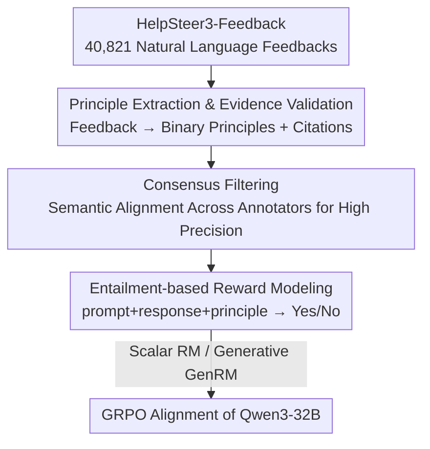

# RLBFF: Binary Flexible Feedback to Bridge Between Human Feedback & Verifiable Rewards

**Conference**: ICLR 2026  
**OpenReview**: [https://openreview.net/forum?id=P3R3S6S5Km](https://openreview.net/forum?id=P3R3S6S5Km)  
**Code**: https://huggingface.co/collections/nvidia/reward-models-10-2025 (Open source models and data)  
**Area**: Alignment RLHF  
**Keywords**: Reward Model, RLHF, Verifiable Rewards, Binary Principles, Entailment Judgment

## TL;DR
This paper proposes RLBFF (Reinforcement Learning with Binary Flexible Feedback), which extracts "binary-answerable principles" from natural language feedback (e.g., "Information accuracy: Yes", "Code readability: No"). It reformulates reward model training as an entailment task—determining whether a response satisfies a specific principle—thereby achieving the broad coverage of RLHF and the interpretability/reward-hacking resistance of RLVR. The resulting scalar reward model outperforms Bradley-Terry models on RM-Bench (83.6) and JudgeBench (76.3). A GenRM further pushes RM-Bench/JudgeBench to 86.2/81.4 (SOTA), and is used to align Qwen3-32B to a level comparable to o3-mini/DeepSeek R1 with less than 5% of the inference cost.

## Background & Motivation
**Background**: Current LLM post-training involves two main RL paradigms: RLHF (training Bradley-Terry reward models based on human preferences) and RLVR (using rule-based verifiers for binary correct/incorrect rewards). New generations of open-source models often combine both as they have complementary strengths.

**Limitations of Prior Work**: RLHF relies on "Response A is better than B" preferences, but the underlying criteria for human judgment are implicit. The resulting BT model scores (e.g., -14.5) only allow relative comparisons within the same prompt, are non-calibrated across prompts, act as a black box without explanations, and are prone to reward hacking (e.g., mistaking length or sycophancy for quality). While RLVR is interpretable and high-precision, it only covers narrow scenarios where correctness is mechanically verifiable (e.g., math or competitive programming) and suffers from low recall, mislabeling equivalent correct answers (e.g., "3 hours" vs "180 minutes") as incorrect.

**Key Challenge**: There is a disconnect between broad coverage (advantage of human feedback) and interpretability plus high precision (advantage of verifiable rewards). No single signal currently achieves all four attributes: broad coverage, interpretability, high precision, and high recall.

**Goal**: Design a feedback signal that covers arbitrary quality dimensions like human feedback while remaining as interpretable and robust to hacking as verifiable rewards.

**Key Insight**: The authors observe that binary rewards in RLVR and "Good/Bad" labels in KTO are isomorphic, but KTO does not clarify the specific criteria for being "good." By explicitly binding the judgment to a **principle** (a binary evaluative axis), one can retain the precision of binary signals while making the standards transparent and specifiable.

**Core Idea**: Reformulate reward modeling from "preference ranking of A over B" to a binary entailment task: "given a prompt + response + principle, determine if the response satisfies the principle." This replaces standard-less preference comparisons with "principled binary judgments."

## Method

### Overall Architecture
The core of RLBFF is "translating" human natural language feedback into a set of binary-answerable principles, then training a reward model using these (prompt, response, principle) → Yes/No triples for RL alignment. The pipeline consists of three stages: **Data Construction** (extracting principles from HelpSteer3-Feedback, filtering, and obtaining annotator consensus) → **Reward Modeling** (training a scalar RM or generative GenRM with triples, where reward = $\log p(\text{Yes}) - \log p(\text{No})$) → **Model Alignment** (using GenRM as the reward for GRPO training of Qwen3-32B). The filtering and consensus steps in data construction are critical for principle quality.

### Key Designs

**1. Decomposing Feedback into "Binary-Answerable Principles": Entailment instead of Preference**
This directly addresses the "implicit and uninterpretable standards" of RLHF. A principle is defined as an evaluative axis that can be judged binarily. Instead of a fixed list, DeepSeek-V3-0324 extracts (Principle, Yes/No) pairs zero-shot from human feedback (e.g., extracting "Follows user requirements: Yes" for praise, or "Contains inline comments: No" for a complaint). Practical design choices include: using **principles** rather than general quality to avoid vague optimization goals; using a **single response** rather than pairs to avoid position bias and reflect real-world feedback; and using **binary** labels rather than Likert scales to mitigate inter-annotator calibration issues. The model must **cite supporting text spans** before judging, and RapidFuzz (`partial_ratio > 60`) is used to remove hallucinations (filtering 2.2%), ensuring higher reliability than synthetic-only data.

**2. Consensus Filtering: Trading Recall for Precision to Prevent Training on Flawed Standards**
From 1.2 million raw principles, the authors filter for consensus because individual annotators can be subjective. Since principles are free-form text, numerical consistency checks (as in HelpSteer2) are impossible. The authors use Qwen-3-8B embeddings to vectorize principles and **only retain those where every other annotator has at least one principle with cosine similarity > 0.8**. This strict filter reduced the count to ~100k (across 3 annotators), resulting in ~33k "independent semantic" principles. The strategy prioritizes **high precision and low recall**, removing "helpfulness" (a global artifact in HelpSteer3) and "partially satisfied" entries (which are ambiguous). Manual verification showed an 88.9% consistency rate with the majority (Fleiss' κ=0.447).

**3. Single-token Scalar RM + Inference-time Custom Principles: Efficiency and Customization**
The RM is trained to output "Yes" or "No" for a given triple. The reward is defined as $r = \log p(\text{Yes}) - \log p(\text{No})$. **Scalar RM** (Flexible Principles based on Llama-3.3-70B-Instruct) requires only a single-token generation, taking <0.1s per task. Crucially, it is the **first scalar RM that allows users to specify arbitrary principles to ground scores at inference time**—a capability previously exclusive to much slower GenRMs. The **GenRM** (based on Qwen3-32B) uses GRPO for chain-of-thought reasoning before judging, achieving SOTA on RM-Bench/JudgeBench but at ~100x higher latency. The single-response design naturally avoids the position bias prevalent in paired GenRMs.

**4. GRPO Alignment with GenRM as Reward: Injecting Principle Signals into the Policy**
RLBFF is validated by using the GenRM to train Qwen3-32B via GRPO. The policy generates candidate responses ending user queries without knowing the specific evaluation principle. The GenRM evaluates these based on principles bound to the training sample. The policy maximizes $\log p(\text{Yes}) - \log p(\text{No})$, effectively fine-tuning the model to align with human-extracted principles.

### Loss & Training
The reward is unified as $r = \log p(\text{Yes}) - \log p(\text{No})$. This is used for scalar RM evaluation, GenRM training/evaluation, and GRPO optimization for the downstream policy. Scalar RMs are supervised to produce the Yes/No token, while GenRM is trained via GRPO on "reason-then-judge" trajectories.

## Key Experimental Results

### Main Results (Reward Model Quality)

| Model | RM-Bench Overall | JudgeBench Overall | PrincipleBench Overall | Speed |
|------|------|------|------|------|
| **Flexible Principles ScalarRM** (Ours) | **83.6** | **76.3** | **91.6** | <0.1 s/task |
| Bradley-Terry (Same Data) | 78.5 | 68.9 | 89.5 | <0.1 s/task |
| Llama-3.3-Nemotron-70B-Reward | 79.9 | 73.7 | 89.7 | <0.1 s/task |
| **Flexible Principles GenRM** (Ours) | **86.2** | **81.4** | 83.8 | >10 s/task |
| Llama-3.3-Nemotron-Super-49B-GenRM | 82.7 | 75.1 | 82.1 | >10 s/task |
| RM-R1-DeepSeek-Distilled-Qwen-32B | 83.9 | 66.0 | 73.9 | >10 s/task |
| R3-QWEN3-14B-LORA-4K | 84.9 | 60.9 | 67.2 | >10 s/task |

Scalar RM significantly outperforms the Bradley-Terry baseline. GenRM achieves SOTA on JudgeBench (81.4 vs previous 80.9). Notably, baseline paired GenRMs (like RewardAnything) fail on JudgeBench (62.6) due to position bias, while the single-response RLBFF is immune. Scalar RMs outperform GenRMs on PrincipleBench because GenRMs (initialized with reasoning models) focus excessively on correctness while neglecting readability and verbosity.

### Ablation Study

| Configuration | RM-Bench | JudgeBench | Description |
|------|---------|-----------|------|
| Group Similarity = 0.8 (Default, 33k) | 83.6 | 76.3 | Optimal quantity/quality trade-off |
| Group Similarity = 0.7 (95k) | 82.8 | 72.3 | More data but includes subjective principles |
| Group Similarity = 0.9 (11k) | 81.9 | 73.7 | Insufficient data |
| Fixed Principle Train Time | 79.9 | 71.4 | Training only on a single fixed principle |
| Fixed Principle Test Time | 81.9 | 70.9 | Flexible training but fixed to "Accuracy" at test |

### Main Results (Policy Alignment)

| Model | MT-Bench | Arena Hard v2 | WildBench | Inference Cost |
|------|---------|--------------|-----------|---------|
| Qwen3-32B | 9.38 | 44.0 | 67.57 | 1x |
| **+ RLBFF training** | **9.50** | **55.6** | **70.33** | 1x |
| + Baseline BT training | 9.45 | 47.5 | 67.38 | 1x |
| o3-mini | 9.26 | 50.0 | 71.64 | 61x |
| DeepSeek R1 | 9.49 | 57.4 | 64.24 | 25x |

### Key Findings
- **Consensus threshold is the quality gate**: 0.8 is the sweet spot. 0.7 introduces subjective noise, and 0.9 results in data scarcity.
- **Multi-principle training benefits single-principle tasks**: Flexible training outperforms single-principle training even when tested on a single principle (+2.0 on RM-Bench).
- **Position bias is fatal for paired GenRMs**: While paired models drop significantly on JudgeBench consistency, the single-response design is naturally robust.
- **High cost-performance**: RLBFF-aligned Qwen3-32B matches or exceeds o3-mini/R1 across benchmarks at less than 5% of the inference cost.

## Highlights & Insights
- **Unified Perspective**: "Principled Binary Entailment" unifies RLVR (correctness principle) and KTO (undefined principle) by explicitly defining "why" a response is good/bad, resolving interpretability and hacking issues.
- **Trustworthy Extraction**: The evidence-citation mechanism transforms LLM-based labeling from unreliable to credible; this is a transferable trick for any structured extraction task.
- **Efficiency of Scalar RM**: Using $\log p(\text{Yes}) - \log p(\text{No})$ as a single-token reward brings the customization of GenRM to the speed of scalar RMs.
- **Biases in GenRM**: PrincipleBench reveals that GenRMs, often initialized from reasoning models, over-prioritize logic at the expense of other quality dimensions like readability.

## Limitations & Future Work
- **Reliance on high-quality feedback**: The pipeline depends on datasets like HelpSteer3-Feedback; portability is limited by the availability of paragraph-level human feedback.
- **Cost of high precision**: The strict consensus filter discards many valid principles, which may be problematic if raw data is already scarce.
- **GenRM "Specialization"**: Generative RMs struggle with non-correctness dimensions, indicating that reasoning capability does not equate to comprehensive quality judgment.
- **Binarization loss**: Removing "partially satisfied" samples simplifies labels but loses nuance for inherently continuous quality dimensions (e.g., conciseness).

## Related Work & Insights
- **vs Bradley-Terry / RLHF**: BT uses implicit preferences and non-calibrated black-box scores; RLBFF uses binary entailment with interpretable and specifiable principles, yielding higher performance.
- **vs RLVR (Verifiable Rewards)**: RLVR is narrow and has low recall for equivalent answers; RLBFF generalizes this to 1000+ principles and leverages LLM pre-training to handle semantic equivalence.
- **vs Self-rubric GenRM (DeepSeek-GRM / RM-R1)**: These synthesize their own standards but aren't user-controllable; RLBFF principles are human-derived and user-specifiable at inference.

## Rating
- Novelty: ⭐⭐⭐⭐⭐ 
- Experimental Thoroughness: ⭐⭐⭐⭐⭐ 
- Writing Quality: ⭐⭐⭐⭐⭐ 
- Value: ⭐⭐⭐⭐⭐ 

<!-- RELATED:START -->

## Related Papers

- [\[ICLR 2026\] Beyond Binary Preferences: A Principled Framework for Reward Modeling with Ordinal Feedback](beyond_binary_preferences_a_principled_framework_for_reward_modeling_with_ordina.md)
- [\[ICLR 2026\] What's In My Human Feedback? Learning Interpretable Descriptions of Preference Data](whats_in_my_human_feedback_learning_interpretable_descriptions_of_preference_dat.md)
- [\[ICLR 2026\] Stackelberg Learning from Human Feedback: Preference Optimization as a Sequential Game](stackelberg_learning_from_human_feedback_preference_optimization_as_a_sequential.md)
- [\[NeurIPS 2025\] Strategyproof Reinforcement Learning from Human Feedback](../../NeurIPS2025/llm_alignment/strategyproof_reinforcement_learning_from_human_feedback.md)
- [\[ICML 2026\] Simultaneous Multi-objective Alignment Across Verifiable and Non-verifiable Rewards](../../ICML2026/llm_alignment/simultaneous_multi-objective_alignment_across_verifiable_and_non-verifiable_rewa.md)

<!-- RELATED:END -->
