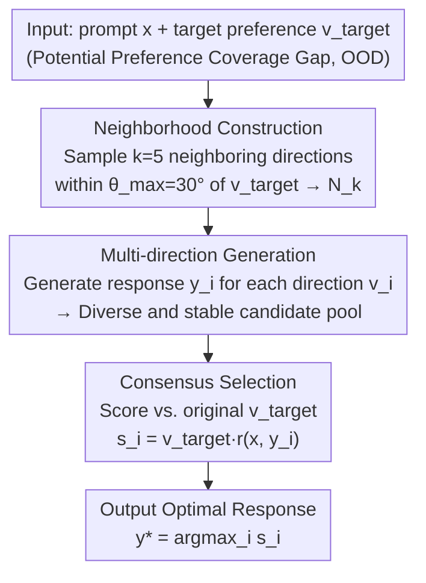

# Robust Preference Alignment via Directional Neighborhood Consensus

**Conference**: ICLR 2026  
**arXiv**: [2510.20498](https://arxiv.org/abs/2510.20498)  
**Code**: [rcmao/robust-preference-alignment](https://github.com/rcmao/robust-preference-alignment)  
**Area**: Signal and Communication  
**Keywords**: Preference Alignment, Robustness, Inference-time Adjustment, Directional Neighborhood Consensus, Out-of-Distribution Preferences

## TL;DR
The authors propose Robust Preference Selection (RPS), a training-free inference-time method for enhancing preference alignment. By sampling multiple candidate directions from the local neighborhood of the target preference to generate responses and selecting the optimal one according to the original preference, RPS achieves up to a 69% win rate over baselines on OOD preferences.

## Background & Motivation

Aligning Large Language Models (LLMs) with human preferences is critical for building reliable and controllable AI systems. User preferences can be modeled as directional vectors in a multi-dimensional space, where different dimensions represent trade-offs between attributes (e.g., helpfulness vs. verbosity). Existing alignment methods (RLHF, DPO, DPA, etc.) typically optimize for the "average" preference dominant in the training data.

**Key Challenge**: Training data has limited preference coverage, concentrating in narrow regions (Preference Coverage Gap). When a user's true preference deviates from the central tendency of the training distribution (i.e., OOD preferences), model performance degrades unpredictably. This represents a fundamental out-of-distribution (OOD) challenge.

**Limitations of Prior Work**:
1. Training-time methods (e.g., data augmentation, Distributionally Robust Optimization (DRO)) require expensive retraining processes and may still fail to generalize to the full preference spectrum.
2. Inference-time methods (e.g., token-level steering, activation guidance) require direct manipulation of model internal states or the introduction of auxiliary models.

**Key Insight**: The authors propose a crucial insight: **Instead of forcing the model to generate a response directly from a specific, uncommon preference direction (which is inherently brittle), it is better to explore the local neighborhood of that preference and generate a candidate response pool from more reliable neighboring directions, then select the response that best matches the original preference.** This paradigm shifts from "direct generation" to "neighborhood consensus selection."

## Method

### Overall Architecture

RPS (Robust Preference Selection) addresses the OOD problem where user preferences fall into training gaps, causing direct generation to fail. The method is a purely inference-time, three-stage pipeline that does not modify model parameters. Given a user prompt $x$ and a target preference vector $\mathbf{v}_{target}$ that may fall within a coverage gap, the method does not feed this brittle direction directly to the model. Instead, it first samples $k$ neighboring directions within an angular neighborhood of $\mathbf{v}_{target}$ closer to the training density, generates one response for each neighboring direction to form a diverse yet stable candidate pool, and finally returns to the original $\mathbf{v}_{target}$ to score and select the response most faithful to the user's intent. In short: the generation phase "swaps directions" for stability, while the selection phase "recognizes the target" for faithfulness.

The "preference coverage gap" and "projected reward" used for scoring are two foundational concepts throughout the process.

### Key Designs

**1. Formalization of Preference Space and Coverage Gap: Clarifying OOD Preferences**

User preferences are modeled as normalized direction vectors on a unit circle $\mathbf{v} = (\cos\theta, \sin\theta)$, where the angle $\theta$ parameterizes the trade-off between attributes like helpfulness and verbosity. A reward model maps a prompt-response pair to a reward vector $\mathbf{r}(x,y) = (r_h(x,y), r_v(x,y))$, and alignment quality is measured by the projected reward $\mathbf{v}_{target}^T \mathbf{r}(x,y)$. Under this framework, the authors define the **Preference Coverage Gap** as the difference between the complete preference spectrum $\mathcal{V}_{user}$ and the subset covered by training $\mathcal{V}_{train}$. When $\mathbf{v}_{target}$ falls into this gap, the model has not been sufficiently trained in that direction, leading to unpredictable output quality.

**2. Neighborhood Construction: Replacing Brittle Directions with Familiar Ones**

RPS avoids feeding the potentially brittle $\mathbf{v}_{target}$ directly into the model for generation. Instead, it samples $k$ neighboring preference directions within an angular threshold $\theta_{max}$ to form a local neighborhood $\mathcal{N}_k$ (typically $\theta_{max}=30°$, $k=5$). These neighboring directions are closer to the dense regions of the training distribution, where model performance is significantly more stable than in the original OOD direction.

**3. Multi-direction Generation: Upgrading Single-point Sampling to a Diverse Candidate Pool**

For each preference vector $\mathbf{v}_i$ in the neighborhood, the LLM generates an independent response $y_i$. Since each $\mathbf{v}_i$ encodes a slightly different attribute trade-off, the resulting $k$ responses vary in helpfulness and verbosity but originate from regions where the model is reliable. This creates a high-quality candidate pool with a computational cost strictly equivalent to baseline Best-of-N sampling, only differing in the source directions of the candidates.

**4. Consensus Selection: Neighborhood for Generation, Target for Evaluation**

After generating candidates, RPS returns to the **original target preference** $\mathbf{v}_{target}$ to score each candidate via $s_i = \mathbf{v}_{target}^T \mathbf{r}(x,y_i)$, selecting the one with the highest score as the final output $y^*$. This decoupling is the core of the method: the generation phase utilizes neighboring directions to gain stability, while the selection phase utilizes the target direction to ensure faithfulness to the user's true intent. Under the OOD performance degradation hypothesis (Assumption 1), the authors prove (Theorem 1) that the RPS candidate pool is superior to the baseline in terms of stochastic first-order dominance, thus $\mathbb{E}[\max(S_{RPS})] > \mathbb{E}[\max(S_{Baseline})]$.

### Loss & Training

RPS is a strictly training-free inference-time method. It involves no training or fine-tuning and acts as a post-hoc technique that can be applied to any pre-aligned preference model.

## Key Experimental Results

### Main Results
A 3×3 experiment matrix (3 models × 3 datasets) shows win rates exceeding 50% against the baseline for all pairings.

| Model | Dataset | RPS Win Rate | Description |
|------|--------|---------|------|
| DPA (DPA-v1-Mistral-7B) | UltraFeedback | ~60% | Strongest OOD gain |
| DPA | HelpSteer | ~60% | Consistent advantage |
| DPA | HelpSteer2 | ~61% | Consistent advantage |
| DPO (Zephyr-7B-Beta) | UltraFeedback | ~52% | Stable but modest |
| DPO | HelpSteer | ~53% | DPO has inherent robustness |
| DPO | HelpSteer2 | ~54% | Modest improvement |
| SFT (Mistral-7B-Instruct-v0.2) | UltraFeedback | 52% | Lowest improvement |
| SFT | HelpSteer | ~57% | Good improvement |
| SFT | HelpSteer2 | 67.3% | Maximum improvement — SFT benefits most |

### Directional Robustness (Preference Angle vs. Win Rate)

| Preference Direction | DPA/UltraFeedback | DPA/HelpSteer | SFT/HelpSteer2 |
|----------|-------------------|---------------|-----------------|
| v1 (10°) | 55.1% | 56.1% | 52.1% |
| v3 (20°) | 53.4% | 58.0% | 58.9% |
| v5 (30°) | 59.3% | 60.2% | 66.7% |
| v7 (40°) | 64.9% | 62.8% | 83.2% |
| v8 (45°) | 69.1% | 64.3% | 94.3% |

### Ablation Study

| Configuration | Key Metric | Description |
|------|---------|------|
| k=5 (Neighborhood Size) | Baseline Config | Computational cost strictly equal to baseline |
| θ_max=30° (Angular Threshold) | Optimal Balance | Too small → insufficient diversity; Too large → target deviation |

### Key Findings
- RPS exceeds a 50% win rate across all 9 model-dataset pairs, proving neighborhood consensus is a broadly effective post-hoc enhancement.
- **RPS advantages scale significantly with larger preference angles (more OOD)**: DPA reaches 69.1% at 45°, while SFT reaches 94.3% on HelpSteer2 at 45°.
- Different training paradigms benefit at different levels: SFT benefits most (lacks explicit preference training), DPO is relatively robust (possesses inherent robustness), and DPA shows the most significant improvements in OOD directions.
- Qualitative analysis indicates that RPS-generated responses are more detailed and targeted, better matching user intent.

## Highlights & Insights
- **Paradigm Shift**: A shift from "direct generation" to an inference-time "neighborhood sampling + selection" paradigm that is clear and powerful.
- **Solid Theory**: The theoretical framework based on stochastic first-order dominance elegantly proves the superiority of the method.
- **Zero-cost Deployment**: A purely inference-time method requiring no retraining, model-agnostic, and plug-and-play.
- **Computational Parity**: RPS generates the same number of candidates as the baseline; the only difference is the source of the preference directions for those candidates.
- **Deep Insights**: Reveals the OOD problem in preference alignment and quantifies the impact of the "preference coverage gap."
- **SFT Models Benefit Most**: Suggests that RPS can serve as an effective inference-time preference steering mechanism, replacing expensive RLHF training.

## Limitations & Future Work
- The preference space is limited to 2 dimensions (helpfulness and verbosity); performance in higher-dimensional spaces is unverified.
- Requires an available reward model to evaluate candidates, increasing inference overhead.
- $k=5$ implies a 5x inference cost (generating 5 responses), which may be unacceptable in latency-sensitive scenarios.
- Selection of neighborhood size $k$ and angular threshold $\theta_{max}$ relies on prior knowledge and lacks an adaptive adjustment mechanism.
- The theoretical framework relies on Assumption 1 (better model performance in neighboring directions), which may not hold in extreme OOD cases.
- Direct comparisons with other inference-time alignment methods (e.g., activation steering, ARGS) are missing.
- Limitations of GPT-4o-mini as a judge — model evaluation itself may have biases.

## Related Work & Insights
- **DPA (Directional Preference Alignment)**: This work builds upon the multi-dimensional preference space formalization of DPA.
- **Self-Consistency (Wang et al., 2022)**: Improves reliability by sampling multiple reasoning paths and aggregating consensus, similar in spirit to neighborhood consensus in RPS.
- **DRO (Distributionally Robust Optimization)**: A training-time robust optimization method; RPS provides a complementary inference-time solution.
- **Best-of-N Sampling**: RPS can be viewed as a directional generalization of Best-of-N — instead of repeated sampling from the same direction, it samples once from different directions.
- Insight: The concept of neighborhood consensus can be generalized to other conditional generation tasks (e.g., image style control, music generation) for handling OOD conditions.

## Rating
- Novelty: ⭐⭐⭐⭐ (Clear idea, though essentially a clever generalization of Best-of-N)
- Experimental Thoroughness: ⭐⭐⭐⭐ (3x3 matrix + multi-angle analysis + qualitative cases)
- Writing Quality: ⭐⭐⭐⭐⭐ (Clear formalization, intuitive visualization, tight integration of theory and experiments)
- Value: ⭐⭐⭐⭐ (High practical value as a plug-and-play inference-time enhancement)

<!-- RELATED:START -->

## Related Papers

- [\[ICLR 2026\] RE-PO: Robust Enhanced Policy Optimization as a General Framework for LLM Alignment](re-po_robust_enhanced_policy_optimization_as_a_general_framework_for_llm_alignme.md)
- [\[AAAI 2026\] Differentiated Directional Intervention: A Framework for Evading LLM Safety Alignment](../../AAAI2026/llm_alignment/differentiated_directional_intervention_a_framework_for_evading_llm_safety_align.md)
- [\[ICLR 2026\] Robust Reward Modeling via Causal Rubrics](robust_reward_modeling_via_causal_rubrics.md)
- [\[ICLR 2026\] When Weak LLMs Speak with Confidence, Preference Alignment Gets Stronger](when_weak_llms_speak_with_confidence_preference_alignment_gets_stronger.md)
- [\[ICLR 2026\] Towards Self-Robust LLMs: Intrinsic Prompt Noise Resistance via CoIPO](towards_self-robust_llms_intrinsic_prompt_noise_resistance_via_coipo.md)

<!-- RELATED:END -->
