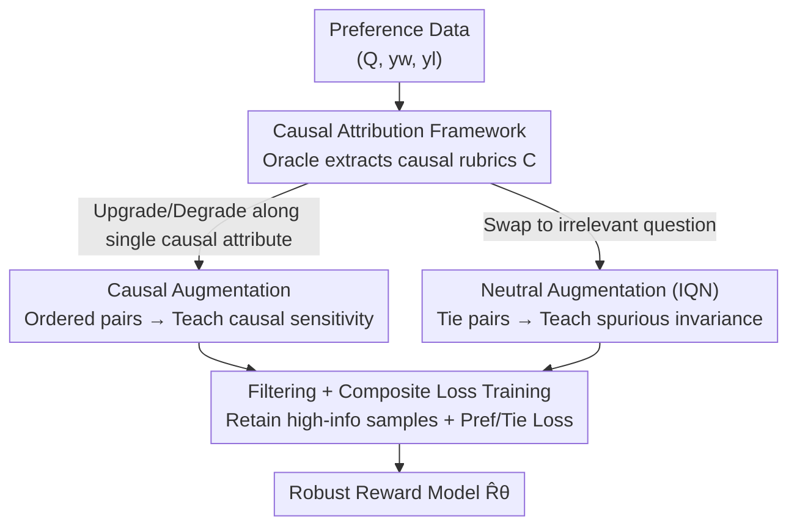

# Robust Reward Modeling via Causal Rubrics

**Conference**: ICLR 2026  
**OpenReview**: [https://openreview.net/forum?id=oP99JQiDYp](https://openreview.net/forum?id=oP99JQiDYp)  
**Code**: None  
**Area**: Alignment RLHF / Reward Modeling / Causal Inference  
**Keywords**: Reward Model, Reward Hacking, Causal Attributes, Counterfactual Augmentation, RLHF

## TL;DR
Addressing the issue where reward models (RM) exploit spurious features like length and format, CROME utilizes an Oracle LLM to list "causal rubrics" that determine true quality for each prompt. It then synthesizes two types of counterfactual data: "causal augmentation" (upgrading/degrading along a single causal attribute) and "neutral augmentation" (pairing answers with irrelevant questions). Combined with a composite loss, this makes the RM sensitive to causal attributes and invariant to unknown spurious ones, achieving an average improvement of 5.3% on RewardBench (+12.4% in Safety, +7.1% in Reasoning).

## Background & Motivation
**Background**: RLHF is the dominant paradigm for aligning Large Language Models (LLMs). Its core involves training a reward model (RM) using human preferences and then using RM scores to guide policy optimization (DPO / PPO / Best-of-N). The quality of the RM directly determines the alignment quality—its flaws are propagated directly to the final policy.

**Limitations of Prior Work**: Standard RMs often suffer from "reward hacking." Since preferred answers in training data are often longer, more elaborately formatted, or more sycophantic, RMs mistake these **surface/spurious features** (length, formatting, sycophancy) for sources of quality and assign them high scores. The standard Bradley-Terry preference loss does not constrain RMs to "rely only on true quality drivers," resulting in brittle RMs that prioritize these spurious shortcuts during policy optimization.

**Key Challenge**: True quality drivers ("causal attributes" like factuality and relevance) and spurious correlations (length, style) are **entangled** in the data. Furthermore, spurious attributes themselves are **high-dimensional and unknown**—one cannot predict which loophole the RM will exploit. Existing robustness methods either regularize against **pre-specified** spurious factors (e.g., specifically penalizing length bias), which misses unlisted ones, or use coarse non-contextual augmentation (e.g., RRM), failing to isolate causality from spuriousness precisely.

**Goal**: Train a robust RM under two strict constraints: (a) specific spurious attributes utilized by the RM are **unknown**, making direct intervention impossible; (b) only stable, invariant **causal attributes** (true quality dimensions from human preferences) are accessible.

**Key Insight**: The authors introduce an explicit causal graph: the true reward $R^*$ is determined only by the query $Q$ and the causal attributes of the answer $C(A)$. Given $C(A)$ and $Q$, $R^*$ is independent of spurious attributes $SP(A)$, i.e., $R^* \perp SP(A)\mid C(A),Q$. The relationship $(Q, C(A))\to R^*$ is **stable/invariant**, while correlations involving $SP(A)$ may shift across annotators or generators. Since the true signal resides in causal attributes and only they are accessible, interventions should be performed **only along causal attributes**.

**Core Idea**: An Oracle LLM explicitly lists causal rubrics for each prompt. **Counterfactuals are then synthesized only around these causal attributes**—creating contrastive pairs along causal attributes to teach "sensitivity" and creating tie pairs by re-pairing answers with irrelevant questions to teach "invariance." This suppresses RM reliance on spurious features without needing to identify what those features are.

## Method

### Overall Architecture
CROME (Causally Robust Reward Modeling) is a **data augmentation + loss modification** training framework that does not change the RM architecture and can be applied to any base (PairPM or Bradley-Terry). The core problem it solves is making the RM rely only on causal attributes when spurious attributes are unknown. The pipeline works as follows: first, an Oracle LLM extracts a set of "causal rubrics" $C=(C_1,\dots,C_\ell)$ (e.g., factuality, relevance, conciseness) for each $Q$. Using these rubrics as anchors, two types of counterfactual data are synthesized: **causal augmentation** (upgrading or degrading an answer along a single $C_j$ to generate pairs with explicit preference orders) and **neutral augmentation** (pairing the same answers with an irrelevant question to generate tie pairs). Next, a baseline RM filters these to keep only high-information samples that it is "uncertain about or misclassifies." Finally, the original preference data, causal pairs, and neutral pairs are combined to train a robust RM using a composite loss.

### Key Designs

**1. Causal Attribution Framework: Splitting rewards into causal and spurious, intervening only on causal rubrics**

This step addresses the fundamental constraint that "spurious attributes are unknown." Conceptually, an answer $A$ contains causal attributes $C(A)$ (factuality, relevance) and spurious attributes $SP(A)$ (length, format), where typically $\dim(C(A)) \ll \dim(SP(A))$ and $SP(A)$ is unknown. The true reward satisfies $R^*(Q,A)=f^*(Q,C(A))$, implying conditional independence $R^*\perp SP(A)\mid Q,C(A)$. It is explicitly assumed that $(Q,C(A))\to R^*$ is **stable** across experiments, while correlations involving $SP(A)$ drift. In practice, since $C(A)$ is latent, an Oracle LLM serves as a proxy: it is prompted to list and refine relevant causal rubrics $C_1,\dots,C_\ell$ for each $Q$. This serves as the anchor for all subsequent augmentations—**by obtaining the list of causal attributes, interventions can be limited to them, bypassing the impossible task of enumerating spurious attributes**. This is the fundamental difference between CROME and regularization methods targeting known spurious factors: it does not guess which loophole the RM will exploit but instead **affirmatively pulls** the RM's dependence toward stable causal dimensions.

**2. Causal Augmentation: Upgrading/degrading along a single causal attribute to teach sensitivity**

Knowing the causal attributes is insufficient; the RM must react to "quality changes along a causal attribute." CROME uses an LLM to generate **counterfactuals**: for an original answer $A$ and a causal attribute $C_j$, the LLM is prompted to modify ONLY $C_j$ while keeping other attributes unchanged, resulting in $\tilde A_{(C_j\leftarrow \text{target})}$. If $A$ is weak in $C_j$, an upgraded version $\tilde A_{(C_j\leftarrow \text{upgraded})}$ is generated, forming a preference pair $(\tilde A_{\text{upgraded}}, A)$; if $A$ is strong in $C_j$, a degraded version $\tilde A_{(C_j\leftarrow \text{degraded})}$ is generated, forming $(A, \tilde A_{\text{degraded}})$. These are validated and stored in $D_{\text{causal}}$. The preference order in these pairs is **driven only by the change in a single causal attribute**, forcing the RM to attribute score changes to this true signal rather than surface features—this is the "causal sensitivity" depicted in Figure 3.

**3. Neutral Augmentation (Irrelevant Query Neutrals): Tie pairs with irrelevant questions to teach invariance**

This is the most ingenious part of CROME and the key to its "unknown spurious attribute" solution. To teach invariance, one would typically perturb spurious attributes—but since they are unknown, they cannot be directly perturbed. CROME does the opposite: it takes a pair of answers $B_1, B_2$ (from the original data or causal augmentation) and **re-pairs them with a completely irrelevant question $Q_{\text{irrelevant}}$**. In the context of the new question, the causal attributes $C(B_i\mid Q_{\text{irrelevant}})\approx 0$—the original causal signals are now irrelevant, and the remaining differences between the answers **lie primarily in spurious attributes**. A **tie label** ($A_1\approx A_2$) is assigned, training the RM to give nearly identical scores when "no true causal signal is present." In other words, it does not need to name any spurious attribute; by creating a scenario where causal signals are neutralized and only spurious differences remain, and requiring the model to be indifferent, it suppresses a **wide range** of unknown spurious correlations simultaneously.

**4. Data Filtering + Composite Loss: Welding sensitivity and invariance into one objective**

The synthesized $D_{\text{aug}}=D_{\text{causal}}\cup D_{\text{neutral}}$ undergoes **filtering**: a baseline RM (trained only on original preference data) scores the pairs, and only those it is "uncertain about or incorrect on" are retained, focusing training on high-information hard negatives. Finally, a composite loss is minimized on $D=D_{\text{pref}}\cup D_{\text{aug, filtered}}$:

$$L(\theta) = -\!\!\sum_{(Q,y_w,y_l)\in D_{\text{pref}}\cup D_{\text{causal}}}\!\!\log \sigma(\Delta_{wl}) \;-\; \lambda\!\!\sum_{(Q,A_1,A_2,\,y=\text{tie})\in D_{\text{neutral}}}\!\!\Big[-\tfrac12\big(\log\sigma(\Delta_{12})+\log\sigma(-\Delta_{12})\big)\Big]$$

where $\Delta_{wl}=\hat R_\theta(Q,A_w)-\hat R_\theta(Q,A_l)$ and $\Delta_{12}=\hat R_\theta(Q,A_1)-\hat R_\theta(Q,A_2)$. The first term is the standard preference loss applied to original and causal pairs, responsible for **causal sensitivity**. The second is the tie loss, encouraging $\Delta_{12}\approx 0$ for neutral pairs (minimized when $\Delta_{12}=0$), responsible for **spurious invariance**, weighted by $\lambda\ge 0$ (set to 1 in experiments). Together, they ensure the model is "sensitive where it should be and indifferent where it should be."

### Loss & Training
Base models include Gemma-2-9B-IT / Qwen2.5-7B / Gemma-2-2B, supporting both PairPM and Bradley-Terry RM formats. UltraFeedback is used for training, with counterfactuals generated by Gemini-2.0-Flash (and Gemma-2-27B-IT for ablations). The tie weight for neutral augmentation is $\lambda=1$. A theoretical note: under composite loss, the $\ell_2$ norm of the error vector grows linearly with causal dimensions $k$ in the worst case and tends to zero when $R^*$ depends sparsely on causal factors, outperforming standard preference training where error can be proportional to $\|\theta\|_1$ (magnitude $O(k^2)$).

## Key Experimental Results

### Main Results
CROME compared against Vanilla RM and RRM (Prev. SOTA robust RM) on RewardBench (Gemma-2-9B-IT, PairPM and BT settings):

| Setting | Method | Average | Chat | Chat-Hard | Safety | Reasoning |
|------|------|---------|------|-----------|--------|-----------|
| PairPM | Vanilla RM | 81.22 | 97.90 | 63.64 | 77.48 | 85.88 |
| PairPM | RRM | 82.54 | 97.12 | 71.05 | 74.70 | 87.27 |
| PairPM | **Ours** | **87.84** | 97.54 | 72.30 | **87.14** | **94.39** |
| PairPM | Gain(Ours−RRM) | +5.30 | +0.42 | +1.25 | +12.44 | +7.12 |
| BT | **Ours** | **85.46** | 96.28 | 65.83 | **84.05** | **95.70** |
| BT | Gain(Ours−RRM) | +2.00 | −0.93 | −3.32 | +10.92 | +1.35 |

Ours achieves the largest gains on the most challenging **Safety (+12.44%) and Reasoning (+7.12%)** subsets. On reWordBench (testing robustness to semantics-preserving transformations), ours gains **+9.1%** in aggregate accuracy for PairPM/Gemma-2-9B-IT, improving on **21 out of 23 transformations** (including paraphrasing, adding irrelevant code/comments, punctuation perturbations). On RewardBench2, it outperforms RRM/RM by 1.5%/5.5% overall and by +2%/+4% on tie subsets, indicating better calibration.

### Key Findings
- **"Intervening only on causal attributes" is sufficient to suppress numerous unknown spurious correlations**: Ours was never specifically trained on reWordBench transformations, yet improved on 21/23 of them, validating the core hypothesis that enumerating spurious attributes is unnecessary.
- **Neutral Augmentation (IQN) is the primary source of spurious invariance**: Removing it results in a significant degradation of robustness to irrelevant perturbations.
- **Superior Safety-Refusal trade-off**: Ours lowers Attack Success Rate (ASR) for harmful prompts without increasing the refusal rate for benign prompts, as the contrastive pairs more faithfully characterize the decision boundary for harmful content.
- **Gains scale with difficulty**: Improvements are concentrated in Safety and Reasoning subsets where true causal judgment is required and spurious shortcuts are more likely to fail.

## Highlights & Insights
- **Inverse construction of "Neutral Augmentation"**: To teach spurious invariance without knowing the spurious factors, CROME creates a context where causal signals are neutralized, forcing the model to ignore remaining (spurious) differences—this cleverly bypasses the "enumeration bottleneck."
- **Dual losses for causality and spuriousness**: Causal pairs use preference loss for sensitivity, while neutral pairs use tie loss for invariance. This clean structure can be applied to any RM without architectural changes.
- **High Translatability**: The workflow—extracting causal rubrics via Oracle and generating counterfactuals along them—can be migrated to any robust scoring/discrimination task (e.g., RAG relevance, content moderation). The core is pulling the discriminator's reliance back to stable causal dimensions.

## Limitations & Future Work
- **Heavy reliance on Oracle LLM attribution quality**: Causal rubrics are proxies. If the Oracle misses key quality dimensions or mistakes spurious features for causal ones, the augmentation chain fails. The paper acknowledges these counterfactuals as "imperfect approximations."
- **Counterfactual generation costs and controllability**: Modifying a single causal attribute while keeping everything else unchanged is difficult in text; spurious attributes often co-vary (as shown in Figure 3). Approximation errors remain unquantified.
- **Strong theoretical assumptions**: The assumptions that $R^*$ only depends on causal attributes and that $(Q,C(A))\to R^*$ is stable are idealized; in real human preferences, causal and spurious factors may not be so cleanly separable.
- **Future Directions**: Developing closed-loop iterations between rubric extraction and RM training, automated validation of counterfactual quality, and extending IQN to multilingual and multimodal preferences.

## Related Work & Insights
- **vs RRM (Liu et al., 2024)**: RRM uses coarse non-contextual/cross-query augmentation to suppress spuriousness but does not tie back to specific attributes. Ours explicitly enumerates causal rubrics for each query and intervenes only on them, offering finer granularity and +5.3% higher RewardBench scores.
- **vs ODIN (Chen et al., 2024)**: ODIN decouples quality and length rewards at the architecture level, targeting only "length." Ours makes no assumptions about which spurious factors exist, covering many unknown correlations via data augmentation, and achieves much higher LC-WR on AlpacaEval.
- **vs Specific Regularization (e.g., MMD, Wang et al., 2025) / RATE (Reber et al., 2024)**: These methods either target pre-specified factors or focus on evaluation rather than training. Ours is a data-centric training solution that "trains" robustness into the RM using counterfactuals.

## Rating
- Novelty: ⭐⭐⭐⭐⭐ The "intervene on causal + tie on irrelevant" strategy to bypass enumeration of unknown spurious factors is novel and self-consistent.
- Experimental Thoroughness: ⭐⭐⭐⭐⭐ Multiple backbones, PairPM/BT settings, comprehensive coverage across RewardBench, reWordBench, DPO, BoN, and Safety.
- Writing Quality: ⭐⭐⭐⭐ Causal graphs and motivations are clear, though some implementation details are relegated to the appendix.
- Value: ⭐⭐⭐⭐⭐ Directly addresses the critical reward hacking issue in RLHF with a generalizable, plug-and-play solution.

<!-- RELATED:START -->

## Related Papers

- [\[ICLR 2026\] Truthful or Fabricated? Using Causal Attribution to Mitigate Reward Hacking in Explanations](truthful_or_fabricated_using_causal_attribution_to_mitigate_reward_hacking_in_ex.md)
- [\[ICLR 2026\] Omni-Reward: Towards Generalist Omni-Modal Reward Modeling with Free-Form Preferences](omni-reward_towards_generalist_omni-modal_reward_modeling_with_free-form_prefere.md)
- [\[ICLR 2026\] Bradley–Terry and Multi-Objective Reward Modeling Are Complementary](bradley-terry_and_multi-objective_reward_modeling_are_complementary.md)
- [\[ICLR 2026\] Beyond Binary Preferences: A Principled Framework for Reward Modeling with Ordinal Feedback](beyond_binary_preferences_a_principled_framework_for_reward_modeling_with_ordina.md)
- [\[ICLR 2026\] RewardBench 2: Advancing Reward Model Evaluation](rewardbench_2_advancing_reward_model_evaluation.md)

<!-- RELATED:END -->
