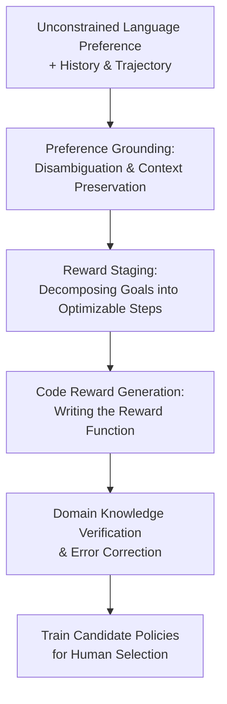

# ROSETTA: Constructing Code-Based Reward from Unconstrained Language Preference

**Conference**: ICLR 2026  
**OpenReview**: [https://openreview.net/forum?id=Ig6goVdtjb](https://openreview.net/forum?id=Ig6goVdtjb)  
**Paper**: [OpenReview](https://openreview.net/forum?id=Ig6goVdtjb)  
**Code**: None  
**Area**: Alignment RLHF / Language Preference Reward Construction / Embodied AI  
**Keywords**: Language Preference Alignment, Code Reward, Reinforcement Learning, Embodied AI, Human Feedback

## TL;DR
ROSETTA decomposes spontaneous, time-varying natural language preferences in robot interactions into three steps: "preference grounding, reward staging, and code generation/verification," generating online trainable code reward functions that achieve an 87% success rate and 86% human satisfaction across 116 preferences.

## Background & Motivation
**Background**: For embodied AI in reinforcement learning to act according to human preferences, the bottleneck is the availability of optimizable rewards rather than control algorithms. Traditional reward shaping requires expert-authored objectives, distances, and success conditions. RLHF and reward modeling typically require extensive offline data or specialized reward models. Recent LLM code generation capabilities (e.g., Eureka, Text2Reward) have demonstrated that LLMs can write dense rewards for robotic tasks from language descriptions.

**Limitations of Prior Work**: Existing methods often assume clean, static, and structured goals. Real users do not always say "place the red cube on the green cube"; they might say "not that one," "slower, that looks too aggressive," "put the red one in the middle," or "that was good, but switch to the left box." These preferences are vague, dependent on visual and historical context, and may override previous objectives. Feeding such raw language directly into code models often leads to misinterpretations of pronouns, spatial relations, or historical goals; even if the code runs, the reward function might optimize behavior irrelevant to user intent.

**Key Challenge**: The fundamental contradiction is that human preferences are naturally open, subjective, and dynamic, whereas reinforcement learning requires explicit, differentiable/optimizable, and state-conditioned reward functions. A preference in a user's mind corresponds to an unknown and time-varying satisfaction function $F^{(t)}$, but robot training can only consume a reward $R^{(t)}$ in code form. The problem is not just "generating a reward," but interpreting the latest preferences, history, current rollouts, and environment geometry into a new, trainable reward objective at every turn.

**Goal**: ROSETTA aims to achieve three things: first, handle unconstrained natural language preferences including colloquialisms, vague references, multi-part requests, and context dependencies; second, generate executable and optimizable code rewards after a single turn of preference rather than collecting feedback for a fixed goal; third, utilize an evaluation system closer to alignment than simple training success rates to verify if generated rewards truly match human intent.

**Key Insight**: Rather than training a new general reward model, the authors decompose the capabilities of foundation models: using vision-language models to understand rollouts and language, LLM planning to decompose goals into reward stages, and reasoning/code models to generate reward code, followed by validation against domain knowledge checklists. This approach avoids retraining reward models for every new preference and converges open language into forms expressible by environment code.

**Core Idea**: A modular pipeline of "semantic grounding, then staging, finally code generation and verification" translates open human language preferences into reward functions that reinforcement learning can optimize.

## Method

### Overall Architecture
The input to ROSETTA is not a clean task description but the full context of an interaction: the original task, images/trajectories of the previous policy rollout, historical preferences, and the current user preference. The system first uses Preference Grounding to rewrite spontaneous feedback into explicit, contextualized instructions. Then, Staging breaks these instructions into a staged plan suitable for dense rewards. Finally, the Coding module converts the plan into environment reward code, refined through domain knowledge checks and error correction.

From a formal perspective, classic reward generation assumes a fixed task description $l$ and a known fitness function $\bar{F}$, aiming to generate $R$ maximizing $\bar{F}(A_M(R))$. ROSETTA handles a harder version: at turn $t$, user preference $h^{(t)}$ changes the hidden satisfaction function $F^{(t)}$. The system must generate $R^{(t)}$ based on history $\{l^{(0)}, h^{(1)}, \ldots, h^{(t)}\}$ such that the trained policy $\pi^{(t)} = A_M(R^{(t)})$ satisfies the user. Since $F^{(t)}$ cannot be hard-coded as a standard success rate, both the method and evaluation acknowledge human judgment as the core objective.

### Key Designs
**1. Preference Grounding: Translating "Human Talk" into Environment-Referable Task Semantics**

The first step of ROSETTA is solving language reference and context issues before writing rewards. Users might say "no, get it to the center," where "it" and "center" are ambiguous, and "no" might negate previous goals. The Preference Grounding module provides rollout images, symbolic states, frame-by-frame language descriptions, original tasks, and history to GPT-4o. The model generates three outputs: an execution summary, a disambiguated grounded preference, and a single-sentence task goal for the next turn.

**2. Reward Staging: Using Language Planning to Structure Open Goals into Dense Rewards**

Many robotic preferences appear as single sentences but are difficult to train as endpoint-only success conditions. The Staging module takes grounded preferences, environment code, and task descriptions to output a natural language stage plan. Each stage defines a state outcome rather than a vague action intent. This leverages LLM planning to create a design specification for reward engineering, ensuring open language details are preserved while providing RL with a step-by-step optimizable reward landscape.

**3. Code Reward Generation & Domain Knowledge Review: Ensuring "Trainable" Reward Code**

The Coding module receives the stage plan, environment attributes, and a domain knowledge checklist, then uses o1-mini to generate the reward function. The difficulty in reward code lies in the "reward shape": distance rewards must be dense, stage masks must be timed correctly, and behavioral penalties (like speed or smoothness) must not overpower the primary objective. ROSETTA feeds domain knowledge as both initial prompts and verification questions to check geometry, target positions, and masking.

**4. Three-Axis Evaluation: Separating Alignment, Semantic Matching, and Optimizability**

Traditional RL only measures success rates, but in open preferences, success only indicates an agent optimized *a* reward, not necessarily the *correct* one. ROSETTA splits evaluation into: Alignment (human satisfaction), Semantic Match (expert review of preference-code pairs for common-sense errors), and Optimizability (success rate of the trained policy). This prevents misleading results where a reward might be easy to train but ignores the user's actual intent.

### Loss & Training
ROSETTA is not an end-to-end trained neural network and introduces no new differentiable loss functions; it generates reward functions $R^{(t)}$ for downstream RL. Training strategies vary by environment: short-horizon tasks use 7-DoF operational space control trained with PPO, while long-horizon tasks use primitive skills from MAPLE trained with SAC. Multiple reward variants are generated per preference; the system trains up to three per generation and selects the checkpoint with the highest success rate.

## Key Experimental Results

### Main Results
Evaluation was conducted on 5 task-agnostic robot manipulation environments involving 35 preference chains and 116 total preferences.

| Setting | Total Prefs | Grounding | Staging | Coding | Cascading | Success Rate | Success >50% | Satisfied | Satisfaction Score |
|------|--------|-----------|---------|--------|-----------|--------------|-------------|-----------|--------------------|
| Short Horizon | 80 | 95.7 | 87.3 | 84.6 | 78.1 | 89.2 | 90.1 | 84.8 | 76.4 |
| Long Horizon | 36 | 80.0 | 90.0 | 82.9 | 78.6 | 82.2 | 88.8 | 88.8 | 92.4 |
| **Overall** | **116** | **~90+** | **~88** | **~84** | **~78** | **87.0** | **~90** | **86.0** | **79.0** |

ROSETTA significantly outperforms baselines like Eureka/Text2Reward particularly in "Preferential," "Goal-related," and "Context-dependent" preference types, where the underlying task or behavior requirements change.

### Ablation Study
| Configuration | Observed Change |
|------|-------------|
| **Full ROSETTA** | Achieves best overall alignment and optimizability. |
| **No-grounding** | Alignment significantly drops; rewards often ignore historical context or pronouns. |
| **No-staging** | Performance drops across most types; the model struggles to structure dense rewards. |
| **No-followup** | Behavioral and geometric details suffer, leading to poorly shaped reward landscapes. |

### Key Findings
- ROSETTA maintains high satisfaction scores across 4-turn preference chains without collapse.
- Optimizability and alignment are distinct: users sometimes prefer lower-success policies if the behavior aligns better with their intent.
- Domain knowledge checklists improved code executability from 79.35% to 95.38%.
- Real-world robot experiments showed minimal sim-to-real gaps in feasibility.

## Highlights & Insights
- **Redefining Reward Generation as Dynamic Alignment**: Focuses on the changing satisfaction function $F^{(t)}$ rather than a static goal.
- **Pragmatic Modular Decomposition**: Separates semantic interpretation, reward structuring, and environment implementation.
- **Checklists as Essential Engineering**: Explicitly prompting for common reward engineering pitfalls (masking, density, offsets) is more effective than "magic" zero-shot prompts.
- **Three-Axis Evaluation**: Crucial for diagnosing why an agent fails to satisfy a user despite high training metrics.

## Limitations & Future Work
- **Simulator Specificity**: Checklist and prompts are currently tied to specific environment APIs.
- **Expert Dependency**: Semantic matching still requires manual expert review.
- **Error Propagation**: Hallucinations in earlier turns (e.g., incorrect height offsets) can persist into subsequent reward code.
- **Temporal Constraints**: Current reward formulations struggle with preferences like "release after placing" or "throw from a height."
- **Safety**: Robust safety filters for generated reward code are not yet integrated.

## Related Work & Insights
- **vs. Eureka**: Eureka focuses on refining rewards for fixed targets via a fitness function. ROSETTA handles changing targets and open language.
- **vs. Text2Reward**: ROSETTA's grounding and staging allow it to handle much more colloquial and context-dependent feedback.
- **Mechanism Insight**: By not training a new model, ROSETTA leverages the reasoning of foundation models to achieve "zero-shot" adaptation to unseen human preferences.

## Rating
- Novelty: ⭐⭐⭐⭐
- Experimental Thoroughness: ⭐⭐⭐⭐
- Writing Quality: ⭐⭐⭐⭐
- Value: ⭐⭐⭐⭐⭐

## Related Papers

- [\[ACL 2025\] Dynamic Scaling of Unit Tests for Code Reward Modeling](../../ACL2025/llm_alignment/dynamic_scaling_of_unit_tests_for_code_reward_modeling.md)
- [\[ICLR 2026\] Towards Understanding Valuable Preference Data for Large Language Model Alignment](towards_understanding_valuable_preference_data_for_large_language_model_alignmen.md)
- [\[ICLR 2026\] Skywork-Reward-V2: Scaling Preference Data Curation via Human-AI Synergy](skywork-reward-v2_scaling_preference_data_curation_via_human-ai_synergy.md)
- [\[ICLR 2026\] Chasing the Tail: Effective Rubric-based Reward Modeling for Large Language Model Post-Training](chasing_the_tail_effective_rubric-based_reward_modeling_for_large_language_model.md)
- [\[ICLR 2026\] Omni-Reward: Towards Generalist Omni-Modal Reward Modeling with Free-Form Preferences](omni-reward_towards_generalist_omni-modal_reward_modeling_with_free-form_prefere.md)

<!-- RELATED:END -->

<!-- RELATED:START -->

## Related Papers

- [\[ICLR 2026\] Skywork-Reward-V2: Scaling Preference Data Curation via Human-AI Synergy](skywork-reward-v2_scaling_preference_data_curation_via_human-ai_synergy.md)
- [\[ICLR 2026\] Towards Understanding Valuable Preference Data for Large Language Model Alignment](towards_understanding_valuable_preference_data_for_large_language_model_alignmen.md)
- [\[ICLR 2026\] PALC: Preference Alignment via Logit Calibration](palc_preference_alignment_via_logit_calibration.md)
- [\[ICLR 2026\] Semi-Supervised Preference Optimization with Limited Feedback](semi-supervised_preference_optimization_with_limited_feedback.md)
- [\[ICLR 2026\] Robust Preference Alignment via Directional Neighborhood Consensus](robust_preference_alignment_via_directional_neighborhood_consensus.md)

<!-- RELATED:END -->
