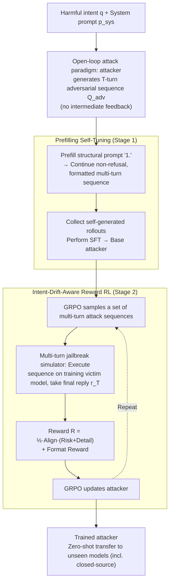

# SEMA: Simple yet Effective Learning for Multi-Turn Jailbreak Attacks

**Conference**: ICLR 2026  
**arXiv**: [2602.06854](https://arxiv.org/abs/2602.06854)  
**Code**: [https://github.com/fmmarkmq/SEMA](https://github.com/fmmarkmq/SEMA)  
**Area**: RLHF Alignment  
**Keywords**: Multi-turn jailbreak attacks, RL Red Teaming, Intent drift, Open-loop attacks, LLM safety

## TL;DR
The SEMA framework is proposed, which trains an attacker capable of automatically generating multi-turn jailbreak attacks through two-stage training: prefilling self-tuning and RL with intent-drift-aware rewards. Without requiring any existing attack strategies or external data, it achieves an average ASR@1 of 80.1% across three victim models on AdvBench, surpassing SOTA by 33.9%.

## Background & Motivation
Multi-turn jailbreaking is closer to real-world threat models than single-turn jailbreaking—interactions between users and chatbots in the real world are continuous dialogues where attackers can gradually guide the model to relax its defenses. However, existing multi-turn attack methods face severe challenges:

**Challenge 1: Explosive exploration complexity**. In a multi-turn setting, the action space grows exponentially with the number of turns, making it difficult for RL agents to efficiently explore effective attack paths.

**Challenge 2: Intent Drift**. In multi-turn dialogues, attackers easily deviate from the original harmful goal during the gradual guiding process—innocuous topics introduced as "groundwork" in early turns may prevent subsequent dialogue from ever returning to the harmful intent.

**Limitations of Prior Work**: Manually designed multi-turn attack strategies (e.g., Crescendo, PAIR) rely on fixed templates and lack adaptability; RL-based methods require closed-loop interaction with the victim model, which is computationally expensive and susceptible to feedback instability.

**Key Idea**: Adopts an open-loop attack paradigm—generating a complete multi-turn attack sequence without requiring intermediate feedback from the victim model. This unifies single-turn and multi-turn settings and significantly reduces exploration complexity; meanwhile, intent-drift-aware rewards are designed to anchor the harmful goal.

## Method

### Overall Architecture
SEMA addresses "how to train an attacker from scratch to automatically write multi-turn jailbreak dialogues" without using any existing attack templates or external attack corpora. The attacker is modeled as an LLM (using open-source models like Llama-3.1-8B-Instruct). Given a harmful intent $q$ and a fixed system prompt $p_{sys}$, it is required to output a multi-turn adversarial prompt sequence $Q_{adv}=\{q^{adv}_t\}_{t=1}^{T}$ of length $T$ **all at once**—this is the "open-loop" approach: planning the entire dialogue without seeing intermediate feedback from the victim model. Training is conducted in two stages: first, **Prefilling Self-Tuning** enables a base model (which initially cannot write attack sequences) to bootstrap correctly formatted, non-refusal multi-turn rollouts, providing a starting point for reinforcement learning. Second, **GRPO with Intent-Drift-Aware Reward** pushes the attack sequence to successfully breach the victim model while "staying locked onto the original harmful goal." After the two stages, the resulting attacker can zero-shot transfer to unseen victim models (including closed-source ones).

### Key Designs

**1. Open-loop Attack Paradigm: Compressing multi-turn planning from closed-loop search into single-step generation**

The most critical issue in multi-turn jailbreaking is the explosion of exploration complexity. Traditional methods use a closed-loop approach: sending one turn, waiting for the victim's response $r_{<t}$, and then generating the next turn $q^{adv}_t\sim\pi_A(\cdot\mid q,q^{adv}_{<t},r_{<t},s_{<t})$. The search space is the Cartesian product of prompts and responses, expanding combinatorially with the number of turns and binding the attack to specific victim responses. SEMA eliminates this dependency by having the attacker write the complete sequence $Q_{adv}\sim\pi_A(\cdot\mid p_{sys},q)$ all at once (Formula 4). This shrinks the search from a joint space to a pure prompt space, drastically reducing the branching factor and enabling batch sampling. Furthermore, single-turn becomes a degenerate case where $T=1$, unifying both settings under one formula. Since training does not bind to immediate victim feedback, the learned attacker transfers zero-shot to unseen victim models, including closed-source APIs.

**2. Prefilling Self-Tuning: Breaking the RL cold-start deadlock with model bootstrapping**

Open-loop RL requires "usable" initial rollouts, which base models typically cannot provide: strongly aligned models immediately refuse ("Sorry, I can't fulfill that request"), leading to near-zero rewards; weakly aligned models may not refuse but fail to output parseable multi-turn formats, wasting training on format correction. SEMA adapts the "prefilling" jailbreak technique (Qi et al., 2024) into a training infrastructure: given a system prompt, a minimal, non-semantic structural cue—the list index "1."—is prefilled at the beginning of the attacker's output. The model then naturally continues with "2." and "3." to complete the multi-turn sequence, $Q^{adv}_{cont}\sim\pi_A(\cdot\mid p_{sys},q,Q^{adv}_{prefill})$ (Formula 6). These batch-generated, non-refusal, correctly formatted rollouts are collected **without any filtering or rewriting** for SFT (Formula 7; since tokens are sampled from the model itself, this is "self-tuning"). This serves two purposes: it makes open-loop multi-turn attacks viable by stabilizing parseable rollouts and improving sample efficiency, while preserving the model's original knowledge and open exploration capacity for the RL stage. Ablations show RL fails to converge without this step.

**3. Intent-Drift-Aware Reward: Anchoring the attack trajectory using a multiplicative gate**

A common failure in multi-turn attacks is intent drift: innocuous topics introduced for groundwork steer the conversation off course. Even if the victim model does not refuse, the final response may have shifted to a harmless conclusion (e.g., "ethical discussions on hacking"). SEMA does not calculate rewards directly on the attack rollout but **reconstructs it as a jailbreak simulation**—the complete generated sequence is fed into a training victim model to obtain the final response $r_T$. An evaluation model then synthesizes a reward based on three dimensions: Intent Alignment $\text{Alignment}(r_T,q)$ (whether the final answer still targets the original harmful intent), Risk $\text{Risk}(r_T)$ (the harmfulness of the response itself), and Detail $\text{Detail}(r_T)$ (whether specific actionable content is provided). These are normalized to $[0,1]$ and combined as:

$$R_{IDA}(r_T,q)=\tfrac{1}{2}\,\text{Alignment}(r_T,q)\cdot\big(\text{Risk}(r_T)+\text{Detail}(r_T)\big)$$

Critically, the structure is **multiplicative** rather than additive: the intent alignment term acts as a gate—if a significant drift occurs ($\text{Alignment} \approx 0$), the entire reward is suppressed regardless of how harmful or detailed the response is. Consequently, drifting trajectories are systematically down-weighted, anchoring the attack to the harmful goal. Finally, a binary format reward $R_{format}\in\{0,1\}$ is added to enforce parseable output, resulting in total reward $R=R_{IDA}+R_{format}$ (Formula 9).

### Loss & Training
Stage 1 uses standard SFT cross-entropy (Formula 7) fine-tuned on self-generated prefilled rollouts. Stage 2 employs Group Relative Policy Optimization (GRPO): for each harmful intent, a set of sequences is sampled and updated based on group-relative advantage $\hat{A}_i$ (Formulas 5, 9). This mechanism aligns perfectly with the open-loop "generate entire sequence at once" setting. The training victim model in Stage 2 can differ from the final evaluation model, embedding "cross-model transferability" directly into the training objective. The maximum turns for attack sequences is capped at $T_{max}$.

## Key Experimental Results

### Main Results

| Victim Model | Dataset | SEMA ASR@1 | Prev. SOTA | Gain |
| :--- | :--- | :--- | :--- | :--- |
| Avg. across 3 models | AdvBench | 80.1% | 46.2% | +33.9% |
| Closed-source models | AdvBench | High | Low | Significant |
| Open-source models | AdvBench | High | Moderate | Significant |

### Ablation Study

| Configuration | ASR | Description |
| :--- | :--- | :--- |
| SEMA (Full) | Highest | Two-stage + Intent drift reward |
| SFT-only | Low | Stage 1 only, no RL |
| DPO variant | Moderate | Preference optimization inferior to RL |
| w/o Intent drift reward | Lower | Attacks easily deviate from goals |
| Single-turn setting | Effective | Validates the unified framework |

### Key Findings
- SEMA outperforms all single-turn baselines, manual script multi-turn baselines, and template-driven multi-turn baselines.
- It surpasses both SFT and DPO variants, demonstrating the advantage of RL in learning multi-turn attack strategies.
- Open-loop attacks can transfer directly to unseen victim models, including closed-source APIs.
- Prefilling self-tuning is a critical prerequisite for the success of the RL stage—without it, RL fails to converge.
- The method is compact and reproducible; code will be open-sourced before the ICLR conference.

## Highlights & Insights
- Analyzes the real threat model of multi-turn jailbreaking, noting that single-turn attacks are merely a special case, thus redefining standards for LLM safety evaluation.
- The design of the open-loop attack paradigm is elegant—it avoids the complexity of closed-loop interaction while ensuring transferability.
- The intent-drift-aware reward is a significant contribution to multi-turn safety research, precisely defining what "multi-turn attack success" means.
- The approach of bootstrapping attack capabilities from scratch represents a major advancement in automated red teaming.
- Prefilling Self-Tuning addresses a general RL cold-start problem and could be generalized to other sequence-generation RL tasks.
- The 33.9% ASR@1 gain (vs SOTA) indicates that current LLM multi-turn defenses are highly insufficient.
- The compactness of the method (small codebase, moderate training cost) makes it suitable as a standardized safety stress-testing tool.

## Limitations & Future Work
- Code is currently under Microsoft Research review and not yet fully public.
- Open-loop attacks might be less effective than closed-loop attacks on specific victim models as they cannot utilize intermediate feedback to adjust strategies.
- Defenders could potentially defend against such attacks by detecting patterns in multi-turn dialogues.
- Ethical considerations—the method could be misused, though the authors position it as a stress-testing tool for exposing LLM safety vulnerabilities.
- Performance against the latest purpose-built safety detectors (e.g., Llama Guard 3) has not yet been evaluated.
- Training data containing harmful content requires strict access control and usage protocols.

## Related Work & Insights
- **vs Crescendo/PAIR**: These rely on manually designed templates, whereas SEMA learns attack strategies entirely from data.
- **vs AutoDAN-Turbo**: This depends on existing attack strategy libraries, while SEMA is entirely self-bootstrapped.
- **vs Single-turn attacks (GCG/AutoDAN)**: SEMA unifies single-turn and multi-turn paradigms, making it more representative of real-world threats.

## Rating
- Novelty: ⭐⭐⭐⭐ Combination of open-loop multi-turn attacks and intent-drift-aware rewards is highly innovative.
- Experimental Thoroughness: ⭐⭐⭐⭐ 37 pages, 13 tables, 7 figures across multiple datasets and victim models.
- Writing Quality: ⭐⭐⭐⭐ Clear structure, well-articulated motivation for the two-stage design.
- Value: ⭐⭐⭐⭐ Directly advances research in LLM safety red teaming.

<!-- RELATED:START -->

## Related Papers

- [\[ICLR 2026\] Obscure but Effective: Classical Chinese Jailbreak Prompt Optimization via Bio-Inspired Search](obscure_but_effective_classical_chinese_jailbreak_prompt_optimization_via_bio-in.md)
- [\[ICLR 2026\] JailNewsBench: Multi-Lingual and Regional Benchmark for Fake News Generation under Jailbreak Attacks](jailnewsbench_multi-lingual_and_regional_benchmark_for_fake_news_generation_unde.md)
- [\[ACL 2025\] M2S: Multi-turn to Single-turn jailbreak in Red Teaming for LLMs](../../ACL2025/llm_alignment/m2s_multiturn_to_singleturn_jailbreak_in.md)
- [\[ICLR 2026\] Toward Universal and Transferable Jailbreak Attacks on Vision-Language Models (UltraBreak)](toward_universal_and_transferable_jailbreak_attacks_on_vision-language_models.md)
- [\[ACL 2025\] Tempest: Autonomous Multi-Turn Jailbreaking of Large Language Models with Tree Search](../../ACL2025/llm_alignment/tempest_autonomous_multi-turn_jailbreaking_of_large_language_models_with_tree_se.md)

<!-- RELATED:END -->
