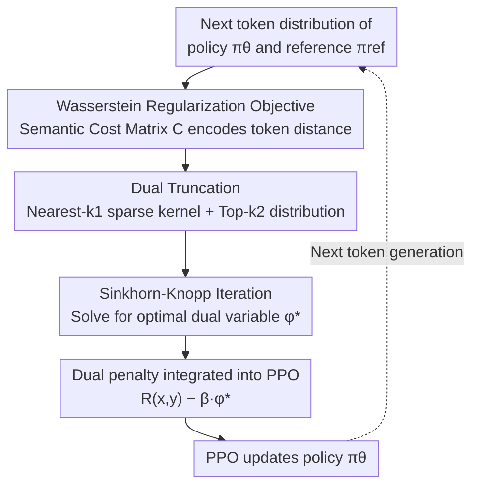

# Semantic-aware Wasserstein Policy Regularization for Large Language Model Alignment

**Conference**: ICLR 2026  
**arXiv**: [2602.01685](https://arxiv.org/abs/2602.01685)  
**Code**: [https://github.com/aailab-kaist/WPR](https://github.com/aailab-kaist/WPR)  
**Area**: Alignment RLHF  
**Keywords**: Wasserstein distance, RLHF regularization, semantic-aware, optimal transport, Sinkhorn algorithm

## TL;DR
This paper identifies that standard KL divergence regularization in RLHF only compares token probabilities at the same index while ignoring semantic similarity. It proposes Semantic-aware Wasserstein Policy Regularization (WPR) based on entropy-regularized Wasserstein distance. By leveraging a dual formulation, the regularization is transformed into a token-level penalty term, which consistently outperforms KL and various f-divergence baselines in dialogue generation and summarization tasks.

## Background & Motivation
RLHF is the mainstream paradigm for LLM alignment. The standard workflow involves scoring with a reward model while using KL divergence regularization to prevent the policy from deviating too far from the reference model. KL divergence is widely used in practice because it can be computed directly from the token probabilities of two policies and easily integrated into PPO training.

However, KL divergence and other f-divergences (such as JS, $\chi^2$, TV, etc.) have a fundamental limitation: **they only compare token probabilities at the same index position, completely ignoring the semantic relationships between tokens**.

The paper illustrates this issue with an intuitive example: assume the vocabulary is {cat, kitten, dog, table}, and the reference policy concentrates probability on "cat." Policy 1 concentrates probability on "kitten," while Policy 2 concentrates on "table." Semantically, "cat" and "kitten" are very close, while "cat" and "table" are unrelated. However, KL divergence yields extreme values due to support mismatch (unfair to Policy 1), and JS divergence gives identical distance values to Policy 1 and Policy 2—neither reflects semantic distance.

**Key Challenge**: KL/f-divergences are "index-wise comparisons" and cannot utilize the geometric structure of the token space. In language generation, shifting probability from "cat" to "kitten" should incur a fundamentally different penalty than shifting it to "table."

**Key Insight**: Replace KL divergence with Wasserstein distance for policy regularization, as Wasserstein distance naturally considers the metric structure of the underlying space, enabling it to encode semantic distances between tokens.

## Method

### Overall Architecture
The core problem WPR addresses is that standard RLHF uses KL to pull the policy back to the reference model, but KL only compares probabilities token-by-token at the same index, failing to distinguish between "moving probability from cat to kitten" versus "to table." WPR replaces the KL regularization term in the objective with entropy-regularized Wasserstein (Sinkhorn) distance, making the regularization aware of semantic distances between tokens.

The engineering challenge lies in the fact that Wasserstein distance requires solving a linear programming problem, has high complexity, and cannot be written as a token-level penalty like KL to be plugged into PPO. The method follows a computational chain: first, a **semantic cost matrix** is constructed using the reference model's embedding distances to encode "semantic proximity equals low transport cost"; then, **dual truncation** reduces the vocabulary-wide calculation to a constant scale; next, the **Sinkhorn-Knopp iteration** solves for the optimal dual variable $\phi^*$; finally, the dual theorem allows $\phi^*$ to be used as a **token-level reward penalty** within PPO, leaving the rest of the process unchanged.

### Key Designs

**1. Wasserstein Regularization Objective: Making Regularization Aware of Token Semantic Geometry**

Standard RLHF uses KL to pull the policy toward the reference model. However, since KL only compares probabilities at the same index, it cannot distinguish between "shifting probability from cat to kitten" and "to table." WPR replaces the token-wise KL term in the objective with an entropy-regularized Wasserstein distance $D_{\tilde{W}}$. The optimization objective becomes $\max_{\pi_\theta} \mathbb{E}[\sum_n R(\mathbf{x}, \mathbf{y}_{1:n}) - \beta \sum_n D_{\tilde{W}}(\pi_\theta(y_n|\cdot) \| \pi_{ref}(y_n|\cdot))]$. The key is the cost matrix $C$, which takes the Euclidean distance in the reference policy's token embedding space. Thus, the geometric structure where "transporting probability between semantically similar tokens is cheap, and expensive for unrelated ones" is directly encoded into the regularization, addressing the blind spot of KL. Wasserstein distance also has the benefit of being well-defined even when the supports of two distributions do not overlap, unlike KL which can diverge to infinity.

**2. Dual Truncation: Reducing $O(d^2)$ Vocabulary Computation to Constant Scale**

The first obstacle after changing the objective to Wasserstein is scale: calculating the cost matrix for the entire vocabulary is $O(d^2)$, which is unsustainable for vocabularies exceeding 256K. WPR uses two stages of truncation: first, Nearest-$k_1$ truncation keeps only the $k_1=512$ nearest neighbors for the kernel matrix $K = \exp(-\lambda C)$ using sparse storage, as probability transport between distant tokens is negligible. Second, Top-$k_2$ truncation limits the policy distribution to the top $k_2=128$ tokens, reducing the effective support from $d$ to $2k_2+2$. With both truncations, the additional computational overhead per 1k steps is only ~2.5%, with ~15GB extra VRAM (A100), making it nearly cost-free in practice. Ablations show that too aggressive a $k_2$ truncation (e.g., 64) leads to significant performance drops, indicating a need for sufficient effective support.

**3. Sinkhorn-Knopp for Dual Variables: Stable Convergence with Few Iterations**

After truncation, the optimal transport problem must be solved. While direct Wasserstein distance requires linear programming, the introduction of entropy regularization turns it into the Sinkhorn distance. Its dual optimality conditions correspond to matrix row and column scaling factors, which can be solved efficiently using the classical Sinkhorn-Knopp iteration—alternating row and column normalization to approximate the optimal dual solution $\phi^*$. In practice, 10 iterations usually suffice for convergence (tolerance $10^{-4}$). The number of iterations is a sensitive hyperparameter: decreasing to 5 iterations causes significant performance loss due to insufficient convergence, while increasing to 30 offers no additional gain.

**4. Dual Penalty Integration into PPO: Converting Transport into Reward Penalty**

The final step is making $\phi^*$ usable for training. Unlike KL, Wasserstein distance cannot naturally be written as a token-level penalty for PPO. The paper bridges this gap using the dual form of the Sinkhorn distance: it proves (Theorem 2) that the optimal dual variable $\phi^*$ acts precisely as a token-level reward penalty term. The objective can be rewritten as $\mathcal{J}_{\tilde{W}}(\pi_\theta) = \mathbb{E}[\sum_n \mathbb{E}_{y_n}[R(\mathbf{x}, \mathbf{y}_{1:n}) - \beta \phi^*_{y_n}]] + \mathcal{C}$. This step is the pivot for implementation: during training, one simply replaces the original KL penalty with $\phi^*$, keeping the rest of the PPO pipeline intact with minimal engineering changes.

### Loss & Training
The overall process follows the standard three-stage RLHF pipeline: SFT → Reward Model → PPO. Only the PPO stage replaces the KL penalty with the Wasserstein dual variable. Experiments use Gemma-2B as the base model, trained on TL;DR (summarization) and HH-RLHF (dialogue), with default hyperparameters $\lambda=100$, $k_1=512$, $k_2=128$.

## Key Experimental Results

### Main Results (GPT-4 Win Rate)

| Divergence/Method | TL;DR vs SFT | TL;DR vs RKL | HH-RLHF vs SFT | HH-RLHF vs RKL |
|-----------|-------------|-------------|-----------------|-----------------|
| RKL | 0.848 | - | 0.828 | - |
| FKL | 0.316 | 0.040 | 0.808 | 0.564 |
| JS | 0.540 | 0.204 | 0.744 | 0.424 |
| $\alpha$(0.5) | 0.724 | 0.304 | 0.792 | 0.524 |
| TV | 0.364 | 0.052 | 0.748 | 0.376 |
| $\chi^2$ | 0.904 | - | - | - |
| **Wasserstein** | **0.924** | **0.608** | **0.852** | **0.596** |

### Ablation Study

| Configuration | vs SFT | vs RKL | Note |
|------|--------|--------|------|
| Default (L2, k1=512, k2=128, λ=100) | 0.924 | 0.608 | Best |
| Cost: cosine | 0.932 | 0.644 | Cosine slightly better than L2 |
| k1=256 | 0.920 | 0.572 | Fewer neighbors, slight drop |
| k2=64 | 0.864 | 0.528 | Excessive distribution truncation, significant drop |
| λ=10 | 0.868 | 0.552 | Entropy regularization too strong |
| Sinkhorn iter=5 | 0.708 | 0.328 | Insufficient convergence, severe drop |
| Sinkhorn iter=30 | 0.880 | 0.536 | No extra gain from more iterations |

### Key Findings
- WPR consistently outperforms KL and all f-divergence baselines across all tasks, being the only method to maintain optimality on both TL;DR and HH-RLHF.
- FKL and TV were unstable during training on TL;DR (probability ratio explosion), whereas WPR is well-defined even with support mismatch.
- WPR achieved the highest score in MT-Bench evaluation (4.272 vs RKL 4.000).
- It is equally effective in code generation (APPS + CodeGemma-7B).
- The Wasserstein penalty is strongly positively correlated with the KL penalty (r=0.917), but the slope < 1 indicates WPR is more tolerant.
- Models trained with WPR exhibit significantly higher semantic consistency among top-10 candidate tokens.
- Computational overhead increases by only 2.5% (per 1k steps), with a memory increase of approximately 15GB (A100).

## Highlights & Insights
- Re-examines RLHF regularization from the perspective of optimal transport theory; the theory is elegant and practical.
- The cat/kitten/table example in Figure 2 is highly persuasive, intuitively demonstrating the blind spot of KL.
- The dual formula transforms Wasserstein regularization into a token-level reward penalty, allowing seamless integration with PPO.
- The truncation strategy is cleverly designed to reduce $O(d^2)$ to $O(k_2^2)$, making computational overhead almost negligible.
- Case studies (Figure 6) intuitively show that WPR applies small penalties for semantically similar tokens and large penalties for semantic drift.

## Limitations & Future Work
- The cost matrix depends on the embeddings of the reference model; it cannot be directly transferred between models with different tokenizers.
- Validation was only performed at the 2B-7B scale; the scaling characteristics for larger models are unknown.
- $\beta$ still requires manual tuning (though it is more robust than f-divergences); automatic adjustment is a future direction.
- Extending WPR to the DPO paradigm (which does not require an explicit reward model) is a natural next step.

## Related Work & Insights
- **vs KL-DPO/PPO**: Standard methods that only compare probabilities index-wise, ignoring semantics.
- **vs f-DPO/χPO**: Generalizations to other f-divergences, but still based on index-wise comparisons.
- **vs Wasserstein GAN**: Also utilizes Wasserstein distance, but for generative model discriminators vs. policy regularization here.
- **vs MA-RLHF**: Concurrent work improving RLHF regularization, but from the perspective of action granularity.

## Rating
- Novelty: ⭐⭐⭐⭐⭐ Introduces Optimal Transport to RLHF regularization with outstanding theoretical innovation.
- Experimental Thoroughness: ⭐⭐⭐⭐⭐ Comparison across two tasks and seven divergences, multiple model scales, code generation, and comprehensive ablation.
- Writing Quality: ⭐⭐⭐⭐⭐ Rigorous theoretical derivation, clear intuitive explanations, and excellent case analysis.
- Value: ⭐⭐⭐⭐⭐ Fundamental improvement to RLHF regularization with the potential to become a new standard.

<!-- RELATED:START -->

## Related Papers

- [\[ICLR 2026\] Towards Understanding Valuable Preference Data for Large Language Model Alignment](towards_understanding_valuable_preference_data_for_large_language_model_alignmen.md)
- [\[ICLR 2026\] Multi-objective Large Language Model Alignment with Hierarchical Experts](multi-objective_large_language_model_alignment_with_hierarchical_experts.md)
- [\[ICLR 2026\] Test-Time Alignment for Large Language Models via Textual Model Predictive Control](test-time_alignment_for_large_language_models_via_textual_model_predictive_contr.md)
- [\[ICLR 2026\] GuardAlign: Test-time Safety Alignment in Multimodal Large Language Models](guardalign_test-time_safety_alignment_in_multimodal_large_language_models.md)
- [\[ICLR 2026\] Chasing the Tail: Effective Rubric-based Reward Modeling for Large Language Model Post-Training](chasing_the_tail_effective_rubric-based_reward_modeling_for_large_language_model.md)

<!-- RELATED:END -->
