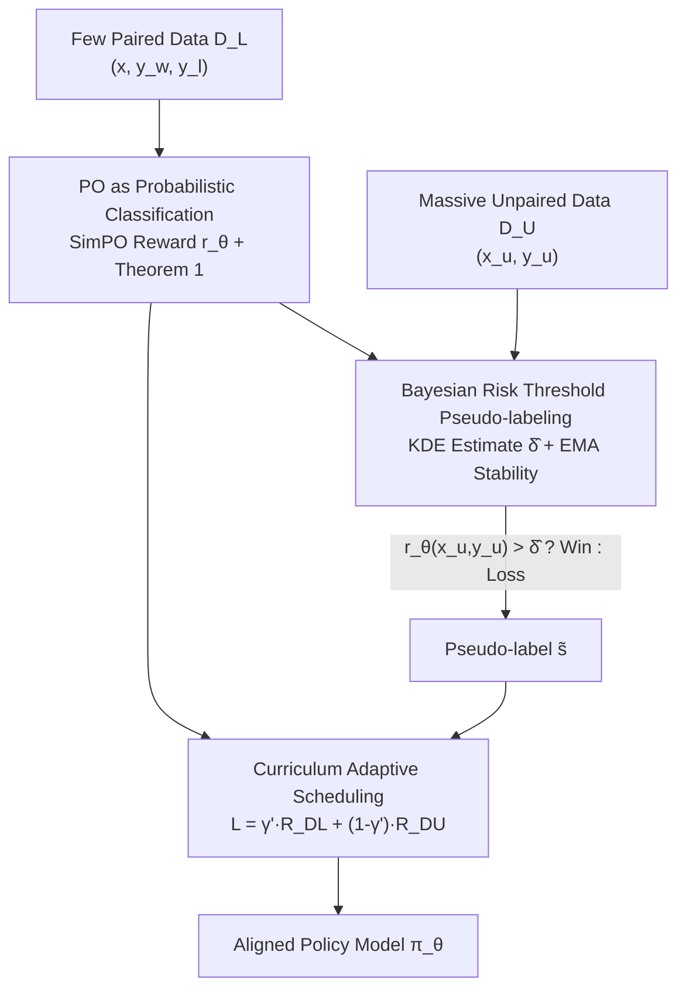

# Semi-Supervised Preference Optimization with Limited Feedback

**Conference**: ICLR 2026  
**OpenReview**: [https://openreview.net/forum?id=ghwxbTx7do](https://openreview.net/forum?id=ghwxbTx7do)  
**Code**: https://github.com/MLAI-Yonsei/SSPO  
**Area**: Alignment RLHF  
**Keywords**: Preference Optimization, Semi-supervised Learning, Pseudo-labeling, Reward Threshold, Data Efficiency

## TL;DR
SSPO reformulates preference optimization as a probabilistic classification problem. It learns a reward threshold from a small amount of paired preference labels that can reliably separate "winning" and "losing" responses. This threshold is then used to assign pseudo-labels to a massive amount of unpaired samples (e.g., SFT data), which are jointly trained using a curriculum scheduling. Using only 1% of UltraFeedback, SSPO consistently outperforms strong baselines trained on 10% of the data.

## Background & Motivation
**Background**: Preference Optimization (PO) is the core method for aligning LLMs with human values. From RLHF and DPO to SimPO, ORPO, and KTO, mainstream approaches rely on **paired** preference data $(x, y_w, y_l)$—given a prompt, annotators must choose the better response from a pair.

**Limitations of Prior Work**: Such paired annotations are extremely expensive, costing an average of 5–10 minutes and \$10–30 per comparison. Expert annotation in specialized fields like medicine or business is a significant bottleneck. To reduce costs, existing works have turned to synthetic feedback or automated labeling by LLMs, but these methods lack verifiable ground truth, making quality difficult to guarantee.

**Key Challenge**: On one hand, paired preference labels are scarce and expensive. On the other hand, a large amount of existing SFT data (Q&A pairs, domain corpora) is rich in **implicit preferences** (coherent logic, appropriate tone) but is discarded by PO due to the lack of explicit preference labels. Using synthetic data or self-labeling can lead to a "feedback loop" where the model reinforces its own biases, amplifying errors.

**Goal**: To effectively utilize implicit preferences in unpaired data under a setting with few paired labels and many unpaired samples, reducing annotation costs without sacrificing alignment quality. The authors formally define this problem as **Semi-Supervised Preference Optimization (SSPO)**.

**Key Insight**: The authors observe that when a reward function is trained on a small amount of paired data, the reward values for winning and losing responses naturally form a **separable margin**. Thus, they investigate whether a reward threshold exists that can separate the two categories with high probability. If it does, it can be used to pseudo-label unlabeled data.

**Core Idea**: Reformulate preference learning as probabilistic binary classification. Theoretically prove the existence of an **optimal reward threshold** $\delta^*$, then use Kernel Density Estimation (KDE) to find this threshold in practice for theoretically grounded pseudo-labeling of unpaired data. Finally, utilize curriculum scheduling to jointly optimize paired and pseudo-labeled data.

## Method

### Overall Architecture
The core mechanism of SSPO is: **Train a reward function with a small amount of paired data → Find a threshold in the reward space that separates winners/losers → Assign pseudo-labels to massive unpaired data using the threshold → Jointly train the policy model via curriculum scheduling**.

The reward function follows the reference-free form of SimPO: $r_\theta(x, y) = \frac{\beta}{|y|}\log \pi_\theta(y\mid x)$, treating the model's own length-normalized log-likelihood as the reward, thus requiring no additional reward or reference models. Paired data $D_L$ provides reliable supervision ensures the reward of $y_w$ is higher than $y_l$. This creates a gap between winning and losing reward distributions. SSPO uses KDE within this gap to locate a threshold $\hat\delta$ that **minimizes Bayesian risk**. For each response in the unpaired data $D_U$, a pseudo-label $\tilde s = 1$ (win) is assigned if its reward exceeds $\hat\delta$, otherwise $\tilde s = 0$ (loss). The final training objective is a weighted sum of paired loss and pseudo-label loss, with the weight $\gamma'$ adaptively decaying to implement a curriculum: "prioritize reliable paired data first, then gradually lean on unpaired data."

### Key Designs

**1. Reformulating Preference Optimization as Probabilistic Classification and Proving Optimal Threshold Existence**

To pseudo-label unpaired data, there must be a theoretical basis for whether rewards can reliably distinguish winners from losers. The authors first remodel preference learning as a Bayesian optimal classification problem: defining a preference classifier $f_\theta(x, y, y') \to [0,1]$ that outputs the confidence that $y$ is better than $y'$, using the Bradley-Terry form $f_\theta = \sigma(r_\theta(x,y) - r_\theta(x,y'))\cdot P(s{=}1) + \sigma(r_\theta(x,y') - r_\theta(x,y))\cdot P(s{=}0)$ to map reward differences to preference probabilities. For paired data, since labels are always $s = 1$, the risk function simplifies to the standard preference optimization objective $\mathbb{E}_{D_L}[-\log\sigma(r_\theta(x, y_w) - r_\theta(x, y_l))]$—demonstrating that this classification perspective is consistent with existing PO.

Based on this, "finding a threshold" is formalized as minimizing the misclassification risk $R(\delta) = P(s{=}1)\int_{-\infty}^{\delta} p(r\mid s{=}1)\,dr + P(s{=}0)\int_{\delta}^{\infty} p(r\mid s{=}0)\,dr$, which measures the overlap area of the win/loss reward distributions. **Theorem 1** proves: when rewards for winners and losers follow sub-Gaussian distributions with means satisfying $\mu_w > \mu_l$, for any $\alpha \in (0,1)$, there exists an optimal threshold $\delta^*$ within the interval $[\mu_l + t_1, \mu_w - t_2]$ such that $P(\max_i r_\theta(x^{(i)}, y_l^{(i)}) \le \delta^* \le \min_j r_\theta(x^{(j)}, y_w^{(j)})) \ge 1 - \alpha$. Essentially, if the reward model learns a sufficient margin, a threshold exists to separate the two classes with high probability, providing statistical legitimacy for pseudo-labeling.

**2. Pseudo-labeling via Bayesian Risk Thresholding**

Theorem 1 guarantees the existence of $\delta^*$, but it depends on unknown true means $\mu_w, \mu_l$. SSPO solves this by using **Kernel Density Estimation (KDE)** to estimate the reward densities $\hat p_w(r)$ and $\hat p_l(r)$ for winners and losers from the paired data (using a Gaussian kernel with bandwidth $h$), then numerically searching for $\hat\delta = \arg\min_\delta \hat R(\delta)$ to minimize estimated Bayesian risk.

With this threshold, SSPO assigns pseudo-labels $\tilde s_k = \mathbb{I}\{r_\theta(x_u^{(k)}, y_u^{(k)}) > \hat\delta\}$ and defines the risk for unpaired data as $R_{D_U}(f_\theta) = \frac{1}{n_U}\sum_k \ell(f_\theta, \tilde s_k)\cdot P_{D_U}(s {=} \tilde s_k)$. A key trick is introducing a **virtual comparison** $y_b$—whose reward falls exactly on the decision boundary—allowing single samples to fit into the preference classifier framework. The prior $P_{D_U}(s{=}1)$ is fixed at 0.5. To handle distribution shifts, $\hat\delta$ is stabilized using **EMA (Exponential Moving Average)** to prevent the boundary from collapsing due to reward non-stationarity.

**3. Curriculum Adaptive Scheduling**

Simply summing paired and pseudo-labeled losses is risky: early in training, the reward function is underdeveloped, and distribution overlap causes noisy pseudo-labels. Over-reliance on them can amplify errors (confirmation bias). SSPO uses an adaptive coefficient $\gamma'$ for curriculum learning: $L(f_\theta) = \gamma' \cdot R_{D_L}(f_\theta) + (1-\gamma')\cdot R_{D_U}(f_\theta)$, where $\gamma' = \max\{\gamma_{\min}, \gamma_0 \cdot \exp(-\lambda\tau)\}$. $\gamma_0 = 1$ initially and decays exponentially with training steps $\tau$ toward the lower bound $\gamma_{\min} = n_L/(n_L + n_U)$.

The effect: the model initially trusts reliable paired data as anchors to learn clean preference patterns. As the reward function improves and the margin clears, the weight of unpaired data increases. This aligns with the "early learning" phenomenon where models learn clean patterns before overfitting to noise.

## Key Experimental Results

### Main Results
On real-world data, UltraFeedback is used for paired data, with 1% ($n_L{=}611$) and 10% ($n_L{=}6{,}113$) simulating scarcity. Unpaired data is 10% of UltraChat-200k ($n_U{=}20{,}786$). Evaluation uses AlpacaEval2.0 (Length-Controlled Win Rate LC, Original Win Rate WR) and MT-Bench with GPT-4-Turbo as the judge.

| Dataset / Backbone | Setting | Metric | SSPO | Strongest Baseline | Note |
|--------|------|------|------|----------|------|
| UltraFeedback / Mistral-7B | 1% | LC | **26.7** | 18.2 (SPA) | Excels all 1% baselines |
| UltraFeedback / Mistral-7B | 1% vs Baseline 10% | LC | **26.7** | 19.1 (SPA, 10%) | 1% data beats 10% baseline |
| UltraFeedback / Mistral-7B | 10% | LC | **30.0** | 19.1 (SPA) | Significantly leading |
| UltraFeedback / Phi-2 | 1% | LC / WR | **7.2 / 4.1** | 4.3 / 2.6 | Leads on small models |
| UltraFeedback / Llama3-8B | 10% | LC / WR | **20.7 / 20.8** | 16.7 / 18.2 (KTO) | Outperforms KTO |

In cross-domain experiments (UltraMedical-Preference, DSP Business), SSPO outperforms the strongest baselines across various scales using Llama3 backbones, verifying its effectiveness in professional domains.

### Ablation Study

| Config | Key Metric (Mistral, 10% UF, LC/WR) | Note |
|------|------|------|
| Full (Adaptive Scheduling ✓) | 30.0 / 20.7 | Full model |
| Fixed $\gamma'{=}0.5$ | 29.3 / 19.8 | Still beats baseline but performance drops |
| Fixed $\gamma'{=}0.1$ | 27.5 / 18.1 | Premature reliance on unpaired data causes larger drops |
| Prior 0.5 | 30.0 / 20.7 | Best default |
| Prior 0.1 / 0.9 | 25.6 / 25.7 (LC) | Over-confident priors overfit to noisy labels |

Toy experiments (GPT-2-small RM, shortest word preference) show: in noise-free settings with $n_L{=}100$, SSPO reaches 0.960 accuracy (SimPO only 0.817). Even with 50% label noise at $n_L{=}10$, SSPO maintains 0.757, far exceeding DPO/SimPO (~0.59), proving robustness to label noise.

### Key Findings
- **Adaptive Scheduling is Critical**: Removing it or using fixed $\gamma'$ leads to performance drops, especially when leaning toward unpaired data too early. The "paired-first, unpaired-later" sequence is essential.
- **Prior 0.5 is the Most Robust**: Deviating from neutrality (0.1/0.9) causes overfitting to noisy pseudo-labels, though even the worse priors outperform baselines.
- **Incredible Data Efficiency**: Mistral at 1% UltraFeedback outperforms all 10% baselines, reducing paired annotation needs by roughly an order of magnitude.
- **Reward Distribution Evolution**: When win/loss distributions overlap early, the scheduler prioritizes paired loss anchors. Once the margin opens, KDE+EMA thresholds track the optimal boundary to avoid confirmation bias.

## Highlights & Insights
- **Theoretically Grounded Thresholding**: Instead of heuristic filtering, SSPO proves the existence of an optimal threshold under sub-Gaussian assumptions and searches for it via Bayesian risk minimization, turning pseudo-labeling into a statistically sound operation.
- **Virtual Comparison $y_b$ Trick**: By introducing an imaginary opponent at the decision boundary, the method seamlessly adapts single unpaired samples into the paired classifier framework, reusing the same $f_\theta$.
- **Curriculum Scheduling meets Early Learning**: Using $\gamma'$ exponential decay to "trust paired data early and pseudo-labels later" avoids confirmation bias, a common trap in self-training. This scheduling logic is transferable to other semi-supervised pseudo-labeling scenarios.
- **Reference-Free Reward Cost Reduction**: Adopting SimPO's length-normalized likelihood as reward saves hardware costs of reference and reward models. The overhead is localized to KDE threshold estimation.

## Limitations & Future Work
- **Reliance on Separability Assumption**: Theorem 1 assumes rewards are sub-Gaussian and $\mu_w > \mu_l$. If paired data is insufficient or too noisy, the distributions may not separate, leading to unreliable thresholds.
- **Fixed Prior as a Simplification**: $P_{D_U}(s{=}1)$ is fixed at 0.5, assuming an even split in unpaired data. This may not hold if the unpaired pool is of significantly high or low quality.
- **Hard Thresholding**: The binary split at $\hat\delta$ ignores confidence. Soft-weighting based on proximity to the boundary could reduce mislabeling in ambiguous regions.
- **Future Directions**: Exploring adaptive priors, soft labels for samples near the threshold, or decoupling KDE thresholds from domain-specific reward scales.

## Related Work & Insights
- **vs DPO / SimPO / ORPO / KTO**: Standard PO methods discard unpaired data, limiting efficiency. SSPO reuses SimPO rewards but incorporates unpaired data via pseudo-labeling, significantly outperforming them at 1% data.
- **vs SSRM (Semi-Supervised Reward Modeling)**: While SSRM also uses self-training for reward modeling, SSPO provides a theoretical existence proof for the threshold and minimizes Bayesian risk, while optimizing the policy directly.
- **vs SPA (Spread Preference Annotation)**: SPA relies on iterative self-labeling with updated preference models, which is computationally expensive and riskier for error amplification. SSPO use KDE thresholds and curriculum scheduling in a more stable and efficient single-pass manner.

## Rating
- Novelty: ⭐⭐⭐⭐⭐ Reformulating PO as classification with a theoretical thresholding proof is a significant contribution to semi-supervised alignment.
- Experimental Thoroughness: ⭐⭐⭐⭐ Coverage of toy/real-world, 3 backbones, and 3 domains is solid, though win-rates are primarily GPT-judged.
- Writing Quality: ⭐⭐⭐⭐ The link between theory and practice is clear.
- Value: ⭐⭐⭐⭐⭐ Reducing paired annotation requirements by an order of magnitude is highly practical for cost-sensitive domain alignment.

<!-- RELATED:START -->

## Related Papers

- [\[ICLR 2026\] Stackelberg Learning from Human Feedback: Preference Optimization as a Sequential Game](stackelberg_learning_from_human_feedback_preference_optimization_as_a_sequential.md)
- [\[ICLR 2026\] Anchored Supervised Fine-Tuning](anchored_supervised_fine-tuning.md)
- [\[ACL 2025\] Fine-grained Video Dubbing Duration Alignment with Segment Supervised Preference Optimization](../../ACL2025/llm_alignment/fine-grained_video_dubbing_duration_alignment_with_segment_supervised_preference.md)
- [\[ICLR 2026\] What's In My Human Feedback? Learning Interpretable Descriptions of Preference Data](whats_in_my_human_feedback_learning_interpretable_descriptions_of_preference_dat.md)
- [\[ICLR 2026\] Multiplayer Nash Preference Optimization](multiplayer_nash_preference_optimization.md)

<!-- RELATED:END -->
