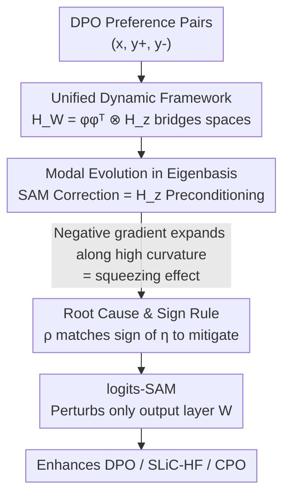

# Sharpness-Aware Minimization in Logit Space Efficiently Enhances Direct Preference Optimization

**Conference**: ICLR 2026  
**OpenReview**: [https://openreview.net/forum?id=4mE2FlL66E](https://openreview.net/forum?id=4mE2FlL66E)  
**Code**: https://github.com/RitianLuo/logits-sam-dpo  
**Area**: Alignment RLHF  
**Keywords**: DPO, squeezing effect, Sharpness-Aware Minimization, logit space, curvature regularization

## TL;DR
This paper explains the "squeezing effect" in DPO training (where the probability of preferred responses paradoxically decreases) from the perspective of logit space dynamics, identifying that negative gradients cause residuals to expand wildly along high-curvature directions. The authors prove that the curvature regularization of SAM effectively suppresses this expansion and implement a near-zero-overhead "logits-SAM" by perturbing only the output layer, providing consistent improvements for DPO and its variants on Pythia-2.8B, Mistral-7B, and Gemma-2B-IT.

## Background & Motivation
**Background**: Direct Preference Optimization (DPO) has become the mainstream offline algorithm for aligning LLMs. It reparameterizes the implicit reward as the log-likelihood ratio between the policy and a reference policy, optimizing a closed-form objective directly on preference pairs $(x, y^+, y^-)$ using the Bradley–Terry model, thereby avoiding explicit reward model training and ensuring stability.

**Limitations of Prior Work**: DPO exhibits a persistent and counterintuitive "squeezing effect" (also known as likelihood displacement): during training, **the generation probability of the preferred response $y^+$ decreases instead of increasing**. This contradicts the original goal of the DPO objective. This phenomenon leads to performance degradation, reduced safety, and potential alignment failure (e.g., decreasing the refusal rate of harmful prompts in AI safety scenarios).

**Key Challenge**: The issue stems from the term in the DPO loss tied to the "rejected response $y^-$," which acts as a **negative objective**—equivalent to gradient descent with a negative learning rate. Negative gradient updates cause residual vectors to **expand rapidly along high-curvature directions** corresponding to large eigenvalues of the Hessian, which is the root cause of the squeezing effect. Prior work (Ren & Sutherland, 2024) proved that the probability of the ground-truth class must decrease while that of the most confident incorrect class must increase, but lacked a unified framework to characterize the evolution of all categories and provide a comprehensive solution.

**Goal**: (1) Establish a unified theoretical framework to track both parameter space and logit space dynamics to pinpoint the cause of the squeezing effect; (2) Prove within this framework that "curvature-aware training" can suppress this drift; (3) Implement the theory as a practical training technique with negligible overhead.

**Key Insight**: The authors turn to Sharpness-Aware Minimization (SAM), which seeks flat minima in supervised learning by minimizing the worst-case loss within a parameter neighborhood—essentially a form of curvature regularization. Since the squeezing effect is an expansion along high-curvature directions, an optimizer that suppresses curvature should mitigate it.

**Core Idea**: By using the logit Hessian to unify second-order dynamics in both parameter and logit spaces, the authors prove that SAM mitigates the squeezing effect when the "perturbation radius $\rho$ has the same sign as the learning rate." They then simplify SAM into **logits-SAM**, which only perturbs the output layer, capturing the benefits of curvature regularization at negligible cost.

## Method

### Overall Architecture
This work is "theory-driven + minimalist implementation." The main logic is: **calculate DPO learning dynamics in a tractable simplified setting, locate the root cause of the squeezing effect, prove that SAM can fix it via a simple sign rule, and finally implement this rule as the efficient logits-SAM perturbing only the output layer**.

Specifically, the authors follow the multi-class logistic regression + fixed features (kernel regime) setting of Ren & Sutherland (2024): features $\phi(x)$ are fixed, logits $z = W\phi$, probabilities $p = \mathrm{softmax}(z)$, and residuals $g = p - y$. The $y^+$ term in DPO corresponds to standard descent with a positive learning rate, while the $y^-$ term corresponds to negative gradient updates with a negative learning rate. Within this abstraction, the authors bridge the geometric connection between the parameter space Hessian $H_W$ and the logit Hessian $H_z$, deriving unified dynamic equations for GD and SAM across parameter/logit/residual spaces. By diagonalizing the vector dynamics into scalar evolutions under the eigenbasis of $H_z$, they reveal how the SAM correction term acts on each curvature direction—concluding that "matching the sign of $\rho$ with the learning rate mitigates squeezing."

### Key Designs

**1. Unified Dynamic Framework: "Down-projecting" parameter space second-order effects to logit space**

Analyzing curvature regularization like SAM requires the Hessian, but the parameter space Hessian $H_W \in \mathbb{R}^{Vd \times Vd}$ is too high-dimensional. Proposition 3.1 provides a critical geometric bridge: under fixed features, $H_W = (\phi\phi^\top) \otimes H_z$. Thus, when $\phi \neq 0$, $\mathrm{rank}(H_W) = \mathrm{rank}(H_z)$, and the second-order effect of any parameter perturbation **only acts through its induced logit perturbation $\Delta W \phi$**. This means the entangled second-order dynamics in $\mathbb{R}^{Vd}$ can be equivalently studied in the much smaller logit Hessian $H_z \in \mathbb{R}^{V \times V}$.

Using this bridge, Theorem 3.2 provides the unified expansion for SAM across parameter, logit, and residual spaces (with $O(\eta^2)$ remainder), where the residual evolution is:

$$g^{t+1} = \big(I - \eta\mu H_z^t - \eta\mu\,\tilde\rho^{\,t}(H_z^t)^2\big)(p^t - y) + r_g^t,$$

with the equivalent perturbation coefficient $\tilde\rho^{\,t} = \rho\sqrt{\mu}/\|g^t\|$. When $\rho = 0$, this degrades to standard GD. SAM adds a preconditioning correction term composed of $(H_z)^2$ compared to GD. The value of this framework is that GD and SAM share the same structure, differing only by the curvature correction term.

**2. Root Cause of Squeezing Effect & SAM Sign Rule: Negative gradients expand along high curvature; matching $\rho$ sign suppresses it**

With the unified framework, the authors diagonalize the residual dynamics in the eigenbasis of $H_z$ (Corollary 3.4): letting $e_k^t = (v_k^t)^\top g^t$ be the modal coefficient of the residual on eigenvector $v_k^t$, then:

$$e_k^{t+1} = \Big(1 - \eta\mu\big(\lambda_k^t + \tilde\rho^{\,t}(\lambda_k^t)^2\big)\Big)e_k^t + r_k^t.$$

This decomposes vector dynamics into coordinate-wise scalars. SAM's role is clear: it adds a correction term proportional to $(\lambda_k^t)^2$. Analyzing two cases: for **positive $\eta$ (corresponding to $y^+$)**, GD already contracts residuals in high-curvature directions, and SAM with positive $\rho$ amplifies this contraction. For **negative $\eta$ (corresponding to $y^-$)**, GD causes the residual to expand faster along high-curvature directions—the source of the squeezing effect. Standard SAM (positive $\rho$) would exacerbate this expansion; **only a negative $\rho$ counteracts it**.

Further aligning with Ren & Sutherland's analysis, the authors prove (Corollary 3.6) that under the setting $\eta\rho > 0$ and $|\rho| = \kappa\sqrt{|\eta|}$, $\alpha_{y^*}^{\mathrm{SAM}} \le \alpha_{y^*}^{\mathrm{GD}}$ and $\alpha_{y}^{\mathrm{SAM}} \ge \alpha_{y}^{\mathrm{GD}}$—meaning SAM suppresses the growth of the most confident incorrect class $y^*$ and slows the decay of the ground-truth class. Combining the two cases yields a simple rule: **The squeezing effect is mitigated when $\rho$ has the same sign as the learning rate**. Toy experiments and real model experiments (GPT-2, Pythia-2.8B) validate this.

**3. logits-SAM: Efficient implementation perturbing only the output layer**

While theoretically sound, applying standard SAM to DPO is costly as it requires an extra forward + backward pass, nearly doubling training costs and potentially causing OOM on billion-parameter models. Since curvature regularization **can be achieved by perturbing logit space** (with the correct $\rho$ sign), the authors propose logits-SAM—applying SAM perturbations only to the output layer parameters $W$:

$$\mathcal{L}^{\text{logits-SAM}}_{\text{DPO}}(W, \theta) = \mathcal{L}_{\text{DPO}}\!\Big(W + \rho\,\tfrac{\nabla_W \mathcal{L}_{\text{DPO}}}{\|\nabla_W \mathcal{L}_{\text{DPO}}\|},\, \theta\Big).$$

Implementation-wise, it **manually** calculates the perturbation using the penultimate layer's hidden states and the last layer's parameters, requiring only one full forward-backward pass. As the output layer is a small fraction of total parameters (4.64% for Pythia-2.8B, 1.81% for Mistral-7B), the overhead is negligible—roughly 2–3% extra time with nearly no change in memory. Since common DPO implementations encode $y^-$ as a negative target using a positive learning rate, the rule practically simplifies to **always using a positive $\rho$**.

### Loss & Training
The core loss is the logits-SAM enhanced DPO objective. The only new hyperparameter is the perturbation radius $\rho$, searched in $\{10^{-5}, 10^{-4}, 10^{-3}\}$ (much smaller than the standard SAM recommendation of 0.01–0.5 due to only perturbing the output layer). AdamW is used as the optimizer. For Pythia-2.8B, batch size 64 and learning rate $1\times10^{-6}$ are used; for Mistral-7B, batch 128 and learning rate $5\times10^{-7}$.

## Key Experimental Results

### Main Results
Summarization / Dialogue (Pythia-2.8B, GPT-5-mini judge, Win Rate%): logits-SAM consistently improves DPO, SLiC-HF, and CPO.

| Method | HH vs SFT | HH vs chosen | TL;DR vs SFT | TL;DR vs chosen |
|------|-----------|--------------|--------------|-----------------|
| DPO | 70.52 | 56.35 | 84.21 | 34.78 |
| DPO+logits-SAM | **72.28** | **60.51** | **89.58** | **36.57** |
| SLiC-HF | 65.27 | 54.72 | 91.88 | 31.36 |
| SLiC-HF+logits-SAM | **71.87** | **62.21** | **94.40** | **32.80** |
| CPO | 66.60 | 58.19 | 90.99 | 39.38 |
| CPO+logits-SAM | **70.24** | **59.90** | **93.29** | **45.41** |

Open-ended Instruction Following (Mistral-7B):

| Method | AlpacaEval2 LC | AlpacaEval2 WR | Arena-Hard WR | MT-Bench |
|------|----------------|----------------|---------------|----------|
| DPO | 13.08 | 10.96 | 19.0 | 5.49 |
| DPO+logits-SAM | **13.90** | **11.62** | **23.1** | **5.79** |
| CPO | 8.97 | 8.13 | 19.2 | 5.22 |
| CPO+logits-SAM | **13.32** | **11.78** | **21.4** | **5.49** |

CPO+logits-SAM achieved +4.35pp LC / +3.65pp WR on AlpacaEval 2, while DPO+logits-SAM gained +4.1pp on Arena-Hard.

### Ablation Study
$\rho$ sensitivity (HH / TL;DR, WR vs SFT / vs chosen):

| Config | HH | TL;DR | Description |
|------|-----|-------|------|
| $\rho=0$ (AdamW) | 70.52 / 56.35 | 84.21 / 34.78 | Pure DPO baseline |
| $\rho=10^{-5}$ | 69.47 / 58.27 | 87.79 / 33.97 | Benefits begin |
| $\rho=10^{-4}$ | **72.28 / 60.51** | **89.58 / 36.57** | Optimal point |
| $\rho=10^{-3}$ | 68.49 / 59.52 | 84.25 / 29.93 | Degradation begins |
| $\rho=10^{-2}$ | 65.49 / 56.31 | 81.56 / 29.31 | Significant drop |

Efficiency (Pythia-2.8B / TL;DR, 2×A100 DDP): logits-SAM vs AdamW is 72min vs 70min and 69.39GB vs 69.36GB. Overhead is ~2–3% time; standard SAM nearly doubles time and OOMs.

### Key Findings
- **Optimal $\rho$ range exists**: Benefits vanish if too small and performance drops if too large. Optimal is $\approx 10^{-4}$.
- **Better Generalization**: On Mistral-7B/UltraFeedback, logits-SAM results in lower evaluation loss and higher evaluation accuracy despite similar training loss to AdamW.
- **Convergence to flatter solution**: The trace of the parameter/logit Hessian for checkpoint ends decreased from $1.337\times10^4$ / $2.732\times10^2$ (AdamW) to $1.186\times10^4$ / $2.586\times10^2$, confirming the curvature suppression mechanism.
- **Transfer to AI Safety**: In on-policy + SorryBench settings, DPO+logits-SAM recovers the refusal rate for harmful requests. Combined with CHES, the refusal rate increases by ~9pp.

## Highlights & Insights
- **Turning "mystery" into "expansion along feature directions"**: The squeezing effect was previously an empirical observation; this paper precisely attributes it to "expansion along large eigenvalues" using modal-wise dynamics.
- **Dimensionality reduction via $H_W = (\phi\phi^\top)\otimes H_z$**: This allow complex second-order analysis of parameters to collapse into a $V\times V$ logit Hessian.
- **A simple sign rule**: "$\rho$ matches the sign of the learning rate" unifies positive and negative target scenarios into an actionable rule.
- **Nearly free gain**: logits-SAM reduces the cost of curvature regularization from "OOM" to "+2–3% time," making it a plug-and-play enhancer for various DPO variants.

## Limitations & Future Work
- **Theoretical assumptions**: Results are based on multi-class logistic + fixed features (kernel regime). While this reproduces the squeezing effect, real LLM finetuning involves changing features.
- **Output-layer-only tradeoff**: logits-SAM sacrifices curvature regularization for deep parameters to gain efficiency. Whether this fully replicates standard SAM's benefits in all scenarios requires more study.
- **Hyperparameter Tuning**: Though robust, the optimal $\rho$ varies slightly across models and datasets.
- **Dependency on LLM Judge**: Win rates depend on GPT-5-mini / GPT-4, which may have biases.

## Related Work & Insights
- **vs DPO Variants (SLiC-HF / CPO / IPO)**: These mostly modify the **loss form**. This paper targets the **optimizer/curvature** and can be orthogonally stacked on any DPO variant.
- **vs Ren & Sutherland (2024)**: They formalized the squeezing effect but only provided phenomenological conclusions. This paper **tracks all categories via unified modal dynamics** to diagnose the root cause and provide a cure.
- **vs standard SAM (Foret et al., 2021)**: Original SAM perturbs all parameters (costly) and defaults to positive $\rho$. This paper reveals the need for a sign rule under negative targets and proposes the efficient logits-SAM.

## Rating
- Novelty: ⭐⭐⭐⭐⭐ First to analyze/apply SAM in DPO context using unified logit Hessian dynamics.
- Experimental Thoroughness: ⭐⭐⭐⭐ Covers 3 models, multiple datasets, and efficiency/Hessian trace/AI safety, though absolute gains are moderate.
- Writing Quality: ⭐⭐⭐⭐⭐ Logical progression from theory to minimalist implementation.
- Value: ⭐⭐⭐⭐⭐ High engineering ROI; plug-and-play enhancement for DPO.

<!-- RELATED:START -->

## Related Papers

- [\[ICLR 2026\] PALC: Preference Alignment via Logit Calibration](palc_preference_alignment_via_logit_calibration.md)
- [\[CVPR 2026\] Uncertainty-Aware Exploratory Direct Preference Optimization for Multimodal Large Language Models](../../CVPR2026/llm_alignment/uncertainty-aware_exploratory_direct_preference_optimization_for_multimodal_larg.md)
- [\[ICML 2026\] Autoregressive Direct Preference Optimization](../../ICML2026/llm_alignment/autoregressive_direct_preference_optimization.md)
- [\[ICLR 2026\] Keep the Best, Forget the Rest: Reliable Alignment with Order-Aware Preference Optimization](keep_the_best_forget_the_rest_reliable_alignment_with_order-aware_preference_opt.md)
- [\[ICML 2026\] Boosting Direct Preference Optimization with Penalization](../../ICML2026/llm_alignment/boosting_direct_preference_optimization_with_penalization.md)

<!-- RELATED:END -->
