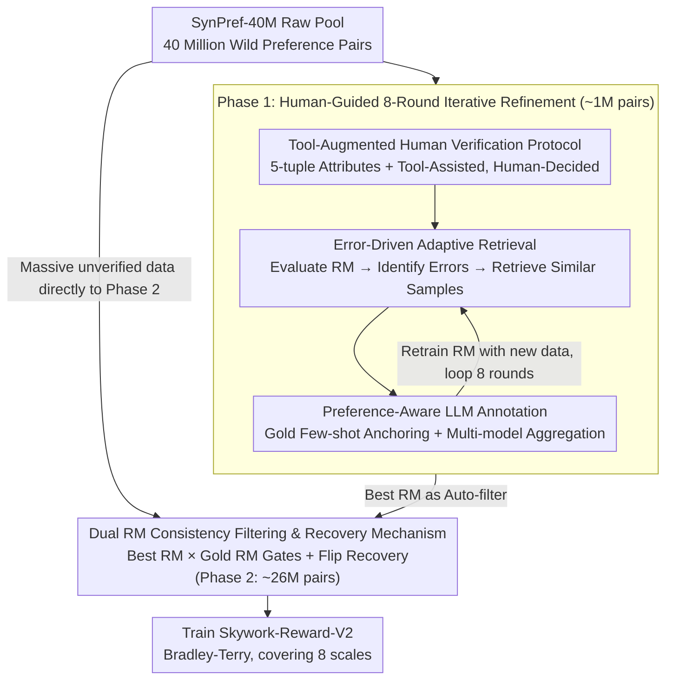

# Skywork-Reward-V2: Scaling Preference Data Curation via Human-AI Synergy

**Conference**: ICLR 2026  
**arXiv**: [2507.01352](https://arxiv.org/abs/2507.01352)  
**Code**: SynPref-40M Dataset Publicly Available  
**Area**: Alignment RLHF / Reward Modeling  
**Keywords**: Reward Model, Preference Data Curation, Human-AI Synergy, Data Quality, Scalable Curation

## TL;DR

A two-stage Human-AI synergistic preference data curation pipeline is proposed: Phase 1 accumulates approximately 1M preference pairs through 8 iterations of human verification, error-driven adaptive retrieval, and preference-guided LLM annotation; Phase 2 scales the data to 26M pairs using dual-RM consistency filtering. The resulting Skywork-Reward-V2 8B model achieves 97.8% on RewardBench and an average of 88.6% across seven major benchmarks, outperforming all open-source 70B reward models.

## Background & Motivation

The Reward Model (RM) is a core component of the RLHF pipeline, responsible for converting human preference signals into optimizable scalar rewards. However, as of September 2024, the development of open-source RMs has largely stagnated: 16 of the top 20 models on the RewardBench leaderboard directly or indirectly utilize the same base models or highly similar training data. More critically, improvements in RewardBench scores from approximately 80 to 90+ do not consistently translate into gains in other benchmarks or downstream tasks. The authors conducted a correlation analysis of 31 top open-source RMs across 7 benchmarks and found that the Pearson correlation between RewardBench and other benchmarks is weak, with some dimensions even showing negative correlations.

**The fundamental bottleneck lies not in model architecture or loss functions, but in the preference data itself**. Existing preference datasets suffer from three systemic defects: (1) Narrow coverage—concentrated on a few task types; (2) Insufficient synthetic annotation quality—biases introduced by pure LLM annotation cannot self-correct; (3) Lack of rigorous quality control—human annotation is high-quality but not scalable. The paper also compares multiple loss function variants (including improved ranking loss and contrastive loss) for the Gemma-2-27B series, finding that the original version remains optimal in overall performance. This indicates that merely improving training algorithms cannot compensate for deficiencies in data quality.

Core Idea: Use human verification to guide LLM annotation (rather than replace it), and then achieve simultaneous expansion of quality and scale through error-driven retrieval and consistency filtering.

## Method

### Overall Architecture

The goal of the paper is to curate a preference dataset, SynPref-40M (40 million pairs, with 26 million retained through curation), that balances quality and scale. The process is divided into two complementary phases: Phase 1 uses a small amount of human annotation to drive 8 iterations of refinement. Each round employs a cycle of "Tool-augmented Human Verification → Error-driven Retrieval → Preference-aware LLM Annotation" to repeatedly identify the current RM's blind spots and append targeted high-quality data, accumulating about 1M pairs. Phase 2 utilizes the best RM from Phase 1 and an independent gold RM as automatic filters to perform dual-consistency screening on massive wild data and recover flipped suspicious samples, expanding the scale to approximately 26M pairs without additional human labor. The final Skywork-Reward-V2 series is trained on this data using the standard Bradley-Terry objective.

### Key Designs

**1. Tool-Augmented Human Verification Protocol: Reliable and Information-Dense Labeling**

Pure human annotation, while high-quality, can suffer from judgment drift and low efficiency when only observing conversation history and two responses. The paper attaches a 5-tuple attribute to each preference pair—task category, preference objectivity, contentiousness, desired attributes, and instance-level annotation guidelines—transforming "choosing by feel" into "choosing by clear standards." Annotators are also permitted to use search engines, frontier LLM assistants, and domain-specific LLMs (math/code) as aids: fact-checking tasks must be verified with search engines, and code correctness tasks must involve code execution. However, the final judgment must be made by a human. This "tool-augmented but human-decided" protocol increases annotation quality from +0.4 (naked human) to +3.2, demonstrating that providing the right tools and structural attributes extracts significantly more value than simply increasing manpower.

**2. Error-Driven Adaptive Retrieval: Precise Allocation of Budget to RM Weaknesses**

Randomly labeling more data is inefficient; true gains come from filling the RM's blind spots. In each iteration, the current RM is evaluated on a gold validation set to pick samples where it predicts incorrectly. These samples' $(x, a)$ (dialogue + attributes) embeddings are used as queries to retrieve semantically similar new samples from the unverified pool for labeling. The number of retrieved samples $k$ varies dynamically with the RM's confidence $p$: $k = k_{\max}$ when $p \le 0.5$ (incorrect prediction), and $k = \lceil k_{\max} \cdot (1 - p) \rceil$ when $p > 0.5$ (correct prediction), where $k_{\max} = 8$. The intuition is clear—areas where the RM is uncertain receive more new samples, essentially an uncertainty sampling strategy for preference annotation that ensures each human label effectively improves the model.

**3. Preference-Aware LLM Annotation: Anchoring LLM Judgment with Human Gold Data**

Allowing LLMs to judge preferences directly introduces biases that are difficult to self-correct, which is why many pure LLM synthetic datasets fail. The paper's approach retrieves semantically similar human-annotated samples from the gold set to serve as few-shot examples in the prompt, ensuring each LLM judgment is referenced against human-verified preferences. Multiple strong LLMs provide scores, with self-consistency aggregation performed within models and cross-model merging to mitigate individual model bias. Randomizing the order of responses in the prompt also eliminates positional bias. This maintains the scale advantage of LLM labeling while strictly constraining its biases near human standards.

**4. Dual RM Consistency Filtering & Recovery Mechanism: Maintaining Quality during Scale Expansion**

Phase 2 deals with wild data without human oversight, requiring an automated quality gate. Samples where the current best RM has confidence $>0.5$ are retained. Inconsistent samples are re-labeled by an LLM (reusing the Phase 1 retrieval + few-shot scheme). Furthermore, a "gold RM" trained only on human-verified data serves as a secondary check. Only samples that pass both the gold RM and the best RM/LLM consistency check are included. Cleverly, samples rejected by both RMs are not discarded—since two independent RMs judge them unreasonable, the original label is likely reversed. Thus, their chosen/rejected labels are flipped and reused as "correction data," providing zero-cost additional training data that consistently improves performance across all stages and iterations.

### Loss & Training

Training follows the standard Bradley-Terry pairwise objective, $p = \sigma(r_\theta(x, y_w) - r_\theta(x, y_l))$, with no fancy modifications at the loss level—confirming the paper's conclusion that data quality is the bottleneck. Models cover 8 scales (Qwen3 0.6B/1.7B/4B/8B, Llama-3.2 1B/3B, Llama-3.1 8B, each with regular and 40M versions). Training uses a 16K token maximum context, 10240 batch size, constant learning rate, and a single epoch. The large batch setting saves approximately 35% of total training computation compared to conventional configurations.

## Key Experimental Results

### Main Results: Comprehensive 7-Benchmark Evaluation

| Model | Params | RB | RB-v2 | PPE-Pref | PPE-Corr | RMB | RM-Bench | JudgeBench | Avg |
|------|--------|------|-------|----------|----------|------|----------|------------|-----|
| OffsetBias-8B | 8B | 89.0 | 64.8 | 59.2 | 64.1 | 57.8 | 71.3 | 63.5 | 67.1 |
| ArmoRM-8B | 8B | 90.4 | 66.5 | 60.6 | 60.6 | 64.6 | 69.2 | 59.7 | 67.4 |
| Skywork-V1-27B | 27B | 94.3 | 75.3 | 63.6 | 61.9 | 69.4 | 67.6 | 66.5 | 71.2 |
| Nemotron-70B | 70B | 93.9 | 76.7 | 64.2 | 63.2 | 64.9 | 72.2 | 65.8 | 71.6 |
| INF-ORM-70B | 70B | 95.1 | 76.5 | 64.2 | 64.4 | 70.5 | 75.4 | 70.2 | 73.8 |
| **Skywork-V2-Qwen3-1.7B** | **1.7B** | 90.3 | 68.3 | 67.6 | 70.5 | 78.1 | 78.7 | 72.9 | **75.2** |
| **Skywork-V2-Llama-8B** | **8B** | 96.4 | 84.1 | 77.3 | 83.4 | 86.4 | 92.8 | 80.0 | **85.8** |
| **Skywork-V2-Llama-8B-40M** | **8B** | **97.8** | **86.5** | **79.8** | **87.2** | **89.3** | **96.0** | **83.4** | **88.6** |

Key Comparisons: (1) Skywork-V2 1.7B outperfroms the previously strongest 70B model, INF-ORM, on all benchmarks except RewardBench/RB-v2; (2) The 8B version ranks first across all 7 benchmarks; (3) The 40M version gains an additional +2.8 average points through flipped recovery data.

### Ablation Study

| Curation Method | Gain vs. Seed RM |
|---------|---------------------|
| Uncurated Data (No Curation) | ≈0 (12M data failed to surpass seed model) |
| Pure LLM Curation (Self-consistency) | +0.1 pts (within optimization noise) |
| Human Curation (Naked labeling) | +0.4 pts |
| Human Curation + Preference Attributes | +1.1 pts |
| Human Curation + LLM Curation | +2.3 pts |
| Full Protocol (Tool-augmented Human + Adaptive Retrieval + LLM) | **+3.2 pts** |
| Only 290K Curated Data (1.8% of pool) | Already exceeds previous SOTA 70B models |

### Other Key Findings

- **Style Bias Resistance in RM-Bench**: Most baseline models show huge performance gaps under Easy/Normal/Hard style conditions (e.g., INF-ORM-70B: Normal 80.0 vs. Hard 54.0, a 26-point drop). Skywork-V2-8B-40M maintains 93.5 on Hard (only a 4.1-point gap), indicating the SynPref-40M preference representations are more debiased.
- **Best-of-N Scaling**: In BoN evaluation on RMB, all 8 Skywork-V2 variants surpass GPT-4o (up to +20 points gap) and show positive scaling curves on 5 PPE Correctness tasks.
- **RewardBench v2 Precise Instruction Following**: Unlike existing RMs (scores <50), Skywork-V2-8B-40M reaches 67.8, surpassing Claude-3.7-Sonnet (54.4) and Gemini-2.5-Flash (55.3).
- **JudgeBench Mathematical Reasoning**: Skywork-V2-Llama-3B achieves 87.5 on math subtasks, equivalent to o3-mini (high); 8B-40M reaches 89.3, exceeding it.

## Highlights & Insights

- **Data quality is overwhelmingly more important than quantity**: 12M uncurated pairs are inferior to the seed model, whereas 290K (1.8%) curated pairs already beat the 70B SOTA. This challenges the "more is better" assumption for preference data.
- **Pure LLM curation is almost ineffective**: It brings only a +0.1 point gain. This explains why open-source preference datasets relying heavily on LLM synthesis fail to advance RMs—LLM biases self-reinforce without human calibration anchors.
- **Error-driven retrieval is the critical bridge**: It maximizes the value of limited human labels by precisely locating RM blind spots rather than labeling random data.
- **Ingenious Recovery Mechanism**: Preference pairs rejected by two independent RMs likely have incorrect original labels. Flipping chosen/rejected labels as "correction data" provides training signal at zero cost and yields consistent gains.
- **Tool-augmented Human Labeling >> Naked Human Labeling**: Permitting annotators to use tools while retaining final judgment power boosted quality from +0.4 to +3.2, offering a template for future annotation protocols.

## Limitations & Future Work

- Subjective preferences (e.g., writing style) do not exhibit data scaling behavior; curation is primarily effective for objective preferences.
- Phase 1 still relies on human annotation resources across 8 iterations.
- Only the pairwise Bradley-Terry objective was used; pointwise scoring or listwise ranking were not explored.
- No 70B+ base models were tested (due to cost); the marginal utility of data quality on larger models remains unknown.

## Related Work & Insights

- **vs. ArmoRM / Nemotron / INF-ORM (70B Scale)**: These models may be strong on single benchmarks, but Skywork-V2 8B is superior across a composite of 7 benchmarks, proving data quality can compensate for a 9x model size gap.
- **vs. Generative Reward Models (DeepSeek-GRM, RM-R1)**: While those methods use reasoning chains to enhance judgment, Skywork-V2's performance with a simple Bradley-Terry objective shows data improvements are orthogonal to model-level improvements.
- **vs. Active Learning**: Error-driven retrieval is essentially an active learning strategy for preference labeling, but it balances quality and efficiency by using human gold data to guide LLM labeling rather than direct human labeling of all retrieved samples.

## Rating

- Novelty: ⭐⭐⭐⭐ The two-stage Human-AI synergistic pipeline is systematic and well-designed; the combination of error-driven retrieval, preference-aware labeling, and recovery is highly coherent.
- Experimental Thoroughness: ⭐⭐⭐⭐⭐ 7 benchmarks × 8 model scales × detailed data/method ablations provide a very complete chain of evidence.
- Writing Quality: ⭐⭐⭐⭐ Descriptions are clear, with motivations well-established in Section 2 before detailing methods.
- Value: ⭐⭐⭐⭐⭐ Provides a comprehensive solution from curation to training, with SynPref-40M and all models open-sourced for replication and application.

<!-- RELATED:START -->

## Related Papers

- [\[ICLR 2026\] When Data Is the Algorithm: A Systematic Study and Curation of Preference Optimization Datasets](when_data_is_the_algorithm_a_systematic_study_and_curation_of_preference_optimiz.md)
- [\[ICLR 2026\] What's In My Human Feedback? Learning Interpretable Descriptions of Preference Data](whats_in_my_human_feedback_learning_interpretable_descriptions_of_preference_dat.md)
- [\[ICLR 2026\] Inverse Reinforcement Learning with Dynamic Reward Scaling for LLM Alignment](inverse_reinforcement_learning_with_dynamic_reward_scaling_for_llm_alignment.md)
- [\[ICLR 2026\] Towards Understanding Valuable Preference Data for Large Language Model Alignment](towards_understanding_valuable_preference_data_for_large_language_model_alignmen.md)
- [\[ACL 2026\] AgentV-RL: Scaling Reward Modeling with Agentic Verifier](../../ACL2026/llm_alignment/agentv-rl_scaling_reward_modeling_with_agentic_verifier.md)

<!-- RELATED:END -->
