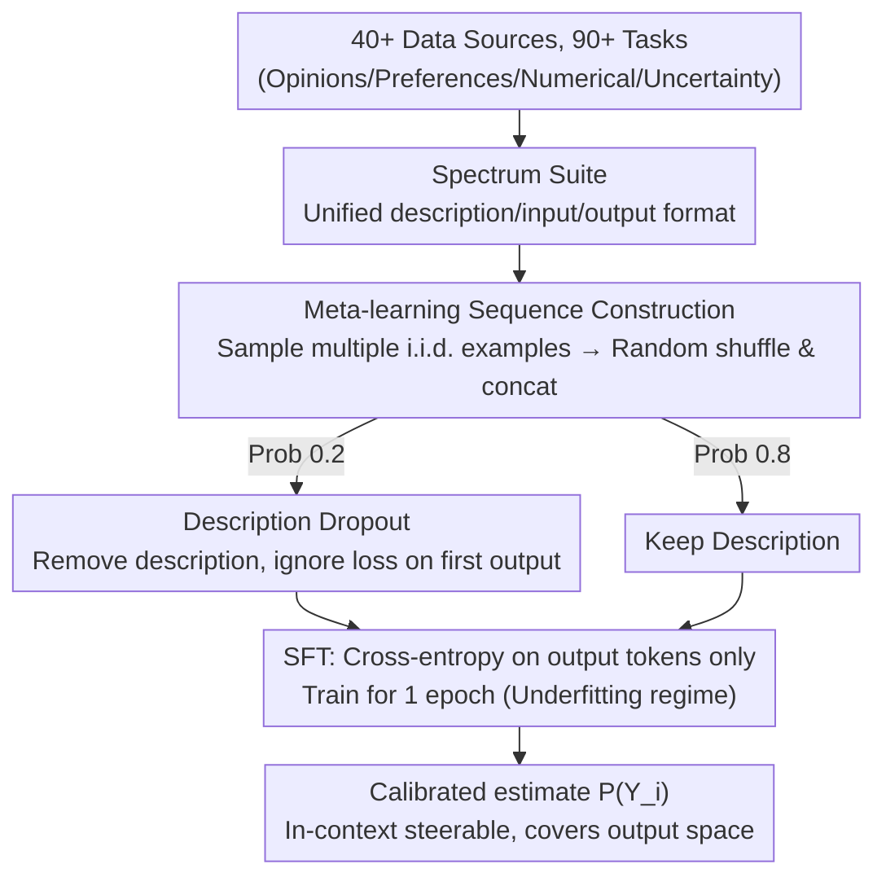

# Spectrum Tuning: Post-Training for Distributional Coverage and In-Context Steerability

**Conference**: ICLR 2026  
**arXiv**: [2510.06084](https://arxiv.org/abs/2510.06084)  
**Code**: [GitHub](https://github.com/tsor13/spectrum)  
**Area**: Signal Communication  
**Keywords**: Post-training, Distributional Coverage, In-context Steerability, Meta-learning, Language Models

## TL;DR

The authors propose Spectrum Tuning, a post-training method that improves in-context steerability, output space coverage, and distributional alignment by training on a distribution-fitting dataset across 90+ tasks. The work reveals that current instruction tuning impairs the in-context steerability of language models.

## Background & Motivation

1. **Background**: Post-training of LLMs (instruction tuning, RLHF, etc.) has significantly improved performance on instruction following and single-correct-answer tasks. However, its impact on tasks requiring diverse outputs (creative writing, synthetic data generation, multi-preference modeling) remains under-studied.

2. **Limitations of Prior Work**: Current post-training methods may have negative impacts on tasks requiring distribution modeling. Model performance declines in three dimensions of conditional distribution modeling: in-context steerability (adjusting output distribution based on new information), output coverage (generating diverse valid outputs), and distribution alignment (matching target distributions).

3. **Key Challenge**: Instruction tuning encourages models to form strong priors and excel at producing a "best" single answer, which compromises the ability to flexibly adjust output distributions based on in-context examples. It is necessary to distinguish between two types of in-context learning: capability elicitation (ICL for capability elicitation) and in-context steerability.

4. **Goal**: To quantify the impact of current post-training on distribution modeling capabilities and propose methods for improvement.

5. **Key Insight**: The authors compile the Spectrum Suite dataset covering 40+ data sources and 90+ tasks, including personal preference modeling and numerical distribution estimation tasks that require distribution matching, serving as an evaluation and training resource.

6. **Core Idea**: Perform meta-learning style fine-tuning on distribution-fitting tasks to enable models to acquire flexible in-context steerability while maintaining capabilities.

## Method

### Overall Architecture

Spectrum Tuning aims to address the issue where current post-training (instruction tuning, RLHF) forces models to provide only the "best" single answer, causing them to lose the ability to "flexibly adjust output distributions according to in-context examples." The solution is essentially a carefully designed Supervised Fine-Tuning (SFT). First, "distribution modeling" data from 40+ sources and 90+ tasks are unified into a description / input / output format (Spectrum Suite). During training, multiple examples from the **same distribution** are sampled for each sequence, randomly shuffled, and concatenated. The task description is dropped with a probability of 0.2. Standard SFT is then performed, calculating cross-entropy **only on output tokens**, with training limited to **1 epoch**. Stopping training in this underfitted regime is critical: minimizing cross-entropy on Monte Carlo samples from the same distribution forces the model to provide a **calibrated estimate** of the underlying distribution $P(Y_i)$ rather than memorizing a "best answer." Combined with the "multiple i.i.d. examples + random shuffle" sequence structure, the model must utilize the previous $k-1$ examples to implicitly update its posterior when predicting the $k$-th output—this is the source of learning to adjust the output distribution in-context.

### Key Designs

**1. Spectrum Suite Dataset: Turning distribution modeling capability into a unified resource**

Existing benchmarks primarily test tasks with a single correct answer, failing to systematically measure whether a model can cover the output space, align with target distributions, or adjust based on in-context examples. To this end, the authors compile 90+ tasks from 40+ data sources into a unified description / input / output format. The tasks cover four typical distribution scenarios: natural interpersonal variation (opinion modeling, personal preferences), sets of i.i.d. text (synthetic data, specific poetry formats), i.i.d. samples from random distributions (e.g., sampling from a normal distribution), and uncertainty reasoning, with a particular emphasis on individual modeling data. This suite serves as both an evaluation toolkit and training corpora, grounding abstract "distribution coverage/steerability" into optimizable objectives.

**2. Meta-learning Sequence Construction: Reframing distribution matching as "learning how to learn"**

Each training sequence contains multiple examples $(x_j, y_j)$ from the same distribution, randomly shuffled and concatenated. When predicting the $k$-th output, the model must use the previous $k-1$ examples to implicitly update its posterior—essentially performing a Bayesian update within the sequence. Random shuffling ensures **exchangeability** (the posterior is invariant to sample order in Bayesian analysis), ensuring the model learns the distribution itself rather than positional preferences. This construction differs from standard instruction SFT in its core effectiveness: the context contains multiple examples from the same distribution rather than a single one, the data is distributional rather than deterministic, the objective is distribution fitting rather than conversational fluency, and input $x$ is optional. Consequently, the model acquires the meta-capability: "given a few samples of a data generation process, I can continue with the next sample following that process."

**3. Description Dropout Strategy: Forcing the model to infer distributions from examples**

If task descriptions are always present, the model may become "lazy," generating outputs based solely on the description without attending to the distribution characteristics hidden in the in-context examples. The authors randomly drop task descriptions with a probability $p_{\text{drop}}=0.2$. When dropped, the first output in the sequence is excluded from the loss calculation (as there is no prior info to infer from). From the second output onwards, the model must rely on previous examples to infer the current task's distribution. This strategy directly trains the model's in-context steerability when descriptions are missing or ambiguous, explaining why Spectrum Tuning still aligns with target distributions in few-shot settings without instructions.

### Loss & Training

The loss is standard cross-entropy, but calculated **only on output tokens**; description and input tokens do not contribute to the loss. Training is strictly controlled to 1 epoch, deliberately stopping in the underfitting regime to avoid memorization and maintain distributional calibration (based on the theory from Ji et al. 2021: minimizing cross-entropy on Monte Carlo samples in the underfitting regime yields calibrated distribution estimates). Models are initialized from pre-trained (PT) weights, with only two or three special format token embeddings migrated from instruction-tuned (IT) models. This prevents inheriting strong IT priors while reusing format tokens.

## Key Experimental Results

### Main Results

Comparison of in-context steerability across three model families (76 task-model comparisons):

| Direction of Change | PT→IT | PT→ST (Ours) |
|---------|-------|------------|
| Significant Decrease | 35/76 | Sparse |
| No Significant Change | 33/76 | — |
| Significant Increase | 7/76 | Frequent |

Spectrum Tuning improves steerability while maintaining capability elicitation:

| Model | Method | habermas_individual (Acc) | wvs_individual (Acc) | numbergame_individual (Acc) |
|------|------|--------------------------|---------------------|---------------------------|
| Gemma-3-12B | PT | 24.4 | 42.1 | 64.3 |
| Gemma-3-12B | IT | 22.4 | 40.4 | 65.6 |
| Gemma-3-12B | **ST** | **23.8** | **42.6** | **70.2** |

### Ablation Study

| Configuration | Key Metric | Description |
|------|---------|------|
| IT Steerability Change | 35 drops vs 7 gains in 76 pairs | IT significantly impairs steerability |
| IT Capability Elicitation Change | 8 gains vs 2 drops in 24 pairs | IT maintains capability elicitation |
| Loss Change (IT vs PT) | 117/144 worse | IT is almost universally inferior to PT on free-text tasks |

### Key Findings

- **Instruction tuning systematically impairs in-context steerability**: This is the core empirical finding of the paper.
- **Capability elicitation and steerability are independent**: IT improves the former but damages the latter.
- **Spectrum Tuning consistently improves across three model families**: Achieving distributional alignment superior to pre-trained models for the first time.
- **Loss is almost universally higher on IT models**: Indicating that calibration of IT models on distribution matching tasks has severely regressed.

## Highlights & Insights

- **Value of Conceptual Distinction**: Distinguishing between "capability elicitation" and "steerability" in in-context learning provides a new framework for understanding the impact of post-training.
- **Simple yet Effective**: Spectrum Tuning is essentially SFT on distributional data, but careful task design makes it effective.
- **Meta-learning Perspective**: Reframes distribution matching as a meta-learning problem where each task is a "data generation process."
- **Inspiration for LLM Evaluation**: Current benchmarks almost exclusively test single correct answers, ignoring distribution modeling capabilities.

## Limitations & Future Work

- Spectrum Suite primarily focuses on classification and short-text tasks; distribution matching evaluation for long-form generation is insufficient.
- The 1-epoch training constraint might not be optimal for all tasks.
- Exploring integration with preference learning methods like RLHF/DPO.
- The root causes of steerability degradation (strong priors vs. overfitting vs. benchmark adaptation) warrant deeper investigation.

## Related Work & Insights

- Connects with research in the In-context Learning field, but is the first to distinguish between capability elicitation and steerability.
- The concept of distributional pluralism is derived from Sorensen et al. (2024).
- Insight: The "side effects" of post-training require more systematic research—optimizing for a single correct answer may impair other vital capabilities.

## Rating

- Novelty: ⭐⭐⭐⭐⭐ First systematic study of the impact of post-training on distribution modeling.
- Experimental Thoroughness: ⭐⭐⭐⭐ Three model families, 90+ tasks, comprehensive comparative analysis.
- Writing Quality: ⭐⭐⭐⭐⭐ Clear concepts and rigorous logic.
- Value: ⭐⭐⭐⭐⭐ Reveals a significant blind spot in post-training with practical guidance for LLM development.

<!-- RELATED:START -->

## Related Papers

- [\[ICLR 2026\] Fluent Alignment with Disfluent Judges: Post-training for Lower-Resource Languages](fluent_alignment_with_disfluent_judges_post-training_for_lower-resource_language.md)
- [\[ICLR 2026\] Chasing the Tail: Effective Rubric-based Reward Modeling for Large Language Model Post-Training](chasing_the_tail_effective_rubric-based_reward_modeling_for_large_language_model.md)
- [\[ICLR 2026\] Quagmires in SFT-RL Post-Training: When High SFT Scores Mislead and What to Use Instead](quagmires_in_sft-rl_post-training_when_high_sft_scores_mislead_and_what_to_use_i.md)
- [\[ICLR 2026\] TS²: Sparsemax+ for Training and Softmax for Testing for Accurate and Diverse LLM Fine-tuning](ts2_training_with_sparsemax_testing_with_softmax_for_accurate_and_diverse_llm_fi.md)
- [\[NeurIPS 2025\] GVPO: Group Variance Policy Optimization for Large Language Model Post-Training](../../NeurIPS2025/llm_alignment/gvpo_group_variance_policy_optimization_for_large_language_model_post-training.md)

<!-- RELATED:END -->
