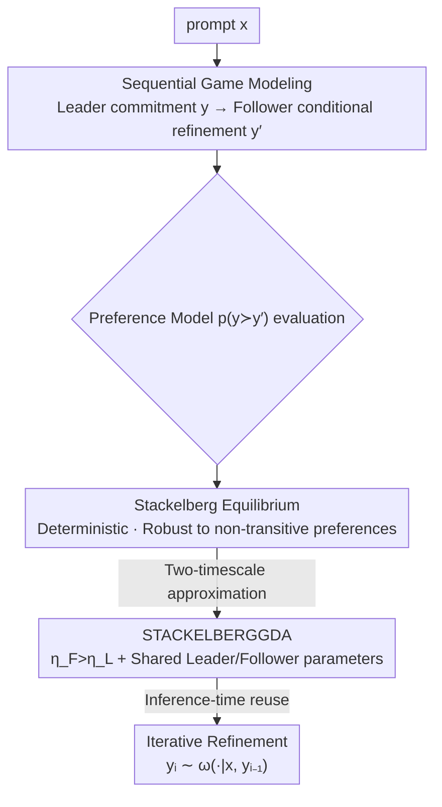

# Stackelberg Learning from Human Feedback: Preference Optimization as a Sequential Game

**Conference**: ICLR 2026  
**OpenReview**: [https://openreview.net/forum?id=vc9Tj11LNE](https://openreview.net/forum?id=vc9Tj11LNE)  
**Code**: None  
**Area**: Alignment RLHF  
**Keywords**: Preference Optimization, Stackelberg Game, Non-transitive Preferences, Inference-time Refinement, Sequential Game

## TL;DR
Ours remodels LLM preference alignment as a "Leader-Follower" **sequential game** (SLHF): the Leader first commits to a response, and the Follower provides an improved version after observing this response. This naturally yields a deterministic equilibrium robust to non-transitive preferences and supports **training-free iterative self-refinement at inference time**, consistently outperforming RLHF (RLOO) and NLHF (Nash-MD-PG) baselines on 0.5B–8B models.

## Background & Motivation

**Background**: The mainstream approach for aligning LLMs with human preferences is RLHF—first training a scalar reward model on pairwise comparison data (usually assuming the Bradley-Terry model $p(y\succ y'\mid x)=\sigma(r(x,y)-r(x,y'))$), then maximizing this reward via RL. Recently, NLHF proposed bypassing the reward model by formulating preference optimization as a **simultaneous-move game** between two policies, using the Nash equilibrium as the solution.

**Limitations of Prior Work**: RLHF compresses "preferences" into a real-valued reward, a scalar assumption that often fails in practice—aggregated human preferences frequently exhibit **non-transitive cycles** ($A\succ B\succ C$ but $C\succ A$), which scalar rewards cannot represent. Even under transitive preferences, they may result in incorrect rankings. Furthermore, the optimal policy is highly sensitive to the specific pairs sampled in the training set. While NLHF does not assume transitivity and is less sensitive to data distribution, the Nash equilibrium is necessarily a **mixed strategy** (degenerating to a uniform distribution under the Condorcet paradox) when no single action is preferred by a majority. This results in inherent stochasticity, which is sub-optimal for scenarios requiring deterministic and reliable answers.

**Key Challenge**: Both existing routes sacrifice a critical component—RLHF sacrifices the ability to represent non-transitive preferences and data robustness, while NLHF accepts stochastic mixed strategies to handle cyclic preferences. Both use a **single policy** to compete against an unobservable, non-stationary opponent, leading to unstable learning.

**Goal**: To find a solution concept that optimizes directly on pairwise preferences, remains robust to non-transitive cycles without relying on scalar rewards, provides a deterministic strategy, and enables continuous output improvement through "repeated sampling" during inference.

**Key Insight**: It is observed that the stochasticity of Nash games stems from the symmetry of "simultaneous moves"—neither party can see the other's actual action. By switching to **sequential moves** (Stackelberg game), where the second player observes the first player's committed action before responding optimally, this information asymmetry breaks the symmetry and produces a deterministic optimal response.

**Core Idea**: Ours reformulates preference optimization from "single-policy competition" into a sequential game of "Leader commitment + Follower conditional refinement," replacing the Nash equilibrium with a Stackelberg equilibrium.

## Method

### Overall Architecture

SLHF decomposes the alignment problem into a sequential game played by two roles. Given a prompt $x$, the **Leader** policy $\pi$ first samples an action $y\sim\pi(\cdot\mid x)$ and "commits" to it; the **Follower** policy $\omega$ observes both the prompt $x$ **and the Leader's committed action $y$**, then provides a secondary response $y'\sim\omega(\cdot\mid x,y)$. Notably, the Follower is conditioned on the **actual action $y$** (rather than the Leader's strategy $\pi$), which is the additional information gained over the standard Stackelberg setting. Both actions are evaluated by a pairwise preference model $p(y\succ y'\mid x)$. The overall objective is formulated as a max-min sequential game:

$$\max_{\pi\in\Pi}\ \min_{\omega\in\Omega}\ \mathbb{E}_{x\sim\rho}\Big[\mathbb{E}_{y\sim\pi(\cdot|x)}\big[\mathbb{E}_{y'\sim\omega(\cdot|x,y)}[p(y\succ y'\mid x)]+\tau^F\mathrm{KL}_{x,y}(\omega\|\omega_{\mathrm{ref}})\big]-\tau^L\mathrm{KL}_x(\pi\|\pi_{\mathrm{ref}})\Big]$$

This decomposes optimization into two complementary sub-problems: the Follower solves a **refinement problem** (finding the best response to a known output, where the opponent is fixed and the problem is stationary), while the Leader solves an **adversarial robustness problem** (anticipating that the Follower will improve the output, thus selecting an initial action that remains strong even after refinement). Training employs the STACKELBERGGDA two-timescale gradient algorithm to approximate the equilibrium, while inference reuses the same mechanism for iterative refinement.

### Key Designs

**1. Sequential Game Modeling: Replacing Single-Policy Competition with "Commitment-Refinement"**

Addressing the instability of RLHF/NLHF using a single policy against a non-stationary opponent, SLHF introduces an asymmetric sequential structure. The Leader moves first with $y$, and the Follower moves with $y'$ **after observing the actual action**. Consequently, the Follower does not face an opponent distribution that drifts during training, but rather a stationary best-response problem: "given a specific known output, find the best response to defeat it." This leads to more stable learning and faster adaptation to Leader policy changes. Conversely, faster convergence of the Follower provides more stable feedback to the Leader, allowing it to accurately anticipate refinement results and select robust initial actions. In Equation (5), $\tau^L, \tau^F \ge 0$ are KL regularization coefficients relative to reference policies $\pi_{\mathrm{ref}}, \omega_{\mathrm{ref}}$. Without regularization ($\tau^L=\tau^F=0$), it simplifies to a sequential-move constant-sum game. The fundamental difference from RLHF (scalar reward) and NLHF (simultaneous move) is the direct optimization on pairwise preferences $p$ while using "who moves first" asymmetry to capture richer preference structures.

**2. Stackelberg Equilibrium: Deterministic, Unique, and Robust to Non-transitive Preferences**

The Nash equilibrium of NLHF must be a mixed strategy under cyclic preferences, resulting in stochastic output. The solution concept for SLHF differs. Proposition 1 proves that when $\tau^L, \tau^F > 0$ and $\pi_{\mathrm{ref}}(y \mid x) > 0$, Equation (5) has a **unique** solution $(\pi^\star, \omega^\star)$, termed the Stackelberg equilibrium. A critical property is that since a deterministic best response always exists for the Follower (picking $y'$ to defeat any $y$), randomization offers no advantage to the Leader; thus, in the unregularized limit, $(\pi^\star, \omega^\star)$ can be **deterministic**. In the classic Condorcet paradox (three actions $A,B,C$ with cyclic preferences and no Condorcet winner), this mechanism "unrolls" the cycle: the Follower's optimal strategy is to move along the cycle ($y=A\Rightarrow y'=C$, $y=B\Rightarrow y'=A$, $y=C\Rightarrow y'=B$), while the Leader anticipates this and selects the "least exploitable" action. In contrast, RLHF's solution here depends on which pairs were sampled, and NLHF yields a uniform random strategy.

**3. STACKELBERGGDA: Two-timescale Gradient Ascent-Descent + Shared Parameters**

Directly solving max-min in the policy space is infeasible for large action spaces. Ours proposes STACKELBERGGDA to approximate the equilibrium. It performs gradient ascent for the Leader and gradient descent for the Follower, projecting back to their respective probability simplexes: $\pi_{i+1}=\pi_i+\eta^L\nabla_\pi f$, $\omega_{i+1}=\omega_i-\eta^F\nabla_\omega f$. The key is the **two-timescale** approach—setting $\eta^F > \eta^L$ (with a ratio $\kappa=\eta^F/\eta^L$, experimentally optimal at $\kappa=5$) to allow the Follower to update faster than the Leader, providing more stable feedback. This choice draws from Actor-Critic and GAN (TTUR) experiences and offers stronger convergence guarantees in non-convex-concave regimes. For LLM fine-tuning, a memory-efficient design is used: the Leader and Follower **share the same parameters**. A prompt template frames them as a multi-turn conversation; the Leader "answers the user's prompt," while the Follower continues with a prompt like "Improve the previous answer!" to generate the refined version. This allows any multi-turn model to serve as both $\pi_{\mathrm{ref}}$ and $\omega_{\mathrm{ref}}$. The process involves online RL optimization, requiring neither explicit reward models nor expensive sampling of mixed strategies.

**4. Inference-time Iterative Refinement: Training-free Pass@k Self-Improvement**

During training, preferences are aggregated population preferences, but deployment requires alignment with **individual user** tastes, which may clash. The sequential structure of SLHF naturally supports inference-time adaptation without additional training: an initial response $y_1$ is sampled from the Leader, and each subsequent step feeds the previous output back to the Follower for further refinement $y_i\sim\omega^\star(\cdot\mid x,y_{i-1})$. This produces a sequence of progressively improved responses, similar to pass@k in verifiable domains—users can resample until satisfied. In the Condorcet paradox, this process **traverses the entire preference cycle**. For example, with a user preferring $A \succ B \succ C$, NLHF has a $1/3$ probability of sampling $A$ in one step (56% cumulative over $N=2$ steps), while SLHF's probability of reaching $A$ rises to 67% at $N=2$ and 100% at $N=3$ regardless of the Leader's initial choice. Crucially, this relies only on inference-time computation, and experiments show the Follower can **transfer across models**, improving outputs from other independently trained models.

### Loss & Training
The objective follows the max-min sequential game in Equation (5), optimized via two-timescale STACKELBERGGDA. Implementation uses Transformers + TRL with the AdamW optimizer. Small-scale experiments fine-tune QWEN2.5-0.5B for 1000 steps, batch $B=32$, with learning rates $\eta\in\{1\mathrm{e}{-6},5\mathrm{e}{-6},1\mathrm{e}{-5}\}$, KL coefficients $\tau\in\{0.001,0.01,0.1\}$, and ratio $\kappa\in\{1,5,10\}$. Optimal settings were $\eta=1\mathrm{e}{-5}, \tau=0.001, \kappa=5$.

## Key Experimental Results

### Main Results

Small-scale training on HELPSTEER2 (11,826 human annotations for single-turn dialogues) used a preference model $p$ estimated across five attributes. The table below shows the average preference score of the row algorithm vs. the column algorithm (>0.5 indicates preference):

| Algorithm (Row vs. Col) | vs. QWEN2.5-0.5B | vs. RLOO | vs. NASH-MD-PG |
|--------|------|------|------|
| NASH-MD-PG | 0.721 | 0.607 | — |
| STACKELBERGGDA-LEADER | 0.734 | 0.613 | 0.503 |
| STACKELBERGGDA-FOLLOWER | **0.800** | **0.656** | **0.594** |

The Leader roughly ties with Nash-MD-PG (approx. 73% vs. base, 61% vs. RLOO, 50% vs. each other), confirming that Stackelberg and Nash equilibria coincide when multiple high-quality answers exist. The **Follower** provides significant Gain—outperforming its own Leader commitment in 60.5% of cases, trading one additional generation for substantial quality improvement.

Large-scale testing used STACKELBERGGDA to train LLAMA-3.1-TULU-3-8B-SFT (with Skywork-Critic-70B feedback) evaluated on AlpacaEval 2.0 / IFEval:

| Model | AlpacaEval 2.0 LC Winrate | IFEval Prompt Loose Acc. |
|------|------|------|
| LLAMA-3.1-TULU-3-8B-SFT (Base) | 8.83 | 67.46 |
| LLAMA-3.1-TULU-3-8B-DPO | 33.37 | 75.23 |
| STACKELBERGGDA-LEADER | 35.04 | 71.71 |
| STACKELBERGGDA-FOLLOWER | **44.57** | 61.92 |

The Follower increased the AlpacaEval 2.0 LC win rate to 44.57, surpassing same-scale DPO models. The cost was a drop in IFEval accuracy (67.46 → 61.92) due to increased context length for the Follower.

### Ablation Study

| Configuration | Key Result | Description |
|------|---------|------|
| STACKELBERGGDA Follower improving various Leaders | Consistent Gain for all Leaders (Table 4, max ~0.60) | Explicit training to "improve given output" is essential |
| QWEN2.5-0.5B / RLOO as Follower | Only improves own output, often **decreases** quality for others | Pure prompting is insufficient for reliable refinement |
| NASH-MD-PG as Follower | Can improve QWEN/RLOO, but 70% < 73% self-improvement | Not specifically trained for refinement, limited capability |
| Two-timescale ratio $\kappa$ | Optimal at $\kappa=5$ (Sec. D.3) | $\eta^F>\eta^L$ is the source of effectiveness |

### Key Findings
- **Follower is the performance driver**: The Leader performs similarly to the Nash strategy; the real separation comes from the Follower's refinement step, which also transfers across model families (improving RLOO, Nash-MD-PG, and itself).
- **"Explicit refinement training" is irreplaceable**: Prompting a model to "improve the previous answer" is unreliable for preference alignment and can even degrade quality. One must train for "refinement" as a fundamental objective, extending self-correction insights from verifiable domains to human preferences.
- **Trade-off between AlpacaEval and IFEval**: SLHF leads significantly on human-preference-centric AlpacaEval 2.0, but Follower context lengthening drags down verifiable instruction following (IFEval), a gap potentially addressable by integrating verifiable reward RL.

## Highlights & Insights
- **Solving Stochasticity via "Who Moves First"**: Changing a simultaneous game to a sequential one uses information asymmetry (the Follower seeing the Leader's action) to turn the necessary mixed-strategy Nash equilibrium into a deterministic best response.
- **Shared Parameters for Dual Roles**: Using a multi-turn prompt template allows the Leader/Follower to share parameters, saving memory and allowing any multi-turn model to serve directly as a reference policy.
- **Training Objective as Inference Capability**: Since the Follower is trained precisely to "improve a known output," iterative refinement at inference time is a natural extension of the same mechanism, enabling pass@k self-improvement without extra training or external feedback.

## Limitations & Future Work
- **Dependence on Well-defined Pairwise Preference Functions**: Like NLHF, the framework relies on a preference model representing the target reward accurately; such a function $p$ is difficult to obtain reliably in open-ended domains.
- **Refinement Lacks Real-time Interaction**: Currently an offline conditional generation process without human-in-the-loop feedback; future work may combine active preference elicitation with personalization.
- **Ergodic vs. Last-iterate Convergence**: STACKELBERGGDA currently guarantees ergodic convergence; last-iterate guarantees might require methods like extragradient or optimistic mirror-prox.
- **Context Length Penalizes IFEval**: The drop in IFEval suggests the need for better integration between the Leader-Follower framework and verifiable rewards.

## Related Work & Insights
- **vs. RLHF (RLOO, etc.)**: RLHF assumes a Bradley-Terry scalar reward, fails at non-transitive loops, and is sensitive to sampling distributions. SLHF optimizes directly on preferences, handle loops, and requires no reward model, with its Follower consistently beating RLOO in experiments.
- **vs. NLHF (Nash-MD-PG)**: NLHF uses simultaneous games for Nash equilibria, which are often mixed/stochastic. SLHF uses sequential Stackelberg games for deterministic equilibria, with the Follower providing additive refinement gains.
- **vs. SGPO (Chu et al., 2025)**: SGPO uses a Stackelberg form between "one policy" and "an adversarial preference distribution" assuming transitivity; ours is a sequential game between "two policies" without transitivity assumptions.
- **vs. Self-correction / Kumar et al. (2025)**: The latter also trains LLMs for refinement but depends on reward models and two-stage training. SLHF uses a single Leader-Follower loop without auxiliary rewards to support inference-time refinement on any preference signal.

## Rating
- Novelty: ⭐⭐⭐⭐⭐ Formulating alignment as a sequential Stackelberg game for deterministic equilibria under non-transitive preferences is a clean and original solution concept.
- Experimental Thoroughness: ⭐⭐⭐⭐ Coverage from 0.5B to 8B with round-robins and large-scale post-training, though code is not yet public and benchmarks are focused on AlpacaEval/IFEval.
- Writing Quality: ⭐⭐⭐⭐⭐ Theory-empirical mapping is clear; the comparison of three paradigms via the Condorcet paradox is insightful.
- Value: ⭐⭐⭐⭐ Provides a new paradigm for alignment without reward models that is robust to non-transitivity and natively supports inference refinement; the transferable Follower is particularly practical.

<!-- RELATED:START -->

## Related Papers

- [\[ICLR 2026\] What's In My Human Feedback? Learning Interpretable Descriptions of Preference Data](whats_in_my_human_feedback_learning_interpretable_descriptions_of_preference_dat.md)
- [\[ICLR 2026\] Semi-Supervised Preference Optimization with Limited Feedback](semi-supervised_preference_optimization_with_limited_feedback.md)
- [\[ICML 2026\] Reward Shaping for (Inference-Time) Alignment: A Stackelberg Game Perspective](../../ICML2026/llm_alignment/reward_shaping_for_inference-time_alignment_a_stackelberg_game_perspective.md)
- [\[ICLR 2026\] RLBFF: Binary Flexible Feedback to Bridge Between Human Feedback & Verifiable Rewards](rlbff_binary_flexible_feedback_to_bridge_between_human_feedback_verifiable_rewar.md)
- [\[ICLR 2026\] Text2Grad: Reinforcement Learning from Natural Language Feedback](text2grad_reinforcement_learning_from_natural_language_feedback.md)

<!-- RELATED:END -->
