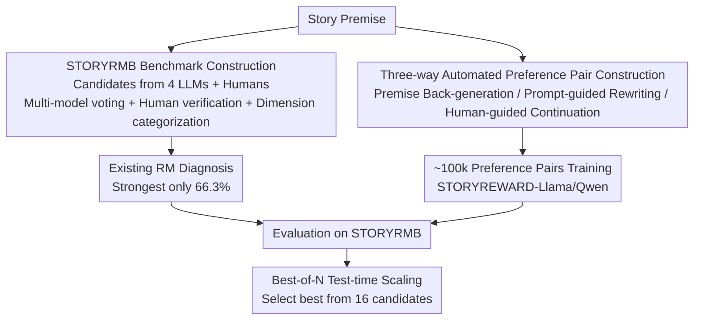

# StoryAlign: Evaluating and Training Reward Models for Story Generation

**Conference**: ICLR 2026  
**OpenReview**: [https://openreview.net/forum?id=a3JmkJtTDV](https://openreview.net/forum?id=a3JmkJtTDV)  
**Code**: https://github.com/THU-KEG/StoryReward  
**Area**: Alignment RLHF / Text Generation  
**Keywords**: Reward Model, Story Generation, Human Preference, Preference Data Construction, Best-of-N  

## TL;DR
This paper demonstrates that existing reward models struggle to identify human-preferred stories (even the strongest GPT-4o achieves only 66.3% accuracy). Consequently, the authors construct the first story preference evaluation benchmark, STORYRMB (1133 human-verified instances), and train a specialized reward model, STORYREWARD, using approximately 100,000 automatically constructed preference pairs. At an 8B scale, STORYREWARD achieves a SoTA accuracy of 75.0% on the benchmark and significantly outperforms other reward models in Best-of-N test-time scaling.

## Background & Motivation
**Background**: LLMs are capable of generating fluent stories, with mainstream approaches utilizing various workflows (outlines, hierarchies, multi-agent systems) to drive long-form narrative generation. To enable models to "write better stories," the standard route is RLHF—training a reward model (RM) to capture human preferences and using its scores to optimize the generative model.

**Limitations of Prior Work**: Stories written by LLMs still fall far short of human works in narrative structure and creativity. Research indicates that the probability of an LLM-generated story passing expert evaluation is only $1/3$ to $1/10$ that of a professional author. The root cause is the lack of effective modeling of "human story preferences" during training: existing RMs are mostly oriented towards general domains, ignoring story-specific preference dimensions and suffering from verbosity bias (preferring longer rather than better responses).

**Key Challenge**: Story preference is inherently **subjective and multi-dimensional** (requiring balance across creativity, coherence, characterization, fluency, and relevance), making it difficult to generalize from general preferences. Furthermore, training a specialized RM lacks large-scale story preference data that truly reflects human judgment, as manual annotation is extremely costly.

**Goal**: The problem is decomposed into two sub-problems: (1) How to **systematically evaluate** whether a reward model understands story preferences? (2) How to obtain large-scale, high-quality training data reflecting human preferences at a low cost to train an RM that truly selects superior stories?

**Key Insight**: The authors observe a counter-intuitive phenomenon: existing RMs are more likely to make errors on "Human Story vs. LLM Story" pairs, tending to favor LLM-generated content. This suggests the issue is not model capacity but the absence of "human-written is better" signals in training data. The authors leverage **existing preference signals from human web fiction platforms** (likes, author columns, human-written continuations).

**Core Idea**: A complete pipeline is proposed: "Evaluation Benchmark STORYRMB + Automatically Constructed Human Preference Pairs + Specialized Reward Model STORYREWARD," transforming story preference from "unmodelable" to "evaluable, trainable, and applicable for BoN selection."

## Method

### Overall Architecture
The paper presents a full pipeline: constructing an evaluation benchmark, building training data, and training/validating the reward model. THE STORYRMB benchmark diagnoses the weaknesses of existing RMs across specific dimensions; STORYREWARD involves low-cost data construction and specialized RM training; the application side uses Best-of-N test-time scaling to verify utility in real-world selection tasks.

The input is a "story premise," and the output is a reward model capable of scoring candidate stories and selecting the one most preferred by humans. The process follows three stages: benchmark construction $\to$ automated preference pair collection $\to$ reward model training and application.

### Key Designs

**1. STORYRMB: The first story preference benchmark quantifying five dimensions.**

To diagnose RMs, a metric is required. The authors construct STORYRMB, where each instance consists of a premise + 1 chosen story + 3 rejected stories. The RM's task is to select the human-preferred story. Accuracy is the proportion where $\arg\max_i f(s_i) = s^*$. **Candidate Generation**: GPT-4o, Gemini 2.5 Pro, Grok, and Qwen-Long write one story per premise, mixed with human stories from WritingPrompts. **Preference Determination**: GLM-4.5, Qwen2.5-Max, Claude-3.5, and DeepSeek-R1 score candidates across creativity, coherence, fluency, characterization, and relevance, followed by human verification.

The key is using **Kendall's Tau** to measure ranking consistency among the four models: for any two rankings $\pi_A, \pi_B$, $\tau(\pi_A, \pi_B) = \frac{N_c - N_d}{\binom{m}{2}}$. If the average $\tau_{avg} < 0.6$ (strong disagreement), the instance is sent for human annotation. This ensures controversial samples are decided by humans, resulting in 1133 high-quality instances.

**2. Dimension Categorization: Four-level downgrade ruling for preference labeling.**

The authors identify **why** a story was chosen using a four-level process:
- **Level 1: Mean Gap**: $\text{mean\_gap}_d = \text{score}_{chosen,d} - \frac{1}{|R|} \sum_{r \in R} \text{score}_{r,d}$. If one dimension's gap significantly exceeds others (tolerance $\tau=0.5$), it is assigned that label.
- **Level 2: Margin over Runner-up**: If gaps are close, the dimension with the largest $\text{margin}_d = \text{score}_{chosen,d} - \max_{r \in R} \text{score}_{r,d}$ is chosen.
- **Level 3: Rejected Variance**: If still tied, the dimension where the rejected stories have the lowest variance is chosen (indicating consistent poor performance).
- **Level 4: Ordinal Backup**: Forced assignment based on a fixed sequence $d_1 \to \dots \to d_5$.

This classifies the 1133 instances into: Creativity (292), Coherence (265), Fluency (225), Characterization (215), and Relevance (136).

**3. Mechanism (Three-way Automated Preference Pair Construction): Leveraging web fiction signals.**

To avoid expensive manual labeling, three methods are used:
- **Premise Back-generation**: Stories are clustered by similarity (genre or author). Two stories from a cluster are used with GPT-4o to back-generate a common premise. Preference is determined by engagement metrics (likes), yielding ~6,000 pairs of pure human signals.
- **Prompt-Guided Rewriting**: Human stories serve as "chosen." LLMs rewrite them to degrade specific aspects (e.g., ruining the ending for coherence), yielding ~30,000 pairs. This prevents trivial differences between chosen/rejected sets.
- **Human-Guided Continuation**: Comparing human vs. LLM stories directly often causes RMs to take shortcuts (learning surface patterns). Instead, two LLMs generate from the same premise, but one is "guided" by seeing human-written segments. The guided version is "chosen," yielding ~10,000 pairs.
Total data: ~100,000 pairs.

### Loss & Training
Using Llama-3.1-8B-Instruct and Qwen3-8B as backbones, the models are trained as standard RMs (input premise, output scalar score, supervised by preference pairs). Training used a batch size of 1, learning rates of $9 \times 10^{-6}$ (Llama) and $2 \times 10^{-5}$ (Qwen) for 1 epoch.

## Key Experimental Results

### Main Results
Accuracy (%) for selecting the "chosen" story from 4 candidates on STORYRMB:

| Model | Creativity | Characterization | Fluency | Relevance | Average |
| :--- | :--- | :--- | :--- | :--- | :--- |
| ArmoRM-Llama3-8B | 48.8 | 44.2 | 56.4 | 43.4 | 49.7 |
| Qwen3-8B (Base) | 53.1 | 47.0 | 60.4 | 48.5 | 53.5 |
| Gemini-2.5-Pro | 51.7 | 57.2 | 64.4 | 52.2 | 56.8 |
| Grok-3 | 57.5 | 62.8 | 69.8 | 60.3 | 62.4 |
| GPT-4o (Prev. Best) | 63.7 | 66.0 | 73.3 | 67.6 | 66.3 |
| STORYREWARD-LLAMA | 60.8 | 62.3 | 53.8 | 67.7 | 61.4 |
| **STORYREWARD-QWEN** | **78.8** | **71.6** | 74.2 | **69.1** | **75.0** |

STORYREWARD-QWEN raises the SoTA from 66.3% to 75.0%, with substantial gains in Creativity (53.1 $\to$ 78.8).

### Key Findings
- **Existing RMs favor fluency**: Accuracy is generally highest for fluency due to surface-level sensitivity in general RMs and LLM-as-judge. Creativity and characterization are weak points.
- **"Preference for LLM content" is a major issue**: Existing RMs systematically fail on Human-LLM pairs, likely because LLMs prefer LLM-generated text. Using such RMs for RLHF prevents models from reaching human-level quality.
- **Data effectiveness**: The significant improvement of STORYREWARD proves the value of the 100k preference pairs and the scalability of the construction methods.
- **Best-of-N Utility**: In BoN testing (N=16), STORYREWARD achieved win rates of 63–75% against competitors and selected low-quality stories less than 30% of the time, despite its small 8B size.

## Highlights & Insights
- **Engineering "Subjective Preference"**: The use of five dimensions and the downgrade ruling transforms "subjective preference" into interpretable diagnostic signals.
- **The "Don't use human text directly" insight**: Directly comparing human vs. LLM text causes RMs to learn surface shortcuts. Using "human-guided LLM output" keeps the preference pair difficulty near the real distribution.
- **Small Models Outperforming Large ones**: STORYREWARD-QWEN (8B) outperforms GPT-4o/Gemini, demonstrating that specialized data is more critical than model scale for vertical preference modeling.

## Limitations & Future Work
- STORYREWARD-LLAMA performs poorly in fluency (53.8%), indicating that the choice of base model significantly impacts results.
- Automated construction relies on **proxy signals** (likes, rewriting), which may not perfectly align with true "story quality" and could introduce new biases.
- Evaluation relies partially on LLM-as-judge for labels (only involving humans for disagreements), potentially inheriting consensus LLM biases.

## Related Work & Insights
- **vs. General Reward Models**: General RMs (e.g., InternLM2-Reward, ArmoRM) are ineffective for stories (accuracies often 15–50%). STORYREWARD captures story-specific dimensions.
- **vs. LLM-as-judge**: GPT-4o and others have a ceiling at ~66% and exhibit "self-preference." STORYREWARD is more accurate and has lower inference costs.
- **vs. Story Generation Workflows**: While workflows improve **how** stories are generated, this work provides the means to **evaluate and select** them. A superior RM can enhance these frameworks via RLHF or Best-of-N selection.

## Rating
- Novelty: ⭐⭐⭐⭐ First story benchmark + specialized RM; clever "non-direct human text" data construction.
- Experimental Thoroughness: ⭐⭐⭐⭐ Three layers of verification (STORYRMB, Human/LLM analysis, BoN).
- Writing Quality: ⭐⭐⭐⭐ Clear progression from motivation to diagnosis, construction, and validation.
- Value: ⭐⭐⭐⭐ Open-sourced data, model, and code with direct utility for creative writing RMs.

<!-- RELATED:START -->

## Related Papers

- [\[ICLR 2026\] Evaluating and Improving Cultural Awareness of Reward Models for LLM Alignment](evaluating_and_improving_cultural_awareness_of_reward_models_for_llm_alignment.md)
- [\[ACL 2025\] Cheems: A Practical Guidance for Building and Evaluating Chinese Reward Models from Scratch](../../ACL2025/llm_alignment/cheems_chinese_reward_models.md)
- [\[ICLR 2026\] Reward Models Inherit Value Biases from Pretraining](reward_models_inherit_value_biases_from_pretraining.md)
- [\[ICLR 2026\] RewardBench 2: Advancing Reward Model Evaluation](rewardbench_2_advancing_reward_model_evaluation.md)
- [\[AAAI 2026\] GRAM-R²: Self-Training Generative Foundation Reward Models for Reward Reasoning](../../AAAI2026/llm_alignment/gram-r2_self-training_generative_foundation_reward_models_for_reward_reasoning.md)

<!-- RELATED:END -->
